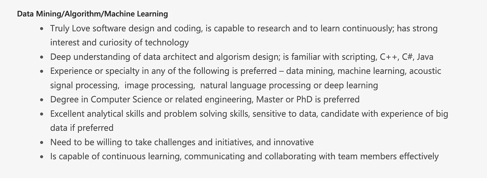

# 这就是为什么你在网上申请工作时会多次被自动拒绝

> 原文：<https://levelup.gitconnected.com/heres-why-you-get-multiple-auto-rejects-when-applying-to-jobs-online-e68608670176>

如果你在网上申请了数百份工作，却没有得到任何回应，那么你的简历很可能不适合申请人跟踪系统。这意味着什么，以及你需要做些什么来增加对你有利的机会。

大多数公司都会在网上收到成千上万的职位申请，招聘人员不可能查看每一份简历。因此，他们有一个 ATS。ATS 会分析每份简历，根据简历与职位描述的匹配程度给出一个百分比值，然后在表格中进行排名。然后招聘人员浏览表格中前几份简历。

[安德鲁·尼尔](https://unsplash.com/@andrewtneel?utm_source=medium&utm_medium=referral)在 [Unsplash](https://unsplash.com?utm_source=medium&utm_medium=referral) 上拍照

ATS 还会自动拒绝几份简历，大多数应聘者都会收到这样的拒绝邮件。以下是你如何确保自己不会被自动拒绝，让一个真正的人来检查你的简历:

1.  **格式:**你的简历应该是可分析的。如果你有一个时髦的格式/模板，ATS 很可能在解析的时候弄乱了它，你就会被拒绝。要想知道你的简历格式是否良好，谷歌“免费 ATS checker”并使用任何可用的工具。
2.  关键词:在申请不同的工作之前，调整你的简历，确保你的技能部分有必要的关键词。假设你申请这个职位:

确保你的简历上有以下几个词(如果你具备这些技能的话):

软件设计、编码、研究、数据架构、算法设计、脚本、C、C++、C#、Java、数据挖掘、机器学习、声学信号处理、图像处理、自然语言处理、深度学习、硕士、博士、问题解决、大数据、创新、交流、协作、团队

你可以在技能部分或项目/工作经历描述的某个地方添加这些词。

**3。使用项目符号**

**4。使用普通标题:**技能、教育、工作经验、成就等标题更好。

**5。使用常用字体:** Times New Roman，Arial 等。

**6。以 pdf 或 dox 格式提交。**

**7。避免图片:**当我收到简历审核请求时，我在我的 DMs 中看到很多这样的图片。你不需要在简历上放一张你的照片。

**8。获得推荐:**对于大多数公司来说，推荐人会确保一个人浏览你的简历。这就是为什么在网上申请时，获得推荐对接到面试电话有很大影响。

大概就是这样，希望这有帮助！

安贾利·维拉加马