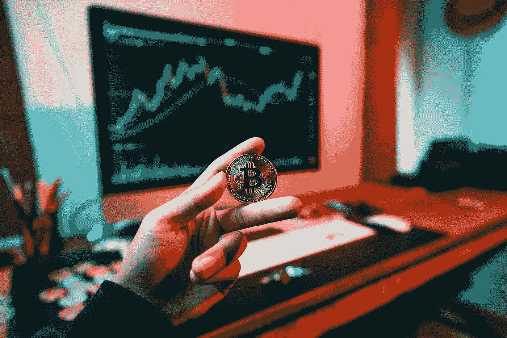
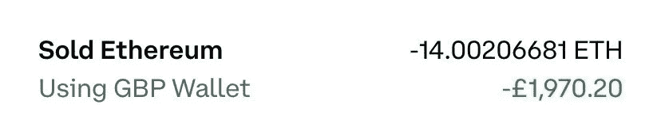
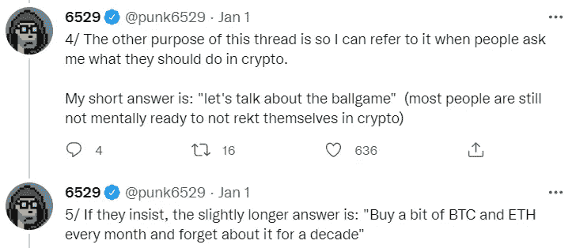
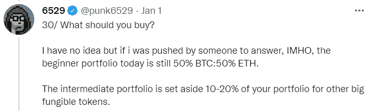

# 这就是为什么你必须把比特币和以太坊的美元成本平均化

> 原文：<https://levelup.gitconnected.com/heres-why-you-must-dollar-cost-average-into-bitcoin-and-ethereum-b5c091450cd4>

## 如果你现在开始，这可能是你最明智的投资。

[Art Rachen](https://unsplash.com/@artrachen?utm_source=unsplash&utm_medium=referral&utm_content=creditCopyText) 在 [Unsplash](https://unsplash.com/s/photos/bitcoin-and-ethereum?utm_source=unsplash&utm_medium=referral&utm_content=creditCopyText) 上拍摄的照片

如果有人告诉你他们有“确定的事情”来投资你的钱，赶紧跑吧。

没有这回事。

当你所爱的人意外死亡或损失了一大笔钱时，你会明白这一点，这要好得多。

比特币和以太坊最大化主义者会让你相信他们的区块链是值得投资的。

这是部落主义 101。

正是因为这个原因，社交网络很难被废黜。

谷歌试图创建一个与脸书竞争的社交媒体网站，Twitter 称之为[Google Buzz](https://en.wikipedia.org/wiki/Google_Buzz)；结果是除了嗡嗡声什么都没有。

它彻底失败了，因为分析师意识到，用户没有心算能力下载另一款与其竞争对手类似的社交媒体应用。

我们在这里谈论的是谷歌——一家市值 1.7 万亿美元的公司。

脸书和推特用户用你会从接触运动中期待的部落主义保护他们选择的社交媒体应用。

Buzz 于 2010 年 2 月推出，并于 2011 年 10 月封顶。

我使用社交媒体作为例子，因为我们在加密货币社区中看到了同样的部落主义。

有这个；“不是他们就是我们”的心态。

为什么不能两者兼得？

现代财务顾问通常会说分散你在多种资产上的风险。

我不是金融顾问，我也还没有遇到过建议把加密作为投资的人。也许在某个时候，他们会的。

在一个已经有风险的市场中，你必须尽可能地降低风险；在接下来的几段中，我将向您展示如何操作。

# 什么是平均成本？

这个策略支持你在一定时期内定期投入相同数量的资金，而不考虑价格。

定期自动购买可以让你更容易应对不确定的市场。

在“下跌市场”中使用这种策略可能会降低你的平均成本价，并减少波动对你的投资组合的影响。

最后，通过消除试图把握市场时机的陷阱，它消除了整个体验中的情绪。

需要明确的是，当你从数学角度来看，平均成本并不比一次性投资赚得更多。

DCA 是针对你和你的情绪的预防性措施，保护你免受市场波动的影响，避免核按钮，完全自毁。

来自美国消费者新闻与商业频道的研究着眼于从 1950 年开始的 100 万美元在股票市场上的滚动 10 年回报，并比较了立即一次性投资和平均成本投资的结果。

> **在 75%的情况下，一次性投资的股票投资组合的表现优于平均美元成本。**
> 
> **在 90%的时间里，债券投资组合的表现超过了平均美元成本。**

你可能在想，那我为什么要去 DCA？

这不是你想要解决的数学问题

就是这个；

1.  你正在从人类历史上最不稳定的资产中移除情感；从数学上来说，你可能不会得到最好的上涨，但它给你的是在市场上的持久力和时间。
2.  不合时宜的一次性付款往往会让你处于过度负债的境地，导致在市场下跌时抛售；这些教训最好从别人那里学到。

这就是没有计划并在 2018 年 ICO 崩盘底部卖出的情况。

是的，那是我；

[信用—我的比特币基地账户](http://www.coinbase.com/)

# 如何选择你的密码

你要做的就是寻找并放大你的赢家。

如果某样东西已经有了成功的记录，那么持续不断地向它投资就更容易了。

如果你像看待初创企业一样看待加密货币，那将会有所帮助。他们必须通过概念验证阶段。

我知道外面有成千上万的硬币可以去月球，但你不想处于这样一个位置，你在猜测，希望和期待一个[埃隆·马斯克](https://twitter.com/elonmusk)推文来帮你打包。

蓝筹加密货币只有两种，这是我个人的看法。

*   **比特币——也就是数字黄金**
*   **以太坊——智能合约和互联网货币**

最著名的精通密码的投资者和最受关注的密码思想领袖，在 [a mega thread](https://twitter.com/punk6529/status/1477259809493819393?s=20&t=vM57ejIVBzobxMvkRyxinA) 中以假名 [@Punk6529](http://twitter.com/Punk6529) 给出了以下建议；

来源— [Punk6529 推特](https://twitter.com/punk6529/status/1477259809493819393?s=20&t=vM57ejIVBzobxMvkRyxinA)

# 如何思考和构建你的投资组合

你一定是在玩你乐意归零的钱。

我从来不想让我的钱变成零，但是知道我不需要这些钱来买面包和牛奶可以让我晚上睡觉。

如果你在游戏中负债过多，你不可能在市场下跌时不感到压力或不得不卖掉所有东西的情况下持有所有东西。

根据 [Punk6529](https://twitter.com/punk6529/status/1477259809493819393?s=20&t=vM57ejIVBzobxMvkRyxinA) ，初学者的投资组合是:

*   **投资 50%进入以太坊**
*   **投资 50%到比特币**

两者平分。

一旦你对自己在这个领域的知识感到满意，就选择 10%至 20 %左右的较小比例购买一些风险较高的加密货币。

来源— [Punk6529 推特](https://twitter.com/punk6529/status/1477259809493819393?s=20&t=vM57ejIVBzobxMvkRyxinA)

# 您的加密投资机会有多大？

没人知道。

到目前为止，投资比特币和以太坊超过五年的人没有一个赔钱。

尽管存在波动，这两种数字资产的采用曲线仍在继续增长。

我读过的最有见地的逻辑来自 [Punk6529](https://twitter.com/punk6529/status/1477259809493819393?s=20&t=vM57ejIVBzobxMvkRyxinA) ，我已经插入了冗长的摘录。

这值得你花时间去理解。

> “今天，分散的数字加密资产约占全球资产价值的 0.5%。我们拥有大约 360 万亿美元的全球资产。
> 
> 实际总数远远超过 400 吨。密码市值约为 2 万亿美元。"
> 
> 市值计算的细节并不那么重要。
> 
> 我认为它是 2T/400t 美元
> 
> 对我来说，宏观问题是:
> 
> “2030 年，去中心化的数字资产所代表的全球资产价值的%会多于还是少于 0.5%？”
> 
> 对我来说，答案是:“从技术角度来看，可能是的，但可能不是因为监管/中央系统。”
> 
> 我的第一种分析形式是“期望值”分析。
> 
> 例如，假设总资产的加密百分比变为 1%的可能性为 50%，加密结束变为 0%的可能性为 50%。
> 
> 在这种情况下，我们应该保持中立。50% x 1% + 50% x 0% = 0.5% =我们今天所处的位置。
> 
> 我的观点是，加密双精度的几率比它变为零的几率大得多，这意味着期望值是正的。
> 
> 因此，我想有一个加密投资，即使是今天。[我第一次做这项分析时，crypto 占全球市值的 0.005%]

> [整个线程都在这里](https://twitter.com/punk6529/status/1477259846739283968)。

时间跨度为五年；持久力比完美把握市场时机更重要。

你可以直接从一个[比特币基地账户](https://www.coinbase.com/)轻松设置定期付款，那么有什么能阻止你呢？

如果你已经走了这么远，我很感激你，并希望这有所帮助。

耐心点，享受旅程。

> *如果你想在 Web3 上阅读更多我的观点，考虑成为会员吧。你的会员费直接支持你读的作家。如果你用我的链接* [*注册，我会赚一小笔佣金。点击这里*](https://medium.com/@jayden_levitt/membership) *。*

*本文仅供参考；不应将其视为财务、税务或法律建议。在做出任何重大财务决定之前，请咨询财务专家。*