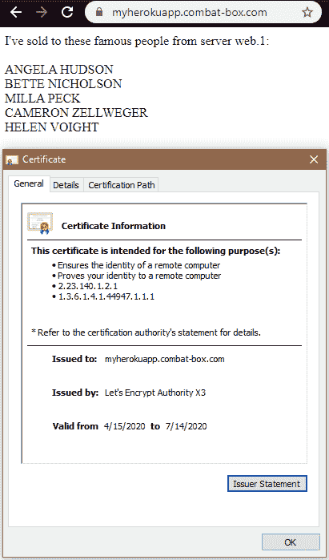

# 云架构师视角下的 Heroku

> 原文：<https://levelup.gitconnected.com/heroku-from-the-perspective-of-a-cloud-architect-5395e3347d5>

作为一名自由职业的云架构师，我花时间回顾和研究最新、最棒的行业趋势。像 Kubernetes、ElasticSearch 和 Prometheus 这样的技术充斥着我的家庭和企业基础设施。经过几个小时痛苦的配置和调整，它们现在完全按照我想要的方式工作。

我经常想将这种配置转售给我的客户，以便在我所熟悉的基础设施上使用我所熟悉的技术来实现成本节约，无论我当天构建了什么样的云。这通常是我的本地服务器和 AWS EC2 实例的混合。为此，我经常为我的项目推荐类似的配置和设置。然后，这将我的客户锁定在我自己的服务中，或者如果他们想在未来的某个时候脱离，他们必须自己学习如何操作基础设施。

最后一个前提是我发现自己越来越关注的一个，因为我访问了一些社区，这些社区的人希望托管具有一些业务逻辑的 web 服务器、用于游戏分析的数据 API，甚至托管他们最喜欢的 Discord 机器人以供娱乐。我该如何向不应该投资如此密集的解决方案的人推销如此奢侈的定制架构？前期托管费用将来会有回报吗？当变革的浪潮来临时，新的技术堆栈铺平了道路，那该怎么办呢？

简单的回答是我不知道，也不应该知道。从头开始构建完整的基础架构并不总是最佳解决方案。有时，中间层平台即服务(PaaS)是这些新兴技术产品和不断增长的应用程序的正确方向。

所以我花了一天时间用我自己的工具构建了一个简单的应用程序，然后把它移植到 Heroku 来测试他们的杠杆、功能和学习曲线。在本文中，我们将探索这个简单的应用程序，并将其与我自己的技术体系进行比较，以确定它是否适合我的客户。

# 应用程序(Kubernetes)

如前所述，我将使用我已经部署好的基础设施。这种设计是许多架构师熟悉的场景，也是我和客户一起构建的应用程序的常用方法。它配有我选择的日志收集器(fluentD 和 ElasticSearch)、指标可观察性(LinkerD)和入口控制器(Ambassador ),作为应用程序堆栈的结构。

应用程序配置见:【https://github.com/Tokugero/kubernetes-hello-world 

构建配置就像我已经构建好的 yaml 模板一样简单，只需更新它们以适应这个新的应用程序。

*   Ambassador [TLS.yaml](https://raw.githubusercontent.com/Tokugero/kubernetes-hello-world/master/spec/TLS.yaml) —生成一个 LetsEncrypt 证书
*   大使 [Mapping.yaml](https://raw.githubusercontent.com/Tokugero/kubernetes-hello-world/master/spec/Mapping.yaml) —生成入口反向代理
*   LinkerD [namespace.yaml](https://raw.githubusercontent.com/Tokugero/kubernetes-hello-world/master/spec/namespace.yaml) —注入服务网格的注释

开始申请吧！

为了给出最直接的比较，我想要求一个我知道 Heroku 支持的数据库，所以我选择了 Postgres。在 Kubernetes 上建立我自己的 Postgres DB 就像一个[舵图](https://github.com/helm/charts/tree/master/stable/postgresql)一样简单，只需对它的缺省值[做一些调整就可以适应我的基础设施。一旦完成，我加载一个](https://raw.githubusercontent.com/Tokugero/kubernetes-hello-world/master/spec/postgres/values.yaml)[测试数据集](https://github.com/devrimgunduz/pagila)来进行交互。

[应用](https://raw.githubusercontent.com/Tokugero/kubernetes-hello-world/master/app/myapp.py)是使用 Flask 和 psycopg2 构建的，它的唯一目的是显示关于它在哪个服务器上运行的数据，以及 Postgres 数据库中的随机行和一些基本的日志记录。它被构建在一个[容器](https://raw.githubusercontent.com/Tokugero/kubernetes-hello-world/master/app/Dockerfile)中，并被推送到位于我的集群中的一个本地提供的 docker 注册中心。

将这个应用程序部署到我的集群相对简单:

> *kubectl apply-f*[*namespace . YAML*](https://raw.githubusercontent.com/Tokugero/kubernetes-hello-world/master/spec/namespace.yaml)
> 
> *ku bectl apply-f*[*mapping . YAML*](https://raw.githubusercontent.com/Tokugero/kubernetes-hello-world/master/spec/Mapping.yaml)
> 
> *ku bectl apply-f*[*TLS . YAML*](https://raw.githubusercontent.com/Tokugero/kubernetes-hello-world/master/spec/TLS.yaml)
> 
> *helm install myapp-n myapp*[*stable/PostgreSQL*](https://github.com/helm/charts/tree/master/stable/postgresql)*—values =*[*postgres/values . YAML*](https://raw.githubusercontent.com/Tokugero/kubernetes-hello-world/master/spec/postgres/values.yaml)
> 
> *kubectl exec <按照指令访问新的 psql 实例输入* [*测试数据*](https://github.com/devrimgunduz/pagila) *>*
> 
> *ku bectl create secret generic PSQL pass-n myapp—from-literal = PSQL _ PASSWORD = " mydb PASSWORD "*
> 
> *kubectl apply-f*[*deployment . YAML*](https://raw.githubusercontent.com/Tokugero/kubernetes-hello-world/master/spec/Deployment.yaml)

在这张图片中，我们看到了一个很棒的结果:一个 HTTPS 加密的 web 应用程序显示了一些来自后端的数据。

在这里，我们可以看到 Grafana 的可观察性堆栈，展示了来自 LinkerD 的 ElasticSearch 日志和 Prometheus 指标。在配置中，应用程序所有者的唯一先决条件是适当地注释名称空间。

现在，我可以访问以下常规操作命令:

> *Scale:kubectl Scale deployment-n myapp myapp—replicas =<n>*
> 
> *Deploy:kubectl set image-n myapp deployment/myapp myapp =<新建容器镜像>*

构建和部署它的价格标签是 0 美元。我在自己的硬件上运行这个，所有使用的软件都是开源的。因此，唯一真正的成本是我管理和维护基础架构的时间和精力。我还在 AWS 中运行了一个类似的配置，我的集群每月花费大约 250 美元，有三个 EC2 实例、一个托管的 ElasticSearch 集群和标准的 GP2 块存储(SSD)。

# 应用程序(Heroku)

我使用这个相同的应用程序，并按照 Heroku 直观的 UI 为我的应用程序构建基础设施。

提供 PostgresDB 非常容易。只需在 Heroku UI 中导航到 data 应用程序并选择“Postgres ”,我就可以看到一个视图，它最终显示了我的完全调配的免费数据库，对数据和存储容量有一些“自由层”限制。这附带了一个预配置的数据库名称、用户帐户和自动生成的密码，AWS 中有一个主机只用于我的数据库。我可以通过环境变量用我的自定义细节替换这些已提供的细节，就像我对 Kubernetes 所做的那样。

部署这个应用程序需要做更多的工作。我需要安装 Heroku CLI 来遵循他们的 Docker 部署方法，还需要安装 Postgres 客户端来向新提供的数据库添加数据。这归结于使用我的仪表板中的 Postgres 插件详细信息中输出的信息:

> *heroku pg:psql PostgreSQL-defined-xxxxx—app Philip-myapp*
> 
> *<添加* [*测试数据*](https://github.com/devrimgunduz/pagila) *>*
> 
> *heroku 容器:登录*
> 
> *<向 heroku >* 提供登录详情
> 
> *heroku 容器:push web -a philip-myapp*
> 
> *heroku 容器:发布 web -a philip-myapp*

在更新了我的环境变量之后，我开始了比赛！算是吧。我仍然没有指标，我的应用程序仍然无法加载到代表我配置的 philip-myapp.herokuapp.com 域中。

浏览日志查看器时，我发现容器反复崩溃。我很清楚，没有端口映射来定义 443 应该到达我的容器的 5000，当 Heroku 健康检查无法到达我的应用程序时，应用程序试图通过重新启动来修复自己。一些研究让我想到了 Heroku 的随机提供的端口，它被传递给环境变量“$PORT”。我对我的 [Dockerfile 和 myapp.py](https://github.com/Tokugero/kubernetes-hello-world/commit/90c6981ee9e9fa9ae44a7f662677efaad809113a) 进行了快速调整，以加载这个动态分配的端口，我的应用程序终于开始工作了。它甚至附带了一个预配的 DigiCert 通配符证书。

我正在运行的 Heroku 应用程序:

在对我的配置做了另一个小小的调整后，我收到了一个带有我自己的 LetsEncrypt 证书的自定义域:

但是这仍然不是完全的奇偶校验。可观测性和可伸缩性在哪里？

在浏览了配置后，我发现了问题:指标仅适用于“爱好”级 dynos 及以上级别，每月 7 美元。扩展仅适用于“专业”级 dyno 及以上级别，价格为 25 美元/月/dyno。然而，计费是按时间比例分配的，所以切换这些设置很容易就能感受到这些特性。这些指标是从容器的一开始就收集的，这意味着在我切换到“爱好”dyno 之前，我没有丢失任何数据。

完成后，这些是我管理应用程序的新功能:

要进行部署，请在 Dockerfile 文件附近重新运行前面的命令:

> heroku container:push we B- a Philip-myapp
> 
> *heroku 容器:发布 web -a philip-myapp*

要扩展，只需升级到“Pro”层 dyno 并调整滑块或使用 CLI:

> *heroku scale web = 2-a Philip-myapp
> Scaling dynos…完成，现在以 2:Standard-1X 运行 web*

只需对数据库命名约定和端口映射功能进行一些强制搭建，我就拥有了一个与我在自己的 Kubernetes 集群上享受的功能相同的应用程序。与我的 AWS 集群相比，这两者之间的成本比较对 Heroku 有利。但是，很明显，如果这个应用程序需要发展成企业级应用程序，最终会变得不经济。我相信，到了有必要维持这种规模的时候，无论如何，也是以其他方式进行优化的时候了，这可能需要一个定制的平台解决方案。

# 结论

Heroku 的功能和初始成本模型令我惊讶。虽然它是一个固执己见的 PaaS，但它对基础架构的断言易于理解并易于协作，同时提供了相同的底层功能，这让我喜欢上了 Kubernetes 的软件定义的基础架构。我最喜欢的部分是 Heroku 使用 Docker 和 Git 等行业标准来管理他们的管道和部署，这使得将我的应用程序迁移到他们的平台上几乎是一件毫不费力的事情。正是这些功能帮助我将客户的体验托付给他们，直到自我管理的平台成为必要。