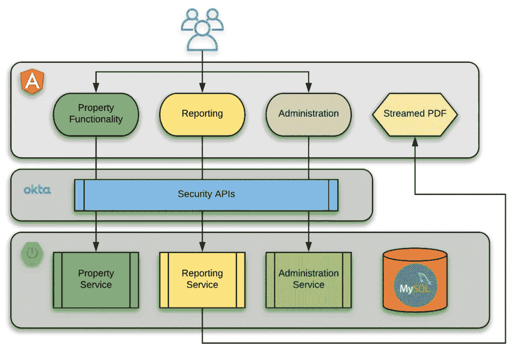
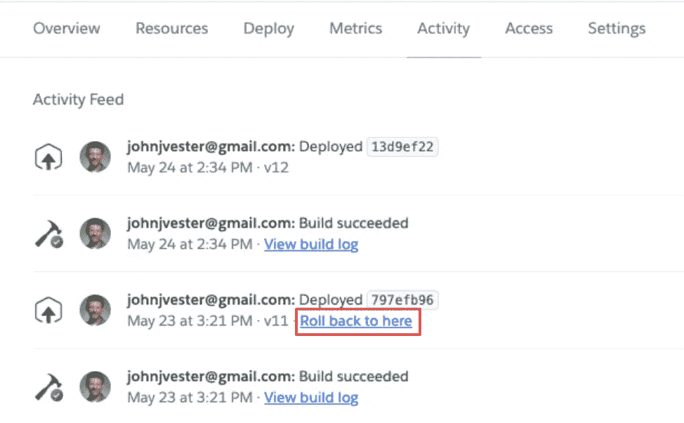
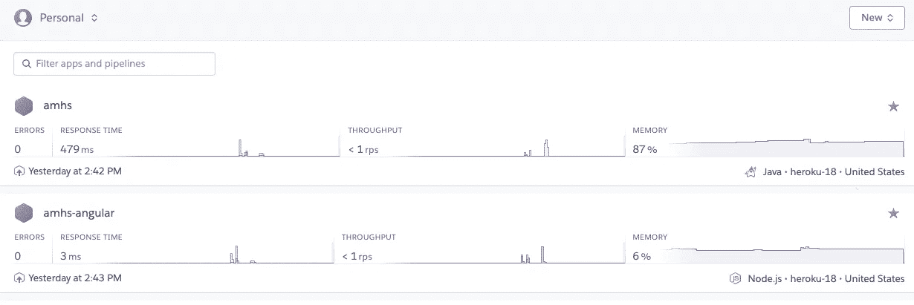

# heroku——我的新家

> 原文：<https://levelup.gitconnected.com/heroku-my-new-home-f8ecfbc33886>


**在本系列的最后一部分，作者回顾了第一次使用 Heroku 的过程，详细介绍了新的设计和经验教训。**

在“[从 AWS 迁移到 Heroku](/moving-away-from-aws-and-onto-heroku-d84852b9884d) ”一文中，我介绍了我想从亚马逊流行的 AWS 解决方案迁移到 Heroku 的应用程序。随后，“ [Destination Heroku](/destination-heroku-86a5811a199c) ”一文展示了一个新 Heroku 帐户的建立，并重点介绍了一个 Java API(在 Spring Boot 编写),它连接到这个新的平台即服务(PaaS)生态系统中的一个 ClearDB 实例。

本系列的第三篇文章(“[将 Heroku 用于静态 web 内容](/using-heroku-for-static-web-content-b7f5ce0712b1)”)提供了一种静态 Web 文件也可以由 Heroku 提供服务的方式。我这个系列的主要目标是找到一个解决方案，让我能够将有限的时间集中在提供业务解决方案上，而不是跟上开发运维流程。

现在一切都在 Heroku 中运行，是时候后退一步，对我的新应用程序之旅进行回顾了。

# 详述新设计

从应用程序和设计的角度来看，应用程序实际上没有任何变化，现在 100%在 Heroku 中运行:



上面的图像是这个系列的第一部分中的图像的一个相同的副本。我报告这些信息的目的是，我能够非常容易地在 AWS S3 和 AWS Elastic Beanstalk 中找到我现有的应用程序，并将准确的源代码迁移到 Heroku。

# 事情发生了怎样的变化

虽然应用程序很容易移植到 Heroku，但是现在应用程序更新和部署的方式发生了变化。

第二部分和第三部分讨论了我如何简单地执行一个额外的基于 git 的命令，以便将更改部署到运行在 Heroku 上的 API 和客户机实例:

`git push Heroku`

自从本系列的第二和第三部分发表以来，我花了几分钟时间来了解更多关于 GitLab CI/CD 的内容，并介绍了一些非常简单的自动化。现在，当一个拉请求被合并到我的 Spring Boot API 存储库的`master`分支时，一个类似于下面所示的`.gitlab-ci.yml`文件被自动执行:

*外壳*

```
stages:- build- deploymaven-build:image: maven:3-jdk-8stage: buildscript: "mvn package -B -DskipTests"deploy:stage: deployimage: ruby:latestscript:- apt-get update -qy- apt-get install -y ruby-dev- gem install dpl- dpl --provider=heroku --app=$HEROKU_APP --api-key=$HEROKU_API_KEYonly:- master
```

在上面的例子中，GitLab CI/CD 进程使用包含 Maven 的 Java 8 容器来构建 Spring Boot 框架，该框架充当我的应用程序的 API。一旦构建完成，CI/CD 流程将利用 Ruby 执行部署到应用程序名称，该应用程序名称使用$HEROKU_API_KEY 变量中提供的 API 键匹配$HEROKU_APP 变量。

因此，我在这个项目上的工作现在是 100%基于特征的。我可以遵循 Git-Flow 策略，为我的工作创建一个特性分支。然后，当准备好时，我将发出一个拉请求，并将我的更改合并到主分支中。在那个时候(也只有在那个时候), CI/CD 管道将启动并将更改推送到 Heroku，Heroku 将部署 API 的新版本。

Angular 客户端存储库也进行了更新，以包括类似于下面列出的管道:

*外壳*

```
image: node:8.10.0cache:paths:- node_modules/stages:- deploy_productionProduction:image: ruby:latestonly:- masterstage: deploy_productionscript:- apt-get update -qy- apt-get install -y ruby-dev- gem install dpl- dpl --provider=heroku --app=$HEROKU_APP --api-key=$HEROKU_API_KEY
```

对于客户机来说，实际上只有一个部署阶段，它也利用 Ruby 和相同的变量合并到 Heroku 目标存储库中。推送完成后，Heroku 会自动部署新版本的 web 客户端。

GitLab 用户:如果您的存储库启用了 Heroku CI 功能，这项工作实际上是自动完成的。对于启用此功能的用户，可以自动部署成功通过测试阶段的主分支的所有更新。

# 保障性和维修性

有了所有这些变化，部署就变得容易了，这让我可以专注于向应用程序添加新功能。事实上，在整点后的 18 分钟，我收到了我岳母发来的一条短信，指出这个应用程序不能正常工作。在几分钟内，我隐藏了我的更改，并在 GitLab 和一个 bugfix 分支中创建了问题(从主存储库中)。在这种情况下，我需要对 API 和 Angular 客户端做一点小小的改动。

在 15 分钟内，使用 API 和 Angular 客户端的本地实例识别、修复并验证了问题。两个存储库的代码都被签入，我创建了一个 PR，尽管我是这个项目中唯一的工作人员。一旦分支被合并到两个存储库中，CI/CD 处理就开始了。不到五分钟后，Heroku 中的两个应用程序都重新启动并正常工作。

使用 Heroku，我能够在不到 20 分钟的时间内解决问题并部署修复程序。在那段时间里，我专注于开发和标准的 git 使用。我没有花时间去理解和记住与 DevOps 相关的内容，这些内容与为我的应用程序所有者提供功能和支持毫无关系。

当然，另一种选择是恢复到服务的早期部署。Heroku 提供了一种令人印象深刻的方式，通过这种方式，托管的应用程序可以回滚到以前的状态。事实上，这就像在应用程序中单击一个链接一样简单:

在下面的屏幕截图中，单击“回滚到此处”链接将启动将服务恢复到先前状态的过程。



使用 CLI,“heroku releases”命令提供部署摘要:

*壳牌*

```
$ heroku releases=== amhs Releases - Current: v12v12  Deploy 1somekey johnjvester@gmail.com  2020/05/24 14:34:51 -0400v11  Deploy 2somekey johnjvester@gmail.com  2020/05/23 15:21:56 -0400
```

现在，如果我希望回滚到 v11，只需执行以下命令:

`heroku rollback v11`

和往常一样，回滚应该只在极少数情况下使用，而不是永久的解决方案。

# 成本差异

当我完成本系列的第三部分时，我确信 Heroku 将是我这个应用程序的目的地。为了节省成本，我决定关闭我的 Elastic Beanstalk 实例，并将最大实例数设置为零。我的想法是，我将产生零成本，因为应用程序没有运行。结果，我的假设是错误的，我最终得到了一张 18.49 美元的发票，其中包含了与保持弹性 Beanstalk 实例可用相关的数据库成本和费用。AWS S3 也有小额费用。同样，我需要时间来理解一个比我真正需要的复杂得多的计费结构…或者有时间去担心。

在 Heroku 方面，我决定升级到两个应用程序的爱好计划。我期望每月支付的 14 美元比 AWS 的标准费用节省了 40%。我现在不必担心数据库，因为使用率非常低，应用程序中的所有历史数据只占 Ignite 选项数据库大小的 6%。现在没什么好担心的。

我选择使用业余爱好计划，主要是为了避免我的岳母不得不等待系统启动。她每个月只使用这个应用程序几天，所以我确信每次她试图访问系统时，她都必须等待。经验提示，让婆婆等从来都不是什么好事。:)

我也喜欢从爱好计划开始展示的应用指标:



我的应用程序真正需要的是了解当前的响应时间和基本的使用水平。

在数据库方面,(免费的)Ignite MySQL ClearDB 实例提供了一个基本的仪表板，也满足了我的需求:


# heroku-buildpack-static

虽然 Node.js 的方法对我来说工作得很好，但我想提出 [heroku-buildpack-static](https://github.com/heroku/heroku-buildpack-static) 项目，它是为类似于我的 Angular 客户端的单页面静态 web 应用程序设计的。为了阅读更多关于这个非常酷的项目的信息， [Terence Lee](https://gist.github.com/hone) 创建了一个[入门文档](https://gist.github.com/hone/24b06869b4c1eca701f9)。

如果我在旅途中早点发现这个项目，我会考虑使用这种方法。虽然 buildpack 是实验性的，不是 Heroku 团队的产品，但我觉得它的稳定性肯定达到了我的应用程序所信任的水平。

# 结论

上大学时，我遇到了一个叫斯泰西的人。当时，我们都很认真地想在音乐行业建立一个专业的地位。然而，命运为我们安排了一段不同的旅程。我最终在信息技术行业工作，斯泰西回到大学成为一名牙医。一晃三十年过去了，我们都在事业上有所建树。时间允许的话我们还是会聊。

我提到史黛西的原因是，他总是把时间花在朋友和家人身上。这超越了牙科保健，涵盖了他多年来提供的各种援助。其实是他的启发，让我想用自己的技能和能力，为婆婆提供更好的应用体验。虽然她可能不理解为她提供改进的做生意方式所涉及的一切，但她对我的帮助表示感谢。

与此同时，我觉得 Heroku 的团队与 Stacy 和我有着相似的使命。他们利用自己的专业知识提供一个平台，开发人员可以在这个平台上快速建立应用程序。一旦就位，支持和增强应用程序就像检入代码本身一样简单。事实上，这种方法正是我所需要的。

不管我们在生活中做什么，保持专注是很重要的。保持专注的一个方法是消除竞争的优先权。对于 AWS，我觉得我需要继续了解他们生态系统的各个方面，这并没有给我的应用程序带来新的特性。有了 Heroku，我的全部时间都可以用来为我的客户提供价值。

祝你今天过得愉快！