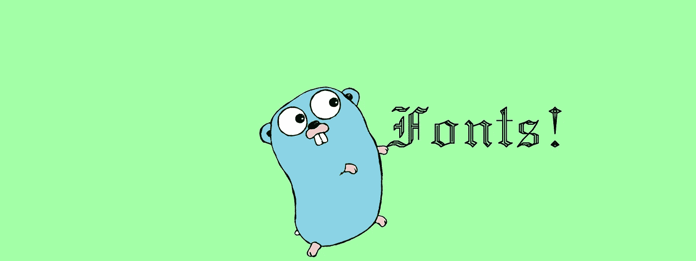
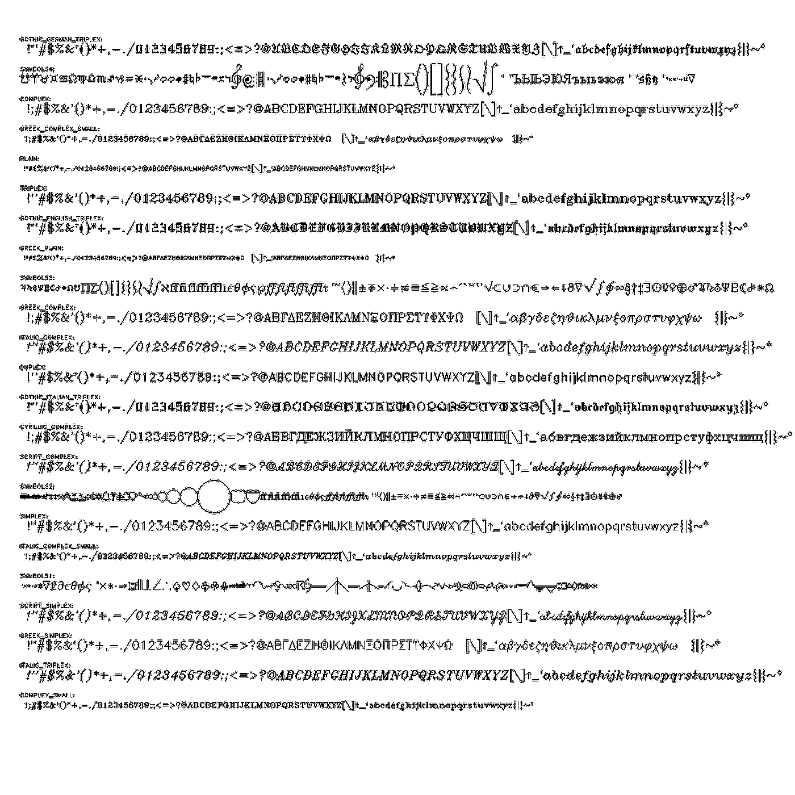
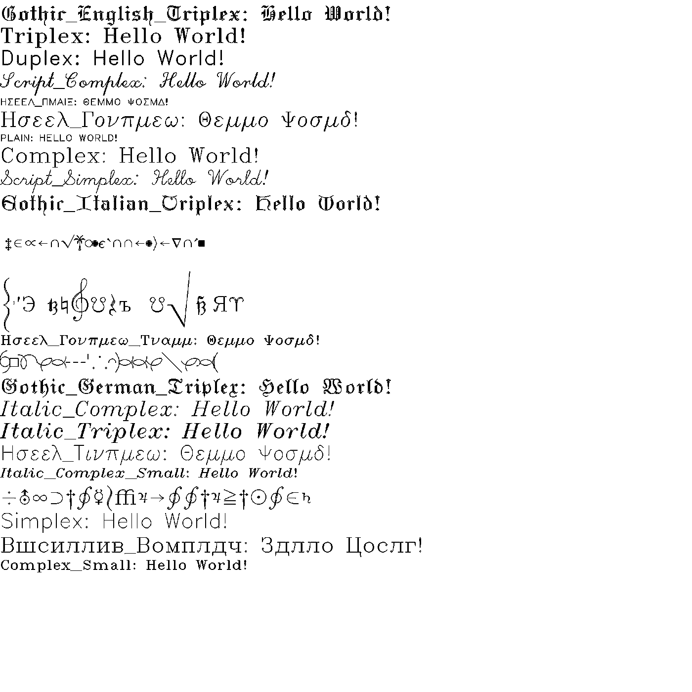
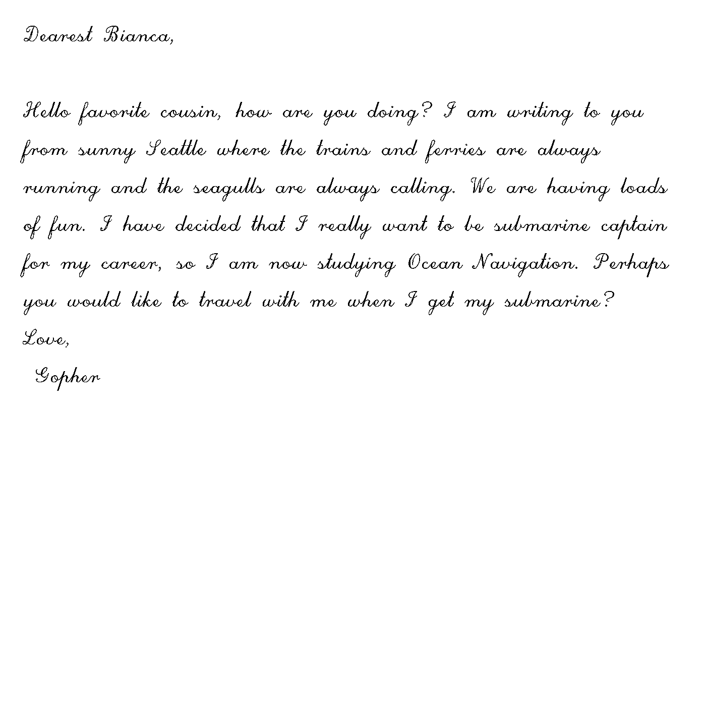

# 好时字体在去

> 原文：<https://levelup.gitconnected.com/hershey-fonts-in-go-b3c3e373171c>



吉祥物归功于 golang.org

在 Golang 中解码和使用 Hershey 矢量字体

为什么你会需要好时矢量字体呢？不是有很多现代字体吗？是的，然而，好时的角色是为一个非常特殊的场景而创造的:用在天生画线而不是画像素的设备上。此外，它们可以免费使用。因此，来自机械笔式绘图仪和激光切割机用户以及更多用户的兴趣重新燃起。另外，从历史和编程的角度来看，它们都非常简洁。

好时字体编码为两个文本文件，一个用于一组[罗马字符](http://Latin alphabet)，另一个用于一组日语字符。本文主要关注罗马字符和字体，但也可以很容易地应用于日语。

Hershey Roman 文本文件是一组 1597 个矢量字符，可以松散地组织成 18 种字体以及一些分类符号。我说“不严格”,因为它们已经存在了很长时间，已经被处理和重新分组了很多次。所有这些最初都是在 20 世纪 60 年代中期由 Allen Vincent Hershey 博士为光学绘图仪开发的，你可以在 Chris Lott 的[这篇优秀文章](https://hackaday.com/2021/03/30/hershey-fonts-not-chocolate-the-origin-of-vector-lettering/)中读到所有相关信息。



所有好时罗马字符

我找不到原始数据集的任何来源，我能找到的最早的数据集是 1997 年 Paul Bourke 的数据集。Paul 将罗马字符和日本字符作为两个独立的集合，编码到一个普通的 ascii 文本文件中。这种编码被证明非常耐用。许多模糊的二进制文件格式来了又去，然而几十年后我们仍然可以很容易地解码这个简单的文本格式。

*   4 个字符(id)表示纯文本中的字符 Id(不是连续的数字)
*   3 个字符(n)表示纯文本中字符的顶点数
*   1 个字符(lt)表示 X 轴左偏移，int 由 ASCII(lt)- ASCII('R ')导出
*   1 个字符(rt)表示 X 轴左偏移，int 由 ASCII(rt)- ASCII('R ')导出
*   (x，y)坐标的 n * 2 个字符，其中 x 和 y 由 ASCII(x)- ASCII('R ')和 ASCII(y)- ASCII('R ')导出
*   特殊情况是，如果任何坐标是一个空格，那么下一个字符将是一个“R”——这个组合被认为是一个新路径的开始(不是坐标)。
*   忽略遇到的任何虚假换行

左偏移和右偏移告诉我们字符在 x 轴的开始和结束位置(相对原点是字符的中心)。以这种方式，通过迭代一组路径来绘制 Hershey 字符，其中移动到路径中的第一个坐标，然后在该路径中的每一个其他坐标处绘制一条连续的线。

Paul 还提供了将罗马字符映射成 18 种字体的 id 集。我决定坚持使用这些名字，而不是一些看似随机的字体名称和重叠的字体集合。《未来》？..实际上？)

Paul 的罗马字体集没有覆盖符号，但是我们可以将它们分成四种不同的符号字体，以覆盖罗马文件中的所有字符。

查看 Hershey 文本文件(hershey.dat)的前几行，您可以看到上面提到的编码示例。

好时. dat

```
1  9MWRMNV RRMVV RPSTS
2 16MWOMOV ROMSMUNUPSQ ROQSQURUUSVOV
3 11MXVNTMRMPNOPOSPURVTVVU
4 12MWOMOV ROMRMTNUPUSTURVOV
5 12MWOMOV ROMUM ROQSQ ROVUV
6  9MVOMOV ROMUM ROQSQ...
```

第一行是

```
<s><s><s>1<s><s>9MWRMNV<s>RRMVV<s>RPSTS
```

它解码成

```
Id: 1
Vertices: 9
Left offset: ASCII(M) — ASCII(R) = -5
Right offset: ASCII(W) — ASCII(R) = 5
Path[0]Coord[0].X =  ASCII(R) — ASCII(R) = 0
Path[0]Coord[0].Y = ASCII(M) — ASCII(R) = -5
Path[0]Coord[1].X = ASCII(N) — ASCII(R) = -4
Path[0]Coord[1].Y = ASCII(V) — ASCII(R) =4<Path Break>Path[1]Coord[0].X = ASCII(R) — ASCII(R) = 0
Path[1]Coord[0].Y = ASCII(M) — ASCII(R) =-5…and so on
```

让我们从保存我们解码的数据的结构开始:

```
type FontPath struct {
   Lt     int
   Rt     int
   Coords [][][]int
}
```

多维数组坐标引用为:

坐标[p] =路径

路径内的坐标

Coords[p][c][0] =坐标的 X 分量

Coords[p][c][1] =坐标的 Y 分量

那么我们的整套 Hershey 字符将只是这些结构的数组:

```
var hershey = []FontPath
```

我们的计划是编写一个小生成器，它将解码 Hershey 文本文件并创建一个新的。go 文件保存我们的角色数据。

generate.go:

```
func GenerateHershey() (out string, idToIndex map[int]int, err error) {
    idToIndex = make(map[int]int)
    name := "hershey"
    data, err := ioutil.ReadFile(name + ".dat")
    if err != nil {
        return
    }
    fmt.Println("Decoding: ", name)
    s := strings.ReplaceAll(string(data), "\n", "")
    out = "//Coordinates: \n\nvar " + name + " = []FontPath{\n"
    i := 0
    for {
        if len(s) < 5 {
            break
        }
        // hershey character id
        id := s[0:5]
        nid, err := strconv.Atoi(strings.Trim(id, " "))
        if err != nil {
            return "", map[int]int{}, err
        }
        idToIndex[nid] = i
        //number of coordinate pairs
        n, err := strconv.Atoi(strings.Trim(s[5:8], " "))
        if err != nil {
            return "", map[int]int{}, err
        }
        s = s[8:]
        //number of characters
        cn := 2 * n
        ss := s[:cn]
        //left position
        lt := int(ss[0]) - int('R')
        //right position
        rt := int(ss[1]) - int('R')
        out += fmt.Sprintf("// %d: %s\n", i, id)
        out += fmt.Sprintf("{%d, %d, [][][]int{", lt, rt)
        i++
        //paths & coordinates
        if n > 1 {
            out += "{"
        }
        for i := 2; i < len(ss); i++ {
            if ss[i] == ' ' { //new path
                out += fmt.Sprintf("},{")
                i += 2
            }
            //coords
            dx := int(ss[i]) - int('R')
            dy := int(ss[i+1]) - int('R')
            i++
            out += fmt.Sprintf("{%d, %d},", dx, dy)
        }
        out = strings.TrimRight(out, ",")
        if n > 1 {
            out += "}"
        }
        out += fmt.Sprintf("}},\n")
        s = s[cn:]
    }
    out = strings.TrimRight(out, ",\n")
    out += "}\n\n"
    return
}
```

请注意，我们沿途创建了一个地图(idToIndex) —我们这样做是为下一步生成字体集做准备。它们是 Paul 作为 Id 引用给出的，但是我们想把它们改成数组索引引用。

我们要转换的原始数据在 fontids 中。go:

fontids.go

```
package hershey
var Id_Fonts = map[string][]int{"Simplex": Id_Simplex,
"Script_Simplex":         Id_Script_Simplex,
"Gothic_English_Triplex": Id_Gothic_English_Triplex,
"Gothic_German_Triplex":  Id_Gothic_German_Triplex,
"Gothic_Italian_Triplex": Id_Gothic_Italian_Triplex,
"Greek_Complex":          Id_Greek_Complex,
"Greek_Complex_Small":    Id_Greek_Complex_Small,
"Greek_Plain":            Id_Greek_Plain,
"Greek_Simplex":          Id_Greek_Simplex,
"Cyrillic_Complex":       Id_Cyrillic_Complex,
"Italic_Complex":         Id_Italic_Complex,
"Italic_Complex_Small":   Id_Italic_Complex_Small,
"Italic_Triplex":         Id_Italic_Triplex,
"Script_Complex":         Id_Script_Complex,
"Complex":                Id_Complex,
"Complex_Small":          Id_Complex_Small,
"Duplex":                 Id_Duplex,
"Plain":                  Id_Plain,
"Triplex":                Id_Triplex,//unmapped chars:"Symbols1": Id_Symbols1,
"Symbols2": Id_Symbols2,
"Symbols3": Id_Symbols3,
"Symbols4": Id_Symbols4,
}var Id_Simplex = []int{
699, 714, 717, 733, 719, 2271, 734, 731, 721, 722,
2219, 725, 711, 724, 710, 720, 700, 701, 702, 703,
704, 705, 706, 707, 708, 709, 712, 713, 2241, 726,
2242, 715, 2273, 501, 502, 503, 504, 505, 506, 507,
508, 509, 510, 511, 512, 513, 514, 515, 516, 517,
518, 519, 520, 521, 522, 523, 524, 525, 526, 2223,
804, 2224, 2262, 999, 730, 601, 602, 603, 604, 605,
606, 607, 608, 609, 610, 611, 612, 613, 614, 615,
616, 617, 618, 619, 620, 621, 622, 623, 624, 625,
626, 2225, 723, 2226, 2246, 718,}var Id_Script_Simplex = []int{
699, 2764, 2778, 733, 2769, 2271, 2768, 2767, 2771, 2772,
2773, 725, 2761, 724, 710, 2770, 2750, 2751, 2752, 2753,
2754, 2755, 2756, 2757, 2758, 2759, 2762, 2763, 2241, 726,
2242, 2765, 2273, 551, 552, 553, 554, 555, 556, 557,
558, 559, 560, 561, 562, 563, 564, 565, 566, 567,
568, 569, 570, 571, 572, 573, 574, 575, 576, 2223,
804, 2224, 2262, 999, 2766, 651, 652, 653, 654, 655,
656, 657, 658, 659, 660, 661, 662, 663, 664, 665,
666, 667, 668, 669, 670, 671, 672, 673, 674, 675,
676, 2225, 723, 2226, 2246, 718,}var Id_Gothic_English_Triplex = []int{
3699, 3714, 3728, 2275, 3719, 2271, 3718, 3717, 3721, 3722,
3723, 3725, 3711, 3724, 3710, 3720, 3700, 3701, 3702, 3703,
3704, 3705, 3706, 3707, 3708, 3709, 3712, 3713, 2241, 3726,
2242, 3715, 2273, 3501, 3502, 3503, 3504, 3505, 3506, 3507,
3508, 3509, 3510, 3511, 3512, 3513, 3514, 3515, 3516, 3517,
3518, 3519, 3520, 3521, 3522, 3523, 3524, 3525, 3526, 2223,
804, 2224, 2262, 999, 3716, 3601, 3602, 3603, 3604, 3605,
3606, 3607, 3608, 3609, 3610, 3611, 3612, 3613, 3614, 3615,
3616, 3617, 3618, 3619, 3620, 3621, 3622, 3623, 3624, 3625,
3626, 2225, 2229, 2226, 2246, 3729,}... and much more
```

我们将基本上镜像原始数据的结构，并使用 idToIndex 将 Id 引用转换为数组索引引用。

```
func GenerateFonts(idToIndex map[int]int) (out string) {
    out = "//Fonts: \n\nvar Fonts = map[string][]int{"
    for name, _ := range Id_Fonts {
        out += "\"" + name + "\": " + name + ",\n"
    }
    out += "}\n\n"
    for name, font := range Id_Fonts {
        out += "var " + name + " = []int{\n"
        for i, v := range font {
            out += fmt.Sprintf("%d, ", idToIndex[v])
            if (i+1)%10 == 0 {
                out += "\n"
            }
        }
        out += "}\n\n"
    }
    return
}
```

最后，我们将添加几个 map[int]int 结构，这将允许我们轻松地在 Id 和数组索引或数组索引和 Id 之间来回转换——以防我们希望通过字符的原始 Hershey Id 来访问它。

```
func GenerateTranslators(idToIndex map[int]int) (out string) {
    out1 := "//Id translation\n\nvar IdToIndex = map[int]int {\n"
    out2 := "\n\nvar IndexToId = map[int]int {\n"
    i := 1
    for k, v := range IdToIndex {
        out1 += fmt.Sprintf("%d: %d,", k, v)
        out2 += fmt.Sprintf("%d: %d,", v, k)
        if i%10 == 0 {
            out1 += "\n"
            out2 += "\n"
        }
        i++
    }
    out1 += "}\n\n"
    out2 += "}\n\n"
    out = out1 + out2
    return
}
```

我们将在一个主生成函数中调用所有这些函数，并将它包装成一个 go 测试，这样我们不仅可以轻松地生成它，还可以将所有代码编写成一个 Go 包。

```
func Generate() (err error) {
    packageName := "hershey"
    out0 := "// generated file, do not edit - see generate.go\n"
    out0 += "package " + packageName + "\n\n" + "type FontPath struct {\n   Lt     int\n   Rt     int\n   Coords [][][]int\n}\n\n"out1, idToIndex, err := GenerateHershey()
    if err != nil {
        return
    }
    out2 := GenerateFonts(idToIndex)
    out3 := GenerateTranslators(idToIndex)err = ioutil.WriteFile(packageName+".go", []byte(out0+out1+out2+out3), 0644)
    // SymbolTables(IdToIndex)
    return
}
```

现在，当我们运行 Go Test 时，我们生成一个名为 hershey.go 的新文件。完成后，我们刚刚生成了近 4000 行 Go 代码，这些代码将构成 hershey 字体包的基础。

好时去吧

```
// generated file, do not edit - see generate.go
package hersheytype FontPath struct {
   Lt     int
   Rt     int
   Coords [][][]int
}//Coordinates:var hershey = []FontPath{
// 0:     1
{-5, 5, [][][]int{{{0, -5},{-4, 4},},{{0, -5},{4, 4},},{{-2, 1},{2, 1}}}},
// 1:     2
{-5, 5, [][][]int{{{-3, -5},{-3, 4},},{{-3, -5},{1, -5},{3, -4},{3, -2},{1, -1},},{{-3, -1},{1, -1},{3, 0},{3, 3},{1, 4},{-3, 4}}}},
// 2:     3
{-5, 6, [][][]int{{{4, -4},{2, -5},{0, -5},{-2, -4},{-3, -2},{-3, 1},{-2, 3},{0, 4},{2, 4},{4, 3}}}},
// 3:     4
{-5, 5, [][][]int{{{-3, -5},{-3, 4},},{{-3, -5},{0, -5},{2, -4},{3, -2},{3, 1},{2, 3},{0, 4},{-3, 4}}}},
// 4:     5
{-5, 5, [][][]int{{{-3, -5},{-3, 4},},{{-3, -5},{3, -5},},{{-3, -1},{1, -1},},{{-3, 4},{3, 4}}}},
// 5:     6
{-5, 4, [][][]int{{{-3, -5},{-3, 4},},{{-3, -5},{3, -5},},{{-3, -1},{1, -1}}}},... and much more
```

接下来，我们将使用新的字体包编写一个绘制字符的函数。我们希望能够将它用于许多独立于任何特定渲染的应用程序，因此我们将传入一对函数来进行实际渲染，一个用于 MoveTo (fmv ),一个用于 LineTo(fln ),以及一个变量接口来保存我们的渲染函数可能需要的任何数据。稍后当我们展示如何使用它时，这一切会变得更有意义。

开始吧

```
type Fn func(s ...interface{})func DrawChar(c rune, font string, scale int, x, y *int, fmv, fln Fn, s ...interface{}) (err error) {
    index := int(c) - 32
    f, ok := Fonts[font]
    if !ok {
        err = errors.New("Unknown Font: " + font)
        return
    }
    if index < 0 || index >= len(f) {
        err = errors.New(fmt.Sprintf("Font: %s, Length: %d, Unprintable character: %d", font, len(f), index))
        return
    }
    if scale < 0 {
        err = errors.New(fmt.Sprintf("Negative scale: %d", scale))
        return
    }
    for _, path := range hershey[f[index]].Coords {
        dx := *x + (path[0][0]-hershey[f[index]].Lt)*scale
        dy := *y - (path[0][1])*scale //chars assume Y inversion
        //prepend dx, dy
        sm := append([]interface{}{&dy}, s...)
        sm = append([]interface{}{&dx}, sm...)
        // fmv(dx, dy, s...)
        if fmv != nil {
            fmv(sm...)
        }
        for coord := 1; coord < len(path); coord++ {
            dx = *x + (path[coord][0]-hershey[f[index]].Lt)*scale
            dy = *y - (path[coord][1])*scale
            //prepend dx, dy
            sl := append([]interface{}{&dy}, s...)
            sl = append([]interface{}{&dx}, sl...)
            // fln(dx, dy, s...)
            if fln != nil {
                fln(sl...)
            }
        }
    }
    //update x for char width
    *x += (hershey[f[index]].Rt - hershey[f[index]].Lt) * scale
    return
}
```

你可以在函数的内部看到，我们只是迭代了角色的所有路径，将 MoveTo 函数(fmv)应用于路径中的第一个坐标。然后，我们迭代路径中的所有其他坐标，并对每个坐标应用 LineTo 函数(fln)。请注意，我们将坐标添加到变量 s 的前面，并将其传递给函数，这样函数就可以访问变量 s 中的坐标和其他任何内容。注意，x 和 y 是字符的本地原点，我们将它们作为指针传递，这样它们就可以被更新到一个新的位置。因为字符是从中心开始绘制的，所以我们从 x 坐标中减去左边的偏移量。因为它是上下颠倒的，所以我们从本地 y 原点减去 y 坐标。我们的目标是考虑一个普通的二维笛卡尔坐标系，然后渲染到任何设备或格式坐标系，比如 PNG，垂直轴是翻转的。

为了使用这个新函数，我们需要做的就是传递两个函数来进行实际的渲染。在我们的例子中，我们将通过渲染到 image.RGBA 来测试它。因此，我们需要一些东西来将线条转换为像素(如果我们渲染到笔式绘图仪，就不需要)。我们将使用 Bresenham 软件包来绘制直线。

[Bresenham 算法是一种经典的计算机科学](https://en.wikipedia.org/wiki/Bresenham%27s_line_algorithm)算法，用于在两点之间绘制一条完整的像素线。夏羽·布内尔写了一个[的不错的 Go 版本](https://github.com/StephaneBunel/bresenham/blob/master/drawline.go)，虽然他声称这不是生产，但我认为它没有问题，而且它工作得很好。

由于 Bresenham 函数需要 to 和 from 点，我们将把 ImageMoveTo 坐标保存回变量列表，以便 ImageLineTo 可以访问它。ImageLineTo 函数然后解包保存的 ImageMoveTo 坐标、它自己的坐标、目标图像和颜色，然后调用 Bresenham 函数在图像上呈现线条。最后，它将其坐标推回到移动槽中，用作下一行中的 x1，y1。

```
// s = (x2, y2, x1, y1, img, color)
func ImageMoveTo(s ...interface{}) {
   x := *(s[0].(*int))
   y := *(s[1].(*int))
   *(s[2].(*int)) = x //save x and y in s for line
   *(s[3].(*int)) = y
}// s = (x2, y2, x1, y1, img, color)
func ImageLineTo(s ...interface{}) {
   x1 := *(s[2].(*int)) //saved from ImageMoveTo
   y1 := *(s[3].(*int))
   x2 := *(s[0].(*int))
   y2 := *(s[1].(*int))
   img := (s[4].(*image.RGBA))
   dimg := convertIf(img) //bresenham needs draw.Image
   color := (s[5].(*color.RGBA))
   bresenham.Bresenham(dimg, x1, y1, x2, y2, color)
   *(s[2].(*int)) = x2 //save x and y in s for next line
   *(s[3].(*int)) = y2
}
```

让我们测试一下 DrawChar，在本文开头创建所有 Hershey 罗马字符的图像。

examples.go

```
var ColorBLACK = color.RGBA{0, 0, 0, 255}
var ColorGREEN = color.RGBA{0, 255, 0, 255}//Test function for DrawChar
func DrawAllFontImage() (err error) {
    var imgRect = image.Rect(0, 0, 2000, 2000)
    img := image.NewRGBA(imgRect)
    var mx, my int //reserve space for move coords
    x := 50
    y := 1900
    lineHt := 50
    scale := 1
    for fontname, f := range Fonts {
        fmt.Println("  Drawing Font: ", fontname)
        err = DrawString(fontname+":", "Plain", scale, &x, &y, ImageMoveTo, ImageLineTo, &mx, &my, img, &ColorBLACK)
        x = 50
        y -= Height["Plain"][1] - Height["Plain"][0] + 5
        for i, _ := range f {
            err = DrawChar(rune(i+32), fontname, scale, &x, &y, ImageMoveTo, ImageLineTo, &mx, &my, img, &ColorBLACK)
            if err != nil {
                return
            }
        }
        y -= lineHt
        x = 50
    }
    toimg, err := os.Create("allfonts.png")
    if err != nil {
        return
    }
    defer toimg.Close()
    flipImg := FlipV(img)
    png.Encode(toimg, flipImg)
    return
}func FlipV(img image.Image) *image.RGBA {
    bnds := img.Bounds()
    var newImg = image.NewRGBA(bnds)
    for j := bnds.Min.Y; j < bnds.Max.Y; j++ {
        for i := bnds.Min.X; i < bnds.Max.X; i++ {
            c := img.At(i, j)
            newImg.Set(i, bnds.Max.Y-j-1, c)
        }
    }
    return newImg
}
```

请记住，我们是在正常的 2d 笛卡尔坐标中思考和绘制，因此我们必须垂直翻转以使 PNG 看起来向右，因为 PNG Y 轴随着它的下降而增加。

现在，假设你想画一个完整的字符串，而不是一次画一个字符？我们将添加一个 DrawString 函数来实现这一点，并且仍然对渲染进行抽象。

```
func DrawString(str string, font string, scale int, x, y *int, fmv, fln Fn, s ...interface{}) (err error) {
    for _, c := range str {
        err = DrawChar(c, font, scale, x, y, fmv, fln, s...)
        if err != nil {
            return
        }
    }
    return
}
```

请注意，我们的 DrawChar 函数会随着 X 位置的变化而更新，这样我们就可以从停止的地方绘制另一个字符。

让我们在一个新的例子中测试抽绳。

```
func DrawAllFontStringImage() (err error) {
    var imgRect = image.Rect(0, 0, 2000, 2000)
    img := image.NewRGBA(imgRect)
    var mx, my int //reserve space for move coords
    x := 0
    y := 1990
    scale := 2
    str := "Hello World!"
    for fontname, _ := range Fonts {
        fmt.Println("  Drawing Font String: ", fontname)
        //miny, maxy
        height := Height[fontname]
        y -= (height[1] * scale)
        x = 0
        err = DrawString(fontname+": "+str, fontname, scale, &x, &y, ImageMoveTo, ImageLineTo, &mx, &my, img, &ColorBLACK)
        if err != nil {
            return err
        }
        y += (height[0] * scale)
    }
    toimg, err := os.Create("allstringfonts.png")
    if err != nil {
        return
    }
    defer toimg.Close()
    flipImg := FlipV(img)
    png.Encode(toimg, flipImg)
    return
}
```



我们可以就此打住，但是我们可以通过将长字符串分解成多行来轻松地呈现它们，从而使它变得更加有用。

同样，我们将通过传递渲染函数来使它呈现不可知。这里我们将采用一种简单的方法，只在空格或换行符上断开一个字符串。我们需要一个依赖于语言的断字词典来拆分单词。

```
func DrawStringLines(str string, font string, scale int, x, y *int, lineSpace, width int, fmv, fln Fn, s ...interface{}) (err error) {
    re := regexp.MustCompile(`[\n| +]`)
    id := re.FindAllIndex([]byte(str), -1)
    if id == nil {
        return
    }
    height := Height[font]
    lastIndex := 0
    x0 := *x
    for strId := 0; strId < len(id); strId++ {
        *x = x0
        _, _, xx, _, err := StringBounds(font, scale, *x, *y, str[lastIndex:id[strId][0]])
        if err != nil {
            return err
        }
        if (xx > (x0 + width)) || (str[id[strId][0]] == '\n') { //exceeded width or , print to last good break
            if xx > (x0 + width) {
                strId--
                if strId < 0 {
                    return errors.New("No breaks and too long") //does not fit??
                }
            }
            *x = x0
            *y -= (height[1] * scale)
            err = DrawString(str[lastIndex:id[strId][0]], font, scale, x, y, fmv, fln, s...)
            *y += (height[0] * scale) - lineSpace
            lastIndex = id[strId][0] + 1
        }
    }
    *x = x0
    if lastIndex < len(str) {
        *y -= (height[1] * scale)
        err = DrawString(str[lastIndex:], font, scale, x, y, fmv, fln, s...)
    }
    return
}//get the bounds of a string to be drawn (do not draw)
func StringBounds(font string, scale int, x, y int, str string) (minX, minY, maxX, maxY int, err error) {
    haveFirst := false //to seed max/min
    tx := x
    ty := y
    for _, c := range str {
        err = DrawChar(c, font, scale, &tx, &ty, Bounds, Bounds, &haveFirst, &minX, &minY, &maxX, &maxY)
        if err != nil {
            return
        }
    }
    return
}// s = (haveFirst, minX, minY, maxX, maxY)
func Bounds(s ...interface{}) {
    x := *(s[0].(*int))
    y := *(s[1].(*int))
    b := *(s[2].(*bool))
    if !b {
        *(s[2].(*bool)) = true
        *(s[3].(*int)) = x
        *(s[4].(*int)) = y
        *(s[5].(*int)) = x
        *(s[6].(*int)) = y
    } else {
        *(s[3].(*int)) = int(math.Min(float64(x), float64(*(s[3].(*int)))))
        *(s[4].(*int)) = int(math.Min(float64(y), float64(*(s[4].(*int)))))
        *(s[5].(*int)) = int(math.Max(float64(x), float64(*(s[5].(*int)))))
        *(s[6].(*int)) = int(math.Max(float64(y), float64(*(s[6].(*int)))))
    }
}
```

注意，我们传入了两个新的参数，lineSpace 来添加除了行高之外的任何额外的行间距。宽度，它决定了在寻找换行符之前我们想要绘制的最大宽度。这个函数使用高度来移动到下一行，这就是为什么我们在 generate.go 中预先计算字体字符高度参数。

我们需要一个新的函数 StringBounds 来告诉我们候选子串的边界，看看我们是否超出了宽度。请注意，我们利用现有的 DrawChar 函数来完成这项工作。因为我们用渲染函数和变量实现了它，所以我们现在可以用一个新的边界渲染函数来查找和保存 min 和 max。尽管 DrawChar 以整数工作，因为原生 Hershey 数据是整数，但如果需要，我们可以很容易地在渲染函数中将它转换为浮点数。

好吧，让我们测试拉绳，看看我们得到了什么。

```
//Test function for DrawStringLinesImage
func DrawAStringLines() (err error) {
    var imgRect = image.Rect(0, 0, 3000, 3000)
    img := image.NewRGBA(imgRect)
    var mx, my int //reserve space for move coords
    x := 100
    y := 2900
    scale := 3
    lineSpace := 50
    width := 2800
    font := "Script_Complex"
    str := "Dearest Bianca,\n\nHello favorite cousin, how are you doing? I am writing to you from sunny Seattle where the trains and ferries are always running and the seagulls are always calling. We are having loads of fun. I have decided that I really want to be submarine captain for my career, so I am now studying Ocean Navigation. Perhaps you would like to travel with me when I get my submarine?\nLove,\n Gopher"
    err = DrawStringLines(str, font, scale, &x, &y, lineSpace, width, ImageMoveTo, ImageLineTo, &mx, &my, img, &ColorBLACK)
    if err != nil {
        return err
    }
    toimg, err := os.Create("stringlines.png")
    if err != nil {
        return
    }
    defer toimg.Close()
    flipImg := FlipV(img)
    png.Encode(toimg, flipImg)
    return
}
```



我们的好时矢量字体包已经完成了。要在您自己的代码中使用它，只需:

```
go get github.com/exyzzy/hershey
```

并将其导入到您的代码中:

```
import "github.com/exyzzy/hershey"
```

然后，您可以轻松地使用任何绘制函数，并向其传递您自己的渲染函数，或者使用示例中的图像版本。

```
func DrawChar(c rune, font string, scale int, x, y *int, fmv, fln Fn, s …interface{}) (err error)func DrawString(str string, font string, scale int, x, y *int, fmv, fln Fn, s …interface{}) (err error)func DrawStringLines(str string, font string, scale int, x, y *int, lineSpace, width int, fmv, fln Fn, s …interface{}) (err error)
```

所有代码都可以在这里找到，玩得开心！

[github.com/exyzzy/hershey](https://github.com/exyzzy/hershey)