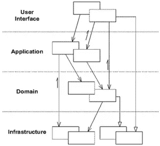

# 从地面开始的六角形建筑

> 原文：<https://levelup.gitconnected.com/hexagonal-architecture-from-the-ground-up-28f2a1097063>

唐尼·姜在 [Unsplash](https://unsplash.com/s/photos/hexagon?utm_source=unsplash&utm_medium=referral&utm_content=creditCopyText) 上的照片

经营传统农场肯定是一场噩梦。你必须给动物喂食，清理它们，安排兽医出诊，种植作物，控制害虫，同时还要兼顾数百项其他任务。

把所有东西都放在正确的地方肯定是一份全职工作。鸡盲目地四处游荡，被狐狸抢购，羊跳过栅栏，荆棘侵入你的土地。

区分农场的不同功能区域是成功管理的关键。让那些鸡远离玉米地，并竖起坚固的栅栏来阻止奶牛离开城镇。

照片由[马库斯·斯皮斯克](https://unsplash.com/@markusspiske?utm_source=unsplash&utm_medium=referral&utm_content=creditCopyText)在 [Unsplash](https://unsplash.com/s/photos/farmland?utm_source=unsplash&utm_medium=referral&utm_content=creditCopyText) 拍摄

# 干净的分离

类似地，在任何不平凡的软件项目中，一半的战斗是管理复杂性。事实上，你可以说任何软件专业人员的主要角色都是驯服复杂性，使我们工作的系统易于改变。

划分应用程序的功能区域是使其易于管理的关键。我们不想将您的持久性框架的关注点与核心业务逻辑、用户界面或代码中发生的任何事情混淆。根据 [*单一责任原则*](https://betterprogramming.pub/revisiting-solid-927e6a5202d3) ，我们要把因相同原因而变化的东西集合在一起，把因不同原因而变化的东西分开。这样做使得对代码的推理、测试和简单的维护变得更加简单。

> *把因为相同原因而改变的事物聚集在一起。将因不同原因而变化的事物分开——单一责任原则*

# 分层架构

管理关注点分离的最常见模式之一是通过使用分层架构。

来自 Eric Evans 的领域驱动设计

这些层捕获应用程序的相关部分。出于类似原因而改变的部分被保留在一起(内聚)，并从程序中不太相关的部分中分离出来(解耦)。任何层都应该只依赖于它自身的一部分或它下面的层。这使我们能够在应用程序的一个领域工作，而不必担心其他问题。

这是一个易于理解且广泛使用的模式，对很多软件来说都很棒。然而，它也存在一些问题。

# 当一层层变成千层面

尽管分层体系结构的分离很清楚，但边界并不总是保持得很好。

不管是有意识的还是无意识的，开发人员偶尔会模糊架构的界限来获得一个特性。例如，使用数据库存储过程来执行业务级任务会将问题分散到多个层。当你在杂草中时，这可能不明显，所以几个月后，这些层开始相互渗透，混合在一起，破坏了建筑的许多好处。

此外，分层方法暗示了架构的单一维度。如果您不仅仅需要一个用户界面来驱动应用程序，还需要一个 CLI、REST API 或事件流作为输入，该怎么办？当然，您可以将这些添加到分层架构中，但是它们并不完全符合一维心理模型。

# 驾驶和被驾驶

让我们翻转一个分层的架构。

用户界面*驱动*应用程序。它是所有互动的源泉。软件的核心(域和它的应用服务)对驱动方的*的交互作出反应，并依赖较低层来帮助它服务于这些请求。我们可以说那些较低的(最右边的)层是由*驱动的*。*

这里存在一种有趣的对称。*驱动*和*驱动*侧都是与我们应用程序的之外的事物*的交互。它们本身并不提供核心价值——这是领域的工作——而是帮助我们将核心价值传播到世界各地。*

软件提供的价值保存在这些中间层中，我们应该尽可能干净地与它们交互——包括测试。同样，我们希望防止外界的关注侵犯我们软件的核心目的。

# 六边形架构/端口和适配器

既然我们已经断言应用程序的中心是最有价值的部分，我们可以改变我们的架构来保护它。

我们要做的关键改变是依赖关系向内指向——域中的*——而不是像以前那样指向链中的下一层。这样做允许我们根据需要注入细节(数据库、用户界面等),并保持我们的核心抽象干净且不受影响。*

> 抽象不应该依赖于细节。细节(具体的实现)应该依赖于抽象——依赖倒置原则

## 应用程序和域

我们从领域模型开始。我们将它包装在应用服务(与我们的应用层相同)中，作为我们软件的核心。

这个包通常是技术不可知的——它只关注我们的软件要解决的问题。这使得推理、与领域专家讨论和测试变得更加简单。随着我们的发展，我们不再在头脑中处理正交的问题。

## 通往外界的港口

当然，我们需要在这个核心中插入一些东西，否则它完全没有用。这就是**端口**的用武之地。

一个**端口**只是一个接口。在*驱动*端，这个接口将调用我们的软件，询问它的问题——例如，将 10 美元存入我的银行账户。在*驱动的*端，我们有域调用的接口来使用外部资源——数据库、外部 API 等。

六边形架构的“*六边形*”部分是为了证明一个应用程序可能有许多不同的东西插入这些端口。我们可以用 GUI 和测试工具来驱动软件，或者在后端插入不同的数据库技术。

## 使用适配器插入

端口只是接口，所以我们需要一些东西来实现它们。我们想要连接的系统不兼容，所以我们需要使用**适配器**模式从一个域转换到另一个域。

每个端口都可以通过一个适配器安装，以允许外部系统与我们的应用程序对话，或者(在右边)让我们的应用程序与外部系统对话。

如前所述，这些适配器是*注入的*,所以我们图中心的抽象不依赖于图外的细节。

# 结论

这是六角形建筑的最终形式。我们已经从一个善意的，但最终耦合的，以层的形式出现的架构转变为一个更干净，更健壮的架构。

端口和适配器允许我们在系统中保持坚固的边界，保持不相关的东西被很好地分开。事实上，我们在六边形周围有多个端口，这使我们可以在每个端口上插入多个系统，并通过测试适配器来确保我们不会意外地将内核与外层耦合在一起(通过三角测量)。

## [编辑]是什么让这种架构比同等的分层架构更有弹性？

首先，依赖倒置。考虑分层架构:

> UI ->域->持久性[接口]

依赖性从上面的层流向下面的层。即使我们正确地使用了接口，并封装了持久化的内部机制，在一个重要项目的整个生命周期中，持久层的某些部分很可能会通过它的 API 泄漏。

在完美的世界中，这种情况不会发生，但是假设开发人员 A(有意或无意地)向持久性接口添加了一个方法，该方法返回一个 MongoDB 数据库游标作为响应的一部分。三个月后，在压力下，开发人员 B 利用在某个域服务中拥有光标的优势来完成他们自己的功能。随着时间的推移，一些持久性逻辑会泄漏到域层，这应该是与持久性无关的。

在六边形架构中，存储库接口与域共存(它是一个端口)。持久性适配器实现了这个接口，但是因为依赖性是反向的，所以不太可能出现意外泄漏。将特定于 DB 的关注点添加到域接口比添加到持久性接口更明显是错误的。

> UI -> Domain [Interface]

Secondly, because the ports live with the domain, there’s a cognitive shift to design it for the purposes of the domain, rather than designing it as an API for the database that the domain uses (a subtle shift).

In essence it’s about protection/evolution, of the application over time, rather than the architecture being objectively better in a perfect world (and it certainly doesn’t come without trade-offs).

## The tradeoffs

Of course, everything comes at a cost. Port interfaces need to be defined, and adapters need to be developed to translate between the semantics of the outer and inner layers. This is not completely trivial, and does come with some maintenance overhead / boilerplate.

For simple software a hexagonal architecture is almost certainly overkill. For more complex applications though — especially those with a busy domain, or that are following *域驱动设计* —它可以成为你工具箱中一个非常有价值的补充，有助于保持软件简单易懂和易于开发。

# 资源

*   [https://netflixtechblog . com/ready-for-changes with-hexagonal-architecture-b 315 EC 967749？gi=7c6004b0f580](https://netflixtechblog.com/ready-for-changes-with-hexagonal-architecture-b315ec967749?gi=7c6004b0f580)
*   【https://alistair.cockburn.us/hexagonal-architecture/ 
*   [https://medium . com/ssense-tech/hexagon-architecture-每层楼总有两面-bc0780ed7d9c](https://medium.com/ssense-tech/hexagonal-architecture-there-are-always-two-sides-to-every-story-bc0780ed7d9c)