# 熊猫分级索引

> 原文：<https://levelup.gitconnected.com/hierarchical-indexing-in-pandas-94ff198b7f35>

## 关于如何对 Pandas 使用层次索引(MultiIndex)的指南。

[钳工](https://unsplash.com/@benchaccounting?utm_source=medium&utm_medium=referral)在 [Unsplash](https://unsplash.com?utm_source=medium&utm_medium=referral) 上拍照

分级索引允许我们在一个轴上使用多个索引级别。分层索引也称为多重索引。在这篇文章中，我将展示如何使用层次索引。简而言之，我将涵盖以下主题:

*   什么是 MultiIndex？
*   什么是拆分？
*   什么是层次索引？
*   分层索引中的选择
*   什么是 Swaplevel？
*   分级索引中的排序
*   分层索引中的汇总统计信息
*   数据框中的分层索引

让我们开始吧。

首先，我打算进口熊猫。

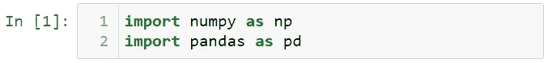

让我们从正态分布中生成随机数据。

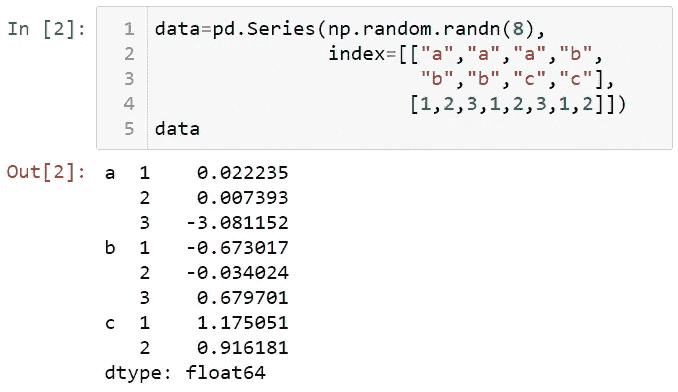

# 什么是 MultiIndex？

MultiIndex 允许您在索引中选择多个行和列。为了理解 MultiIndex，让我们看看数据的索引。

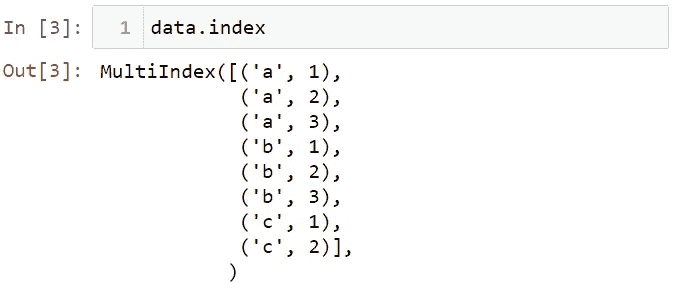

MultiIndex 是一种用于数据帧的高级索引技术，它显示了多个级别的索引。我们的数据集有两个层次。您可以使用索引获得数据的子集。例如，让我们看看索引为 a 的值。

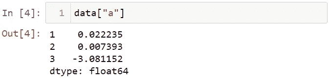

你可以把数据切片。

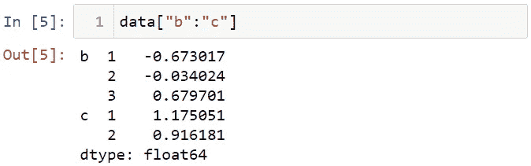

你可以看到不止一个指数。例如，让我们看看索引为 a 和 c 的值。

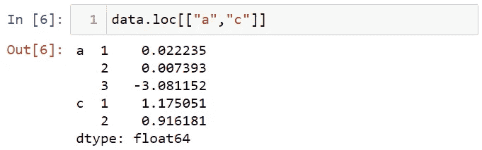

您可以从内部索引中选择值。让我们看看内部索引的第一个值。

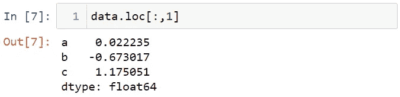

# 什么是拆分？

stack 方法将列名转换为索引值，unstack 方法将索引值转换为列名。您可以使用拆分方法以表格的形式查看数据。

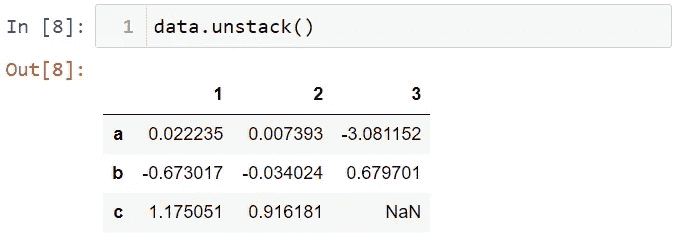

要恢复数据集，可以使用 stack 方法。

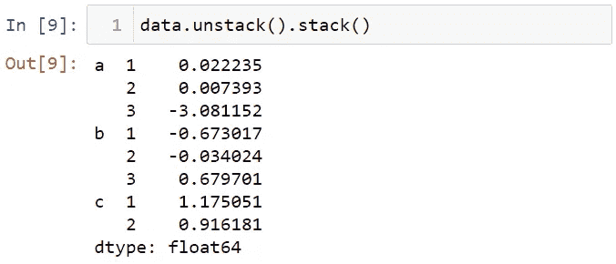

# 什么是层次索引？

分层索引是一种在数据集中创建结构化组关系的方法。数据框可以有等级索引。为了展示这一点，让我创建一个数据集。

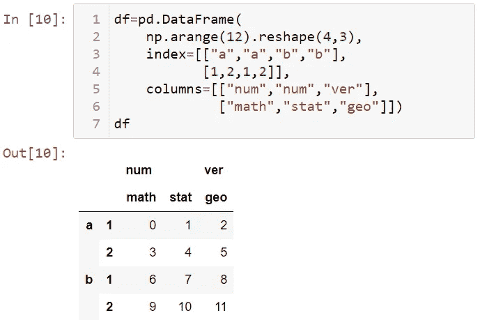

注意，在这个数据集中，行和列都有层次索引。您可以命名层次级别。让我们看看这个。

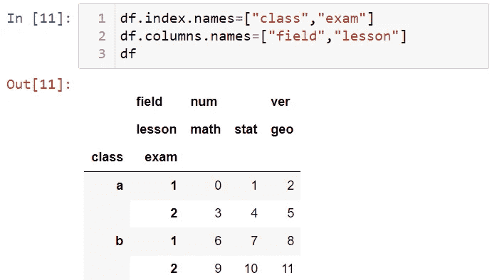

# 分层索引中的选择

您可以选择数据的子组。例如，让我们选择名为 num 的索引。

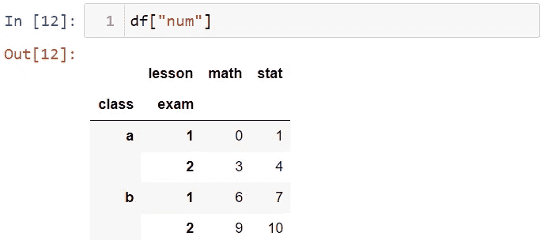

# 什么是 Swaplevel？

有时，您可能想要交换索引的级别。为此，您可以使用 swaplevel 方法。swaplevel 方法采用两个级别并返回一个新对象。例如，让我们交换数据集中的课程和考试索引。

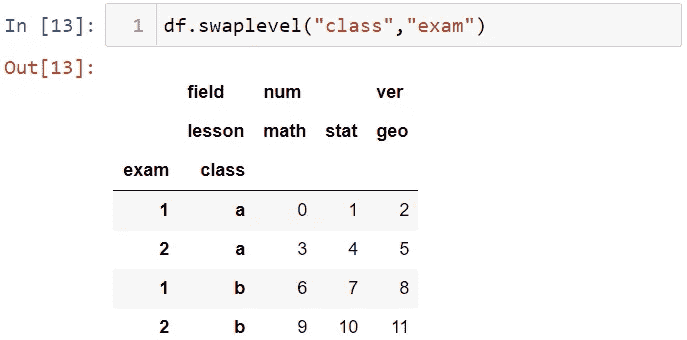

# 分级索引中的排序

要按级别对索引进行排序，可以使用 sort_index 方法。例如，让我们按级别 1 对数据集进行排序。

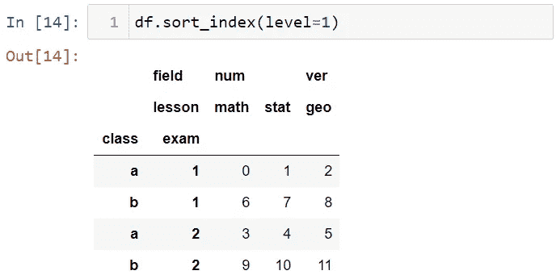

# 分层索引中的汇总统计信息

系列或数据帧中的汇总统计数据可以通过一个级别找到。如果您有多个级别的数据，您可以根据级别计算汇总统计数据。例如，让我们根据数据集中的考试级别来查看总和值。

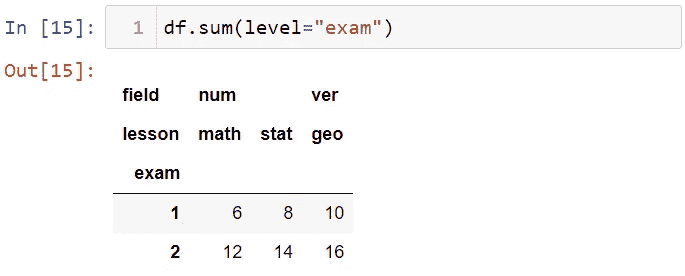

让我们根据字段级别来查看总值。

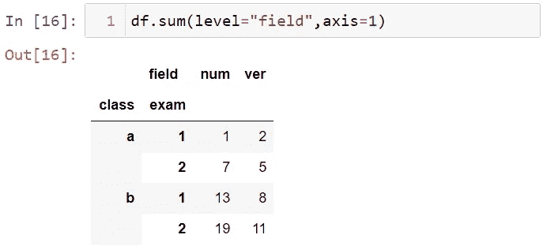

# 数据框中的分层索引

您可以将数据帧的列移动到行索引。为了展示这一点，让我们创建一个数据集。

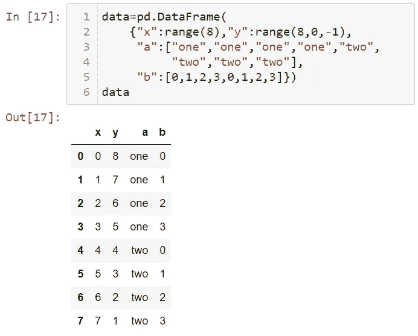

让我们将这个数据集的 a 列和 b 列转换成一个行索引。

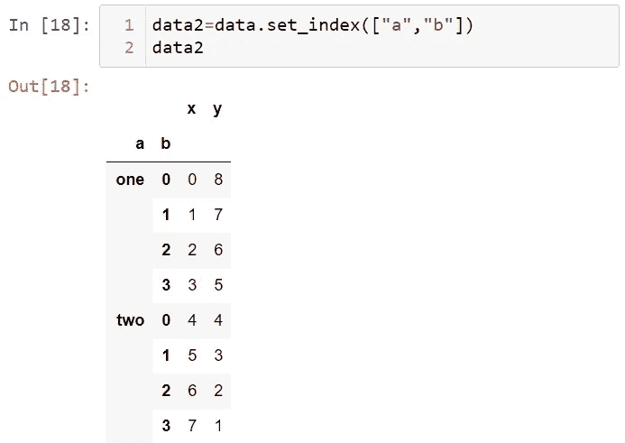

在 set_index 方法中，移动到行的索引将从列中删除。可以使用 drop = False 将获得的列作为索引保留在同一位置。

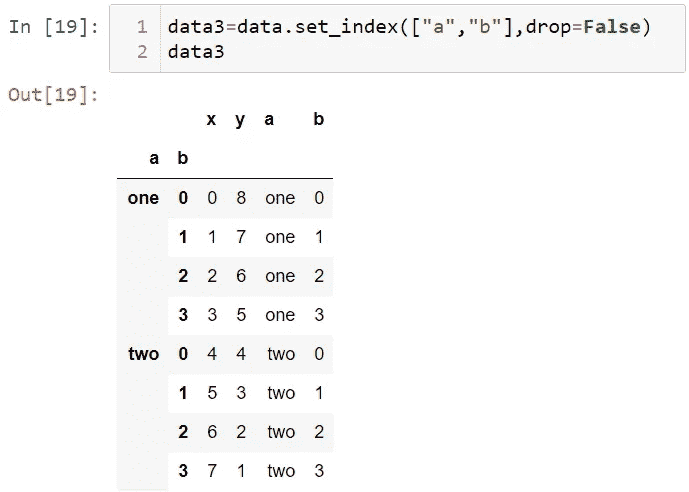

让我们首先看一下 data2 来演示 reset_index 方法。

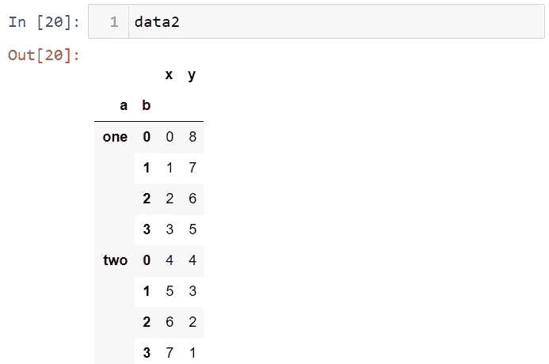

您可以使用 reset_index 方法来恢复数据集。

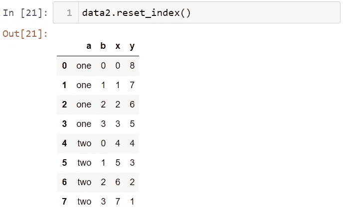

就是这样。在这篇文章中，我解释了熊猫的层次索引。我希望你喜欢这篇文章。感谢阅读。在这里可以找到笔记本[。](https://github.com/TirendazAcademy/PANDAS-TUTORIAL/blob/main/13-Hierarchical%20Indexing.ipynb)

别忘了在[YouTube](http://youtube.com/tirendazacademy)|[Twitter](http://twitter.com/tirendazacademy)|[GitHub](http://github.com/tirendazacademy)|[Linkedin](https://www.linkedin.com/in/tirendaz-academy)|[ka ggle](https://www.kaggle.com/tirendazacademy)上关注我们

 [## Python 熊猫教程

### Pandas 是 Python 最重要的库之一。在这篇博文中，我将谈论熊猫图书馆并展示…

medium.com](https://medium.com/codex/python-pandas-tutorial-42be3e827e2a)  [## 熊猫的实用数据分析

### 在我的上一篇文章中，我提到了在熊猫图书馆使用数据。Python 最重要的库之一是熊猫…

levelup.gitconnected.com](/practical-data-analysis-with-pandas-c40fbd2955fa) 

如果这篇文章有帮助，请点击拍手👏按钮几下，以示支持👇