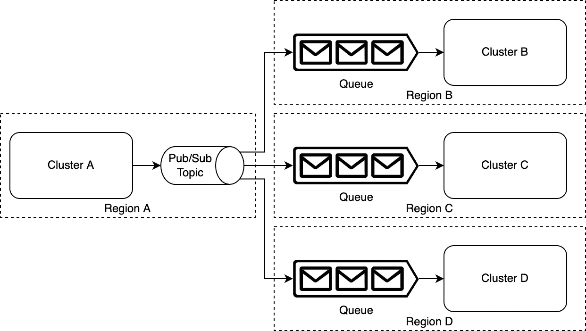
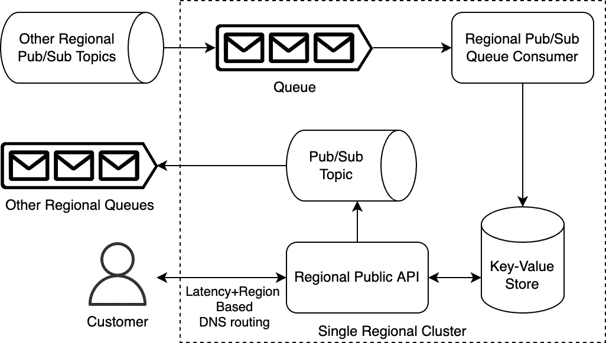
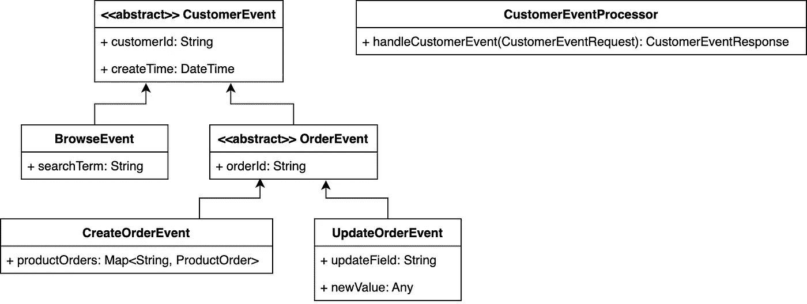

# 高级与低级

> 原文：<https://levelup.gitconnected.com/high-level-vs-low-level-54b8faea4ffa>

当某人以*高层次*对*低层次*描述某事时，这意味着什么？这取决于上下文(被描述的内容)。在软件上，你越低，越接近单机的硬件。相反，在最高级别，您可以端到端地了解整个系统的全貌，这可能会跨越整个地球(或更多)。

# 跨区域(全球)

在这样一个由成千上万台相互通信的机器组成的全球系统中，其人类可读的系统设计图不会显示每一台机器，它可能会显示区域机器集群如何相互通信。下面的跨区域发布/订阅消息传递模式就是一个例子:

*注意:在 AWS 中，这些发布/订阅主题和队列可能分别是 SNS(简单通知服务)和 SQS(简单队列服务)。不管是哪种情况，上图都是非常高级的。*

# 单一区域

即使是这些区域集群之一的系统设计图(如下图所示)也会被认为是高层次的(绝对意义上的)。然而，相对于上面的图表，这将是一个较低层次的图表(或描述)。需要注意的是，一个对话中的高级图表在另一个对话中可能被认为是低级图表。都是相对的。下面，我们稍微深入一点，想象一下我们的一个区域集群可能如何消费和处理这些跨区域消息:

*注意:我们只是将消息存储在数据存储中。实际上，需要区域集群的系统可能比这复杂得多，有自己的内部发布/订阅主题队列、缓存服务、分片数据库表等…*

# 单一应用

再往下一步*可能是*一个描述机器上运行的单个应用程序中不同组件交互的图(或描述)。下面是一个面向对象的设计图表示例，描述了一个基本的单一用途事件处理器。

*注意:这个抽象类和具体子类的例子是面向对象设计的一个非常基本的例子，但是对于这篇博文的范围来说已经足够了。还要记住:更喜欢组合而不是继承，因为前者更有可塑性(可以改变)。现实世界中应用程序中不同组件的实际图表通常要比上面的复杂得多。*

# 我们能更低吗？

大多数开发人员不需要更低，因为像 Python 或 Java 这样的高级编程语言是带有 API 的工具，这些 API 提供了一个接口，隐藏了与操作系统内核和系统硬件的所有本质交互。Python 是建立在(用)C 语言之上的，C 语言是一种相对较低级的编程语言。退一步说，那些熟悉汇编语言的人会认为 C 是一种高级编程语言。汇编语言是由人类可读代码组成的最低层次的编程。在这一层，编写的代码特定于运行它的硬件。最后，绝对最低层是机器码——0 和 1。

用 Java 或 Python 等高级编程语言编写的优秀开发人员仍然需要了解硬件中发生的交互——特别是内存、持久存储，甚至 CPU 周期中发生的代码循环。有些人可能会认为这种意识是软件开发人员和软件工程师之间的区别，但无论是哪种情况，编写代码*就是*开发软件。这听起来很容易，但对于处理互联网规模的流量和数据的分布式系统来说，这变得很有挑战性。

# 最后的话

需要注意的是，在高级和低级之间没有有限的“级别”。有些系统配置很容易介于这里提到的级别之间。例如，描述单台机器中多个 Docker 容器之间的通信的图表可以很好地放在[单个区域](#b2e6)和[单个应用](#4b57)之间。或者，描述面向对象设计的层次可以用功能设计或其他编程范例来代替。软件及其运行系统令人难以置信的灵活性使得写这样一篇文章很困难。困难在于将一个抽象的主题(如*高层次对低层次*)分解成具有明确界限的具体术语。这就是为什么这些帖子需要大量使用像*可能*、*可能*或*通常*这样的词。尽管在这个领域中有很多界限明确的绝对概念，但是也有同样多(如果不是更多)的抽象概念不仅彼此相关，而且实际上彼此重叠！这种灵活性的一个例子是如何将面向对象的特性构建到 C 语言中，而 C 语言本身并不提供这种功能。这并不意味着“万事皆有可能”——每个解决方案取决于*单独的用例*，软件是无限用例的完美工具。

## 链接

*   [AWS SNS 跨区域交付](https://docs.aws.amazon.com/sns/latest/dg/sns-cross-region-delivery.html)
*   [基于延迟的多区域路由](https://aws.amazon.com/blogs/aws/latency-based-multi-region-routing-now-available-for-aws/)