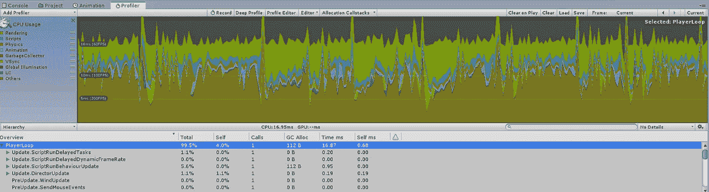
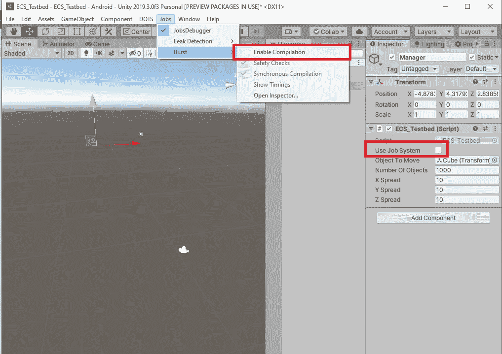
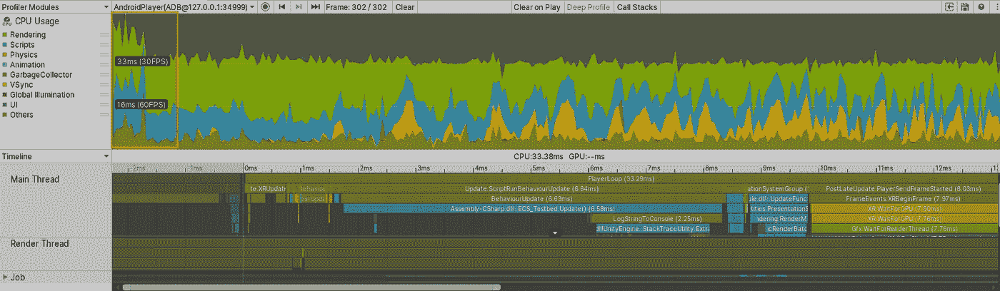

# 低端 Android 手机上的高性能 VR

> 原文：<https://levelup.gitconnected.com/high-performance-vr-on-a-low-end-android-phone-9186177d0e20>

## 在廉价的智能手机上显示一千个移动的立方体。

斯科特·韦伯在 [Unsplash](https://unsplash.com?utm_source=medium&utm_medium=referral) 上拍摄的照片

# **简介**

虚拟现实是在消费设备上呈现交互式内容的一种有前途的方式。但同时，它对资源的要求也很高。这就是为什么大多数能够平稳运行 it、创造高度用户兴奋度和参与度的设备往往价格昂贵，并且依赖于固定的计算设备。

另一方面，VR 也可以在智能手机上体验；几乎每个人都拥有的普通袖珍设备。大约三分之一的设备(大约。2020 年预测 4.8 亿台；参见参考文献 2)被归类为“低端”，这意味着它们的价格大约为 100 至 200 欧元。问题是它们提供的硬件能力有限，这使得运行高复杂度的 VR 非常困难，有时甚至不可能。但是，如果这种困难可以以某种方式减少甚至绕过，那么基于智能手机的虚拟现实可能会作为一种可行的选择回到游戏中，由大量低拥有成本的设备支持。

在这篇文章中，我们讨论了使用 Unity 全新的面向数据的技术堆栈(DOTS)在诺基亚 5.1 Android 手机(150 欧元价格范围)上运行的资源密集型演示 VR 应用程序的实现，以便尽可能多地发挥手机硬件的性能。让我们首先将 DOTS 与 Unity 中优化移动 VR 内容的常见方法进行比较。

# **传统优化**

在[之前的文章](https://medium.com/swlh/develop-a-simple-vr-golf-application-6cb6539fc037)中，我们通过创建一个简单的 VR 高尔夫演示应用程序并将其部署在我们的诺基亚 5.1 手机上，讨论了场景构建和优化的传统实践的使用。我们采用了纹理贴图和静态批处理等技术，以最大限度地减少所需的绘制调用次数，并显著提高性能。我们完成了一个艰苦的优化过程，反复调整游戏对象在场景中的位置，然后反复分析部署的应用程序(见图 1)。

图 1:高尔夫应用程序的最终分析结果。

最终产品在我们的智能手机上以大约 60 fps 的稳定帧速率平稳运行，如下面的视频 1 所示，但它花了很长时间来创建它，这与其低功能复杂性完全不相称。

视频 1:显示 fps 调试信息的高尔夫应用程序的简短视图。

另一方面，在一个功能复杂的 VR 高尔夫应用程序中，我们可以让多名球员同时在多个分区进行多次击球。在场景中同时显示大量实时球轨迹和其他移动物体的高要求任务，可能会很容易地将应用程序的性能降低到低端智能手机上不可接受的水平，使应用程序几乎无法使用。因此，我们需要开发移动虚拟现实应用:

1.  在更短的时间内
2.  在某种程度上确保开箱即用的卓越性能，限制手动优化的低成本流程。

# **使用单位点编写代码**

为了在处理寻路(即计算下一帧中特定对象的位置)等基本的资源密集型任务时实现上述目标，我们需要高效利用低端智能手机中可用的所有处理器内核。为此，Unity 的 DOT Stack 配备了 Burst 编译器(一种高效的本机代码生成器)和实体组件系统(ECS)，可以清晰地将游戏数据与计算和对它们执行的操作分开。它还具有作业系统，该系统管理多核设备上基于 ECS 的功能的多线程执行。

总之，它主要是关于一种全新的、数据驱动的编写和执行代码的方式。我们的演示应用程序使用 Unity 的点堆栈实现，并显示一千个立方体同时通过默认的虚拟空间向主摄像头漂移。首先，我们创建了负责寻路计算的 ZTranslationJob 作业类，如下面的代码片段所述。

代码片段 1:指示作业系统计算每个立方体的下一个位置。

作业系统自动管理由 ZTranslationJob 产生的所有线程，并在所有可用的处理器内核中高效地执行它们。因为所有的立方体都是直线移动的，所以我们的寻路算法非常简单。因此，我们的 DOTS 驱动的演示和单线程实现之间的任何性能差异都可以忽略不计。因此，为了正确地模拟真实世界的游戏开发场景，这肯定需要复杂的寻路计算，我们向 ZTranslationJob 的执行循环添加了一个虚拟的“繁重任务”(参见参考 6 中的 Assets/Scripts/Helpers.cs)。此外，除了使用作业系统，我们还以两种略有不同的方式对实现进行了编码:

1.  未使用 ECS。这意味着所有的立方体都将在场景中被渲染成普通的游戏对象。
2.  ECS 已启用。所有立方体实例将被转换为点样式的实体，并且每个立方体在场景中的位置将由平移组件表示。

代码片段 2 和 3:实例化多维数据集的两种不同方式。

这两种实现风格的基础在上面的代码片段 2 和 3 中显示，当在两个不同的平台上运行应用程序时，它们会产生显著的性能影响:标准 PC 和我们的诺基亚 5.1 Android 智能手机。

# **立方体演示**

我们首先使用第一种样式实现立方体运动，并禁用拆分编译器，如下面的屏幕截图所示。这意味着该应用程序将在单线程模式下运行，在虚拟环境中只呈现普通的游戏对象。

图 2:起点低。

在普通 PC 上运行这种配置(例如 3 GHz 四核 CPU、16 GB RAM、GeForce GTX 1060 6 GB 显卡)产生的结果令人失望。帧速率低得令人无法接受，大约为 5 帧/秒，游戏速度明显落后。显然，在这一点上部署到我们的 Android 智能手机上没有任何意义；应用程序会变得非常慢，以至于几乎无法使用。

视频 2:在相对强大的 PC 上运行单线程“重型”寻路。

如果我们现在使用第二种实例化样式实现 cube motion，然后选择 Manager 对象的 Enable Job System 属性并再次运行应用程序，则所有 cube 对象都将实例化为 DOTS 实体，从而使性能提高了大约五倍(25 fps)。尽管如此，对于 PC 系统来说，这还是相当低的，这表明对于我们的 Android 智能手机来说，这将再次低得不可接受。以下视频显示了在 PC 上玩游戏。

视频 3:作业系统已启用。更好，但对移动 VR 来说仍然不够。

然而，当启用拆分编译器选项时，可以观察到巨大的改进。现在，在 PC 上玩游戏变得相当稳定，超过 200 fps。

视频 4:启用了作业系统和拆分编译器。

下图突出显示了该应用程序在最后阶段在移动设备上的输出，显示了在作业系统和拆分编译器均启用的情况下，诺基亚 5.1 上的探查器结果。

图 3:剖析 Android 上的最终演示应用。

在一段非常短的相对较低的性能时期后(图 3 中的红色帧标记)，应用程序继续以 30 fps 的稳定帧速率平稳运行，为用户提供了愉快的体验(见下面的视频)。

视频 5:部署在我们低端智能手机上的最终产品。

此外，性能似乎不受主摄像头移动的影响。这意味着，即使当用户四处移动他/她的头部时，我们的智能手机上的 VR 体验也是流畅的，尽管我们在我们的场景中有 1000 个独立移动的立方体，每个立方体都有一个“繁重”的寻路计算任务。

# **结论**

通过使用 Unity DOTS 实现涉及大量移动物体的复杂场景，有可能利用智能手机设备的所有处理核心来解决寻路问题，即使它是低端型号。

从程序员的角度来看，这是以实体组件和作业系统的结构化和全面的方式完成的，不需要大量代码，只需手动构建多线程 Unity 应用程序的一小部分时间。

从用户的角度来看，人们已经拥有的如此多的低端(因此，低成本)智能手机设备可以潜在地作为高质量的虚拟现实设备，这是非常好的。这两种观点都有助于提高日常生活中虚拟现实的采用率。在我们的下一篇文章中，我们将讨论使用 Unity DOTS 实现一个完整的 VR 游戏，以及它在我们通常的“基准”Android 手机上的性能。

# **参考文献**

1.  [开发一个简单的 VR 高尔夫应用](https://medium.com/swlh/develop-a-simple-vr-golf-application-6cb6539fc037)。
2.  [Unity 面向数据的技术栈文档。](https://github.com/Unity-Technologies/EntityComponentSystemSamples/blob/master/ECSSamples/Documentation/index.md)
3.  [2012 年至 2022 年全球按价格分类的智能手机出货量。](https://www.statista.com/statistics/934471/smartphone-shipments-by-price-category-worldwide/)
4.  [诺基亚 5.1 安卓智能手机(GSMArena)的规格。](https://www.gsmarena.com/nokia_5_1-9214.php)
5.  [电脑游戏中的寻路。](https://arrow.tudublin.ie/cgi/viewcontent.cgi?article=1063&context=itbj)
6.  该项目的源代码:[https://github.com/mkoutroumpas/ECS_Testbed](https://github.com/mkoutroumpas/ECS_Testbed)