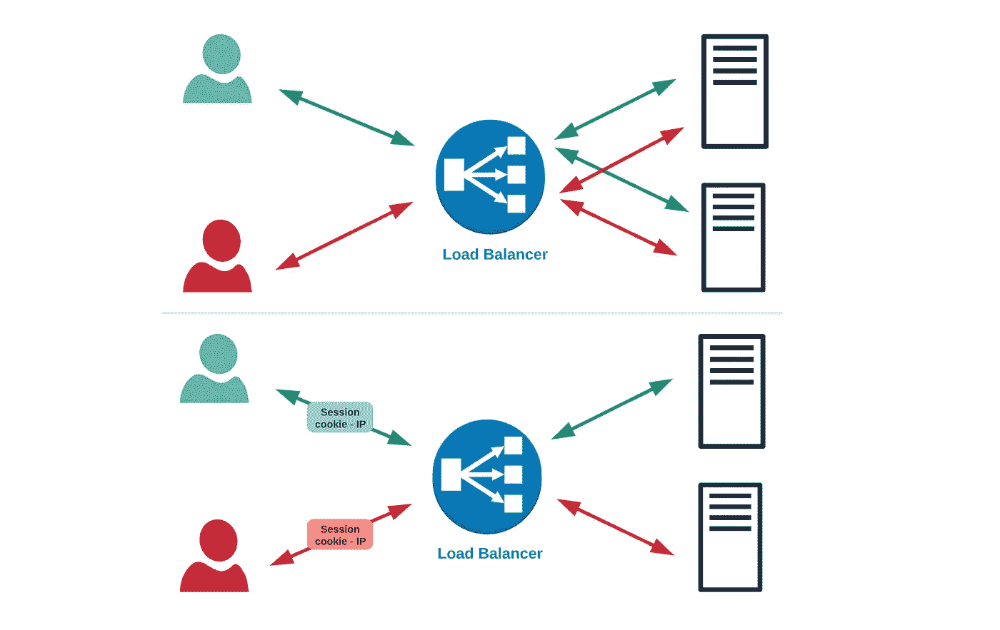
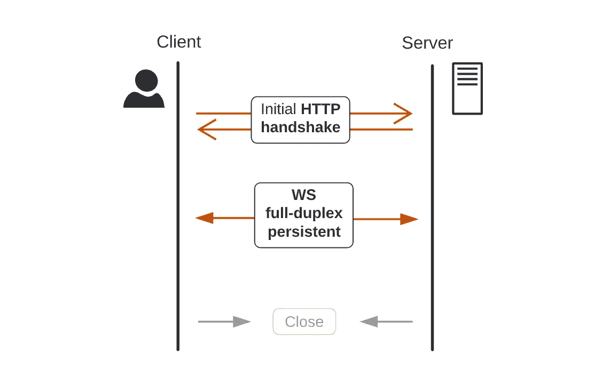
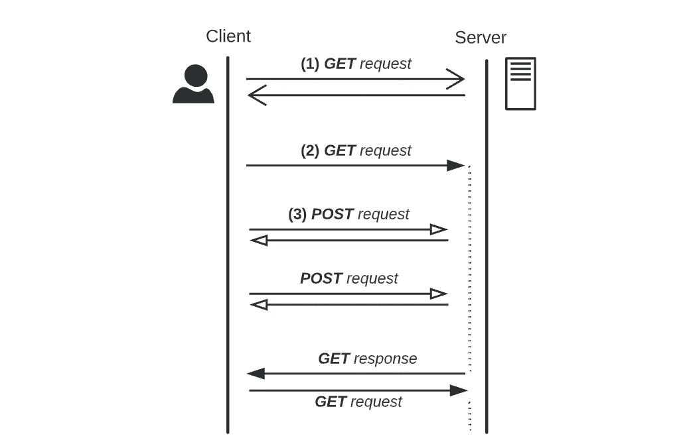
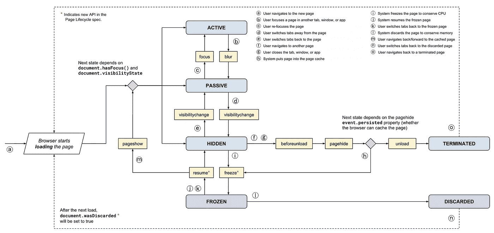
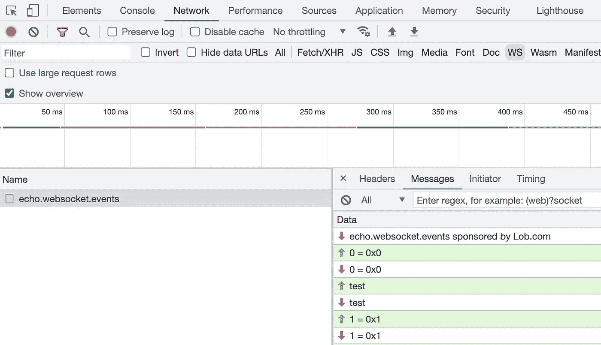

# Web 套接字的高弹性

> 原文：<https://levelup.gitconnected.com/high-resilience-with-web-sockets-315641e4f02c>

## 使用实时数据确保连通性和增强 UX 的技巧

在一个拥有巨大数据量的快速发展的世界里， [WebSockets](https://developer.mozilla.org/en-US/docs/Web/API/WebSocket/WebSocket) 在谈论实时通信时往往会成为第一选择，因此，在使用它们时提高它们的能力是非常重要的。


实时图表示例

虽然这不是本文的目的，但值得注意的是，根据场景的不同，【WebSockets 可能有些过头了，其他替代方案 **如服务器端事件(** [**SSE**](https://developer.mozilla.org/en-US/docs/Web/API/Server-sent_events/Using_server-sent_events) **)或轮询** **对于大多数常见情况来说可能是足够好的解决方案。**

说到这里，我们不打算深入实施细节或解释整个[协议](https://datatracker.ietf.org/doc/html/rfc6455)本身，而只是强调几个概念来支持您在考虑 Web 套接字时应该考虑的不同点，主要是前端方面。

下面，我们旨在涵盖以下主题:

1.  会话粘性
2.  订阅缓存
3.  应用可见性
4.  网络状态
5.  插座配置

# 1.粘性会话

会话粘性(*又称为会话持续性或关联性*)是一个过程，其中负载平衡器将特定会话的请求路由到为该会话的第一个请求提供服务的同一物理机器，从而在客户端和特定网络服务器之间创建关联性。



无粘性与粘性会话配置

这通常是通过发布 cookie 或跟踪他们的 IP 详细信息来实现的。

> **粘性本身仅仅取决于你的技术和产品规格**

## 您计划扩展您的系统吗？

如果不是这种情况，你的系统的本质已经达到了粘性。唯一的服务器实例将侦听和处理所有连接。

## 您需要提供连接回退吗？

WebSocket 是一个开放的 TCP 连接，当连接打开时，服务器和客户端可以在任何给定的时间发送和接收数据。

当客户端请求对 WebSockets ( *又名握手*)进行连接升级时，返回 [HTTP 101](https://developer.mozilla.org/en-US/docs/Web/HTTP/Status/101) 状态码以接受连接升级的目标就是 WebSocket 连接中使用的目标。**一旦升级，基于 cookie 的粘性将不再使用**。

> WebSocket 连接天生具有粘性

[握手](https://developer.mozilla.org/en-US/docs/Web/API/WebSockets_API/Writing_WebSocket_servers#the_websocket_handshake)旨在与基于 HTTP 的服务器端软件和任何中介兼容，以便 HTTP 和 WebSocket 客户端可以使用一个端口与服务器对话。



Web 套接字图

连接到`/prices`名称空间的客户端握手看起来像这样:

```
 GET /prices HTTP/1.1
 Host: example.com
 **Upgrade: websocket**
 Connection: Upgrade
 Sec-WebSocket-Key: dGhlIHNhbXBsZSBub25jZQ==
 Origin: https://example.com
```

服务器的响应是:

```
 **HTTP/1.1 101 Switching Protocols**
 Upgrade: websocket
 Connection: Upgrade
 Sec-WebSocket-Accept: s3pPLMBiTxaQ9kYGzzhZRbK+xOo=
```

> **Sec-WebSocket-Key** 是一个随机的 16 字节 nonce (base64 编码),它在服务器中与预定义的 GUID 一起使用，以导出 **Sec-WebSocket-Accept** 报头，**,因此客户端确保服务器支持 WS，并且不会将数据解释为 HTTP 请求**

> WebSocket 协议是一个独立的基于 TCP 的协议。它与 HTTP 的唯一关系是它的握手被 HTTP 服务器解释为升级请求

然而，默认情况下， [Socket.io](https://socket.io/) 和 [SockJS](https://github.com/sockjs/sockjs-client) 等套接字引擎会建立与 **HTTP 长轮询**传输的连接，以防止由于公司代理、个人防火墙等原因建立 WebSocket 连接时可能出现的问题。

长轮询(*或“轮询”*)基本上由连续的 HTTP 请求组成:

*   *长时间运行的* `GET`请求:从服务器接收数据(相当于服务器*发出*)
*   *短时运行* `POST`请求:向服务器发送数据(相当于客户端*发出*)



长轮询图

> 服务器选择保持客户端连接打开，直到数据可用(或超时后)。这比原来的轮询技术更有效，因为服务器不需要为每个新的传入连接分配新的资源来处理、解析、生成和传递响应

在连接开始时***【1】***服务器发送会话 ID `sid`以及其他信息:

```
*Request*
GET https://example.com/prices/?EIO=3&**transport=polling**&t=NymEVAg*Response*
{
  "**sid**": "**aBM2xUVW5zx0WC3ZAAQE**",
  "upgrades": ["websocket"],
  "pingInterval": 25000,
  "pingTimeout": 20000
}
```

在升级到 WS 之前，该会话 id 必须作为查询参数包含在所有后续 HTTP 请求中，作为协议的一部分:

```
**(3)** POST https://example.com/prices/EIO=3&transport=polling&t=NymEVR0&**sid=aBM2xUVW5zx0WC3ZAAQE****(2)** GET
http://example.com/prices/EIO=3&transport=polling&t=NymEVR4&**sid=aBM2xUVW5zx0WC3ZAAQE**
```

所有这样的服务器实现通常将会话状态存储在内存中，因此**给定会话的每个长轮询请求需要到达同一个服务器**，也就是说**会话粘性。**

> 根据引擎，您可以禁用此回退。以 Socket.io 为例，您可以在启动连接时通过[传输](https://socket.io/docs/v3/client-initialization/#transports)参数来避免长时间轮询:`*transport = ['websocket']*`

## 您是否为每个用户提供个性化数据？

与 http 相比， **WebSocket** 协议**没有元数据**，因此如果连接丢失，负载平衡器将不得不在 TCP 层实现负载平衡。

> 失去连接后，负载平衡器和浏览器之间将发生 http 升级协商

**负载平衡器可以** **因此使用粘性会话 cookie** 以便将连接发送到合适的服务器实例。

但是，如果您的应用程序只需要一个没有个性化内容的通用实时源，它可以重新连接到任何实例**、**，因此粘性会话不是强制性的。

> 即使提供定制的更新，只要你能确保在你的所有实例中提供正确的提要，你就不需要会话粘性

# 2.订阅缓存

根据应用程序的性质，您需要特别注意它如何处理实时更新。

在大多数情况下，一个简单的场景可能需要在一个页面中显示一个提要。

然而，对于更复杂的应用程序，您应该事先问自己几个问题:

*   *我的应用需要多少订户？它们是固定的还是基于用户交互动态创建的？*
*   *它们是如何分布的？他们使用来自同一来源的数据吗？它们是在应用程序、页面还是组件级别分配的？*
*   *登录时，无论导航如何，我是否需要在后台使用任何订阅源？*

根据答案思考以下几点。

## **跟踪给定房间的预订情况**

例如，根据您的需求为订阅实体建模:

```
import { Subscription } from "rxjs"*class* SourceSub {
 // Subscriber -> Subscription
 *private* subscribers: *Map*<*string*, Subscription> = new *Map*()
}
```

每个`SourceSub`被绑定到一个[房间](https://socket.io/docs/v3/rooms/)作为数据源，你的应用程序中从同一来源获取更新的所有部分应该由同一个实例处理。

`subscribers`地图让我们可以通过存储每个 UI 部件的数据源订阅来实现，这些 UI 部件需要对给定房间进行实时更新。

## 缓存最后一个提要

给定一个房间，缓存最后收到的值:

```
*class* SourceSub { *private* subscribers: *Map*<*string*, Subscription> = new *Map*()
 **private lastValue?** //Your feed model
}
```

这将有助于在用默认值呈现新组件时增强用户体验，直到它获得新的提要更新。

> 根据您的数据馈送约束，考虑在服务器端缓存它

## 在您的应用中缓存订阅

在任何给定时间缓存应用程序中的所有活动订阅:

```
*class* MyApp {
 // Room -> SourceSub
 private appSubCache: Map<string, SourceSub> = new Map()
}
```

> 根据您的需求和服务器套接字配置的缓存结构

每次装载显示实时数据的新组件时，您都需要跟踪它并创建合适的订阅。成像一个`header`组件第一次加入`today`通道:

```
const channel = 'today'
const subscriber = 'header'
const source$ = my_feed_stream*// Component subscription receiving live updates* const headerSubscription = source$.subscribe(update)*// New source subscription for the first time*
const roomSubscription = new SourceSub()
roomSubscription.add(subscriber, headerSubscription)*// Store it*
this.appSubCache.add(channel, roomSubscription)// Join room
join(channel)
```

举个例子，当`my_feed_stream`发出动态数据时，`update`将作为回调函数相应地更新每个新提要的组件状态，但是您可以实现任何其他机制将数据源连接到您的组件树。

## **退订**

每当获取实时更新的组件被卸载时，确保它从数据源中取消订阅。

假设用户现在导航到一个没有`header`组件的新页面:

```
const channel = 'today'
const subscriber = 'header'*const* subscription = this.appSubCache.get(channel)
// Unsubscribe and delete 
subscription.remove(subscriber)if (subscription.hasNoSubscribers()) {
  // Remove SourceSub *
  this.appSubCache.delete(channel) // Leave room
  leave(channel)
}
```

这将防止内存泄漏并改进处理，而无需从服务器更新针头。

> ***** 请记住，您可以为没有订户但有`*lastValue*`的给定房间保留`SourceSub`实例，这样下一个新订户将始终有一个默认值可供显示

# 3.应用可见性

一个普通用户可能会同时打开几个页面，所以你应该考虑当你的应用不活跃时会发生什么。

> 用户代理通常有特定的策略来减轻后台或隐藏选项卡的性能影响

例如，大多数浏览器停止发送`requestAnimationFrame`回调，像`setTimeout`这样的计时器被节流以提高性能和电池寿命。

> 像[标签丢弃](https://developer.chrome.com/blog/tab-discarding/#discarding-unused-tabs)和[基于预算的后台超时](https://developer.chrome.com/blog/background_tabs/#budget-based-background-timer-throttling)调节这样的功能在现代浏览器中可用，以提供对后台计时器 CPU 使用的额外限制

然而，**像音频**播放、**索引 DB** 和**实时连接(WebSocket 和 WebRTC)这样的进程不受这种节流**行为的约束，以避免超时关闭连接。

请记住，您可以为基于 web 的应用程序使用 [**页面可见性**](https://developer.mozilla.org/en-US/docs/Web/API/Page_Visibility_API) API:

```
function getPageVisibility() {
  let hidden, visibilityChange
  if (typeof document.hidden !== "undefined") {
    hidden = "hidden"
    visibilityChange = "visibilitychange"
  } else if (typeof document.msHidden !== "undefined") {
    hidden = "msHidden"
    visibilityChange = "msvisibilitychange"
  } else if (typeof document.webkitHidden !== "undefined") {
    hidden = "webkitHidden"
    visibilityChange = "webkitvisibilitychange"
  }
  return { hidden, visibilityChange }
}
```

根据您的应用和性能要求，您可能需要在应用处于非活动状态时关闭所有连接，但更重要的是，**当应用返回前台时，您应该始终确保连接处于正常活动状态**，以减少任何连接停机时间:

```
document.addEventListener(visibilityChange, () => {
 if(!document[hidden]) {
   **// Ensure connectivity** 
 }
}, false)
```

> 当切换标签或最小化浏览器时，监听器将被触发

页面可见性 API 得到了广泛的[支持](https://caniuse.com/pagevisibility)，但是那些不支持它的浏览器可以使用替代的 [**onblur**](https://developer.mozilla.org/en-US/docs/Web/API/GlobalEventHandlers/onblur) 和 [**onfocus**](https://developer.mozilla.org/en-US/docs/Web/API/Element/focus_event) 事件来代替。



页面生命周期 [API](https://developers.google.com/web/updates/2018/07/page-lifecycle-api)

请注意，这些事件会通知您**用户是否切换了窗口，但这并不一定意味着它是隐藏的**。只有当用户切换选项卡或最小化包含该选项卡的浏览器窗口时，页面才会隐藏。

> 或者，你也可以尝试使用 [**页面隐藏**](https://developer.mozilla.org/en-US/docs/Web/API/Window/pagehide_event) 和 [**页面显示**](https://developer.mozilla.org/en-US/docs/Web/API/Window/pageshow_event) 事件，但是在触发事件时要考虑它们的局限性

如果您提供一个移动应用程序，您将需要基于您的移动技术实现类似的 API。

> 在本地移动平台上，基于操作系统，后台应用程序或其连接可能会被系统终止，以节省资源

例如，基于 Cordova 或 Capacitor 的应用程序可以使用 [**暂停**](https://cordova.apache.org/docs/en/latest/cordova/events/events.html#pause) 和 [**恢复**](https://cordova.apache.org/docs/en/latest/cordova/events/events.html#resume) 事件来控制应用程序的可见性。

Android 应用程序可以通过 [**onPause**](https://developer.android.com/guide/components/activities/activity-lifecycle#onpause) 和[**on resume**](https://developer.android.com/guide/components/activities/activity-lifecycle#onresume)activity life cycle 方法来跟踪它，在 iOS 上可以使用 [**前台**](https://developer.apple.com/documentation/uikit/uiapplication/1622944-willenterforegroundnotification) 通知和 [**应用状态**](https://developer.apple.com/documentation/uikit/uiapplication/1623003-applicationstate) 之间的组合。

> 一个 WWDC 2020 [视频](https://developer.apple.com/videos/play/wwdc2020/10078/)解释了你的应用程序可能被杀死的主要原因

# 4.网络状态

在手机上，用户可能会因为一些原因暂时失去连接，所以你需要考虑这些情况。

在这种情况下，您可以通过收听**在线/离线** [**事件**](https://developer.mozilla.org/en-US/docs/web/api/navigator/online) 来检测应用程序是否在线，并采取相应措施:

```
window.addEventListener('online',  event => {
  **// Ensure connectivity** })
```

不是特别相关，但是如果您想收集关于用户行为的统计数据，您可以使用网络监听器或页面可见性 API 以及 [**sendBeacon**](https://developer.mozilla.org/en-US/docs/Web/API/Navigator/sendBeacon) 方法:

```
window.addEventListener('offline',  event => {
  navigator.sendBeacon('/info', data)
})
```

该方法**在用户代理有机会时异步传输数据**，**而不阻止卸载文档**。

# 5.插座配置

如前所述，WebSocket 是客户机和服务器之间的一个开放的 TCP 连接。

## 关系

默认情况下，像`SocketIO`这样的套接字引擎使用**多路复用**，这意味着你可以在一个共享连接上拥有**几个通信通道**(又名[名称空间](https://socket.io/docs/v4/namespaces/) ) **。**



检查本地[插座](https://echo.websocket.events/.ws)示例

当连接断开时，你的应用将停止获取所有频道的新内容。

然而，在启动连接时设置配置标志`*forceNew: true*`将会改变这种情况，从而**获得每个名称空间**的独立套接字连接(在这种情况下，您将在 devTools 中看到与单个套接字连接一样多的 WebSockets 条目)

> 如果你好奇的话，你可以分别通过`chrome://net-export`和`https://netlog-viewer.appspot.com`来记录和加载低级别的网络活动

## 版本匹配

继续使用套接字引擎，始终确保客户端和服务器使用相同的版本。此类协议定义了双方之间交换的数据包的格式，因此需要匹配才能相互理解。

> 像 [PieSocket](https://www.piesocket.com/websocket-tester) 这样的工具可以帮助您测试与本地 WS 或不同 socketIO 版本的服务器连接

## 事件处理程序和重新连接

这似乎是显而易见的，但是请倾听由协议触发的合适的[事件](https://developer.mozilla.org/en-US/docs/Web/API/WebSocket#events)，并始终根据您的解决方案相应地处理重新连接。

考虑诸如重新连接之间的*延迟*、*最大重试次数*、*连接超时*等方面，以避免在意外情况下服务器过载。

还要记住你的 socket 引擎在失去连接后是否会自动重新加入房间，所以如果需要的话**确保你的系统支持并在连接重新建立后正确解决这种情况**。

# 结论

总结我们只是强调了处理 WebSockets 时需要考虑的几点。

总的来说，在确保这种技术是适合你的情况的解决方案后，试着进一步思考，并根据你的应用程序的性质提出潜在的极限情况。

最后，说到实时通信，如果你也想深入研究其他流技术，比如 [**WebRTC**](https://webrtc.org/) ，可以看看我以前的文章！😁

[](/build-your-own-video-chat-with-vue-webrtc-socketio-node-redis-eb51b78f9f55) [## 使用 Vue、WebRTC、SocketIO、Node & Redis 构建您自己的视频聊天

### 通过水平缩放构建多房间视频聊天

levelup.gitconnected.com](/build-your-own-video-chat-with-vue-webrtc-socketio-node-redis-eb51b78f9f55) [](/multiparty-video-conference-using-vue-webrtc-socketio-node-redis-e8c5a059d332) [## 使用 Vue、WebRTC、SocketIO、Node 和 Redis 的多方视频会议

### 第二部分:对等网格体系结构

levelup.gitconnected.com](/multiparty-video-conference-using-vue-webrtc-socketio-node-redis-e8c5a059d332) 

# 分级编码

```
Thanks for being a part of our community! More content in the [Level Up Coding publication](https://levelup.gitconnected.com/).
Follow: [Twitter](https://twitter.com/gitconnected), [LinkedIn](https://www.linkedin.com/company/gitconnected), [Newsletter](https://newsletter.levelup.dev/)
```

**升一级正在改造理工大招募➡️** [**加入我们的人才集体**](https://jobs.levelup.dev/talent/welcome?referral=true)