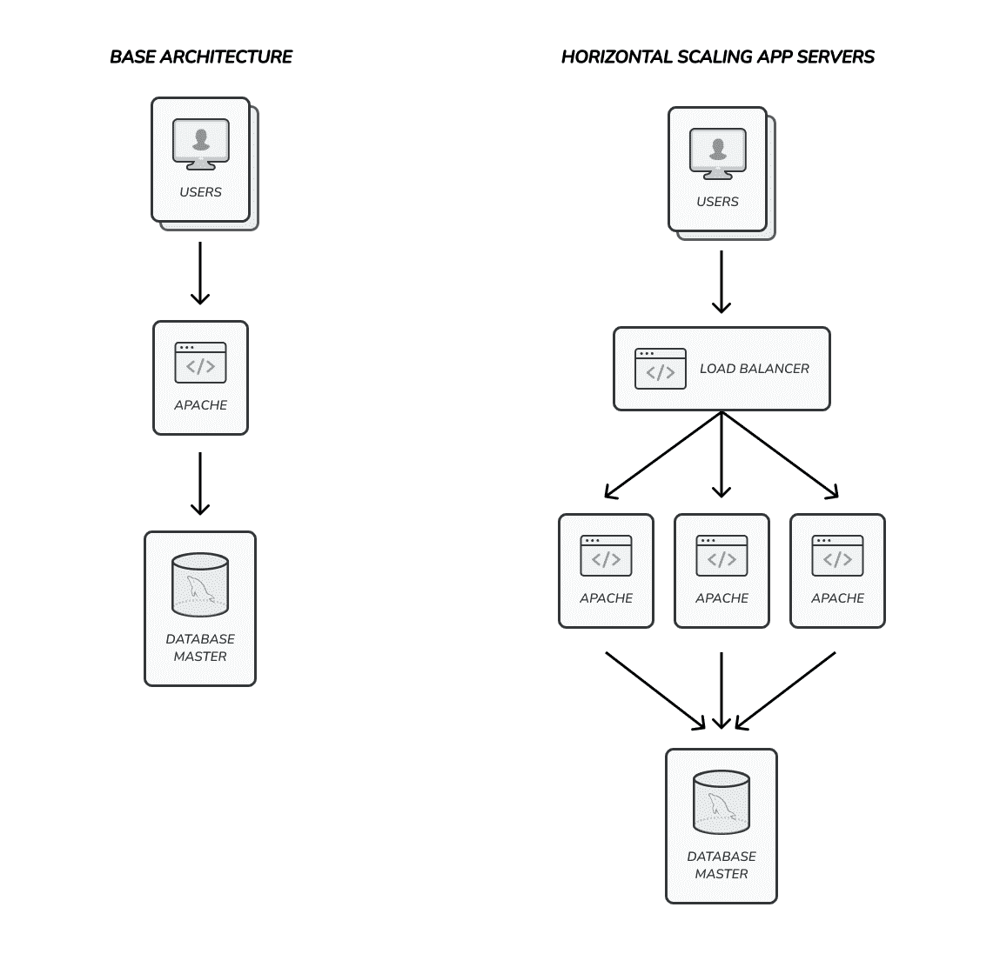
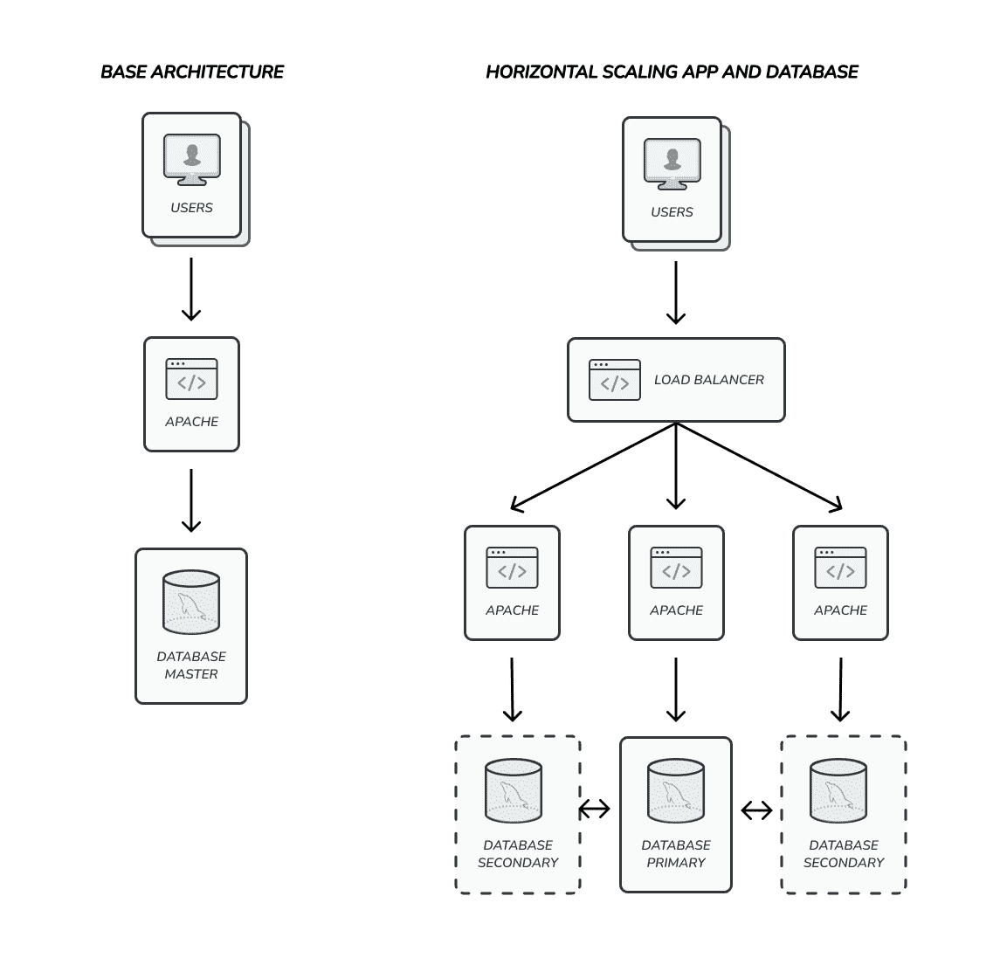
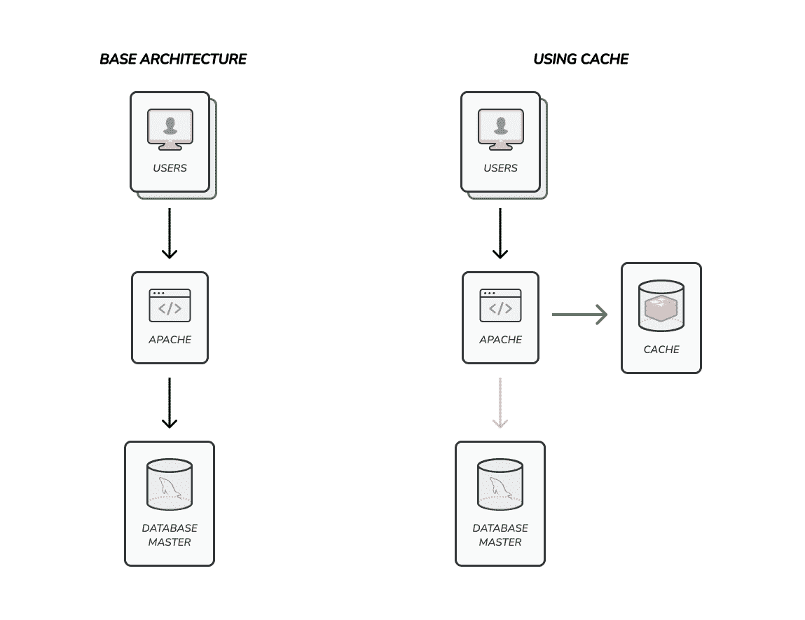
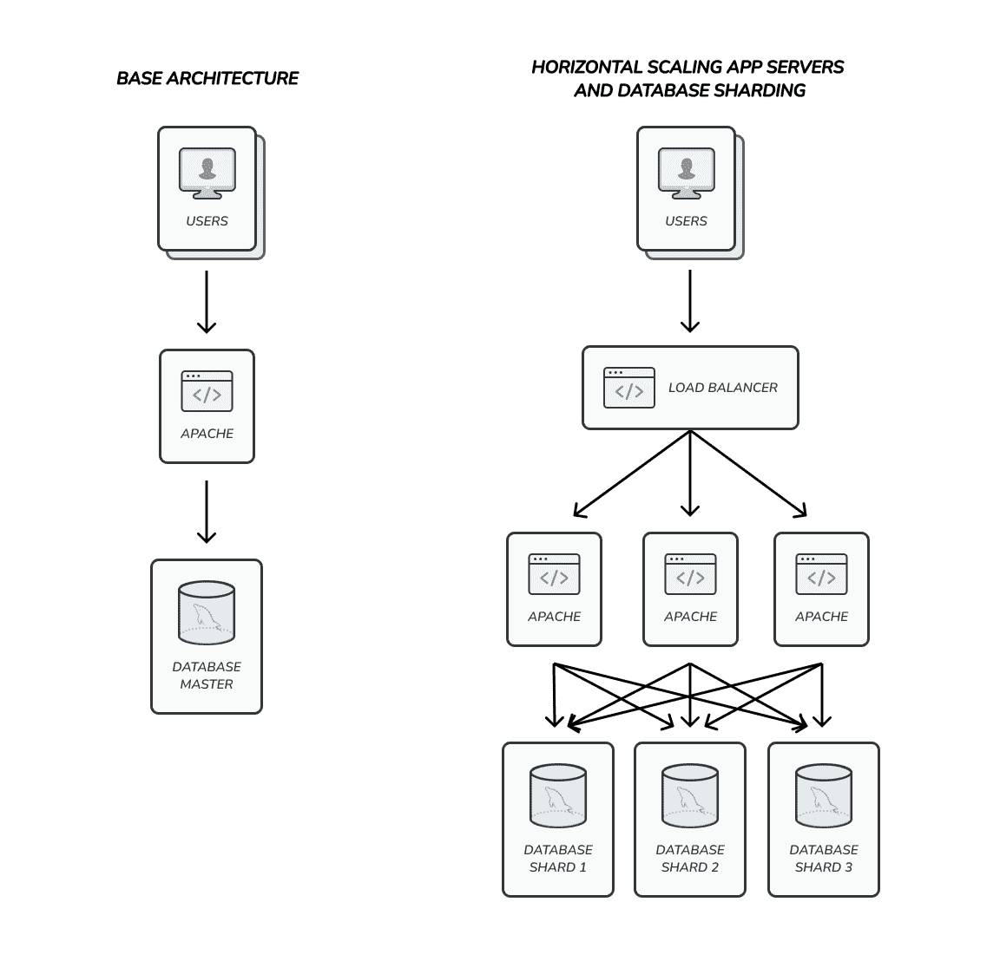

# 虚拟的高可伸缩性模式

> 原文：<https://levelup.gitconnected.com/high-scalability-patterns-for-dummies-da1f7d2a7873>

乌列尔·索伯兰斯在 [Unsplash](https://unsplash.com/es/s/fotos/martial-art?utm_source=unsplash&utm_medium=referral&utm_content=creditCopyText) 上拍摄的照片

这是一系列文章的第二部分，我将介绍扩展后端应用程序的基础知识。

在[的第一篇文章](/scaling-backend-applications-for-dummies-31c713ec04a4)中，我们谈到了一些概念和程序，以确保您在需要的时候以及如何进行扩展，您可以在这里阅读全文。

在第二部分中，我想重点介绍一些扩展应用程序的高级技术，为什么需要它们，以及一些基于现实世界问题的实施示例，来吧！

# 关于缩放模式

通常当你扩展你的应用程序时，你从应用一种技术开始，然后根据你面临的问题应用另一种技术。所以基本上你的应用程序开始变得更具可伸缩性，因为每个模式都给你带来了改进。

没有具体的方法来应用这些模式，因为每个应用程序都是不同的，但是如果我要写一个指南来扩展应用这些模式的应用程序，应该是这样的:

1.  确保您检查了基础知识(数据库和代码优化)
2.  垂直缩放
3.  水平缩放
4.  实现缓存系统
5.  实现数据库分片

我将按照这个特定的顺序应用这些模式，因为它解决了随着应用程序使用量的增加，您将面临的最常见的问题。

当你有了一些开发支持巨大负载的系统的经验时，你会跳过一些模式，因为它们对你没什么帮助。我将在接下来的部分做更多的解释，但是首先让我们了解更多关于模式本身的信息。

# 关于垂直和水平缩放

现在，我想谈谈垂直和水平缩放之间的区别，以及何时使用其中一种。

垂直扩展是指向相同的应用程序添加更多的资源，但使用相同数量的服务器。例如，假设我们有一个网站，我们使用一台服务器来运行它。如果我们想要纵向扩展，我们将把 CPU 换成更快的，我们将增加更多的 RAM，我们将把磁盘换成更快的，等等。

水平扩展是指添加更多资源来运行应用程序，但同时增加服务器数量的行为。使用前面的例子，如果我们想横向扩展我们的网站，我们将添加第二台服务器，而不是改进现有的服务器，这样我们将获得两倍的能力来运行应用程序。

当您扩展以添加更多资源时，您会增加运行应用程序的成本，具体取决于应用程序的硬件要求垂直扩展添加强大的硬件可能与运行另一台服务器进行水平扩展一样昂贵。

两种选择都有一些优点和缺点，一些用例使其中一种成为最佳选择。例如，如果您正在运行一个没有会话的无状态应用程序，那么水平扩展是最好的选择，因为除了获得更大的能力之外，您还将获得应用程序的高可用性。另一方面，如果您的应用程序对服务器内部的本地资源有很强的依赖性，那么在对您的应用程序进行大规模重构以进行水平伸缩之前，垂直伸缩可能是获得更高性能的最快方法。

重要的一点是，垂直和水平扩展模式不属于某项特定的技术，它们适用于从 web 服务器到数据库的几乎所有应用程序。通常每个应用程序都有自己内置的扩展能力。

# 关于缓存、分片和高吞吐量数据库

现在是时候介绍一些与数据库和一般数据使用相关的伸缩概念了。

当我们说缓存时，我们指的是编译信息并以一种更快访问和需要更少资源的方式存储它。有了它，我们可以在较短的响应时间内支持更多的请求。在到达慢速数据库之前，此模式作为第一层应用于改进数据库访问。我们将在下面几节中看到它是如何工作的。

分片是数据分布的一个概念，指的是我们可以在不同服务器的不同数据库实例之间分布信息的方式。通常，当我们水平扩展数据库时，我们这样做是为了读取信息，但是典型的架构只有一个主服务器。如果你的应用程序需要写很多信息，这就有一个大问题，而这正是分片来解决这个问题的地方。我们将在接下来的章节中讨论更多关于分片的内容。

如果要我定义什么是高吞吐量数据库，我会说它是一个实现了开箱即用的水平可伸缩性和分片功能的数据库。这意味着您只需要安装和配置您的数据库来处理数百万个请求，而不需要接触一行代码。

# 每个问题的缩放模式

如前所述，每种模式都被认为是为了解决当系统请求数量增加时，应用程序将面临的一个或一组特定问题。我们已经看到了关于这些模式的所有细节，是时候看看它们如何帮助我们了。

垂直扩展允许您处理稍微增加的请求，但不会帮助您达到数以亿计的请求。这在应用程序的早期阶段非常有用，但是您将需要很快开始水平扩展。

水平缩放将帮助您处理数百万个请求，应该应用于应用程序的每个部分。这意味着您需要横向扩展您的应用服务器、数据库服务器等等。

通过避免系统的某些部分(如数据库)过载，缓存将帮助您增加应用程序可以处理的请求数量。缓存可以用来存储应用程序的响应，所以基本上你甚至可以跳过请求本身的过程，但是它对于减少数据库查询非常有用。有时您需要一个缓慢但可靠的数据库引擎来存储信息，缓存一些信息将有助于减少响应时间并提高性能。

对数据进行分片将允许您处理对数据库或应用程序的更多读写请求。你可以实现自己的分片算法，这比看起来容易，但是我建议使用现有的解决方案，比如一些内置了分片支持的数据库引擎。

使用高吞吐量数据库当应用程序的瓶颈是数据库时，这非常有用。通常是关于使用像 MongoDB，Redis，CouchDB，Cassandra 等 NoSQL 数据库。这些数据库使用一种新的方法来管理数据，其中大多数都实现了开箱即用的水平可伸缩性和分片功能。

我们已经学习了很多关于扩展的理论，它的模式以及它们如何帮助我们提高应用程序的性能。现在我们将看看它们是如何工作的，以及如何在我们的系统中使用它们。

# 如何水平缩放

通常，当应用程序的某个部分过载时，您会进行水平伸缩。假设您的应用服务器或 web 服务器正在耗尽资源(CPU、ram 等)，您可以添加更多的服务器来处理它。

最常见的横向扩展架构涉及使用负载平衡器。负载平衡器是一个应用程序，它在服务器池中分发请求，通常是 HTTP 或 TCP 请求。使用负载平衡器，您只需向池中添加服务器，就可以将应用程序扩展到天上。

一些应用程序(如数据库)支持开箱即用的水平扩展。最常用的策略是主从复制。您可以有一个主服务器和多个辅助服务器或副本服务器。理想情况下，您将使用辅助服务器发出大量读取请求，而将主服务器仅用于写入请求。数据将自动从主服务器复制到辅助服务器。

水平扩展有许多含义，有时可能涉及大的重构和巨大的基础设施变化。但是尽管如此，当您的应用程序需要有效地处理更多请求时，这是添加更多资源的唯一方法。

# 如何实现一个缓存系统

基本的扩展模式之一是缓存，它是关于使用特定的高性能数据库来提供数据。

当您实现一个缓存系统时，您使用一个两步过程来获取数据。首先，您将尝试使用缓存数据库中的数据，因为这样更快，如果数据不在缓存中，您通常会查询关系数据库来收集信息。

您可以使用几种类型的数据库，如内存数据库、键值数据库或 NoSQL 数据库，具体取决于您的需求，有些数据库比其他数据库更合适。例如，如果您的缓存需要复杂的查询，也许 NoSQL 数据库比简单的键值更灵活，但如果您需要纯粹的速度和性能，内存数据库中的键值是最佳选择。

除了选择数据库类型，您还需要考虑将什么信息存储在缓存中以及如何存储。知道存储什么信息真的很容易，您需要缓存信息有两个原因:它在您的应用程序中广泛使用，或者从数据库获取它真的很慢。

选择如何存储数据可能有点棘手，最常见的方法是使用尽可能接近您稍后在代码中需要使用的结构来存储数据。例如，如果您正在缓存一个来自关系数据库的慢速查询，您将缓存该查询的结果。

通常缓存以两种方式填充:动态存储数据或使用后台进程编译信息。如果动态缓存数据，则是将查询结果或业务逻辑数据处理结果存储到缓存中，以供后续请求使用。如果你使用后台进程来填充你的缓存，你是在编译信息，然后在你的代码中检索它。这两种方法都很有用，可以同时使用。

另一件重要的事情是，您可以根据需要使用不同的策略来实现任意多的缓存，因此您可以充分利用这种模式来提高应用程序的性能。

如果你想要更多的信息，你可以查看一些技术，如:Redis，MongoDB，CouchDB，Cassandra 等。了解关于高性能数据库和缓存的更多信息。

# 实现数据库分片

当谈到水平扩展时，我们说过一些数据库引擎已经内置了水平扩展，但是是针对只读查询的。最先进的数据库引擎支持写查询的水平伸缩，它们通常通过实现数据库分片来实现。

数据库分片实际上将您的数据分成几组服务器，称为分片。每个碎片通常至少有三台服务器(一台主服务器和两台辅助服务器)，以确保可用性并支持其数据部分的读写。如果有两个碎片，您可以处理两次写入请求；如果有四个碎片，您可以处理四次写入请求，依此类推。

根据我的经验，数据库分片并不总是需要水平扩展应用程序，只需要在需要扩展对数据库的写请求时使用它。

根据数据库引擎的不同，分片可能很容易实现(比如 MongoDB ),也可能需要您编写自己的代码来管理分片。

无论如何，分片需要高级配置，并且有许多含义，所以你需要在使用它之前确定，以避免过度工程化。

# 结论

如果您的服务器资源不足，扩展您的应用程序将解决您的问题。您应该根据所面临的问题来选择缩放模式。

让您的系统运行得更快的最简单、最快的方法是实现一个缓存系统。您应该考虑两件事:数据库引擎和数据结构。根据您访问和存储信息的方式，数据结构和数据库引擎会有所不同。

毫无疑问，拥有一个可靠的、可伸缩的系统的最好方法是水平伸缩系统的每一层，包括应用程序和数据库服务器。根据您使用的层和技术，水平扩展可能只需要几秒钟，或者需要大量的开发时间。

扩展您的应用程序会增加复杂性，但这是让它增长的唯一方法。因此，当您扩展应用程序时，您应该平衡系统复杂性和性能改进，并谨慎分析每一个变化。但是请相信我，没有其他方法可以处理数百万个请求，您需要扩展！

如果您觉得这些概念对您的扩展应用知识来说有点超前，您可以查看本系列的第一篇文章。