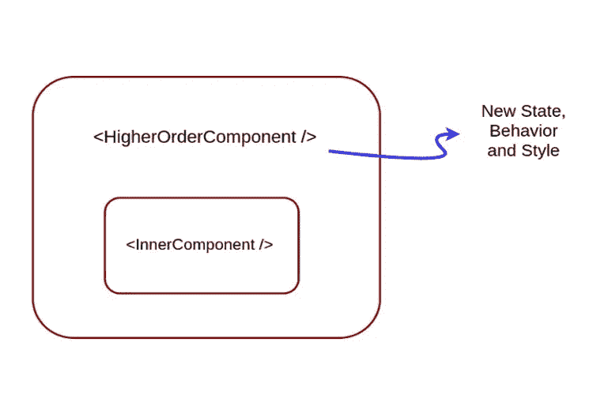
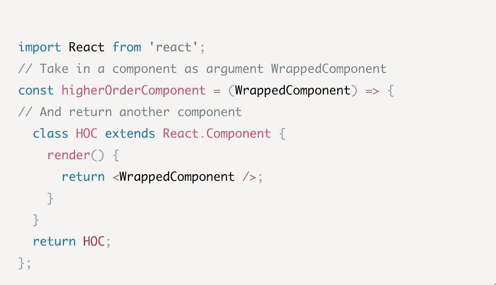

# React 中的高阶组件

> 原文：<https://levelup.gitconnected.com/higher-order-components-in-react-26e495dbeb90>

当你开始学习编码时，你听到的第一件事是你遇到的每个来源一次又一次重复的咒语:不要重复自己，或者 D.R.Y .高阶组件是一个超级强大的设计模式，它允许我们按照这条规则生活，抽象我们的代码以减少冗余。

# 成分

组件是每个 React 应用程序的构建块，即使是最简单的组件也可以组合成复杂的用户界面。出于这个原因，理解组件和使用它们的不同模式对于构建有利的设计结构是必不可少的。

为了更好地理解这一点，我们先来看看组件到底是什么。组件本质上是独立的、隔离的和可重用的部分，它们组合在一起构成了用户界面。这种基于组件的架构使得 React 具有声明性；组件接受称为“道具”的输入，然后返回“声明”用户界面外观的 React 组件。

这就是组件模式的用武之地。组件模式是不同的最佳使用实践，最初流行于将应用程序的数据和逻辑从其 UI 层中分离出来。它们促进了组件之间的责任划分，这有助于构建和维护更可重用和更内聚的 UI 构建块。

# 高阶组件

我将在这篇博文中讨论的组件模式是一种非常流行的模式，被称为高阶组件。在 JavaScript 中，高阶函数是接收函数作为参数或者返回函数作为输出**的函数。**高阶组件非常类似，都是以一个组件为自变量，返回一个新组件的函数。它们允许你抽象出不同组件的共享功能。您可以构建一个“包装器”函数，然后用该函数传入或“包装”不同的组件，然后该函数将在内部执行一些操作并返回新的组件，而不是编写几个功能相似的组件。一般来说，创建这个包装函数不是为了以任何主要的方式改变组件的功能，而是可以做一些更小的事情，比如向组件中注入新的属性，将一个属性转换为另一个属性，或者设置默认值。这是一种为任意数量的功能组件提供获取和提供数据的流行模式。

# 特设委员会是什么样子的？

这是一个简单高阶元件的基本示例。

在本例中，higherOrderComponent 接受一个名为 WrappedComponent 的组件，并返回其中的另一个组件。这种技术允许我们重用特定组件的逻辑，方法是从该组件中创建一个更高阶的组件，并在我们选择的任何地方使用它。

# 让我们通过一个例子来看看它是如何工作的。

## 基本示例

首先，让我们从一个常规组件开始。假设我们有一个简单的应用程序组件，其中包括一个 BasicButton 组件。

在我们的 BasicButton 组件的一个单独的文件中，我们有一个 styles 变量，它有一个默认选项，将一些样式应用于我们的按钮，然后有一个深色模式选项，用于更改配色方案。darkmode 选项仍然希望保留默认选项的填充，但会覆盖 backgroundColor 和 Color 值。

在这里，我们创建了应用了默认样式的 BasicButton。如果我想更改按钮的配色方案，我只需将按钮的 style 属性(在上例的第 17 行)更改为{styles.darkMode}，如下所示。该按钮仍将保留 styles.default 提供的 10px 的填充，但是该按钮的 backgroundColor 和 Color 属性将会改变。

如果我们需要更多同样需要默认样式的按钮，以及用第二种样式覆盖该样式的机制，那会怎么样？我们可以在所有组件中重写这种逻辑，但这将是重复的。

相反，使用更高阶的元件将是理想的。

## 高阶组件示例

让我们看看如何重构我们的代码，以使用更高阶的组件。我们还可以将之前创建的样式变量移动到一个名为 commonStyles.js 的新文件中。

接下来，让我们创建一个名为 stylesWrapper.js 的新文件，并构建这个组件。

首先，我们从 commonStyles 组件导入样式。接下来，我们构建一个 translateProps 函数，它使用与我们的 basicButton 组件类似的逻辑，在这里我们应用 commonStyles.default 样式，如果 Props 有一个 darkMode 属性，我们用 commonStyles.darkMode 覆盖 commonStyles.default。

接下来，我们创建了我们想要添加的附加样式，称之为 newProps。我们设置 newProps 等于{…props，styles:styles }。这里，{…props}只有一个道具，就是 darkMode = true。我们接受这个道具，给它添加样式，然后返回这个新道具。

高阶组件的核心在于我们的下一个函数，我们称之为 wrappedRender。我们返回这个 wrappedRender，它返回我们的 translatedProps 函数以及传递给 wrappedRender 函数的任何参数。换句话说，这个函数获取组件的 props(称为 args ),通过 translateProps 传递它们，然后返回新的结果组件。

最后，让我们编写我们的按钮，称之为 HocButton。

这里，我们首先导入我们的 stylesWrapper 函数组件。当我们导出按钮时，我们导出包装在 styleWrapper 函数中的按钮。

我们的 HocButton 组件看起来非常简单；所有的逻辑都被移到了 styleWrapper 中。这意味着如果我想创建另一个按钮，我只需在 stylesWrapper 中包装这个新按钮，它就会为我返回这个新按钮组件。如果我希望它有 darkMode 属性，当我在 stylesWrapper 中包装新按钮时，我只需将 darkMode 属性传入，它就会使新按钮应用 darkMode 样式。

# **结论**

每个初学者都很快认识到冗余在编程领域是不受欢迎的。高阶组件是我添加到工具包中的最新工具，它帮助我在 React 中编写更健壮、更少重复的代码。它们的工作方式类似于高阶函数。高阶分量是将一个分量作为输入并输出一个新分量的函数。一旦你对它们感到舒适，你可能会上瘾。