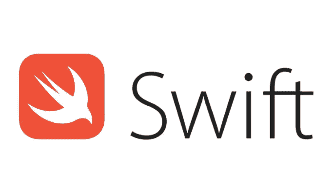
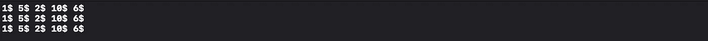
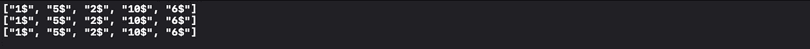
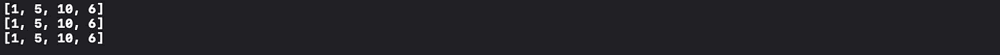
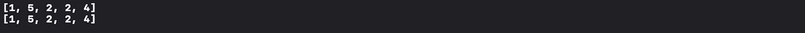
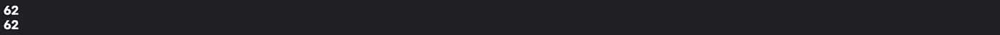

# Swift 中的高阶函数

> 原文：<https://levelup.gitconnected.com/higher-order-functions-in-swift-35861620ad1>

## forEach、map、CompactMap、flatMap、filter、reduce、sort 和 sorted

作为 swift 开发人员，您必须了解高阶函数。它将加速你的软件开发技能。

高阶函数是以一个或多个函数作为参数或返回一个函数作为结果的函数。以下是一些快捷的高阶函数——forEach、map、CompactMap、flatMap、filter、reduce、sort 和 sorted。

在本文中，您将探索 swift 几乎所有类型的高阶功能的实施。

让我们开始-

# 为每一个

forEach 将遍历数组中的所有元素，不会返回任何内容。

forEach 示例

如果你运行上面的代码，那么输出会是这样的——

对于每个的**输出**

在上面的代码中，在步骤 1 中，您创建了一个名为 coins 的数组。

在第 2 步中，遍历所有的硬币，向每个元素添加$并打印出来。

在第 3 步中，使用 **forEach** 遍历所有硬币，向每个元素添加$并打印出来。

在第 4 步中，您使用了一个简短的语法 **forEach。**

**【forEach】**的作用类似于 **for in"** ，但基本区别是，不能使用 **break** 和 **continue** 语句从 **forEach** 的闭包中退出。

# **地图**

map 将遍历数组中的所有元素，并将返回一个更新后的数组。

地图示例

如果你运行上面的代码，那么输出会是这样的——

地图示例的输出

在上面的代码中，在步骤 1 中，您创建了一个名为 coins 的数组。

在步骤 2 中，遍历所有硬币，向每个硬币添加$并将该元素追加到新数组中。

在第 3 步中，使用 **map** 遍历所有硬币，向每个硬币添加$并返回新数组。

在步骤 4 中，您使用了一个简短的语法 **map。**

# **紧凑图**

compactMap 将遍历一个数组中的所有元素，并返回一个更新后的数组，该数组只包含满足 compactMap 体中所写条件的元素。任何导致零值的元素都将从更新后的数组中排除。

compactMap 示例

如果你运行上面的代码，那么输出会是这样的——

compactMapExample 输出

在上面的代码中，在步骤 1 中，您创建了一个名为 coins 的数组。

在第 2 步中，遍历所有硬币，过滤包含 int 值的硬币，并添加到新数组中。

在步骤 3 中，使用 **compactMap** 遍历所有硬币，过滤包含 int 值的硬币，并返回新数组。

在步骤 4 中，您使用了一个简短的语法 **compactMap。**

# 平面地图

flatMap 将 2D 数组转换为一维数组。

平面图示例

在上面的代码中，在步骤 1 中，您创建了一个名为 arrayOfCoins 的 2D 数组。

在步骤 2 中，使用 flatMap 合并行，将其转换为一维数组。

在第 3 步中，您使用了一个简短的语法 **flapMap。**

# **滤镜**

filter 将遍历数组中的所有元素，并返回一个更新后的数组，该数组只包含满足 filter 体中所写条件的元素。

过滤器示例

如果你运行上面的代码，那么输出会是这样的——

过滤器示例输出

在上面的代码中，在步骤 1 中，您创建了一个名为 coins 的数组。

在第 2 步中，您将遍历所有硬币，过滤掉价值小于 6 的硬币。

在第 3 步中，你使用了一个简短的语法**过滤器。**

# 减少

reduce 将遍历数组中的所有元素，并返回一个包含所有元素的组合值的对象。

**语法-**

reduce( **initialResult** ，( **currentResult** ，**currentElement**)->Return**final result**

简化示例

如果你运行上面的代码，那么输出会是这样的——

减少示例输出

在上面的代码中，在步骤 1 中，您创建了一个名为 coins 的数组。

在第 2 步中，将初始值设置为 0，遍历所有硬币，将 currentResult(result)添加到闭包体中的 currentElement(coin)中，并对其进行迭代。

在步骤 3 中，您使用了一个简短的语法 **reduce。**

# 排序(依据:)和排序(依据:)

sort(by:)将根据闭包体内的条件对所有元素进行排序。

sorted(by:)将根据闭包体内的条件对所有元素进行排序，并返回一个新数组。

排序(依据:)和排序(依据:)示例

在上面的代码中，在步骤 1 中，您创建了一个名为 coins 的数组。

在第 2 步中，您将对一个数组进行降序排序，并创建一个名为 sortCoins 的数组。

在步骤 3 中，您将按照降序对同一个数组进行排序。

以下是 sort(by:)和 sorted(by:)的简短语法

排序(依据:)和排序(依据:)的简短语法

感谢您阅读这篇文章。如果你觉得这篇文章有帮助，请不要忘记鼓掌。

如果您有任何问题或意见，请随时在 Twitter 上联系我。