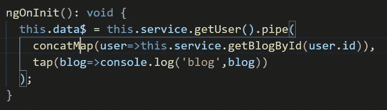

# 高阶映射算子

> 原文：<https://levelup.gitconnected.com/higher-order-mapping-operators-62466243820a>


高阶算子的好处

奇怪的是，好几年我都没有使用高阶映射运算符。因为我总是混淆“map”和“xMap ”, x 可以替换为“switch”、“concat”、“flat”等等。我对 RxJJ 失去了兴趣，因为我不能驾驭库的许多操作者。

在理解这个概念之前，我总是试图使用地图操作符来解决问题，我相信你们中的许多人正在经历相同的阶段。

在这篇博客中，我将解释**何时使用高阶映射操作符。这是探索 RxJS** 原始世界的首要步骤。一旦你理解了这个概念，你将会使用更多的 RxJS 操作符，而不是依赖于一些操作符，比如 map，distinctUntilChanged，interval，timer，filter 等等。

所以让我们开始吧。

假设我们正在调用一个服务，它将返回用户数据，如下所示。


这很简单，因为服务在内部调用 HttpClient，我们从服务器获取数据。现在你的要求说，一旦获得用户，我们需要该用户写的博客。所以我们在这里使用映射操作符如下。


我们在 tap 操作符中得不到数据。相反，我们在控制台中可以观察到。


这是怎么回事？在地图操作中，我们得到了用户，但在点击操作中，我们没有得到“博客”。

**这种行为的原因是 map 操作符返回了你在 map 函数中返回的可观察值。**

因此，如果你正在返回一些属性/对象的子集/另一个对象，如下图所示，那么 map 将返回它的可观察值。

```
this.data$ = this.service.getUser().pipe(
map(user=>user.name),// it will return observable of user.name tap(name=>console.log('blog',name)));
```

所以当你在 map 函数中返回另一个可观测值时，它会返回那个可观测值的可观测值如下。

```
map(user=>this.service.getBlogById(user.id)), // it will return observable of this.service.getBlogById(user.id) i.e. observable of observable
```

因此，当我们试图在 tap 操作符中记录数据时，我们得到了一个可观察的结果。因此，我们需要通过更高阶的操作符，如 concatMap、switchMap、flatMap 等，使其变平。如下图。



如果我们看到 console.log，如下所示。


**所以这个概念是，每当你需要在映射函数中返回可观测值时，你将不得不使用高阶算子来代替映射。**

现在大部分程序员都会在这里犯错。他们在 getUser 的 subscribe 中调用“getBlogById”方法。这是反模式的，因为它制造了回调地狱。什么是回调地狱以及如何避免它已经是另一个博客的一部分。可以参考这里。

[https://medium . com/@ securepawank . kuma wat/avoid-callback-hell-in-angular-code-3537890034 b](https://medium.com/@securepawank.kumawat/avoid-callback-hell-in-angular-code-3537890034b)

我希望这很清楚。如有任何疑问，请留下评论。

请一定要订阅/鼓掌/喜欢。这激励我写更多这样的博客。

我在 Udemy 上创建了一个 Angular 课程，涵盖了 Angular 中的许多实际问题和解决方案，包括这个。这可能是你职业生涯的垫脚石。 [***请看一看。***](https://www.udemy.com/course/angular-practicals/?couponCode=F48E50E6ECF6D99AD500)


角实践

也可以观看/订阅我的免费 [**YouTube 频道**](https://www.youtube.com/channel/UC30-Z9Lz8DWe_Vq93dOs-Gw) **。**

请订阅/关注/喜欢/鼓掌。