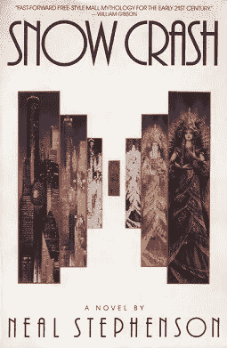

# 元宇宙历史。回到 1985 年的旅程。

> 原文：<https://levelup.gitconnected.com/history-of-metaverse-a-journey-back-to-1985-43505d10bde3>

## 虚拟空间

## 在这篇文章中，我们深入探究元宇宙的历史，追溯到在线角色扮演游戏的起源和创建虚拟社区的最初尝试。

卡尔·劳在 [Unsplash](https://unsplash.com?utm_source=medium&utm_medium=referral) 上的照片

你可能已经读过元宇宙这个词的含义甚至起源，但是你知道它的历史根源吗？你听说过卢卡斯艺术的参与吗？是的，虚拟社区的第一次尝试早在 1985 年就已经开始了。

让我们深入了解元宇宙的历史。

# 目录

*   元宇宙一词的由来
*   人居中心(1986 年)
*   活跃的世界(1995)
*   宫殿(1995 年)
*   哈博(2000 年)
*   第二次生命(2003 年)
*   开放源代码元宇宙项目(2004 年)
*   结论

# 元宇宙一词的由来

当研究元宇宙的历史时，人们不可避免地会碰到这个术语的起源。尼尔·斯蒂芬森于 1992 年出版了他的[小说《雪灾》](https://amzn.to/3gC3sSQ)，并首次使用术语元宇宙描绘了一幅虚构的未来图景——**Meta**(来自希腊语 *meta，*“之后”或“超越”)结合来自宇宙的**诗句**。

这本书基本上是关于一个未来的无政府资本主义的反乌托邦，其中的人物反复逃离现实进入**元宇宙**，这是互联网和大型多人在线角色扮演游戏(MMORPG)的混合体，他们通过虚拟角色移动。

[维基百科上的平装封面](https://en.wikipedia.org/wiki/Snow_Crash)

# 人居中心(1986 年)

然而，从技术角度来看，元宇宙的历史可以追溯到更早。早在尼尔·斯蒂芬森创造这个术语之前，最初创建于 1985 年的 MMORPG“栖息地”就被认为是第一个元宇宙。 *Habitat* 是 LucasArts 开发的多人在线角色扮演游戏。这是第一次大规模尝试创建一个基于图形的商业虚拟社区。

卢卡斯影业(1986)的《栖息地》宣传短片

这款游戏于 1986 年由 Quantum Link 作为 beta 测试版推出，Quantum Link 是 Commodore 64 的在线服务，也是 AOL 的前身。与当时的其他在线社区(MUDs 和基于文本界面的大型多人在线游戏)不同，它被认为是现代在线多人世界(MMORPGs)的先驱。Habitat 拥有图形用户界面和庞大的用户群。虚拟世界中的用户由屏幕上的化身来代表。这些元素使得 *Habitat* 成为一个被广泛引用的项目，并成为当今在线社区沉浸式元素的参考。

与今天的元宇宙和作为其关键元素的身临其境不同，*栖息地*的用户拥有第三人称视角，使其更像一个视频游戏。玩家可以在所谓的区域中看到彼此并与之互动。这些区域是预设的虚拟环境，如海滩、洞穴、郊区，用户可以随时进入或离开。交流通过屏幕上的文本输出进行。

为了克服当时的宽带限制，运行在 Commodore 64 上的客户端软件提供了用户界面，并生成了一个关于*栖息地*世界的实时动画。它将玩家的输入翻译成信息，并通过调制解调器和电话，通过商业分组交换网络将信息传递给主机，即中央主机。主持人维护着世界模型，并告知每个玩家的客户端世界不断变化的状态。这在当时是一项了不起的技术成就。

在*栖息地*中，化身之间可能的广泛互动引发了一些最初的担忧。因为用户自己要对可接受的行为和遵守某些基本的道德规则负责。化身必须在*栖息地*交易资源，甚至可能被其他化身抢劫或“杀死”。最初，这导致了*栖息地*的混乱。于是，规则、条例甚至权威头像被推出来维持秩序。

*栖息地*从 1986 年运行到 1988 年，在试运行结束时关闭。这项服务被证明成本太高，不可行，所以卢卡斯影业游戏公司于 1988 年在 Quantum Link 上发布了一个名为 *Club Caribe* 的精简版，以此收回开发成本。1988 年，它获得了富士通的许可，并于 1990 年以富士通栖息地的名字在日本发行。

目前正在努力在麻省理工学院的许可下以 [*NeoHabitat*](http://neohabitat.org) 重新推出 Habitat。

# 活跃的世界(1995)

从 20 世纪 90 年代中期开始，更便宜和更广泛的互联网接入支持在线平台，以建立当时尽可能真实的虚拟世界。其中之一就是 *ActiveWorlds* 。

探索一个被遗弃的 20 世纪 90 年代网络世界

*ActiveWorlds* 允许用户拥有世界和宇宙，并开发定制的 3D 内容。该软件支持网页浏览功能、语音聊天和基本的即时消息。用户必须每年支付公民身份费。

虽然它已经在 27 年前发布了，但它经历了坎坷的历史，目前仍在[活跃并可访问](https://activeworlds.com)。最新的稳定版本 8.1 发布于 2022 年 5 月 22 日。

# 宫殿(1995 年)

*The Palace* 的软件概念由时代华纳于 1994 年制作，并于 1995 年 11 月首次向公众开放。它提供被称为宫殿的图形化聊天室服务器，用户可以在里面相互交流。

[皇宫](https://www.youtube.com/watch?v=3a_8Z2dCEIU) —早期网络聊天室(1997)

宫殿**中的每个房间都由一个大图像代表，作为用户的背景。通过点击一个名为“门”的房间中的特定区域，用户可以前往同一宫殿中的其他房间、另一个宫殿服务器或通向另一个服务的地址，这些也可以是外部网站和电子邮件。在一些房间里，用户可以使用一套简单的绘图工具在房间的背景上绘画。除此之外，交流是通过聊天信息进行的。这些以聊天气泡的形式出现在他们的头像上方，类似于漫画书，并存储在聊天日志中。**

这座宫殿有一个**化身系统**，允许用户组合小的、部分透明的图像。一旦成员创建了一个虚拟形象，他们可以选择不同的服装或其他配件。默认情况下，用户由球形笑脸表情符号表示，但他们也可以佩戴多达九个单独的位图图像，称为“道具”

当时宫殿的一个特色是服务器软件是免费提供的，运行在私人电脑上，而不是存放在一个中心位置。

由约翰·苏勒尔主持的对虚拟角色社区的全面心理研究——这是同类研究中的第一次——在*宫殿*进行。这本名为《皇宫生活》的散文集，包含了对皇宫历史、社会关系、“上瘾”和越轨行为的分析。苏勒尔的工作集中在通过化身和图形空间进行互动的特殊方面。

虽然对原始程序不再有任何官方支持，但是已经开发了一个新的客户端，并且正在积极维护。许多聊天服务器仍在运行，可以在[皇宫门户直播目录](https://www.thepalaceportal.com/list.php)上找到。

# 哈博(2000 年)

Habbo(也称为 Habbo Hotel 或 HH)是一个面向 12 至 18 岁年轻人的在线社区，实际上他们占用户的 90%。哈博成立于 2000 年。它融合了聊天、互动和网络游戏元素。每个用户可以创建他们自己的虚拟角色，称为 Habbo，进入虚拟酒店的不同房间。用户可以创建自己的房间，并为他们配备自己选择的家具。在大多数情况下，用户还可以相互交换这些项目。

[哈博酒店体验](https://www.youtube.com/watch?v=bosfP5sFz3s)哈博酒店(2013 年)

Habbo 在超过 115 个州拥有付费客户，每月活跃用户超过 850，000 人，在 2020 年继续保持强势。2021 年，推出了 NFT 系列。该系列包括 Habbo 头像，也可以在社区中使用。此外，仅基于 NFTs 的新 Habbo 酒店仍将于 2022 年公布。官方应用程序在 App Store 中以 [Habbo —原版元宇宙](https://apps.apple.com/app/habbo-original-metaverse/id1638285230)的名称出售。

# 第二次生命(2003 年)

第二人生是一个用户创造的虚拟世界，人们可以通过虚拟角色进行互动、游戏、交易和其他交流。它以*林登世界*的名字开始，从 2003 年开始上市。

2013 年，在 *Second Live* 上注册的用户账户大约有 3600 万个，活跃并发用户有 3 万到 6.5 万个。这一数字多年来急剧下降，到 2017 年，实际用户只有 80 万。

《第二人生》背后的公司*林登实验室*宣称的目标是创造一个像小说《冰雪奇缘》中描述的“元宇宙”那样的世界。

[欢迎来到第二人生](https://www.youtube.com/watch?v=0LC-HO0ljN0)林登实验室(2015)

第二生命“世界”存在于一个由林登实验室运营的大型服务器群中，通常被称为“T2”网格。客户端软件将世界呈现为连续的 3D 动画，旨在给人一种空间感，并且可以将额外的音频和视频流集成到其中。客户端软件为其用户(称为居民)提供工具来设计他们的化身，创建对象，导航*第二人生*世界，通过高级相机控制观看世界，以及与其他人交流。导航由内部搜索引擎和设置地标的能力来促进，这些地标可用于在世界范围内传送。

此外，还有一个基于网络的地图 *Second Life* 允许地标也在 *Second Life* 客户端软件之外**显示。人们和公司可以通过这种方式相互联系，相互提供虚拟商品或服务。通信通过公共或私人聊天进行，聊天进度有许多显示选项。可选地，也可以通过内部第二次谈话进行口头交流。**

*第二人生*也是一个社交互动的平台。志趣相投的人可以组成群组，并通过集成的即时消息同时与群组中的所有成员进行交流。

通过纳入一种可以转换成真实货币(美元)的虚拟货币(L$，林登元)， *Second Life* 融入到真实的经济循环中。

2013 年 12 月，爱德华·斯诺登(Edward Snowden)提供的文件显示，英国情报机构和美国国家安全局至少自 2009 年以来一直在监控“第二人生”用户的通信。

*Second Live* 可通过其[网站](https://join.secondlife.com/)访问，并得到积极维护。到目前为止，[电网](https://status.secondlifegrid.net/)的最后一次定期维护发生在今年 11 月 25 日。

# 开放源代码元宇宙项目(2004 年)

*开源元宇宙项目(OSMP)* 是一个在多个参与者之间共享虚拟世界的在线平台。这个平台是免费的，并且是开源软件。

*OSMP* 借鉴了现有世界的想法，比如*第二人生*、*活跃世界*，以及*那里*。该项目旨在开发一个开源引擎，用于创建流式 3D 世界，也使现有世界互联成一个开放的、基于标准的元宇宙成为可能。

自 2008 年以来，该项目不再活跃。大多数开发者专注于开发与 *Second Life* 兼容的开源软件，比如 *OpenSimulator* 。

# 结论

以上只能是对过去和现在的虚拟社区和世界的一瞥。还有更多的项目存在，其中一些专注于开源元宇宙。值得一提的是 OSMP，因为它采用了特殊的方法将现有的世界连接成一个基于标准的开放元宇宙。

这里的选择应该可以很好地洞察过去几年的发展，特别是元宇宙的开始，比如 1985 年的《栖息地》。毫无疑问，这是第一个元宇宙，因此被大量引用。

👏🏻如果你喜欢这篇文章，请留下一些掌声。
💬*评论下面，渴望听到大家的看法。*

*加入部落，订阅我的时事通讯* [***元宇宙俱乐部***](https://staerck.substack.com/welcome) *如果你想了解元宇宙的最新动态/Web3。未来关于元宇宙、web3、生产率和增长的文章请关注我。如果你想继续阅读…*

*   [*第一款电子游戏诞生 50 周年*](https://medium.com/geekculture/the-first-video-game-turns-50-years-5595324def4c)
*   [*分解元宇宙*](https://medium.com/the-shortform/breaking-down-the-metaverse-328c3c58aefd)
*   [*元宇宙一词的最简单解释。我们一起试试好吗？*](https://medium.com/illumination/the-most-simple-explanation-of-the-term-metaverse-shall-we-try-it-together-a08bcf662acf)
*   [*什么是元宇宙？初学者指南。*](https://medium.com/illumination/what-is-the-metaverse-a-guide-for-beginners-28a91790a177)
*   [*你需要一个. SOL 域名，马上！*](https://medium.com/coinmonks/you-need-a-sol-domain-right-now-e2c2d2699501)

*使用* [*中级会员*](https://medium.com/@staerck/membership) *可以完全访问我和其他伟大作家的所有文章。你的会员费直接支持我和你看的其他作家。注意:这篇文章可能包含附属链接。*

# 分级编码

感谢您成为我们社区的一员！在你离开之前:

*   👏为故事鼓掌，跟着作者走👉
*   📰查看[升级编码出版物](https://levelup.gitconnected.com/?utm_source=pub&utm_medium=post)中的更多内容
*   🔔关注我们:[Twitter](https://twitter.com/gitconnected)|[LinkedIn](https://www.linkedin.com/company/gitconnected)|[时事通讯](https://newsletter.levelup.dev)

🚀👉 [**加入升级人才集体，找到一份神奇的工作**](https://jobs.levelup.dev/talent/welcome?referral=true)