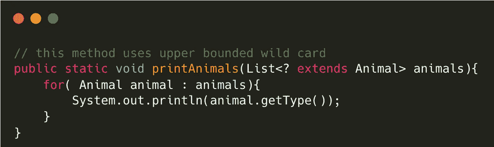
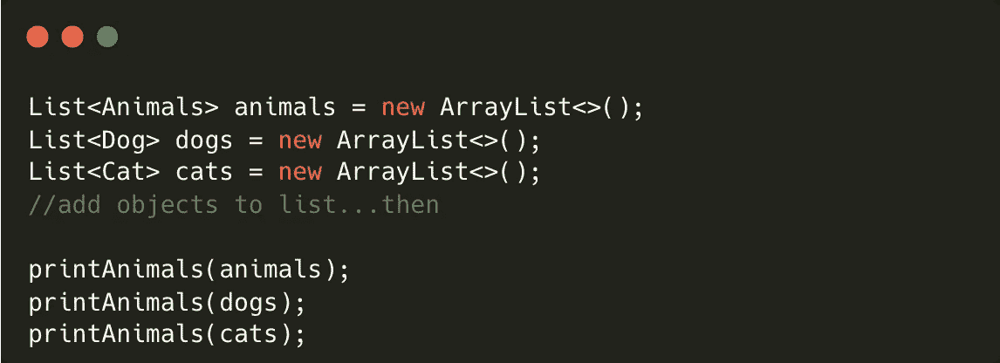
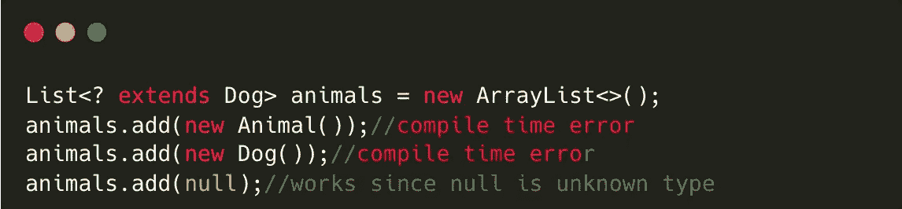
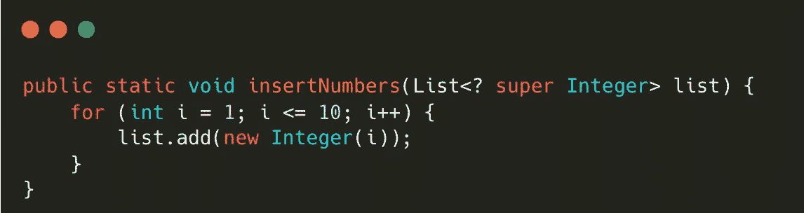
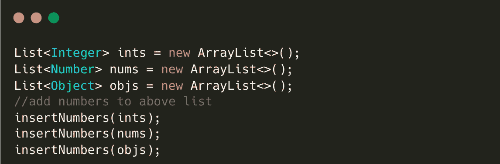
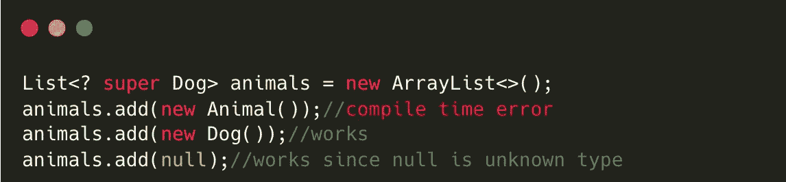
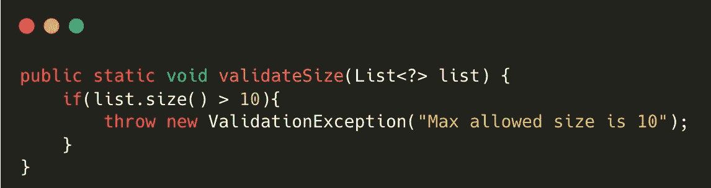
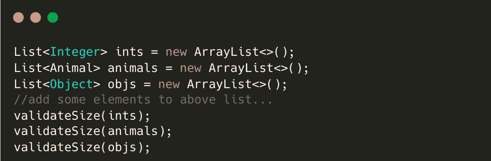
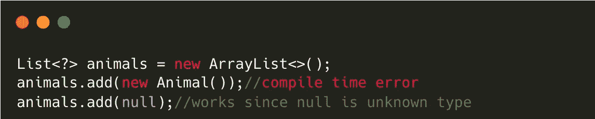

# 高级开发人员知道如何使用 Java 泛型通配符编写实用程序方法，但是您知道吗？

> 原文：<https://levelup.gitconnected.com/hmm-senior-developers-know-how-to-write-utility-methods-using-java-generics-wildcards-but-do-you-c41e5258c31a>

***Java 5 中已经引入了泛型:***

1.  在编译时检测错误
2.  为了帮助创建通用函数
3.  以消除从集合中读取元素时进行类型转换的需要。

在本文中，我们将看到如何使用通配符(？)来编写通用的实用方法。

***通配符变体汇总:***

假设任何 Java 类 a。

1.  上限通配符(？扩展 A):可以理解为 ***任何一个类，它是一个*** 的子类
2.  下界通配符(？超 A):可以理解为 ***是 A 的任何类或者是 A 的超类***
3.  无界通配符(？) :未知类型

## **1。上限通配符:**

***表象:*** <？延伸出一个>

***用法:*** 这个通配符可以解释为' ***任何一个自身是 A 的类或者是*** 的子类'

> 当定义为方法实现仅从集合中读取数据的方法参数时非常有用。

***示例:*** 考虑下面的方法，它只打印动物的类型

您可以将任何动物列表传递给上述方法，该方法扩展了 Animal 类

***但是:***

> 除了 null 之外，不能将对象添加到上限集合中。

## **2。下限通配符:**

***表象:*** <？超 A >

***用法:*** 这个通配符可以解释为' ***任何一个自身是 A 的类或者是 A 的超类*** '

> 当定义为方法实现只将数据写入集合的方法参数时非常有用。

***示例:*** 考虑下面的方法，它只是将数字插入到提供的列表中。它可以接受整数列表或它的超类，如 Number 或 Object。

上述方法可以作为一个实用工具，将 1 到 10 个整数添加到一个整数列表或数字列表或对象列表中。值得注意的是，您只能将整数类型添加到所有这些列表中。

***但是:***

> 只能将指定类型的对象和 null 添加到下限集合中。

## 3.无限通配符:

***表象:*** <？>

***用法:*** 这个通配符可以解释为' ***未知的类类型*** '或者更通俗地解释为'任何类型'

> 当您的方法实现不想知道集合中存在什么类型的对象时，请将它用作方法参数。这意味着您只是使用对象类方法或集合泛型方法，如 clear()、size()和 toString()。

***示例:*** 考虑下面的方法，它只验证集合的大小并抛出错误。

上述方法可以用作验证任何类型列表大小的工具，如下面的代码所示。

***但是:***

> 除了 null 之外，不能添加或读取未绑定集合中的元素。

