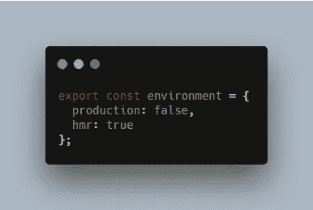
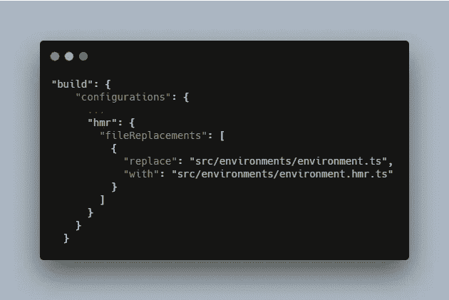
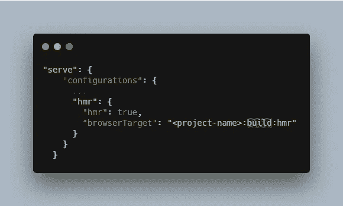
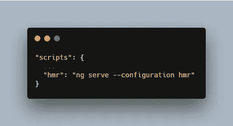
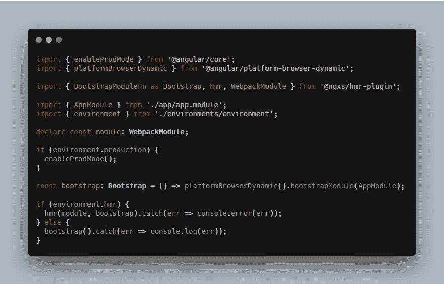
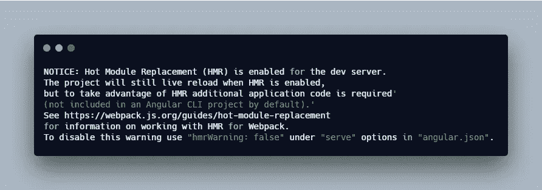
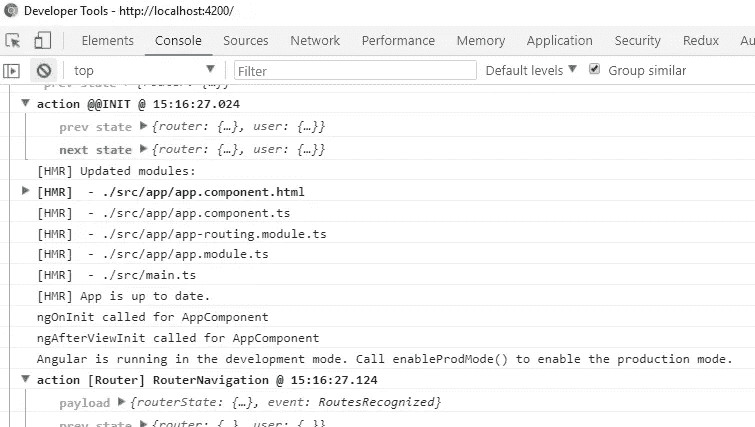

# 在 Angular CLI 项目中添加 HMR(热模块重新加载)

> 原文：<https://levelup.gitconnected.com/hmr-in-angular-cli-project-eb8512ef514b>

## 在 Angular CLI 项目中配置 HMR(热模块重新加载)的指南

照片由[黄川](https://unsplash.com/@transonhoang?utm_source=unsplash&utm_medium=referral&utm_content=creditCopyText)在 [Unsplash](https://unsplash.com/@transonhoang?utm_source=unsplash&utm_medium=referral&utm_content=creditCopyText) 上拍摄

在这篇文章中，我将指导你通过使用 NGXS 插件将 HMR 添加到一个由 Angular CLI 设置的项目中。

*更多类似的内容，请查看*[https://betterfullstack.com](https://betterfullstack.com/stories/)

## 什么是 HMR？

HMR 代表热模块重装，它的另一个名字是[热模块更换](https://webpack.js.org/concepts/hot-module-replacement/)。

它在应用程序运行时交换、添加或删除模块，而无需重新加载整个页面。

这通过以下方式加快了开发过程:

1.  保留在完全重新加载过程中丢失的应用程序状态。
2.  通过仅更新已更改的内容来节省宝贵的开发时间。
3.  当对源代码中的 CSS/JS 进行修改时，立即更新浏览器，这几乎相当于直接在浏览器的开发工具中更改样式。

为了增加这个功能，我将使用 [NGXS HMR 插件](https://ngxs.gitbook.io/ngxs/plugins)。

## 安装热模块重新加载

运行`npm i @ngxs/hmr-plugin @angularclass/hmr --save-dev`进行安装。

## 添加新的环境文件

用以下内容创建一个名为`src/environments/environment.hmr.ts`的文件:

`environment.hmr.ts`

将`hmr`设置为`true`，用于`main.js`运行 HMR 模式。

## 更新 Angular.json

这将包括两个部分:

1.  将`hmr`添加到`build.configurations`
2.  将`hmr`添加到`serve.configurations`

当调用配置`hmr`时，这将替换环境:

将 hmr 添加到 build.configurations

为`serve`添加配置`hmr`以构建上述环境:

将 hmr 添加到服务配置中

## 在 package.json 中添加新脚本

添加新脚本以服务于应用程序:

package.json

## 更新主页面

添加逻辑以检查`hmr`在热模块更换模式下运行应用程序:

主页面

如果您看到此错误

无法解析“ [@angularclass/hmr](http://twitter.com/angularclass/hmr)

你需要安装`@angularclass/hmr`

## 测试

当通过终端中的`npm run hmr`启动应用程序时，您可以看到:

npm 运行 hmr 时的终端屏幕

更新`app.component.html`中的一些文本，以查看控制台日志中发生的 HMR:

本地主机控制台

您可以看到应用程序仅部分更新了相关文件。

> 注:在[页面 hmr 插件](https://ngxs.gitbook.io/ngxs/plugins/hmr)上，他们通过增加类型节点提到并更新到`tsconfig.app.json`。看来我们并不需要它来服务 hmr。

## 摘要

热模块重新加载是 [webpack](https://webpack.js.org) 的一个重要特性，可以帮助您在实现过程中更改代码时减少加载时间。这提高了开发速度，并使构建应用程序的体验更好。

我希望这篇文章对你有用！可以跟着我上[媒](https://medium.com/@transonhoang)。我也在推特上。欢迎在下面的评论中留下任何问题。我很乐意帮忙！

在此检查源代码[。](https://github.com/hoangtranson/angular8-blp)

## 资源/参考资料

[1]:热模块更换[https://webpack.js.org/concepts/hot-module-replacement/](https://webpack.js.org/concepts/hot-module-replacement/)

[2]:NgXS 上的 HMR[https://ngxs.gitbook.io/ngxs/plugins/hmr](https://ngxs.gitbook.io/ngxs/plugins/hmr)

 [## 学习角度-最佳角度教程(2019) | gitconnected

### 50 大角度教程-免费学习角度。课程由开发人员提交和投票，使您能够…

gitconnected.com](https://gitconnected.com/learn/angular)  [## 故事-更好的全栈

### 所有的故事故事为我们写指南提交故事到更好的编程博客 1。故事指南避免什么…

betterfullstack.com](https://betterfullstack.com/stories/)