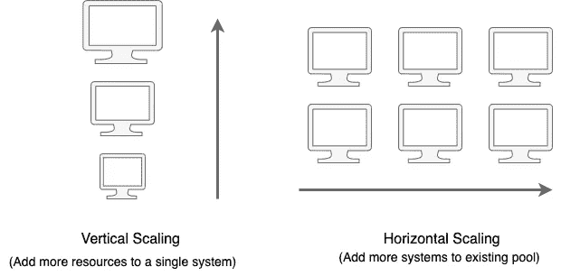
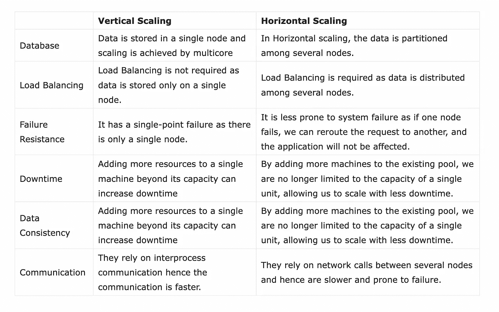

# 水平扩展和垂直扩展—系统设计

> 原文：<https://levelup.gitconnected.com/horizontal-scaling-and-vertical-scaling-6a6eadfb2ea4>

克里斯蒂娜@ wocintechchat.com 在 [Unsplash](https://unsplash.com?utm_source=medium&utm_medium=referral) 上的照片

开发系统时，可伸缩性是一个需要考虑的关键因素。企业级的任何应用程序都必须能够同时处理大量请求，并以最新的信息快速响应。

[可伸缩性](https://en.wikipedia.org/wiki/Scalability)是系统在规模上增长或收缩以满足不断增长的用户需求的能力。可伸缩系统具有优势，因为它可以适应用户不断变化的需求。可以通过向当前系统添加更多资源、向现有系统添加新系统或两者来实现扩展。

在设计任何企业软件时，可伸缩性都是需要考虑的一个关键特性。从一开始就对其进行优先排序将会降低维护成本，改善用户体验，并提高可用性。此外，如果你的目标是进入一家大型科技公司，那么你应该非常了解这个概念。

# 缩放类型

当我们谈论[系统设计](https://intmain.co/category/system-design/)时，我们通常谈论两种类型的扩展:

1.  垂直缩放
2.  水平缩放

水平和垂直扩展都涉及到向您的基础架构添加计算资源，但不同之处在于实施和性能。

## 1.垂直缩放

在垂直扩展中，我们向同一系统添加更多新资源，即增加 RAM、CPU、GPU 和其他资源的数量，以满足不断增长的计算需求。这很容易实现。它还消耗更少的功率。

但是，垂直扩展并不能使系统具有容错能力，也就是说，如果我们扩展在单台服务器上运行的应用程序，如果该服务器出现故障，我们的整个系统也会出现故障。此外，它通常仅限于单个机器，即扩展到超出该机器的容量通常会导致停机。

优势:

1.  易于实施。
2.  功耗更低
3.  更快、更简单的通信。
4.  减少管理工作量。
5.  不需要数据分区。

缺点:

1.  停机时间增加的风险。
2.  单点故障。
3.  有限的扩展和升级限制。

## 2.水平缩放

在水平扩展中，我们通过向现有系统池中添加更多系统来进行扩展。由于所有服务器都独立工作，并且同样能够处理请求，因此这将最终减少每个服务器上的请求负载，并使整个系统容错，即，即使一个服务器出现故障，其他系统也会处理即将到来的请求。此外，没有限制，我们可以添加任意多的新服务器。

水平扩展的挑战是难以实现，因为它要求所有系统彼此同步。此外，我们需要使用一个[负载平衡器](https://intmain.co/what-are-load-balancers-and-how-load-balancing-is-done/)在所有系统之间平均分配负载，这是一个额外的开销。

优势

1.  更短的停机时间。
2.  方便以后升级。
3.  增强的弹性和容错能力。
4.  性能提升。

不足之处

1.  复杂性增加。
2.  初始成本增加。
3.  复杂的建筑设计。
4.  需要额外的网络设备。

# 水平和垂直缩放的比较

现在我们知道了水平和垂直扩展之间的区别，让我们根据几个参数来比较这两种方法:

水平和垂直缩放的比较

# 哪种扩展方法适合您的应用？

在了解水平和垂直扩展后，我们知道每种扩展方法都有其优点和缺点，每种方法总会有一些权衡，因此可能很难决定哪种方法适合您的应用。让我们来谈谈有助于做出正确选择的因素:

1.  **性能:**水平扩展可以提高应用程序的性能，因为它允许您将几台机器的功能合并到一台虚拟机中。但是对于垂直缩放，您需要
2.  **冗余:**横向扩展提供了内置的冗余功能，而纵向扩展只有一台机器，因此不可能实现冗余。
3.  **地理分布:**当需要将数据分布在世界各地的不同数据中心并处理灾难恢复时，水平扩展是唯一的选择。
4.  **成本:**升级现有服务器资源的成本低于购买新服务器的成本。因此，水平扩展的成本高于垂直扩展。此外，在垂直扩展时，您不太可能添加新的备份和虚拟化软件，而且维护成本也可能保持不变。

现在我们已经看到了水平和垂直扩展的优点和缺点，我们不能简单地说一种扩展方法比另一种好。归结起来就是您的应用程序需求是什么。然而，在做出正确的扩展决策时，您应该考虑以下因素。如果您的目标是实现卓越的性能，您可以在云环境中使用垂直扩展或水平扩展，或者两者都使用。

这篇文章最初发表于[https://intmain.co](https://intmain.co/horizontal-scaling-and-vertical-scaling/)

# 分级编码

感谢您成为我们社区的一员！在你离开之前:

*   👏为故事鼓掌，跟着作者走👉
*   📰更多内容请查看[升级编码刊物](https://levelup.gitconnected.com/?utm_source=pub&utm_medium=post)
*   🔔关注我们:[推特](https://twitter.com/gitconnected) | [LinkedIn](https://www.linkedin.com/company/gitconnected) | [时事通讯](https://newsletter.levelup.dev)

🚀👉 [**加入升级人才集体，找到一份神奇的工作**](https://jobs.levelup.dev/talent/welcome?referral=true)