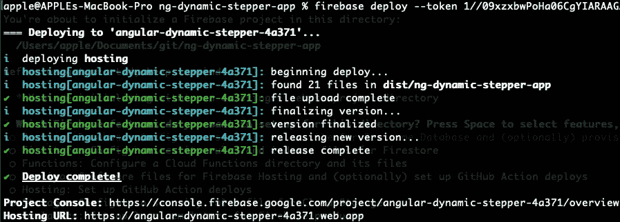

# 如何在 Firebase 上托管和部署 Angular 应用程序

> 原文：<https://levelup.gitconnected.com/host-and-deploy-on-firebase-cbca4aad2fa6>

## [网络开发](https://rakiabensassi.medium.com/list/software-engineering-7a179a23ebfd)

## 在 Firebase 控制台上获得一个句柄


作者图片

无论你是在做一个开源项目，你想用它作为参考，或者你正在寻找一个免费的托管服务，它都值得考虑 Firebase 作为一个解决方案来实现你的目标。

我个人在[我的 GitHub 账户](https://github.com/rakia)上有一堆开源的迷你项目，但大多数都没有实时演示的链接，这对于其他开发人员直观地了解项目是什么非常有帮助。过去，我一直使用 Heroku 托管和部署我的一些应用程序，但这次我想尝试 Firebase。

在这篇文章中，我将与你分享我最近如何在 Firebase 上部署我的一个 web 应用——在这里实现了[——以及一些提示，如果你在这个过程中面临与我所面临的类似的问题，你可能需要这些提示。](https://betterprogramming.pub/build-a-hand-pose-detector-web-app-powered-by-machine-learning-62131ec43db5)

事不宜迟，我们开始吧。

# **步骤 1:创建新的 Firebase 项目**

首先，您需要登录 [Firebase 控制台](https://console.firebase.google.com/)网页，点击“*添加项目*按钮创建一个新项目，然后填写表格，点击“*继续*按钮。

# 第二步:选择托管

现在，您需要在左侧菜单中选择“*托管*”，然后点击“*开始*”:


作者图片

您将看到一个屏幕，告诉您安装 Firebase 工具，这是用于初始化和部署应用程序的 CLI。但在此之前，确保你已经安装了 [Node.js](/7-nodejs-vulnerabilities-149094e441c2) 。

然后使用`npm`运行以下命令，在您的计算机上全局安装 Firebase CLI:

```
npm install -g firebase-tools
```


在您的计算机上全局安装 Firebase CLI(图片由作者提供)

# **第三步:认证**

拥有 Firebase 后，您需要通过运行以下命令登录，该命令将您的计算机连接到 Firebase，并授予您对 Firebase 项目的访问权限:

```
firebase login:ci
```

这将调出你的谷歌账户。如果您有多个帐户，请访问提供的 URL，然后选择并使用您想要用来进行身份验证的帐户登录。


firebase 登录:ci(图片由作者提供)

这里重要的一点是，在运行 firebase 命令时，您需要显示的 ***令牌*** 。因此，请使用以下两种方法之一将其复制并存储在安全的地方:

1.  在 CI 系统中运行所有带有 token 标志的 firebase 命令。
    令牌加载的优先顺序是标志、环境变量，然后是所需的 Firebase 项目。
2.  将令牌存储为环境变量，例如 **FIREBASE_TOKEN** ，以便系统自动使用它。如果您有一台 Mac，您可以添加这个新的环境变量，如下所示:

*   开放终端
*   运行`touch ~/.bash_profile; open ~/.bash_profile`
*   在“文本编辑”中，添加`export FIREBASE_TOKEN="your_token_value"`
*   保存`.bash_profile`文件并退出(Command + Q)文本编辑。
*   运行`source ~/.bash_profile`

完成后，您可以通过列出 Firebase 项目来验证 CLI 是否已正确安装，以及是否可以访问您的帐户:

```
firebase projects:list
```


firebase 项目:列表(图片由作者提供)

输出应该与 [Firebase 控制台](https://console.firebase.google.com/)网页中列出的 Firebase 项目相同。

# **第 4 步:生产构建**

如果您没有 Angular 应用程序，您可以跳过此步骤，否则，您需要运行以下命令，以便通过运行以下命令来构建用于生产的应用程序:

```
ng build --prod
```

这将在您的项目根文件夹下生成一个`dist/your-app-name`文件夹，它已经准备好投入使用了。

# 步骤 5:初始化你的应用程序

好了，现在让我们转到您想要在 Firebase 上部署的应用程序源代码所在的文件夹，并从那里运行`firebase init`:


为 Firebase 初始化您的应用程序(图片由作者提供)

在这一步，我为终端上显示的问题选择了以下答案。我在“为生产而构建”中所做的是为我回答第二个问题做准备(我需要使用" *dist"* 文件夹，而不是" *public"* 文件夹，这是 Firebase 默认建议的文件夹):

1.  您想为此目录设置哪些 Firebase 功能？→ ***托管:为 Firebase 托管配置文件并(可选)设置 GitHub 动作部署***
2.  你想用什么作为你的*公共*目录？→***dist/ng-dynamic-stepper-app***
3.  配置为单页 app(将所有 URL 重写为/index.html)？→ ***否***
4.  用 GitHub 设置自动构建和部署？→ ***是***
5.  文件 dist/ng-dynamic-stepper-app/index . html 已经存在。覆盖？→**否 **
6.  您希望为哪个 GitHub 存储库设置 GitHub 工作流？(格式:用户/资源库)→***rakia/ng-dynamic-stepper***
7.  设置工作流以在每次部署前运行构建脚本？→ ***否***
8.  存在用于 PR 预览的 GitHub 工作流文件。覆盖？→ ***否***
9.  当 PR 合并时，是否设置自动部署到您站点的直播频道？→ **号*号*号**

如果您的源代码只存在于您的本地主机上，而您没有 GitHub 存储库，请确保您选择了适合您的答案。

# 步骤 6: Firebase 部署

好了，现在我要做的是运行`firebase deploy`，以便部署我的应用并准备好测试:



`firebase deploy (image by author)`

该命令的输出为您提供了 live 应用程序的托管 URL。对我来说，网址是这样的:[https://angular-dynamic-stepper-4a371.web.app/](https://angular-dynamic-stepper-4a371.web.app/)

去试试吧！您可能会喜欢“订单创建”视图，它使用手势跟踪在步骤之间导航。

感谢您的阅读，下次再见。

🧠💡我为一群聪明、好奇的人写关于工程、技术和领导力的文章。 [**加入我的免费电子邮件简讯，获得独家访问权**](https://rakiabensassi.substack.com/) 或者在此[注册媒体](https://rakiabensassi.medium.com/membership)，如果你还没有注册🤗

*你可以在 Udemy 上查看我的* ***视频课程****:*[*如何识别、诊断、修复 Web Apps 中的内存泄漏*](https://www.udemy.com/course/identify-and-fix-javascript-memory-leaks/) *。*

[](https://betterprogramming.pub/programming-buzzwords-9e94a3544eed) [## 作为网络开发人员，你的老板希望你知道的 11 个流行词汇

### 获得关于工具箱中术语的更多见解

better 编程. pub](https://betterprogramming.pub/programming-buzzwords-9e94a3544eed) [](https://betterprogramming.pub/web-vitals-guide-b56e28798e7f) [## 网络生命:它们是什么，如何衡量它们

### 谷歌用来影响你的网络应用排名的基本性能指标指南

better 编程. pub](https://betterprogramming.pub/web-vitals-guide-b56e28798e7f)