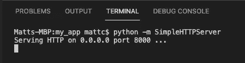
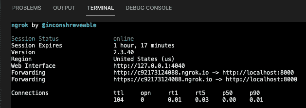

# 使用 SimpleHTTPServer 和 ngrok 托管本地 Web 应用程序

> 原文：<https://levelup.gitconnected.com/host-local-web-app-with-simplehttpserver-and-ngrok-874f8adde821>

## 不到两分钟


照片由[克里斯蒂娜@ wocintechchat.com](https://unsplash.com/@wocintechchat?utm_source=unsplash&utm_medium=referral&utm_content=creditCopyText)在 [Unsplash](https://unsplash.com/s/photos/server?utm_source=unsplash&utm_medium=referral&utm_content=creditCopyText) 上拍摄

在这篇文章中，我将向您展示如何托管您的本地 web 应用程序，就像它被部署到一个真实、安全的域中一样。最后是一个快速视频教程，告诉你只需要不到 1 分 30 秒就可以做到。

下面是我在浏览器中用来访问本地文件的 URL。

```
file:///User/matt/Development/my_app
```

然而，当我试图通过浏览器在另一台设备上访问它时，显然找不到它。那么，我是如何解决这个问题的呢？

首先，我仍然在我的项目目录中运行`python -m SimpleHTTPServer`。我可以在`localhost:8000` ( `8000`是默认端口)访问`file:///User/matt/Development/my_app`。这是我在 mac 上用 chrome 刷新`localhost:8000`时，我的终端看起来的样子。



现在它运行在一个托管端口上(尽管是本地的),我们可以访问它，而不仅仅是直接引用文件。唯一的问题是，`localhost` *还是*只指本地机(我的 mac)。如果我试图在另一台机器上访问它，我将无法访问。

为了解决这个问题，我可以包含我的计算机的 IP 地址，后面跟着`:8000`来代替`localhost`。然而，这不是一个安全地址(即没有启用`https`)。这意味着它可能在某些浏览器中不可访问(或不容易访问)。我终于可以在服务器上访问我的本地项目了，但是我如何快速使它安全呢？

介绍`[**ngrok**](https://ngrok.com/product)`。

> " Ngrok 通过安全隧道将 NAT 和防火墙后面的本地服务器暴露给公共互联网."-Ngrok 网站

这意味着它会获取您的本地服务器并创建一个临时的、安全的公共域，这样您就可以从任何设备上的任何浏览器安全地访问您的`localhost`！


我们所需要做的就是安装`ngrok`，我们可以在你的终端上使用自制软件执行下面的命令。

```
brew install --cask ngrok
```

然后用下面的命令启动它。

```
ngrok http [port number]
```

在我这里，`[port number]`就是`8000`。运行该命令后，我可以在我的终端中看到这个。



*注意:每次运行 ngrok 命令时，生成的安全域(位于“转发”右侧)都会发生变化

所以现在我们已经运行了我们的 python 简单服务器和我们的`ngrok`隧道，我们可以在提供的安全地址访问我们的本地应用。对我来说，是 https://850691a71668.ngrok.io/.，你现在可以在任何设备上通过你选择的浏览器访问本地应用。

这对于在将本地 web 应用程序部署到托管 url 之前，在安全托管的环境中测试本地 web 应用程序非常有用。只需不到两分钟就能实现，设置本身只不过是安装`ngrok`，运行一个命令，然后在另一个终端窗口中运行您的 python `SimpleHTTPServer`。

如果你想改变你的`SimpleHTTPServer`端口，你可以执行下面的命令。

```
python -m SimpleHTTPServer <port_number>
```

只要您的`SimpleHTTPServer`端口号与您的`ngrok`端口号匹配，您就可以开始了！下面是承诺的 YouTube 教程。

[*在此将您的免费中级会员升级为付费会员*](https://matt-croak.medium.com/membership) *，每月只需 5 美元，您就可以获得数千位作家的无限量无广告故事。这是一个附属链接，你的会员资格的一部分帮助我为我创造的内容获得奖励。谢谢大家！*

# 参考

 [## ngrok -保护到本地主机的内部隧道

### 是的，有点。您可以许可 ngrok 服务器群集的专用安装用于商业用途。您为我们提供了…

ngrok.com](https://ngrok.com/product)