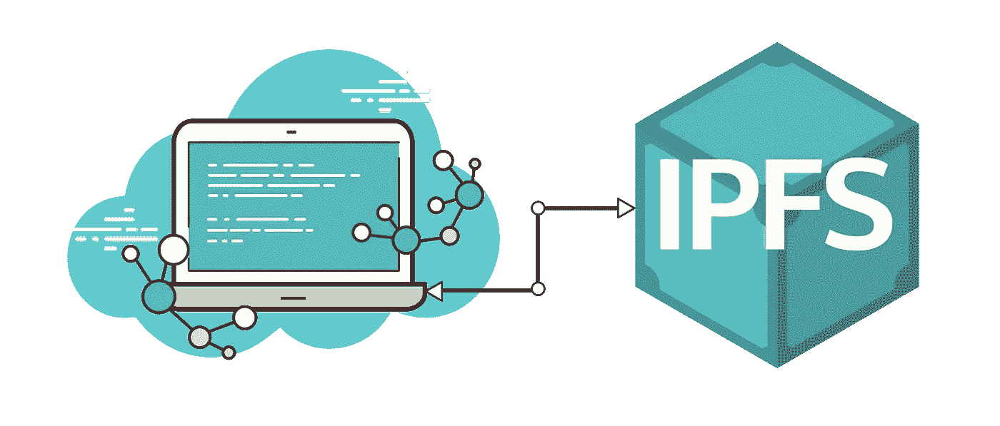
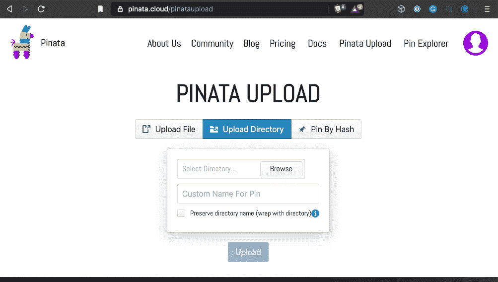
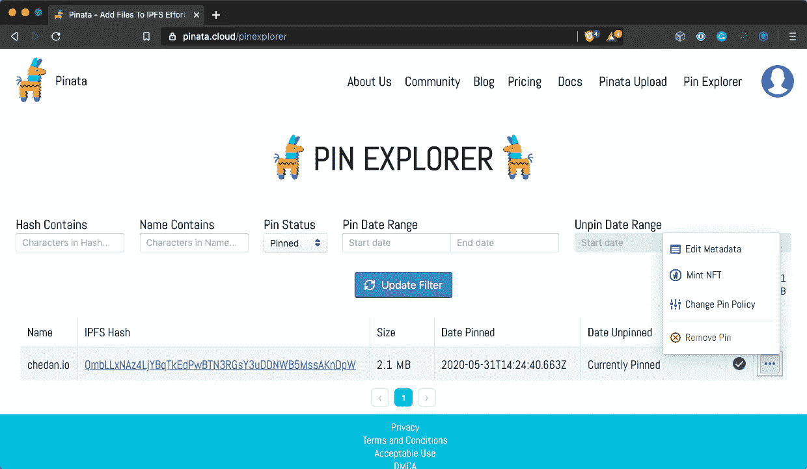
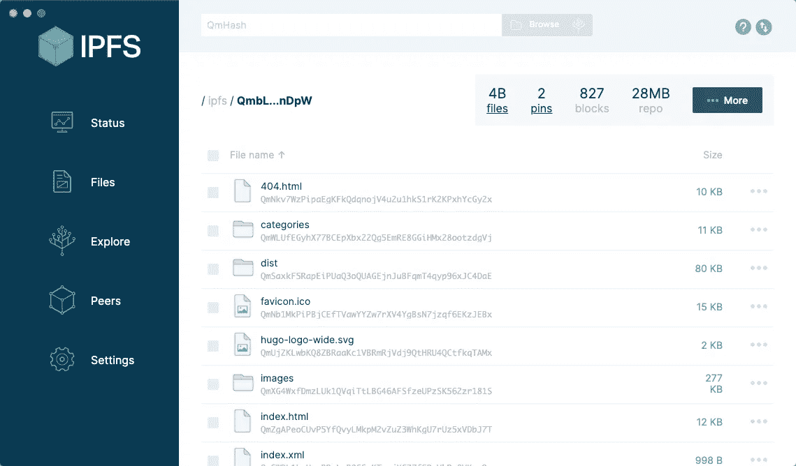
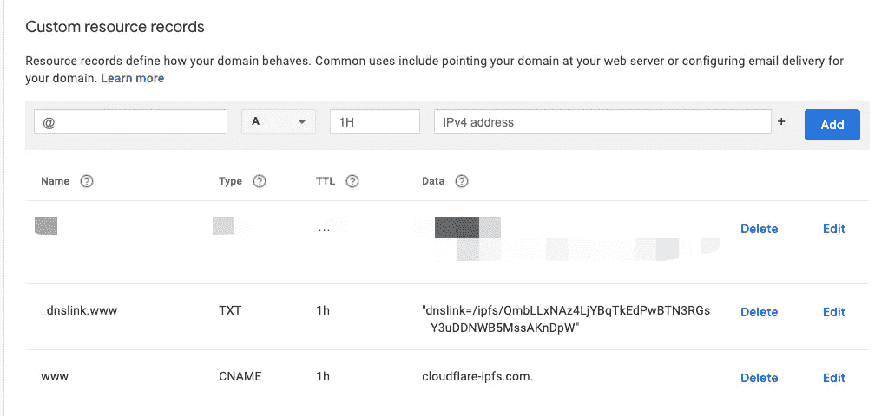
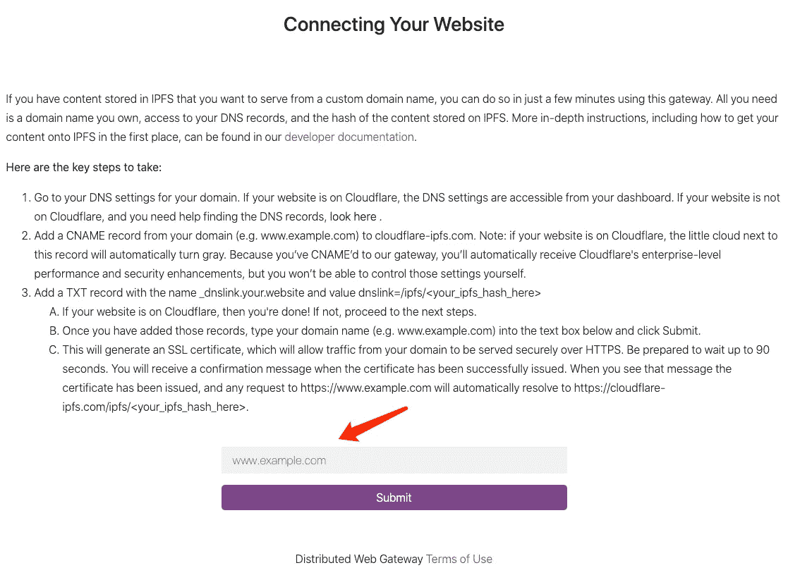
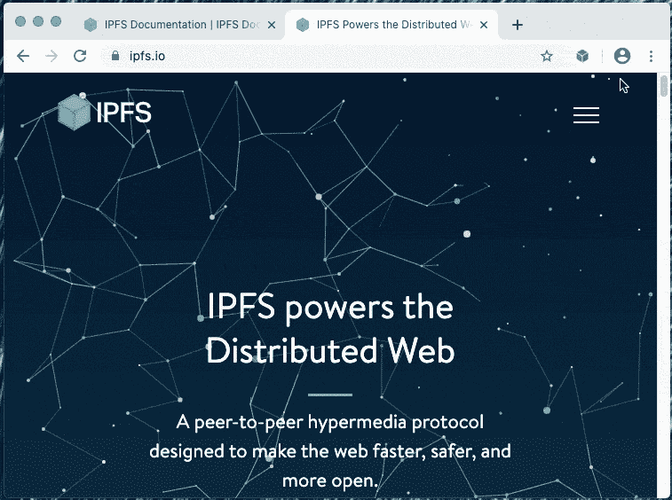

# 在 IPFS 上托管静态网站

> 原文：<https://levelup.gitconnected.com/host-static-website-on-ipfs-70c7c2418fe2>

在[之前的故事](/build-a-distributed-website-with-hugo-1183bb098057)中，我用 Hugo 生成了一个静态网站。今天，让我来详细解释一下如何在 IPFS 主持这个网站。希望这个故事能对你有所帮助。

# 什么是 IPFS

引用[官网](https://ipfs.io/)的话，IPFS 是“一个点对点的超媒体”。它旨在让网络更快、更安全、更开放。”

乍一看这并不直观，但是重申它的目标应该有助于理解这项技术。

它的目标是取代 HTTP 协议，建立一个分布式的更好的网站。它定义了将在分布式 Web 中使用的所有协议。这些用于存储、定位和传输文件资源的协议使分布式 Web 成为可能。

与其详细分析 IPFS 本身，不如让我们来关注今天的主题:如何在它上面托管一个静态网站。

# IPFS 托管网站

对于传统的静态网站，网页必须上传到网络服务器。默认情况下，对此网站的所有请求都将由该服务器处理。当流量大的时候，这个服务器在计算和带宽方面会遇到很大的压力。(虽然 cdn 等边缘计算技术可能会缓解这个问题，但它们不会改变集中化的本质)

相比之下，在 IPFS 网络中，一个内容可能有多个副本，不同的访问者将被路由到不同的副本。内容越受欢迎，拷贝就越多。这基本上消除了单点压力。

然而，对于非流行内容，最初接收该内容的节点可能是网络中唯一托管该内容的节点。如果此节点脱机，内容将无法访问。

基于上述理由，我们知道简单地将内容上传到 IPFS 并不能保证它的可用性。

我们需要一种保持内容始终在线的服务。这项服务不需要处理所有的访问流量，但它需要承诺保持在线。在 IPFS 世界，这种服务被称为“pin”。

虽然可以建立自己的 IPFS 节点来实现这一点，但对于静态网站这样的简单场景，更好的选择是现成的“pin”服务。

Pinata 就是其中之一。它易于使用，免费存储高达 1G。

注册 Pinata 后，你可以在[https://pinata.cloud/pinataupload](https://pinata.cloud/pinataupload)上传文件。通过点击“上传目录”按钮，我们可以上传 Hugo 生成的`. /public`文件夹。

上传到 Pinata

上传成功后，您将获得 **CID** (即该文件夹在 IPFS 的唯一内容 ID)。此外，您可以在[https://pinata.cloud/pinexplorer](https://pinata.cloud/pinexplorer)管理上传的内容。

管理上传的文件

现在，该网站被上传到 IPFS 网络，皮纳塔保证至少有一份内容总是可用的。网站保证保持在线。

# 访问网站

## 使用 IPFS 桌面访问网页

网页上传到 Pinata 后，您就可以访问网页了。最直接的方法是将 CID 输入 [IPFS 桌面](https://github.com/ ipfs-shipyard/ipfs-desktop)，然后你会看到网站文件夹的内容。

你可以通过点击文件夹中的 HTML 文件看到 HTML 源代码(因为 IPFS 桌面不是浏览器)。

## 通过公共 IPFS 网关访问

要访问一个网站，上面的方式并不理想。我们希望在浏览器中访问网站，并直接呈现网页。

IPFS 为这个问题提供了一个优雅的解决方案: **IPFS 网关**。网关充当传统网络和 IPFS 之间的中介。要访问 IPFS 网络上的内容，您只需知道文件或文件夹的 CID

目前有许多 IPFS 网关正在运行。可以访问 [ipfs.io](https://ipfs.github.io/public-gateway- checker/) 查看公开可用的网关及其状态。除了官方的 IPFS 网关，最受欢迎和易于使用的 IPFS 网关是 [Cloudflare IPFS 网关](https://cloudflare -ipfs.com/)。

## 使用 DNSLink

IPFS 网关将普通网络与 IPFS 连接起来，但仍不理想。我们想在自己的域名下访问网站。这需要使用另一种与 IPFS 相关的技术: [DNSLink](https://docs. ipfs.io/guides/concepts/dnslink/) 。DNSLink 使用 DNS TXT 记录将域名与 IPFS 地址相关联。

我们知道，IPFS 中的每一条内容都有一个唯一的 CID，通过与 DNSLink 相结合，IPFS 内容和传统网络之间的桥梁就建立起来了。

这里，我们使用 Cloudflare IPFS 网关作为配置 DNS 以使用 DNSLink 的示例。

有两个步骤:

1.  创建一个指向地址`cloudflare-ipfs.com`的 CNAME。以我的网站`chedan.io`为例，我将 CNAME `www.chedan.io`指向 Cloudflare
2.  添加一条 TXT 记录`_dnslink.www`，指向地址`dnslink=/ipfs/{CID}`。注意`{CID}`是我们上传一个文件夹到 IPFS 时从 Pinata 得到的 CID。

完成这两个步骤后，DNS 控制面板将如下所示。

至此，我们的网站已经可以通过常规浏览器访问: [http://www.chedan.io](http://www.chedan.io)

**注**:当网站内容发生变化时，内容的 CID 也会发生变化。我们需要相应地更新 DNS 记录。不同的 DNS 服务提供商提供不同的 API，但是它们的一般思想是相同的。实际上，您可能希望用这些 API 自动更新 DNS 记录。

## 自动 HTTPS 保护

现在，该网站已经可以使用常规浏览器了，但仍然存在缺乏 HTTPS 保护的缺陷。说到这里，我不得不称赞 Cloudflare，因为它免费为用户提供 HTTPS 保护。

通过上述 DNS 配置，可以自动生成和配置 HTTPS 证书。

您需要做的只是访问 [Cloudflare IPFS 网关](https:/ /cloudflare-ipfs.com/)，并在页面底部的文本框中输入您想要保护的域名(在我们的示例中是`www.chedan.io`)，等待 90 秒，直到提示“证书已激活”出现。然后进入[**https**://www . chedan . io](https://www.chedan.io)，你会看到 https 证书正在工作。

申请 HTTPS 保护

至此，我们已经完成了在 IPFS 上托管我们的网站并将其打开到传统 web 浏览器的过程。

## 直接在浏览器中访问 IPFS 内容

IPFS 网关使用户更容易访问 IPFS 和体验分布式网络。然而，通过集中式网关的传输与分布式 Web 的目标背道而驰。理想情况下，我们希望浏览器本身支持 IPFS 协议，允许用户直接从浏览器访问 IPFS 的内容，而不依赖于任何集中的节点。

事实上，有些人正在为这个而努力[。在浏览器拥有原生支持之前，我们可以借助浏览器扩展来体验真正的分布式 Web。目前，已经有针对](https://github.com/ipfs/in-web-browsers)[火狐&火狐安卓](https://addons.mozilla.org/firefox /addon/ipfs-companion/)和 [Chrome & Brave](https://chrome.google.com/webstore/detail/ipfs-companion/nibjojkomfdiaoajekhjakgkdhaomnch) 的 IPFS 扩展。

这些扩展有几个核心特性:

1.  支持 IPFS 地址(`/ipfs/`和`ipfs://`)并将请求重定向到本地网关。
2.  支持 DNSLink 主机名
3.  从浏览器共享文件到 IPFS。
4.  提供全局级和网站级开关，以控制是否使用本地 IPFS 网关

扩展用法展示如下。

IPFS 同伴

**注意:**要使用这些扩展，你需要先安装并运行 IPFS 节点( [IPFS 桌面](https://github.com/ipfs-shipyard/ipfs- desktop)或 [IPFS 命令行工具](https://docs.ipfs. io/how-to/commandline-quick-start/#install -ipfs))。

安装扩展后，如果访问 [https://www.chedan.io](https://www.chedan.io) ，浏览器会自动重定向到[http://www . chedan . io . ipns . localhost:8080](http://www.chedan.io.ipns.localhost:8080)并显示相同的内容。

虽然看似一样，但背后的机制却完全不同。现在，内容通过 IPFS 协议直接从 IPFS 网络获取，绕过了任何集中式 web 节点，真正实现了分布式 Web。

随着 IPFS 的采用，我们相信在不久的将来，大多数浏览器将内置对 IPFS 的支持。

# 结论

IPFS 并不遥远。我们可以现在就把我们的静态网站发布到 IPFS。借助 IPFS 网关/ DNSLink / IPFS 伴侣等技术，任何用户都可以轻松体验 IPFS，享受分布式网络带来的乐趣。

**参考**

*   [如何在 IPFS 轻松托管一个网站](https://medium.com/pinata/how-to-easily- host-a-website-on-ipfs-9d842b5d6a01)
*   [Cloudflare 分布式 Web 开发人员中心](https://developers.cloudflare.com/ distributed-web/)
*   [IPFS 浏览器更新](https://blog.ipfs. io/2019–10–08-ipfs-browsers-update/)
*   [分布式 Web:使用 IPFS 集群、Cloudflare 和 DevOps 托管您的网站](https://withblue.ink/2018/11/14/distributed-web-host-your-website-with-ipfs-clusters-cloudflare-and-devops.html)