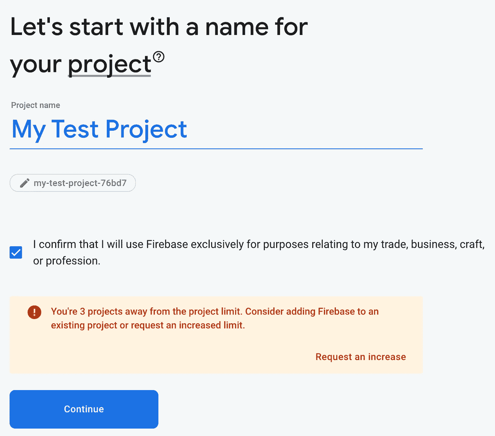

# 使用 Firebase 免费托管您的网站

> 原文：<https://levelup.gitconnected.com/host-your-website-free-using-firebase-7135c2b5f213>


在 [Unsplash](https://unsplash.com/s/photos/host-website?utm_source=unsplash&utm_medium=referral&utm_content=creditCopyText) 上由 [Carlos Muza](https://unsplash.com/@kmuza?utm_source=unsplash&utm_medium=referral&utm_content=creditCopyText) 拍摄的照片

# 什么是 Firebase 托管？

你可以使用名为 Firebase Hosting 的谷歌服务免费托管你的静态网站。静态网站包括使用 React.js、Angular 和 Vue.js。当然，你也可以托管普通的 Javascript、HTML 和 CSS 项目。他们也给你一个你不能改变的免费的火焰基地域。你也可以使用你的域名。

它也只在每天一定的使用量内免费，但之后费用就低了。开始时你可能没有那么多的流量，所以这将为你节省早期的资金。

[](https://firebase.google.com/pricing) [## Firebase 定价

### 认证电话认证-美国、加拿大和印度帮助价格根据成功的验证。关于火焰计划，电话…

firebase.google.com](https://firebase.google.com/pricing) 

## Firebase 托管限制

您将无法在 Firebase 上托管后端代码，如 Node.js、Go 等。你也不能在 Firebase 主机上托管 WordPress 站点。谷歌确实有其他选择，让你托管这些类型的应用程序。

# 入门指南

首先，您需要下载 firebase 命令行工具。别担心，这很简单。你不需要成为命令行专家。另外，使用诸如 Visual Studio Code 或 Webstorm 之类的 IDE 会使这变得更容易，因为您可以在这些应用程序中直接使用终端。

## Windows 操作系统

对于 Windows，您可以下载 CLI 二进制文件:

【https://firebase.tools/bin/win/instant/latest 

## Linux、UNIX 和 macOS

对于 Linux、UNIX 和 macOS(我相信是 UNIX)用户，您可以打开终端并输入以下命令:

```
curl -sL https://firebase.tools | bash
```

## 使用 NPM 安装

您也可以使用 npm 安装该工具。您需要在计算机上安装 Node.js。您可以在此处安装它:

[](https://nodejs.org/en/download/) [## 下载| Node.js

### Node.js 是基于 Chrome 的 V8 JavaScript 引擎构建的 JavaScript 运行时。

nodejs.org](https://nodejs.org/en/download/) 

您现在需要安装 firebase 工具。你只需要做一次。对于您将来可能托管的网站，您可以跳过这一步。

在你的终端/命令行应用程序中输入这个命令 **:**

```
npm install -g firebase-tools
```

然后按**键进入**。

## 登录

在您的 Windows 或 Mac 计算机上，在终端中键入以下内容，然后按 enter 键:

```
firebase login
```

这将打开您的浏览器，登录您的 google 帐户。您也可以为您的网站创建一个新的 Google 帐户。

登录后，回到您的终端，您将看到一条成功消息。

# 在 Firebase 控制台上创建新项目

现在，您需要在 Firebase 控制台上创建一个新项目。转到下面的链接:

[](https://console.firebase.google.com/) [## 登录- Google 帐户

### 编辑描述

console.firebase.google.com](https://console.firebase.google.com/) 

现在点击“添加项目”


现在给你的项目命名，点击**继续**:



您可以选择为您的项目启用谷歌分析，然后点击**继续**。


如果您启用 Google Analytics，您需要指定一个 Google Analytics 帐户或创建一个新帐户。


现在点击**创建项目**。


这可能需要一段时间才能完成。

现在，单击左侧的“主机”选项卡:


点击**开始**按钮。

接下来，它会显示一个遵循说明的屏幕。

它会问你是否想看看添加 Firebase Javascript SDK 的步骤。我们将跳过这一步。

现在，您需要在您的计算机上初始化 firebase 项目。如果你已经有了一个想要上传的网站，进入终端，进入你的网站项目的根目录。然后，您将输入:

```
firebase init
```

它会问你很多问题。

你会输入**是**到**这是单页 app/网站吗？**询问你的网站是否有反应、棱角等。

另外，当它要求您覆盖 index.html 时，输入**否**

在 Firebase 主机上点击**继续**，直到**注册你的应用。**您需要在这里指定一个名称**。**


点击**注册并继续**

接下来，我们将把 Firebase SDK 添加到您的项目中。如果你正在使用 React，Angular，Vue 等，你可以使用 npm。您还可以在任何项目上使用 script 标签。您将把脚本标签复制到您的 index.html 文件的底部，在结束的


现在，通过在终端中输入此信息并按下 **Enter** 来部署您的网站。

```
firebase deploy
```

它会显示你的新托管网站的网址！

回到 firebase 控制台，点击**继续控制台**。


您可以通过点击**添加自定义域**按钮并按照以下步骤添加您的自定义域。


祝贺你的第一个 firebase 托管网站！

通过我的推荐链接加入 Medium。你的会员费直接支持克里斯托弗咖啡和你阅读的其他作家。你也可以在媒体上看到所有的故事。

[](https://cmcoffee.dev/membership) [## 加入我的推荐链接-克里斯托弗咖啡媒体

### 阅读 Christopher Coffee(以及 Medium 上成千上万的其他作家)的每一个故事。您的会员费直接…

cmcoffee.dev](https://cmcoffee.dev/membership)