# 使用 S3 和 CloudFront 在 AWS 中托管安全和定制的域 React 应用程序

> 原文：<https://levelup.gitconnected.com/hosting-secure-and-custom-domain-react-application-in-aws-using-s3-and-cloudfront-f3f472dc648d>

本文介绍了使用 AWS 组件通过 https 在您的域名中托管 React 应用程序的过程。重要的是，这不会利用服务器，而是使用 AWS S3 和 AWS CloudFront 以低成本托管它。

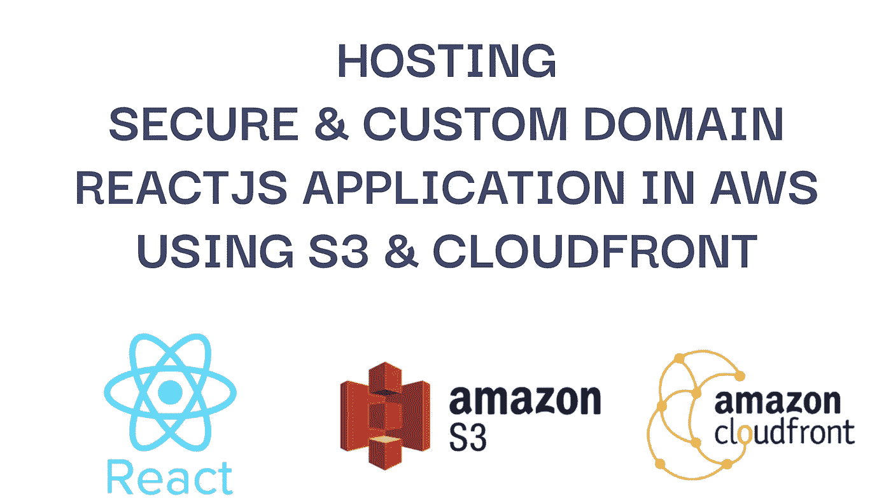

# 构建 Reactjs 应用程序

对于一个示例应用程序，这将通过以下方式轻松创建新的 Reactjs 应用程序:

```
$ **npx create-react-app reactjs-https**// Check Reactjs application running on [http://localhost:3000](http://localhost:3000/)
$ **cd** **reactjs-https**
$ **npm start**// Build static files of Reactjs application
$ **npm run build**
```

然后在`build/`文件夹中创建静态文件

```
Creating an optimized production build...
Compiled successfully.File sizes after gzip:43.71 kB  build/static/js/main.10e53472.js
  1.78 kB   build/static/js/787.555671f1.chunk.js
  541 B     build/static/css/main.073c9b0a.css
```

# 将 Reactjs 静态文件上传到 AWS S3

**创建 S3 桶**

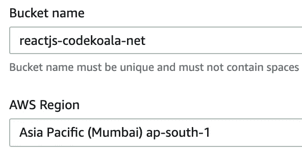

创建带有桶名的 AWS S3:**react js-code koala-net**以上传构建文件。

**上传静态文件到 S3 桶**

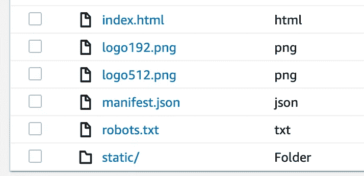

从您的本地机器将`build`文件夹中的所有内容上传到 AWS S3 存储桶。

这将包括`index.html`和 Reactjs 申请所需的所有其他文件

# 使用 S3 自动气象站托管公共网站

**启用静态网站托管**

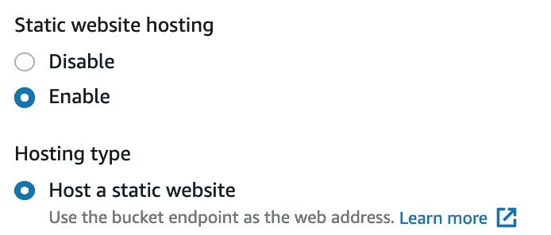

转到 S3 铲斗的**属性**并导航到`**Static Website**` 部分，并启用该功能。

对于**索引** **文档**和**错误** **文档**都添加了`index.html`，因为这将是我们 Reactjs 申请的切入点。

**允许公众访问网站**

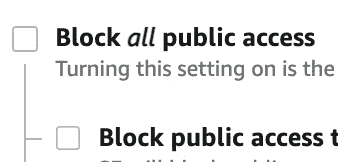

转到 S3 桶的权限，导航到`Block public access`并启用访问。

然后，as `Bucket policy`通过以下方式授予对其所有文件的访问权限:

```
{
    "Version": "2012-10-17",
    "Statement": [
        {
            "Sid": "PublicRead",
            "Effect": "Allow",
            **"Principal": "*",**
            "Action": [
                "s3:GetObject",
                "s3:GetObjectVersion"
            ],
            **"Resource": "arn:aws:s3:::reactjs-codekoala-net/*"**
        }
    ]
}
```

**验证 S3 静态网站托管**

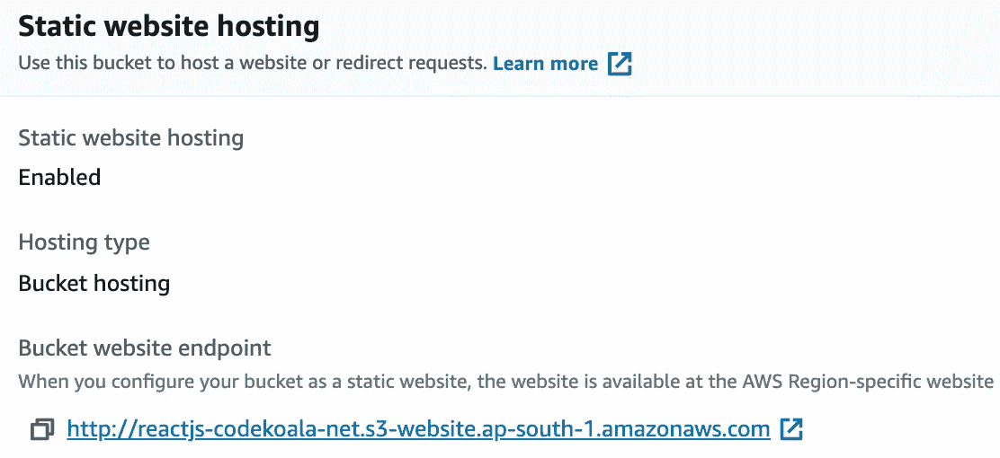

进入 S3 水桶的**属性**，导航到`**Static Website**` 部分，现在会显示网站链接。

如果我们在门户中导航到 S3 桶，它将显示内容是`Publicly accessible`

如果我们在浏览器中导航到上面的链接，它将显示我们刚刚创建的 Reactjs 应用程序示例，因此网站是公开托管的。注意，这不包含我们的域和它的 https。

# 使用 AWS CloudFront 获得更好的性能

**创建 CloudFront 发行版**

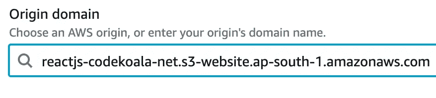

CDN 服务可以用来提高网站的性能。因此，我们使用 CloudFront distribution 向客户展示我们的网站。

导航到 CloudFront 服务，创建一个发行版并保留所有默认值。当**选择源域名时，将静态网站 S3 链接**作为源域名(注意，这不是下拉列表中的 S3 域名)

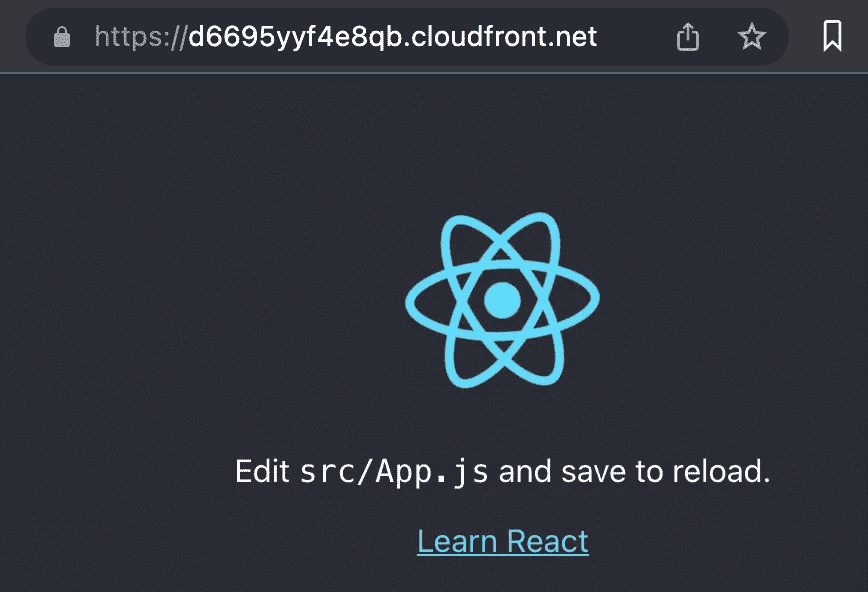

在不久的将来，这个 CloudFront 发行版将会启用。这可以通过 CloudFront url 访问，如下所示。

注意，对于 CloudFront 发行版，这可以分别通过 http 和 https 访问。

# 在 AWS 证书管理器中创建 SSL 证书

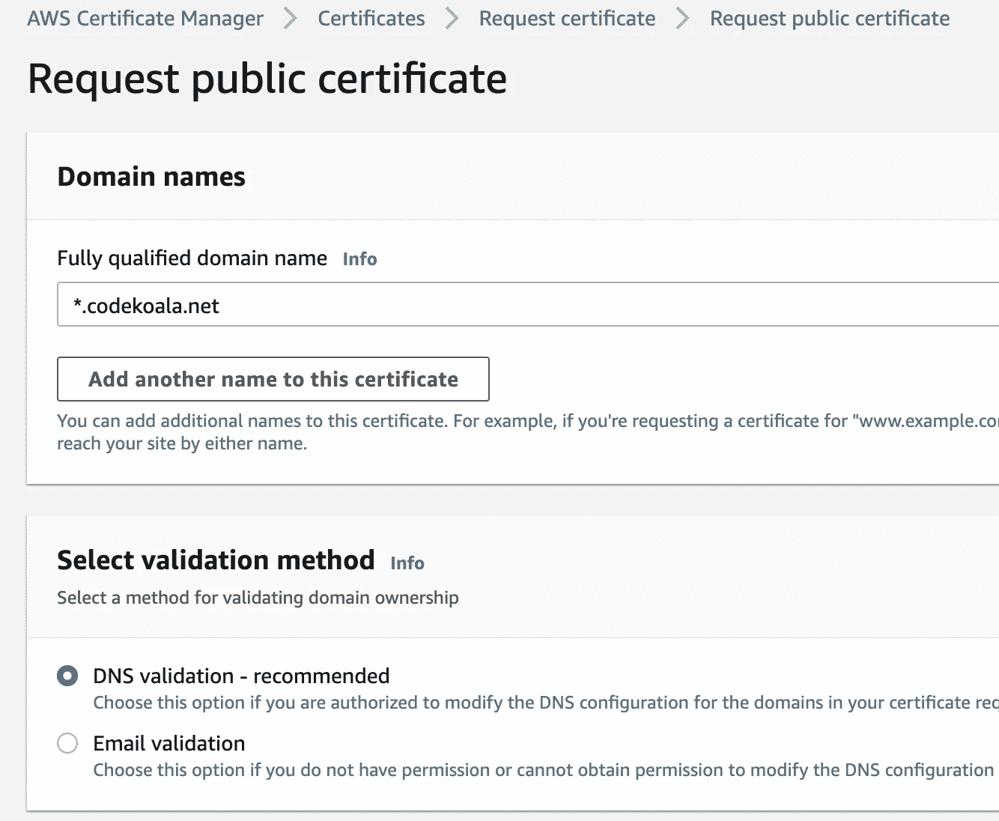

自定义域需要 SSL 证书才能创建网站 https。

在这里，从 AWS 证书管理器或 ACM，继续生成公共证书，这里是为通配符域`***.codekoala.net**`完成的。

为了生成证书，需要**通过 **dns 验证**验证域名所有权**。

这里，ACM 将要求在域注册中心添加新的 DNS 记录，该记录可能是 **AWS Route 53** 或 **Namecheap** 。

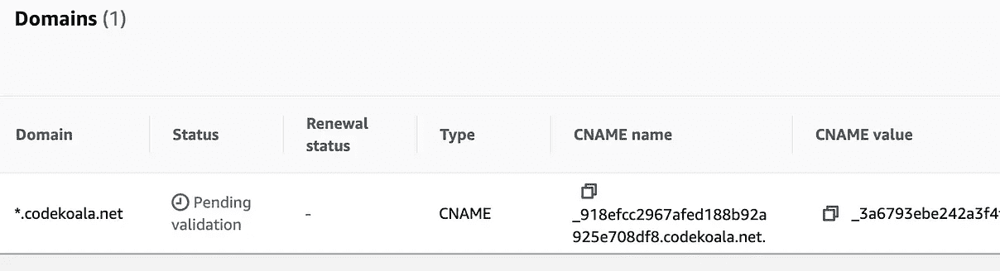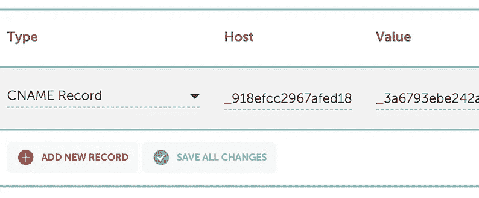

ACM 会将**待验证**和 **CNAME 值添加到 Namecheap DNS 记录**。(有时会更改为已验证)

然而，这种 SSL 证书的生成也可以通过**使用 Certbot** 进行加密，这将在下一篇文章中介绍。一旦生成，就可以通过证书主体、私钥和链**导入到 ACM** 中。

[](https://medium.com/swlh/learning-configuring-https-for-node-js-5097e44320e3) [## 学习和配置 Node.js 的 HTTPS

### 为安全网站创建和应用 SSL 证书

medium.com](https://medium.com/swlh/learning-configuring-https-for-node-js-5097e44320e3) 

# 在 CloudFront 发行版中附加自定义域

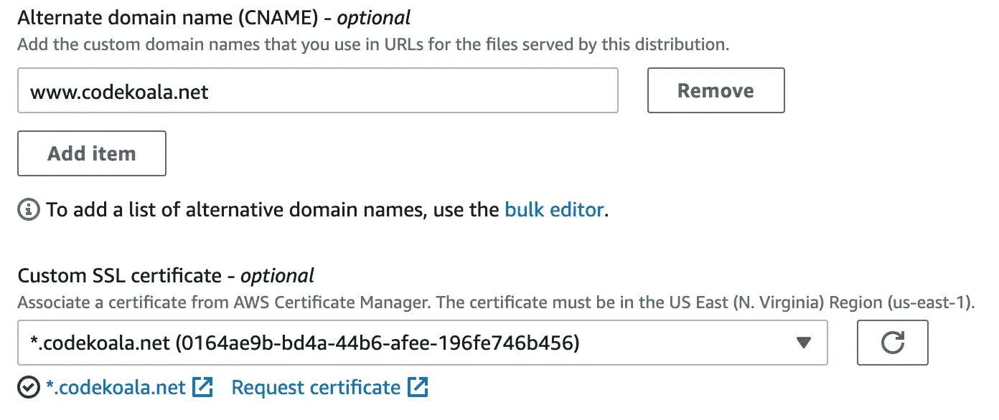

这里需要编辑以前创建的 CloudFront 发行版来附加自定义域。

这里在编辑模式下，需要添加 **CNAME 域名**为`**www.codekoala.net**`，并选择 ACM 颁发的 SSL 证书。

在 CloudFront 发行版的**行为**标签中，可以编辑为**重定向 http 到 HTTPS** 以避免 Reactjs 应用程序使用 HTTP。

# 创建到 CloudFront 分发的 DNS 记录

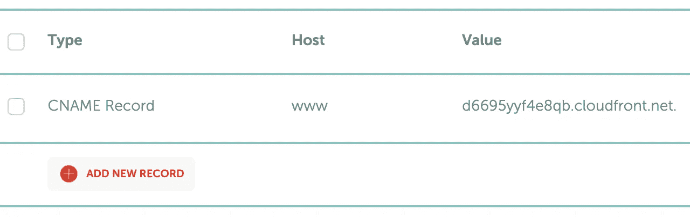

然而，名称服务器仍然不知道 CloudFront 站点。因此，需要将这个 **CNAME 记录添加到 DNS** 记录中，以指向 CloudFront link。

一段时间后，一旦域条目得到解析，就可以通过自定义域 avoid CloudFront link 访问。

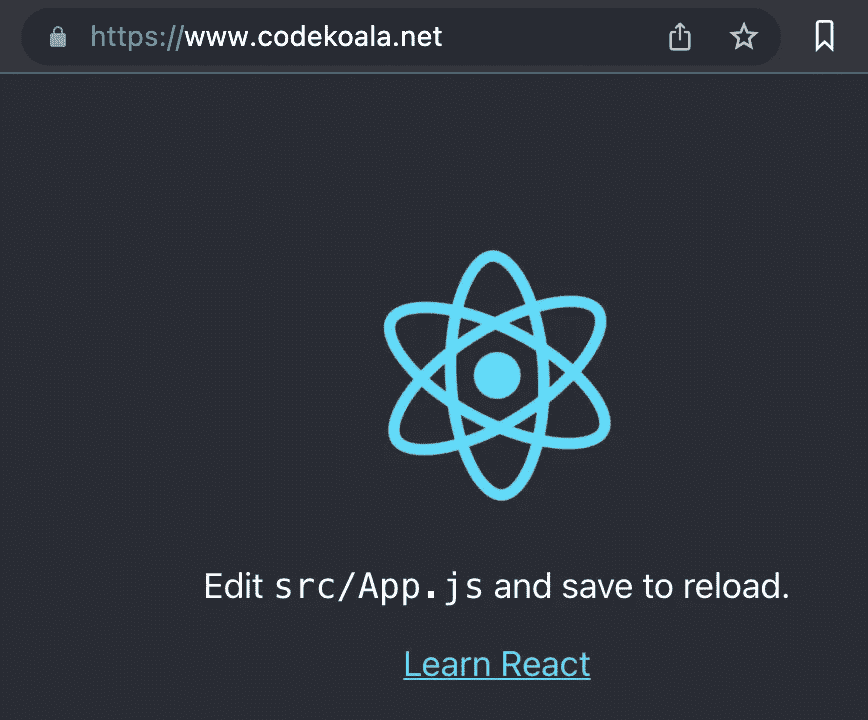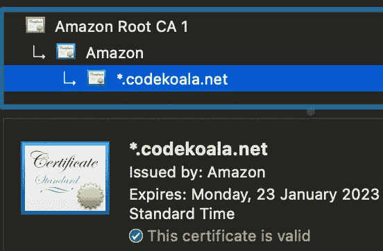

自定义 Reatjs 应用程序可通过自定义域访问，SSL 证书的有效期超过一年

如果我们登录到`[**http://www.codekoala.net**](http://www.codekoala.net)`，它会自动通过 https 导航到`[**https://www.codekoala.net**](https://www.codekoala.net.)` [。](https://www.codekoala.net.)

综上所述，本教程采用低成本的方法来托管 Reactjs 应用程序，而不是使用服务器。

*   存储在 **AWS S3** 的应用程序静态文件
*   通过 **AWS CloudFront** (CDN)交付的应用
*   通过 **AWS 证书管理器**生成的域 SSL 证书(或者加密)
*   通过 **AWS Route 53** 管理的域名 DNS 记录(或域名注册机构，如 Namecheap)