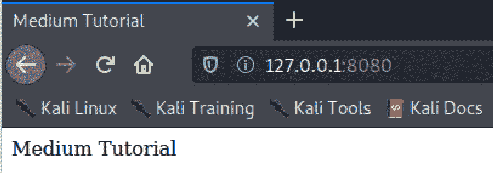
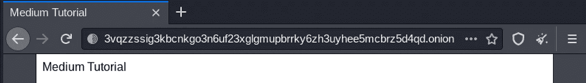

# 黑暗网络上的托管服务

> 原文：<https://levelup.gitconnected.com/hosting-services-on-the-dark-web-e42a963309d8>

## 我们都听说过黑暗网络，但是网站实际上是如何托管的呢？


来自 Adobe Stock 的许可图像

在本教程中，我将讲述以下内容:

*   Tor 浏览器和服务
*   创建基本网页
*   启动一个基本的 web 服务器来托管我们的网页
*   用自定义的洋葱地址在黑暗网络上托管我们的网页

## Tor 浏览器和服务

Tor 浏览器允许你访问“**暗网**”、“**深网**”或“**隐网**”。我将使用 Kali linux 来演示这一点，它不是默认安装的。你也可以在 Windows、OS X、Linux 和 Android 上安装 Tor 浏览器。

第一步是安装“ **tor** ”。

```
kali@kali:~$ **sudo apt-get update -y && sudo apt-get upgrade -y**
kali@kali:~$ **sudo apt-get install tor -y**
```

然后，我们启动“ **tor** ”服务…

```
kali@kali:~$ **service tor status**
● tor.service - Anonymizing overlay network for TCP (multi-instance-master)
     Loaded: loaded (/lib/systemd/system/tor.service; disabled; vendor preset: disabled)
     Active: inactive (dead)kali@kali:~$ **service tor start**
==== AUTHENTICATING FOR org.freedesktop.systemd1.manage-units ===
Authentication is required to start 'tor.service'.
Authenticating as: Kali User,,, (kali)
Password: 
==== AUTHENTICATION COMPLETE ===
```

或者，我们也可以在启动时启动“ **tor** ”服务…

```
kali@kali:~$ **sudo systemctl enable tor**
Synchronizing state of tor.service with SysV service script with /lib/systemd/systemd-sysv-install.
Executing: /lib/systemd/systemd-sysv-install enable tor
Created symlink /etc/systemd/system/multi-user.target.wants/tor.service → /lib/systemd/system/tor.service.
```

无论你使用哪种操作系统，Tor 浏览器都需要一个专门的非根用户来运行，这是有原因的。如果出于任何原因，浏览器受到一些漏洞或欺骗性下载的危害，您需要尽可能地限制系统上的攻击面。出于同样的原因，您永远不会希望以 root 用户身份运行它。

```
kali@kali:~$ **sudo adduser tor**
Adding user `tor' ...
Adding new group `tor' (1001) ...
Adding new user `tor' (1001) with group `tor' ...
Creating home directory `/home/tor' ...
Copying files from `/etc/skel' ...
New password: 
Retype new password: 
passwd: password updated successfully
Changing the user information for tor
Enter the new value, or press ENTER for the default
        Full Name []: Tor Browser
        Room Number []: 
        Work Phone []: 
        Home Phone []: 
        Other []: 
Is the information correct? [Y/n] y
```

现在，您需要注销 Kali，并使用这个新的专用用户登录。

1.  使用您的“ **tor** ”用户登录 Kali。
2.  启动您的浏览器
3.  打开，[**https://www.torproject.org**](https://www.torproject.org)
4.  点击 [**下载 Tor 浏览器**](https://www.torproject.org/download/)
5.  找到您的操作系统版本并下载
6.  在您的系统上找到归档文件并打开它
7.  将“**浏览器**目录和“**start-tor-Browser . desktop**”文件解压到您的桌面
8.  关闭存档
9.  打开桌面上的“ **Tor 浏览器设置**


点击**连接**。如果由于任何原因失败，点击"**配置**"并选择 Tor 在你的国家被审查，并使用一个桥。这应该可以解决问题，然后再次连接**和**。


Tor 浏览器可能看起来像一个普通的浏览器，但它的特殊之处在于它通过代理节点路由来处理网络流量。它还允许您访问特殊”。**洋葱网址**上的“**暗网**”。

如果您想在“**用 DuckDuckGo** 搜索”框中查看“ **hiddenwiki url** ”的搜索示例。“**隐藏维基**”一直在移动，所以你需要寻找它。它包含了许多未编入索引的不可搜索的内容。洋葱网址。请注意，很多内容都是非法的，所以不要这样做。

我想找一个例子**。洋葱**网址给你看。在隐藏维基中，DuckDuckGo 浏览器也有一个**。洋葱**网址并且可以这样访问，“[**https://3g 2 upl 4 pq 6 kufc 4m .洋葱**](https://3g2upl4pq6kufc4m.onion/) ”。此链接在普通浏览器中不起作用，但在“**黑暗网络**”中，您可以使用 Tor 浏览器访问它。

作为一名验笔师和道德黑客，你会在“**暗网**”上找到很多有用的信息，以便更有效地开展工作。黑客论坛特别有趣。

我想不言而喻，永远不要在你的普通机器或任何人的机器上运行来自“**黑暗网络**的任何东西。如果你想离线运行或查看某个东西，确保你在一个没有外部访问的包含的虚拟机中运行它。

## 为自己创建一个基本的网页

让我们尽可能简单地解决这个问题。

首先为你的网站创建一个目录。

```
kali@kali:~$ **sudo mkdir /var/www/onion**
kali@kali:~$ **sudo chown kali:tor /var/www/onion**
kali@kali:~$ **sudo chmod 775 /var/www/onion**
```

然后给自己创建一个基本的 HTML 页面。

```
kali@kali:~$ **cd /var/www/onion**
kali@kali:/var/www/onion$ **echo "<html><head><title>Medium Tutorial</title></head><body>Medium Tutorial</body></html>" > index.html**kali@kali:/var/www/onion$ **ls -la**
total 12
drwxrwxr-x 2 kali tor  4096 Nov 21 23:47 .
drwxr-xr-x 4 root root 4096 Nov 21 23:43 ..
-rw-r--r-- 1 kali kali   85 Nov 21 23:47 index.htmlkali@kali:/var/www/onion$ **cat index.html**
<html><head><title>Medium Tutorial</title></head><body>Medium Tutorial</body></html>
```

## 为自己创建一个基本的 web 服务器

你可以在这里使用任何你喜欢的东西。你可以选择更适合生产的服务，比如 Apache 或 Nginx，或者只是使用一个快速而肮脏的 web 服务器" **one liner** "使用 Python、Node、PHP 等等。

我将使用 Python 3，因为您可能已经安装了它，并且最容易演示。

## 马科斯

```
# Install XCode
% **xcode-select --install**# Install Homebrew
% **ruby -e "$(curl -fsSL https://raw.githubusercontent.com/Homebrew/install/master/install)"**# Confirm Homebrew is installed
% **brew doctor**# Install Python 3
$ **brew install python3**% **python3 --version**   
Python 3.8.3
```

## Debian，Ubuntu，Kali 等。

```
# Update & Upgrade System
# **apt-get update -y && apt-get upgrade -y**# Install Python 3
# **apt-get install python3 -y**# **python3 --version**
Python 3.8.5
```

## 红帽、CentOS 等。

```
# Update & Upgrade System
# **yum update -y**# Install Python 3
# **yum install python38 -y**# **python3 --version**
Python 3.8.3
```

让我们确认一下我们的网络服务器是否正常工作，网页是否加载…

```
kali@kali:/var/www/onion$ **python3 -m http.server --bind 127.0.0.1 8080**
Serving HTTP on 127.0.0.1 port 8080 ([http://127.0.0.1:8080/](http://127.0.0.1:8080/)) ...
```

现在打开你的浏览器，进入“ **http://127.0.0.1:8080** ”。



## 配置我们的黑暗网络服务

您需要以 root 用户身份完成下一部分。

```
kali@kali:/var/www/onion$ **sudo su -**
[sudo] password for kali: 
root@kali:~#root@kali:~# **vi /etc/tor/torrc**
```

向下导航到这些行…

```
#HiddenServiceDir /var/lib/tor/hidden_service/
#HiddenServicePort 80 127.0.0.1:80
```

取消对这些行的注释，并将端口从 80 更改为 8080。

```
HiddenServiceDir /var/lib/tor/hidden_service/
HiddenServicePort 80 127.0.0.1:8080
```

保存文件并退出。

重启“ **tor** 服务。

```
root@kali:~# **service tor restart**
```

并导航到该目录。

```
root@kali:~# **cd /var/lib/tor/hidden_service**
root@kali:/var/lib/tor/hidden_service#
```

我司网站在暗网上的“**洋葱地址**”为“**3 vqzzssig 3 kbcnkgo 3n 6 uf 23 xglgmupbrrky 6 zh 3 uyhee 5 mcbrz 5d 4 qd . onion”**

```
root@kali:/var/lib/tor/hidden_service# **cat hostname**
**3vqzzssig3kbcnkgo3n6uf23xglgmupbrrky6zh3uyhee5mcbrz5d4qd.onion**
```

我将重新登录到 Kali linux 系统上的 Tor Browser " **tor** "用户，因为我想浏览我的 onion 站点。

让我们开始我们的 Python 3 web 服务…

```
┌──(tor㉿kali)-[~]
└─$ **cd /var/www/onion**                                                      
┌──(tor㉿kali)-[/var/www/onion]
└─$ **python3 -m http.server --bind 127.0.0.1 8080**
Serving HTTP on 127.0.0.1 port 8080 ([http://127.0.0.1:8080/](http://127.0.0.1:8080/)) ...
```

并确认它在本地仍然有效…


启动您的 Tor 浏览器，导航到我们在黑暗网络上的洋葱地址。



**而且有效！**

有趣的是，我不需要打开任何防火墙规则来允许这个网站被托管。都是通过 Tor 服务处理的。

我希望你觉得这篇文章有趣并且有用。如果您想随时了解情况，请不要忘记关注我，注册我的[电子邮件通知](https://whittle.medium.com/subscribe)。

# 迈克尔·惠特尔

*   ***如果你喜欢这个，请*** [***跟我上媒***](https://whittle.medium.com/)
*   ***更多有趣的文章，请*** [***关注我的刊物***](https://medium.com/trading-data-analysis)
*   ***有兴趣合作吗？*** [***我们上领英***](https://www.linkedin.com/in/miwhittle/) 连线吧
*   ***支持我和其他媒体作者*** [***在此报名***](https://whittle.medium.com/membership)
*   ***请别忘了为文章鼓掌:)←谢谢！***