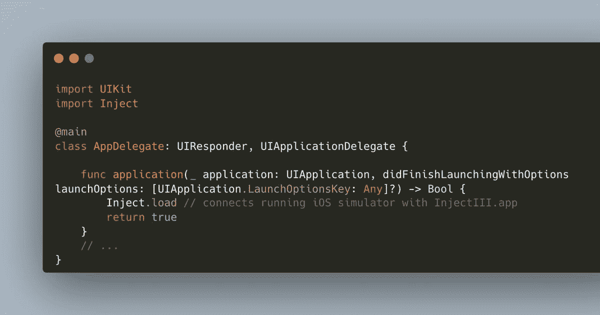

# 在 Swift 中热重装 SceneDelegate

> 原文：<https://levelup.gitconnected.com/hot-reloading-a-scenedelegate-in-swift-cd9c23fcdf5e>



在我之前的博客文章中，我告诉过你关于热重装 SwiftUI 应用程序的事情。

在这篇博文中，我将告诉你如何注入没有绑定到 UI 表示的代码。示例:在基于 UIKit 的应用程序中测试自定义 URL 的处理时，您需要更改场景委托中的代码。

您需要相同的工具:

*   由 Krzysztof Zabł ocki 创建的 Swift 包
*   `InjectionIII`，这是一个 macOS 应用程序，用于执行繁重的工作(即，监视修改后的源代码并插入新功能，就好像它已被编译到 SwiftUI 应用程序中一样)

我假设你在你的应用程序(`-Xlinker -interposable`)的构建设置中做了必要的配置，并且在你的 Mac 上运行了`InjectIII.app`。

关键的区别在于我们没有使用`Inject.ViewControllerHost(...)`或`Inject.ViewHost(...)`。相反，我们调用 AppDelegate 中的惰性属性`Inject.load`,这样`InjectIII.app`将从应用程序开始就监视文件的更改。

```
import UIKit
import Inject[@main](http://twitter.com/main)
class AppDelegate: UIResponder, UIApplicationDelegate {func application(_ application: UIApplication, didFinishLaunchingWithOptions launchOptions: [UIApplication.LaunchOptionsKey: Any]?) -> Bool {
        Inject.load // connects running iOS simulator with InjectIII.app
        return true
    }
    // ...
}
```

就是这样！

在我的视频中，我还证明了当 iOS 生命周期处理调用时，对`SceneDelegate.swift`的更改将被注入并最终执行。

对于我的视频，我在`Info.plist`中注册了一个 URL 方案。

在运行 app 之前，我给`SceneDelegate`类*添加了以下函数。*

```
func scene(_ scene: UIScene, openURLContexts URLContexts: Set<UIOpenURLContext>) {
    for context in URLContexts {
        print("url: \(context.url.absoluteURL)")
        print("scheme: \(String(describing: context.url.scheme))")
        print("host: \(String(describing: context.url.host))")
        print("path: \(context.url.path)")
        print("components: \(context.url.pathComponents)")
    }
}
```

一旦应用程序开始在 iOS 模拟器中运行，我会更改`scene(_:openURLContexts:)`的实现

使用终端命令`xcrun simctl openurl booted <myCustomURLScheme>`，我在运行的 iOS 模拟器中调用一个定制的 URL，我看到注入的代码被执行。

*原载于*[*https://blog . ei dinger . info*](https://blog.eidinger.info/hot-reloading-a-scenedelegate-in-swift)*。*

# 分级编码

感谢您成为我们社区的一员！在你离开之前:

*   👏为故事鼓掌，跟着作者走👉
*   📰查看[级别提升编码](https://levelup.gitconnected.com/)中的更多内容
*   🔔关注我们: [Twitter](https://twitter.com/gitconnected) | [LinkedIn](https://www.linkedin.com/company/gitconnected)
*   🚀👉 [**软件工程师的顶级职位**](https://jobs.levelup.dev/)