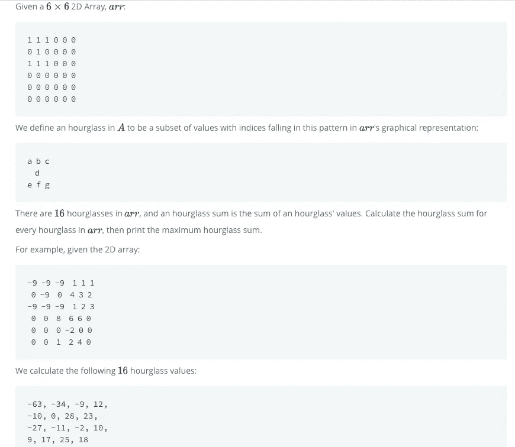

# 二维数组中的沙漏求和:编程中的石匠握手

> 原文：<https://levelup.gitconnected.com/hourglass-sums-in-two-dimensional-arrays-the-stonecutters-handshake-of-programming-87b6bebc3bad>

附上编程之石！

作为一个 30 多岁的程序员，我花了 9 年时间做喜剧，公平地说，我是《辛普森一家》的粉丝，可以说是有史以来最伟大的电视节目，至少在前 10 个赛季是如此。

在最精彩的一集里，我们的美国超级傻瓜主角荷马加入了[像自由石匠一样的](https://en.wikipedia.org/wiki/Freemasonry)昂船洲骑士团，这是一个兄弟组织，允许他在工作中获得额外津贴，并从他周围的世界获得优惠待遇，包括使他高于他的百万富翁老板伯恩斯先生的社会等级制度。

正如你在上面看到的，他甚至让一名男子修理了他的水管，这名男子冷漠地告诉他，一旦他给了他一个秘密的握手，他就“等待一个零件”。

秘密津贴、有趣的酒会、财富以及对人们感知世界方式的潜在影响；这些不仅仅是昂船洲的信条——它们也是软件工程师的生活方式，这是一种高薪职业，工资与医生或律师相当，没有沉重的债务，享受各种福利，比如在任何地方工作，带薪休假，竞争性加薪，以及鼓励拓展思维的文化。他们也有能力塑造我们普通人通过技术和网络体验世界的方式。

然而，就像《辛普森一家》中的昂船洲一样，并不是每个人都能成为软件工程师或“SE”。随着技术每隔几年就会发生变化和发展，面试官和被面试者都很难就工作可能需要的东西达成一致。与水管工相比:如果我们建造水槽的方式每 4 年改变一次会怎样？

相反，潜在的候选人要接受他们自己版本的昂船洲秘密握手测试:精心展示他们不会在工作中使用但具体而不可靠的东西:关于算法和数据结构的问题。

无论你是用 C++还是 React.js 编码，这两个框架都涉及到条件、循环、迭代和列表，以及时间复杂度和递归等概念。因此，对这些东西的测试是永远绿色的，永远复杂的，用来淘汰那些值得成为 se 的人。

以多维数组中的这个问题为例:



砰！(乐队 tm)

现在，我有了一些程序员的经验。我以全班第一的成绩毕业于全国排名第一的全栈训练营，[有望在他们母公司与库什纳夫妇的疯狂冒险中幸存下来。我精通至少 3 种编程语言，可以](https://www.bloomberg.com/news/articles/2020-04-16/kushner-cos-faces-squeeze-in-brooklyn-over-wework-coronavirus)[为你构建一个全功能的 API，利用多个端点，在几个小时内部署到网络上](http://scary-outside.herokuapp.com)。

我甚至没有听说过多维数组的**，更不用说“沙漏值”了。**

幸运的是，我的朋友、经验丰富得多的程序员迈克尔·麦克拉农(Michael McLarnon)提出在解决问题的过程中帮助指导我。编程文化的一个积极方面是，里面的人通常愿意回馈给新的程序员。

Michael 向我解释说，首先，在 JavaScript 中，二维数组只是数组中的一些数组，可以通过循环每个数组中的每个值来探索。按照惯例，这看起来像是:

```
for(let i=0; i<arr.length; i++){
   for(let j= 0; i<arr[i].length; j++){
}}
```

这意味着对于数组的**数组中的每一项，遍历**子数组中的每一个** **数字。****


我把沙漏定义为用来看时间的东西。

他们要求我们寻找的一个**沙漏和**，查看**顶部数组的三个元素、下一个数组的第二个或中间元素以及第三个数组的三个元素。**

因此，给定我们的循环，我们可以定义一个变量 **max** ，因为我们试图在循环外找到最大总和，在循环内找到一个变量 **total** ，返回那个沙漏的总和。在迈克尔的指导下，我决定将沙漏总和抽象成一个函数。

```
**const** indiGlass = (arr, i, j) => { **let** sum = 0 *//take the first three elements and add them* counter += arr[i][j] + arr[i][j+1]+arr[i][j+2] *//take the 1 indexed element from the second array* counter += arr[i+1][j+1] *//take the first three elements from the third and add them* counter += arr[i+2][j] + arr[i+2][j+1]+arr[i+2][j+2] //give us the sum **return** sum}
```

如你所见，我们从循环中取出参数(I 和 j ),并用它们来计算沙漏和。这使得问题变得简单多了，因为这个函数为循环中的任意给定点返回一个**沙漏和**！

这给了我看起来像这样的东西:

```
**function** hourglassSum(arr) { **let** max = 0 **for**(**let** i=0; i <arr.length-2; i++){ **for**(**let** j = 0; j< arr[i].length-2; j++){ **if**(indiGlass(arr, i, j) > max) max = indiGlass(arr, i, j); }
  } **return** max}
```

" **arr.length-2"** 在那里，这样我们就不会越过数组的边缘，因为我们需要三个数来进行沙漏求和。我们甚至有了最大值，因为 indiglas**的**返回值是一个整数**，这在 Java 之类的语言中可能表达得更有力。**

但是这段代码中有一个错误！

如果沙漏和是负整数呢？

这有点吹毛求疵，但是 **0 总是大于负数之和**，所以我需要为 max 做一些非常小的东西，Michale 建议像来自 Java 的 [**Integer.min** 这样的东西，但是](http://ice-web.cc.gatech.edu/ce21/1/static/JavaReview-RU/VariableBasics/minAndMax.html)[上过 Dan Abramov 的 Just Javascript 课程](https://justjavascript.com/)，我知道 Javascript 的这个版本:“ **-Infinity”！**

**-无穷大**将总是小于一个数，所以再进行一次重构…

```
**const** indiGlass = (arr, i, j) => { **let** sum = 0 *//take the first three elements and add them* counter += arr[i][j] + arr[i][j+1]+arr[i][j+2] *//take the 1 indexed element from the second array* counter += arr[i+1][j+1] *//take the first three elements from the third and add them* counter += arr[i+2][j] + arr[i+2][j+1]+arr[i+2][j+2] **return** sum}**function** hourglassSum(arr) { **let** max = -Infinity **for**(**let** i=0; i <arr.length-2; i++){ **for**(**let** j = 0; j< arr[i].length-2; j++){ **if**(indiGlass(arr, i, j) > max) max = indiGlass(arr, i, j); }
  } **return** max}
```

我能让一切都过去。握手完成！

“我是会员！”

所以我在这里，这是我在一集…差不多 30 年前的《辛普森一家》,程序员的精英生活和二维数组上的集会。

公平地说，在写这篇文章时，我和另一位程序员朋友 [Kristy Jordan](https://www.linkedin.com/in/kristy-jordan-97b766b0/) 聊过，她说她在工作中“一直”使用二维数组。所以，也许我对面试问题的冷嘲热讽或者至少这个问题是没有根据的，但有一点我可以肯定，那就是贝里奇。


贝里奇！

贝里奇是一只小狗模样的小伊沃克人。他喜欢抓抓抱抱，也怀念在疫情期间和其他狗狗一起玩的日子。但是他知道他的主人 Tombo 和 Shelbs 在这段时间需要额外的拥抱，所以他给了他们。

他是一个伟大的伊沃克人。最好的。

白现在来说。


网卡