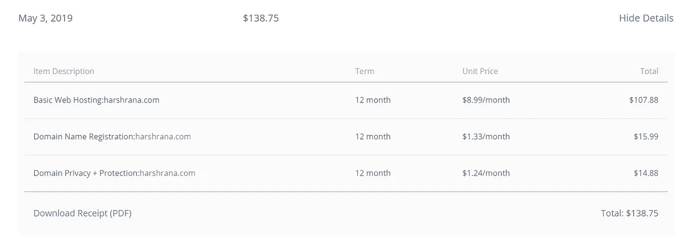
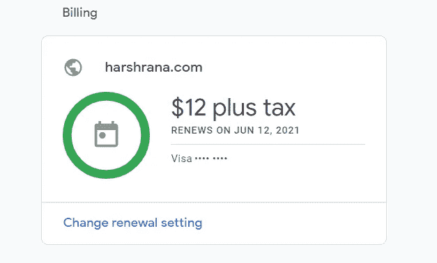

# 15 分钟如何为我的个人网站每年节省 100 多美元的托管成本

> 原文：<https://levelup.gitconnected.com/how-15-minutes-saved-me-over-100-year-in-hosting-costs-for-my-personal-website-b6483b1bd03d>

## 强大的网络存在比你想象的更容易，更便宜，让我来证明这一点。

我 2014 年的个人网站。啊，美好的旧时光..

我有一个个人网站已经很久了。我在 2014 年高三的时候搭建了第一个版本。这是一个相当简单的网站，上面有我的脸，一些关于我在学校参与的细节，以及我的志向(正如你在上面看到的)。这不是最复杂的网站，但在 2014 年，由于我对 web 开发和部署的知识有限，我选择了 Bluehost 作为我的虚拟主机提供商。

**这篇文章概述了我如何从 2014 年到 2019 年支付了远远超过我需要的托管我的网站，以及我如何通过使用 Netlify 和 Google Domains 将我的成本降至原来的 10%以下。**

# (有目的地)复杂的网站托管世界

在我谈论我使用和付费的服务之前，让我穿过复杂的虚拟主机世界，介绍人们真正需要的主要服务:**域名管理器和主机提供商**。

**域名管理器**是一个允许你购买新域名的平台。域名只是网站地址的另一种说法，比如“ilikewebdev.com”，在我看来这是一个很棒的名字。虚拟主机提供商是一家允许你上传网站相关文件并将这些页面提供给用户的公司。这些公司通常在世界各地都有他们的服务器，并允许简单的人，如你和我，使用他们的服务器来“托管”我们的网站。

这两种服务结合在一起，由许多虚拟主机公司提供，如 Bluehost、GoDaddy 等。现在，虽然这些是您需要的主要服务，但还有许多附加服务可以以不同的方式让您的生活变得更加轻松。我选择加入的一些项目包括:

1.  **域名隐私+保护**:注册一个网站域名，你需要提供你的详细资料，如姓名、地址、电话号码、电子邮件等。除非你购买这个附加软件，否则你的所有信息都是公开的。我花了两天没有这个，并收到了 100 个电话和信息，不要犯我的新手错误。
2.  **HTTPS 证书**:你可以选择一个不安全的网站，但是像谷歌这样的搜索引擎倾向于将它们排在那些启用了 HTTPS 的网站之后。值得庆幸的是，大多数服务提供商允许你在 2020 年免费添加这项功能，但还是要注意一些事情。

既然你已经了解了虚拟主机的世界，以及购买域名和建立并运行网站所需的服务，那么让我来描述一下我的经常性费用。

# 旧成本细目

从 2014 年到 2019 年，我使用 Bluehost 作为我的域名管理器和托管提供商。这是我付给 Bluehost 的最后一张账单:

这笔钱太多了，我本不该付的

如你所见，我为我所使用的服务支付了一大笔钱。在我看来，17 岁的我并不知道更多，但谢天谢地，22 岁的我知道。我决定停止使用 Bluehost，将我的网站完全转移到新的服务提供商那里。

# 升级的托管技术体系

从今年开始，我将我的域名迁移到由谷歌域名管理。这是我做的两个改变中的第一个。我选择谷歌域名有几个原因:

1.  谷歌是有史以来最成功的公司之一，所以有一种安全感
2.  他们的成本与其他域名管理器相当，有时甚至更低
3.  他们免费提供域名隐私和保护！

因此，马上，通过切换到谷歌域名，我可以停止支付 14.88 美元/年的域名隐私和保护。将我的网站从 Bluehost 迁移到 Google Domains 相当简单，只花了<5 minutes. You can learn more about this process by reading this [文章](https://support.google.com/domains/answer/9003139?hl=en)。

> 通过切换到谷歌域名，我可以停止支付 14.88 美元/年的域名隐私和保护

我做的下一个改变是我的主机提供商。我决定搬到[网生活](https://www.netlify.com/)有很多原因:

1.  Netlify 有一个免费层，非常适合静态的个人网站
2.  他们免费提供对自定义域和 HTTPS 集成的支持
3.  它们可以与 GitHub 集成，从而提供对开发人员极其友好的部署和维护体验

这是一个重大的游戏改变。使用 Bluehost 时，我支付的是 8.99 美元/月或 107.88 美元/年；对于 Netlify，我只支付 0 美元。同样，将主机权限从 Bluehost 迁移到 Netlify 需要<10 minutes and the move from a file manager (used by Bluehost and most other hosting providers) to GitHub was a treat.

> With Bluehost, I was paying $8.99/month or $107.88/year; with Netlify, I pay exactly $0.

You can understand the migration process and learn more about it by watching the following [视频教程](https://www.youtube.com/watch?v=Q9giWrfIJKk&t=11s)。

# 新成本细分和比较

自从迁移到 Google Domains 和 Netlify 后，我的服务器/主机成本已经完全消除，因为 Netlify 提供的免费层对我来说是完美的！我只支付 12 美元/年的权利，拥有自己的域名和网站。

我唯一的成本与我的个人网站有关

相比之下，我以前的成本是 14.88 美元(隐私保护)+ $15.99(域名)+ $107.88(托管)= $ 138.75/年。**这一降价意味着节省了 126.75 美元的成本，换句话说，降价了> 90%！**

# 结束想法

米格尔·Á拍摄的照片。来自[佩克斯](https://www.pexels.com/photo/web-text-1591060/?utm_content=attributionCopyText&utm_medium=referral&utm_source=pexels)的帕德里纳

现在是 2020 年，拥有一个谈论你、你的成就和技能的个人网站比以往任何时候都更容易、更便宜。12 美元/年大致是:

*六杯咖啡*

或者

三品脱冰淇淋

或者

*一顿午餐*

希望这篇文章能帮助你认识到，一个更强大的网络存在比你想象的更近。PS:你可以通过访问[harshrana.com](http://www.harshrana.com)来了解我的网站自 2014 年以来是如何升级的。