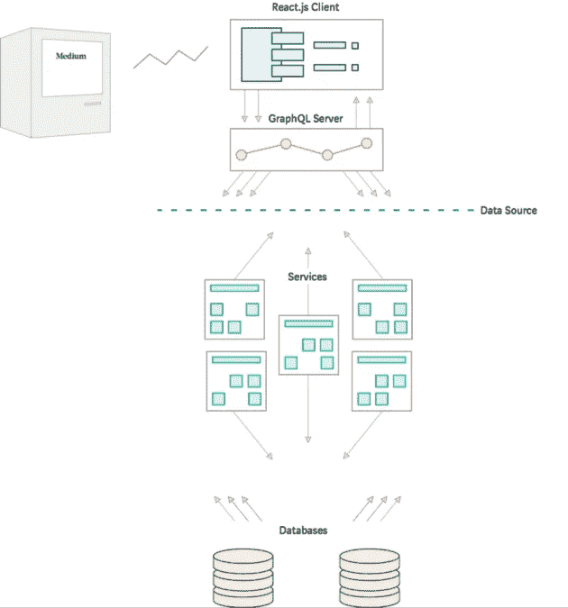

# 一个 Bug 如何帮助我更好地理解 GraphQL

> 原文：<https://levelup.gitconnected.com/how-a-bug-helped-me-to-understand-graphql-7c6b0ad577ae>

## [网页开发](https://rakiabensassi.medium.com/list/software-engineering-7a179a23ebfd)

## 如何利用你的好奇心和 Chrome DevTools 来学习更多关于 web 开发的知识

图片由[图米苏](https://pixabay.com/users/tumisu-148124/?utm_source=link-attribution&utm_medium=referral&utm_campaign=image&utm_content=4340698)来自 [Pixabay](https://pixabay.com/?utm_source=link-attribution&utm_medium=referral&utm_campaign=image&utm_content=4340698)

让我倒回去一点。

这一切都是从我在 Medium 上为一篇文章写完评论后点击“回复”按钮的那天开始的。然后我向下滚动查看其他读者的反馈，在评论列表的最后，我找到了我的第二条评论，也是同样的内容。

我想知道我是否评论了那个帖子并忘记了它。然后我注意到两个评论发布的日期是一样的:1 分钟前，这证明了存在导致这种重复的 bug。

当我试图重现这个错误时，我发现它只发生在至少有 5 条评论的文章上，当我刷新页面(F5)时，一切都会好的:我只看到我的评论一次，总评论数也是正确的。所以这只是客户端的一个 bug。

遇到这个错误，让我充满了不同的兴奋，促使我按下 F12 键，开始检查 Chrome DevTools 的网络、控制台和元素选项卡上的输出。

以下是我了解到的情况。

# 调查前

我对用户点击“回复”时发生的情况的第一个猜测如下:

1.  web 应用程序在客户端自动更新 UI:显示所有评论和评论总数的列表。
2.  它还向服务器发送一个带有新评论数据(文本和用户 id)的请求。
3.  然后，当服务器成功接收并保存数据时，它向客户机发送一个响应，客户机用从后端接收到的评论数据再次更新 UI，最后一步没有正确完成:DOM 没有被正确替换。

可能实现的逻辑只替换了文件夹 上方显示的 DOM***。这可以解释为什么当评论列表大于我的屏幕高度(≥ 5 条评论)时，我可以在向下滚动时看到重复的评论。***

# 调查结果

在 DevTools 的网络选项卡中，我发现了许多 ***graphql*** 和 ***批处理*** 请求。我知道 GraphQL 是一种用于 API 的数据查询语言，它是 REST 的替代语言，但是我不知道在这个上下文中 batch 是什么。

在谷歌搜索之后，我决定采用一种叫做“客户端 GraphQL 查询批处理”的数据获取技术它允许将多个请求封装到单个操作中，以避免向服务器发出过多网络请求的问题。多次往返可能会损害您的性能。

> “批处理是将一组请求组合成一个请求，并使用所有其他查询都会发出的相同数据发出单个请求的过程。这通常是通过定时阈值来实现的。例如，对于 50 毫秒的阈值，如果从一个组件进行查询，客户端不是立即进行查询，而是等待 50 毫秒。如果在这 50 毫秒内请求了任何其他查询，所有这些额外的查询将同时请求，而不是分别请求。”— [批处理是如何工作的？](https://www.apollographql.com/blog/apollo-client/performance/batching-client-graphql-queries/)

用数组进行批处理操作的例子([图像源](https://www.apollographql.com/blog/apollo-client/performance/batching-client-graphql-queries/)

也就是说，支持技术有它的缺点:

*   它可能会降低客户端的加载速度，因为批处理请求与批处理中最慢的请求一样慢:如果向 GraphQL 端点发出 4 个请求，其中一个比其余的慢，客户端应该等待所有请求都被处理后再返回结果。
*   这使得调试网络流量更加困难。

我继续搜索，发现了更多的技术细节，并确认了上述应用程序对 GraphQL 的使用。它具有:

*   [React.js](https://reactjs.org/) 作为客户端框架，以及
*   [GraphQL](http://graphql.org/) 作为客户端和托管业务逻辑的服务之间的接口。 [Apollo Client](https://www.apollographql.com/client) 用作 GraphQL 客户端框架， [Sangria](http://sangria-graphql.org/) 用作 GraphQL 服务器框架。

中等代码基础架构([图像源](https://medium.engineering/2-fast-2-furious-migrating-mediums-codebase-without-slowing-down-84b1e33d81f4))

您可能已经注意到，在网络选项卡的*协议*一栏中有`h3`。它指的是 HTTP/2 的后继协议 HTTP/3。

HTTP/3 最初是由 Google 开发的，它的目标是提高网络速度。2018 年[被互联网工程任务组(IETF)采用](https://kinsta.com/blog/http3/)作为超文本传输协议(HTTP)的第三代。

据 [W3Techs](https://w3techs.com/technologies/comparison/ce-http2,ce-http3) 报道，2021 年:

*   21.4%的网站使用 HTTP/3(尽管它还不是官方的互联网协议)。
*   46.3%的网站使用 HTTP/2。

所以，让我们回到我们的重复评论错误。

2021 年 9 月 9 日，我无法再现它，我以为开发团队已经修复了它，并对应用程序进行了新的部署，但在接下来的几天里，我再次看到了它，再现它的条件不清楚。在一篇评论不到 5 条的文章里见过一次。

希望有了这些见解，你可以放心地按下 F12 键，探索你每天都在交互的网页的更多细节。

🧠💡感谢阅读！我为一群聪明、好奇的人写关于工程、技术和领导力的文章。 [**加入我的免费电子邮件简讯独家访问**](https://rakiabensassi.substack.com/) 或注册媒体[这里](https://rakiabensassi.medium.com/membership)。

*你可以在 Udemy 上查看我的* ***视频课程****:*[*如何识别、诊断、修复 Web Apps 中的内存泄漏*](https://www.udemy.com/course/identify-and-fix-javascript-memory-leaks/) *。*

 [## 如何用 Chrome DevTools 检测并修复内存泄漏

### 准备好提高您的 web 性能了吗？

better 编程. pub](https://betterprogramming.pub/build-me-an-angular-app-with-memory-leaks-please-36302184e658)  [## 改善开发人员体验的 8 种工具

### 快乐的开发者写出更好的代码

better 编程. pubb](https://betterprogramming.pub/how-to-improve-developer-experience-2d5908d7bbb0)