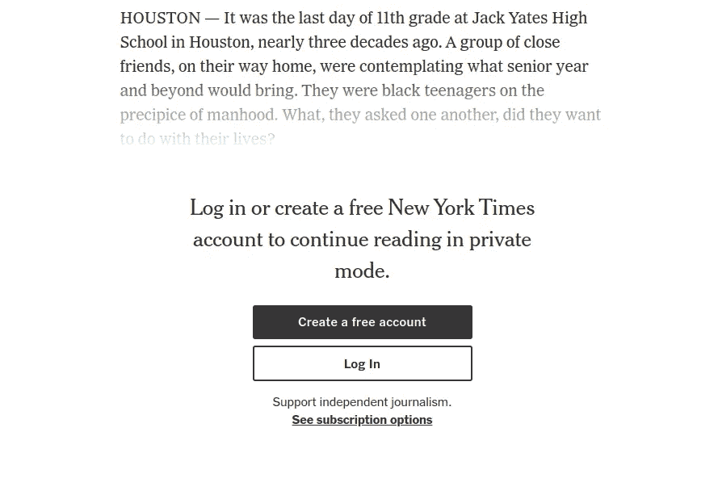
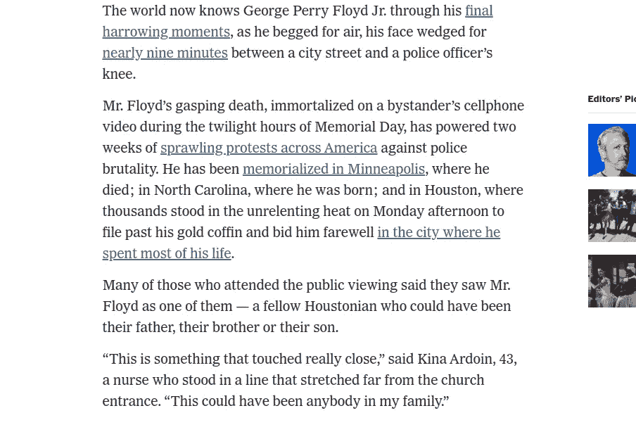

# 怎么一个句号(。)把谷歌这样的科技巨头搞砸了

> 原文：<https://levelup.gitconnected.com/how-a-period-screwed-tech-giants-as-huge-as-google-59070cab701e>

## 一个边缘案例的无知故事…


照片由[卢卡·布拉沃](https://unsplash.com/@lucabravo?utm_source=unsplash&utm_medium=referral&utm_content=creditCopyText)在 [Unsplash](/s/photos/tech-fishes?utm_source=unsplash&utm_medium=referral&utm_content=creditCopyText) 上拍摄

众所周知，一般来说，无知是一种诅咒，应该被根除。但是对于程序员或者开发者来说，都是反过来的。有时候，无知也是一种福气，只要他们能找到明智利用它的方法。历史证明，被开发人员忽略的边缘案例有时会导致灾难性的后果。有时，由于生产级应用中可能出现的遗漏边缘案例，大型科技巨头不得不承受巨大损失。

# 月经是怎么回事？

一名网络开发者和一名 Reddit 用户 [unicorn4sale](https://www.reddit.com/user/unicorn4sale/) 发现了许多网站的这一漏洞，并通过添加一个(.)在 URL 中。是的，你没看错，这实际上是一个非常有趣并且经常被忽视的互联网的根基是如何工作的。

## 首先，让我们检查 URL 的不同部分:

URL 代表统一资源定位器，它是一个网址，使用一种机制来识别网络中的合作伙伴网站并检索所需的信息。URL 的不同部分(不限于)如下:

*   方案(也称为协议)
*   子域
*   二级域名
*   顶级域名
*   小路
*   查询字符串
*   片段标识符

URL 的不同部分在`colons`、`forward-slashes`、`**periods**`、`hypens`和`questions-marks`的帮助下绑定在一起。不需要所有的部分都在一个 URL 中，但是一些部分如**方案、二级域名和顶级域名必须**在一个域名中，以便从全球巨大的网站池中找到资源。

# 怎么通过加句号绕过广告？

用句点将**子域名与二级域名**和**二级域名与顶级域名分开。**在 youtube 的例子中，“youtube”和“com”由句点分隔，完全可以说最终用户可以做任何事情，也可以在顶级域名之后和正斜杠之前添加句点**，就像这样:“youtube.com **。** /。在这里添加一个句点不会有任何改变，网站将照常打开，因为这个事实并不广为人知，许多 web 开发人员也没有考虑它，导致有趣的结果。**

在这种情况下，你可以观看没有广告的 youtube 视频，甚至可以免费阅读优质内容(**不适用于媒体**，你知道我们的媒体非常智能😜)

让我们举个例子来了解一下在哪里准确地添加一个时间段来观看没有广告的 youtube 视频:

```
**Example 1:**
Regular URL
[https://www.youtube.com/watch?v=lfo7k6dR9gU&feature=youtu.be](https://www.youtube.com/watch?v=lfo7k6dR9gU&feature=youtu.be)Changed URL (with no ads)
[https://www.youtube.com**.**/watch?v=lfo7k6dR9gU&feature=youtu.be](https://www.youtube.com/watch?v=lfo7k6dR9gU&feature=youtu.be)
```

从普通的网址到改变的网址，你很容易就能看出有广告和没有广告的区别。

```
**Example 2:** Regular URL
[https://www.youtube.com/watch?v=dQw4w9WgXcQ](https://www.youtube.com/watch?v=dQw4w9WgXcQ)Changed URL (with no ads)
[https://www.youtube.com**.**/watch?v=dQw4w9WgXcQ](https://www.youtube.com/watch?v=dQw4w9WgXcQ)
```

最有趣的部分是，一旦你在 URL 中添加了一个句点，该句点将在整个会话中保持不变。你将能够在视频之间或 Youtube 内的任何地方进行切换，并且可以享受无广告的体验，而无需一次又一次地插入句号。它将继续工作，直到谷歌修复这个错误。

如果你正在使用广告拦截器，那么你已经停止了广告的播放，黑客也不会有任何帮助。因此，要测试这种攻击，你需要禁用广告拦截器，或者考虑切换到匿名模式，以获得更好的测试体验。

# 让我们深入探讨一下:

这种方法之所以有效，是因为有几个网站忘记“规范主机名”。
以下是 Reddit 用户 unicorn4sale 在发布该技巧时所说的话:

> “这是一个普遍被遗忘的边缘案例，网站忘记规范化主机名，内容仍然提供，但浏览器上没有匹配的主机名，因此没有 cookies 和损坏的 CORS-许多较大的网站使用不同的域来提供广告/媒体，白名单不包含额外的点。”

这也适用于许多其他提供付费墙服务的网站:

```
**Example 3:**
Regular URL
[https://www.nytimes.com/2020/06/09/us/george-floyd-who-is.html](https://www.nytimes.com/2020/06/09/us/george-floyd-who-is.html)Changed URL (able to read premium article with paywall)
[https://www.nytimes.com./2020/06/09/us/george-floyd-who-is.html](https://www.nytimes.com/2020/06/09/us/george-floyd-who-is.html)
```

## 请参见下面的截图，了解不同之处:



**带常规网址**



**更改网址后**

> 早些时候，我以为这不会在手机浏览器上工作，但令我惊讶的是，同样的黑客在手机上也工作，但为此，你需要切换到移动版 Chrome 上的**“请求桌面站点”**功能。

因为它破坏了 cookies，这也意味着你不能关闭自动播放，而且没有记忆的历史，所以它很可能会无限循环播放少量视频。如果您关闭浏览器中的自动播放，它会暂停广告，直到广告超时。

虽然我在 Youtube 音乐上尝试了同样的技巧，在“com”和“/”之间添加了一个句点，但我希望同样的技巧在这里也能起作用，但这破坏了整个 web 应用程序。尝试其他一些网站，让我在评论中知道哪些网站同样的伎俩奏效了。

> 还有，在评论区告诉我，如果你是开发者，你对边缘案例的无知有什么看法？

# 免责声明:

广告和对**“你给我看广告，我得到你的内容/服务”**的理解，通过给每个人一种无需支付现金就能访问的方式，使现代互联网成为可能。像这样的网站用广告来资助你喜欢的创作者继续创作内容。

所以，负责任地使用这篇文章作为教育内容，而不是在没有广告的情况下使用它来观看和阅读。此外，毫无疑问，谷歌迟早会修复这个 bug。如果你真的想享受无广告内容，考虑购买网站提供的优质服务。考虑到我们消费的内容数量，我觉得支付少量费用是合理的。

## 别忘了给我们你的👏！

此外，遵循出版[级编码](https://levelup.gitconnected.com/)的一切相关技术。


拍手！拍手！拍手！

请关注作者，定期获取未来文章的更新。

[](https://medium.com/@singhjp) [## 贾尚·普里特·辛格——中等

### 阅读 Jashan Preet Singh 在媒体上的文章。全栈 Web 开发人员。每天，贾尚·普里特·辛格和成千上万的…

medium.com](https://medium.com/@singhjp) 

随时通过 Linkedin 联系:

[](https://www.linkedin.com/in/singhjp006/) [## jashan Preet Singh——软件工程师——Chai Point | LinkedIn

SDE | |热情 _ 火山| |科技 _ 漫游癖| |新 _ 风险投资 _ 领导力@麻省理工学院](https://www.linkedin.com/in/singhjp006/)