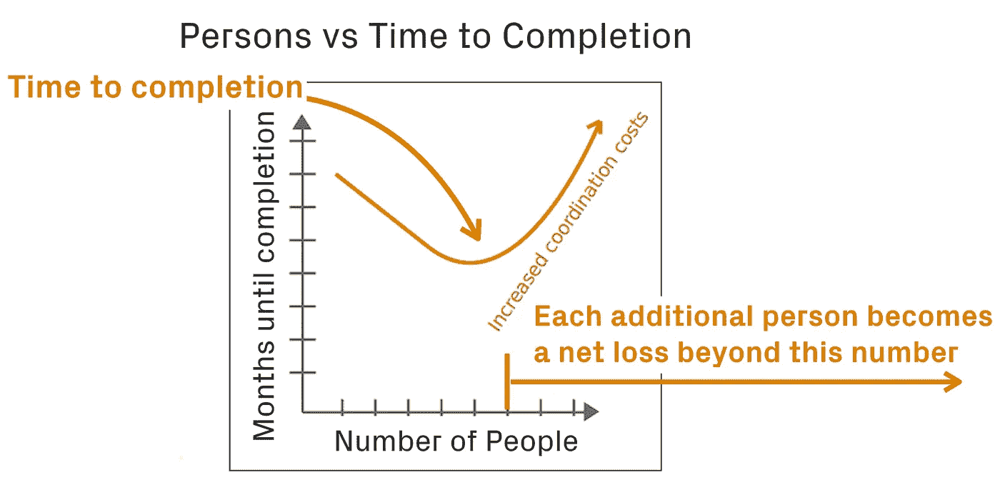
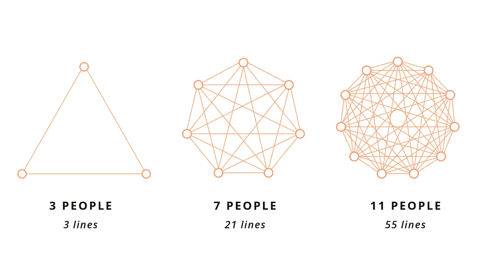

# 增加开发人员如何降低项目速度

> 原文：<https://levelup.gitconnected.com/how-adding-devs-slows-projects-a21aefedd190>

## 理解什么对及时的软件交付真正重要

去年，我与一家全球银行的首席信息官进行了一次讨论，他正在思考如何最好地解决开发人员的生产力问题。他的想法是测量代码提交。我认为这是一种奇怪的方法，所以我探究了他的推理，问他“五个为什么”:

*   ***为什么你觉得测量代码提交会有用？*** 他想知道他们有多少开发人员在积极地编写代码。
*   ***为什么需要知道开发人员主动编码的数量？他回答说，这个团队在全球有数千人，不清楚谁在定期编写代码。***
*   ***为什么知道积极编码的开发人员的数量对生产力有帮助？*** 他说他需要了解组织中可用的人的力量。
*   ***为什么人力有助于你理解生产力？他回应说，工程方面有大量积压，他认为他们人手不足。***

在提出最后一个“为什么”之前，我停顿了一会儿来阐述我的想法。

*   ***为什么你认为九个女人生孩子的速度不会比一个女人快？***

好吧，这不是我问的问题，但当我们深入讨论工程度量和生产率时，我想到了这个问题。对于一个拥有成百上千分布在许多地点和时区的开发人员的工程组织来说，获得人们正在做的事情的准确脉搏可能非常困难。

你可能会把我上面的妙语当成 [**布鲁克斯定律**](https://en.wikipedia.org/wiki/Brooks%27s_law) 的一个例子。1975 年，Fred Brooks 写了软件工程中最有影响力的书之一，神话中的人月。他对软件项目进行了观察，补充说人们会延迟交付。

从表面上看，这听起来有违直觉。你添加到项目中的每个人非但没有帮助减少工作量，反而起了相反的作用。我们的期望是增加人的帮助。听说人手不足是导致工作积压越来越多以及无法响应企业新请求的原因，这种情况有多普遍？

在许多情况下，更多的工作会带来更多的人。没有快速招聘，初创公司就无法扩大规模。随着新功能的增加，产品团队通常需要新的技能。过渡到新架构和平台的 IT 团队需要让专家来做这项工作，并对现有员工进行培训。

随着复杂性和规模的增长，对更多专业化的需求也在增长。一旦组织处于执行模式，计划者和通才就不那么重要了。这是有意义的，因为我们对早期所做的暗示和假设的有限理解只有在工作完成后才变得清晰。或者换句话说，只有当我们身处其中时，我们才知道我们所知道的。

当我开始软件工程师的职业生涯时，我经历了几个早期选择导致不同现实的痛苦例子。我经常从绘制数据库模式开始我的项目，然后创建业务逻辑和 UI。对于我正在构建的销售平台，我假设一个人只属于一个组织。然后销售的 VP 有一天问我为什么不能给一个人加多个公司。

现在我明白了在数据模型中建立灵活性的必要性(或者去 NoSQL)。要跟踪当前和以前的雇主、添加关联或跟踪咨询任务，在人员和组织之间建立多对多关系是正确的选择。具有讽刺意味的是，我后来加入了一家名为 Siebel Systems 的知名公司，这家公司犯了同样的数据模型错误，但规模和成本都大得多。

这就是布鲁克斯所说的经常被忽略的微妙之处。他的直觉是，在项目后期增加人员会减慢进度。这是因为新人需要入职，这需要几周时间。他们没有知道向谁寻求帮助的内部网络，也没有获得机构知识。当他们问问题时，他们会打断其他人，这会影响团队成员的工作效率。结果是更大的通信开销。

这对生产力有多大影响？一项研究表明，在中断后，需要 23 分钟**才能回到自己的状态。如果经常出现多次中断，生产效率的下降会对交付时间产生重大影响。**

****

**这些是 Brooks 在项目后期观察到的问题。在战略和计划更重要的早期，增加人员是有意义的。随着计划的巩固，需求更加明确。因此，问题不在于增加更多的人是否本质上是坏事。相反，我们应该问我们在增加谁，为什么？**

**对“添加谁”的回答经常会陷入对开发人员如何编写软件的误解。非技术经理认为软件的创建就像一条装配线。如果你想要更多的产量，就增加更多的装配线和工人。代码就像小部件，装配线上的工人可以互换。**

**现代软件开发与杰克·凯鲁亚克或杰克森·波拉克的共同点要多于亨利·福特对工作的看法。这涉及到创造力和解决问题的能力，这使得我们对可预测性的标准衡量变得无效。这就是为什么测量代码提交或产生的代码行不能告诉我们任何关于生产率的事情。**

**编码的另一个方面是开发人员的工作表现出原子性。工作是一个问题和一个工件，它等于一个工作单元。这类似于女人和她的怀孕，一个人独自并且只有一个人可以从头到尾完成这项工作。**

**当考虑“增加谁”的问题时，重要的是要强调，没有上下文，增加更多的开发人员是没有意义的。如果涉及到新的特性或技术，那么添加具有特定领域技能的资源来执行这项工作是合理的，比如添加新的 API 端点或将代码移动到微服务中。**

**然而，增加资源背后的原因是一个更大的问题。在布鲁克斯的时代，占主导地位的项目方法是瀑布。现在企业正从项目转向产品，并采用敏捷在更短的周期内发布产品和新特性。我前面提到的银行就是如此。然而，尽管有“双披萨团队”和其他敏捷教条、大项目、长发布周期，大型团队仍然存在。**

**或许布鲁克斯定律仍然适用。这对于那些将编码视为小部件制作、只是名义上实施敏捷、花几个月时间来部署特性、并认为开发人员是容易互换的可替代资源的组织来说很重要。那些组织将永远唱着项目资源的晚期蓝调。**

**然而，对于领先的组织来说，他们不断地发布特性。团队有合适的人才，规模适当，可以快速部署代码。未知因素在早期得到解决，影响和依赖性较小。布鲁克斯定律根本不是一个东西。**

**你是如何解决项目延期的问题的？最初是什么导致了延期？你实施了什么来帮助加速项目交付？**

****

# ****第 7 集 Shaun Norris 的云迁移的四个关键指标****

** [## 赫里泰克人

### 第 7 集-组织迁移到现代健壮的云体系结构的四个关键指标共同主持人 Justin…

heretechs.io](https://heretechs.io/post/189310347666/episode-7-four-key-metrics-for-organizations-to) 

*在下一季之前，我们回顾了过去的几集，本期节目将与 VMWare Tanzu 的 Shaun Norris 讨论如何衡量云迁移的成功。*

第二季的嘉宾来自南非、新西兰、爱尔兰、美国和其他地方的科技创业公司和全球企业。如果你想上播客，并对 IT 和工程的状态有想法，让我们聊天吧！

查看过去 Heretechs 播客在 [**苹果播客**](https://podcasts.apple.com/us/podcast/heretechs/id1485913088) 、 [**谷歌播客**](https://play.google.com/music/listen?u=0#/ps/Iyc3skvthrw7j3vgevce2r4wpmi) 上的剧集，或者任何你听你喜欢的播客的地方。请点赞并订阅😁** 

***我们帮助企业中的 IT 领导者解决数字化转型中涉及的文化挑战，并转向基于社区的文化，以更快地提供创新和客户价值。了解更多关于* [***我们的工作在这里***](https://devbizops.co/) *。***