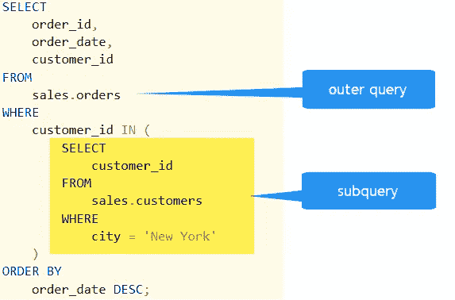
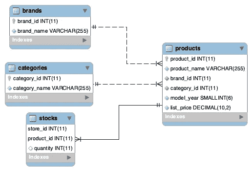

# 如何以及何时编写 MySQL 子查询

> 原文：<https://levelup.gitconnected.com/how-and-when-to-write-mysql-subqueries-8d5d580b1729>

## FROM 和 WHERE 语句中的实现



[图片来自 sqlservertutorial.net](https://www.sqlservertutorial.net/sql-server-basics/sql-server-subquery/)

我的朋友 JP 最近发表了一篇优秀的[文章](https://medium.com/@jprinfret/the-mysql-functions-used-in-almost-every-etl-pipeline-d2007d6f5086)，概述了 ETL 管道的基本 MySQL 函数，最后略微提到了子查询的主题。鉴于子查询在执行多步操作时非常有用，我想详细说明子查询并提供一些技巧和窍门。

子查询是嵌套查询，允许用户获取需要多次操作的数据。例如，如果我们有一个包含产品信息的表，我们可能希望找到不同类别产品的最高价格，然后取每个类别价格的平均值。为此，我们需要分别执行每个聚合。让我们用一个示例数据库来看看这是如何工作的，`production`:



`Production databse` 模式

我们可以在一个查询中的多个地方调用子查询，但是我们将只看如何在`FROM`和`WHERE`语句中使用它们来了解这是如何工作的。

## FROM 语句中的子查询

我们可以在`FROM`语句后插入一个子查询来选择列并聚合一个单独查询的结果！让我们从一个简单的例子开始，感受一下语法。

示例 1

这里的语法非常简单。在`FROM`语句之后，我们将子查询放在括号内，它遵循与任何普通查询完全相同的语法。在右括号之外，我在第 10 行指定了别名`sub`，因为根据 MySQL，“每个派生表都必须有自己的别名。”

只检查 4–9 中的子查询，我们看到我们简单地选择了所有`model_year`为 2018 的列。然后，外部查询只返回子查询中的所有列。最终，我们知道没有子查询也可以得到同样的结果，但是我以这种方式介绍它是为了说明语法。

让我们看一个稍微复杂一点的例子。假设我们想知道每年发布的产品的平均数量。我们将创建以下查询:

示例 2

为了理解发生了什么，我们先来看看第 4–10 行的子查询。该查询通过聚合`model_year`返回每年生产的产品数量。子查询的结果是:

```
+--------------------+
| count | model_year |
|--------------------|
| 26    | 2016       |
| 85    | 2017       |
| 204   | 2018       |
| 6     | 2019       |
+--------------------+
```

然后，外部查询计算出上述`counts`列的平均值为 80.25。不错！

现在，对于一个更高级的例子，我将演示如何在子查询中使用窗口函数。在本例中，我们希望找出每个`brand_id`最贵的前 3 种产品，以及关于`product_id`、`product_name`等产品的信息。

示例 3

第 9 行中的 window 函数做的和它所说的几乎完全一样:它对每个`brand_id`按`list_price`降序排序，并创建一个新列`price_rank`，为每行分配一个整数排名。想了解更多关于窗口函数的信息，请查看这篇很棒的教程。

一旦我们从第 4–12 行的子查询中得到我们的表，我们选择所有列，其中`price_rank< 4`，这将我们限制到每个品牌 id 的前 3 个最昂贵的产品。

我们在上面看到了如何在`FROM`语句中实现子查询，有时甚至不需要子查询。仅仅因为你*能*做并不意味着你*就应该*！接下来让我们看看子查询的另一个应用，在我看来，它更有用一些。

## WHERE 语句中的子查询

我们还能够在条件逻辑中实现子查询。如果我们被要求提供两个可能品牌的产品的平均价格，会怎么样？

实例 4

我们创建了一个子查询(第 6–13 行),该子查询隔离了相关品牌名称的品牌 id。然后我们编写一个外部查询，查找品牌 id 与子查询结果相匹配的所有价格的平均值。相当整洁！

您可能已经注意到，我在这里没有为子查询使用别名。这是因为子查询被视为单个值或一组值，如这里使用`IN`的情况，而不是一个表。

让我们更进一步…我们可以获得任何与“Strider”和“Trek”产品的平均价格一样贵或更便宜的产品名称和价格吗？

实例 5

答案是肯定的，我所做的只是将示例 4 包装在另一个通过`list_price`过滤的查询中。

## 最后

在 MySQL 中有很多方法可以编写有用的子查询，包括这里没有讨论的其他方法，比如连接子查询。我们讲述了如何在`FROM`和`WHERE`语句中编写子查询，了解了如何将窗口函数与子查询结合使用，甚至在其他子查询中嵌套子查询。

可能性几乎是无限的。您只需要决定在什么情况下您的查询会变得计算量过大并降低运行时间。也就是说，如果你有兴趣学习更多关于子查询和 SQL 或数据科学的知识，我推荐你查看 Mode.com 的[上的资源，因为它们是这篇文章的灵感来源。](https://mode.com/sql-tutorial/sql-sub-queries/)