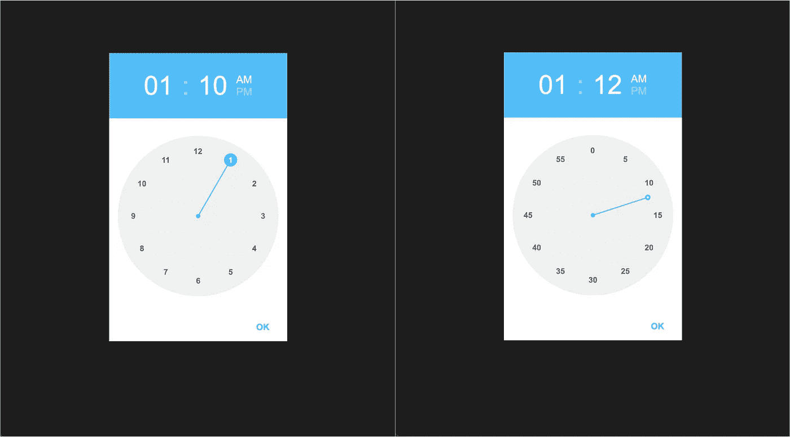
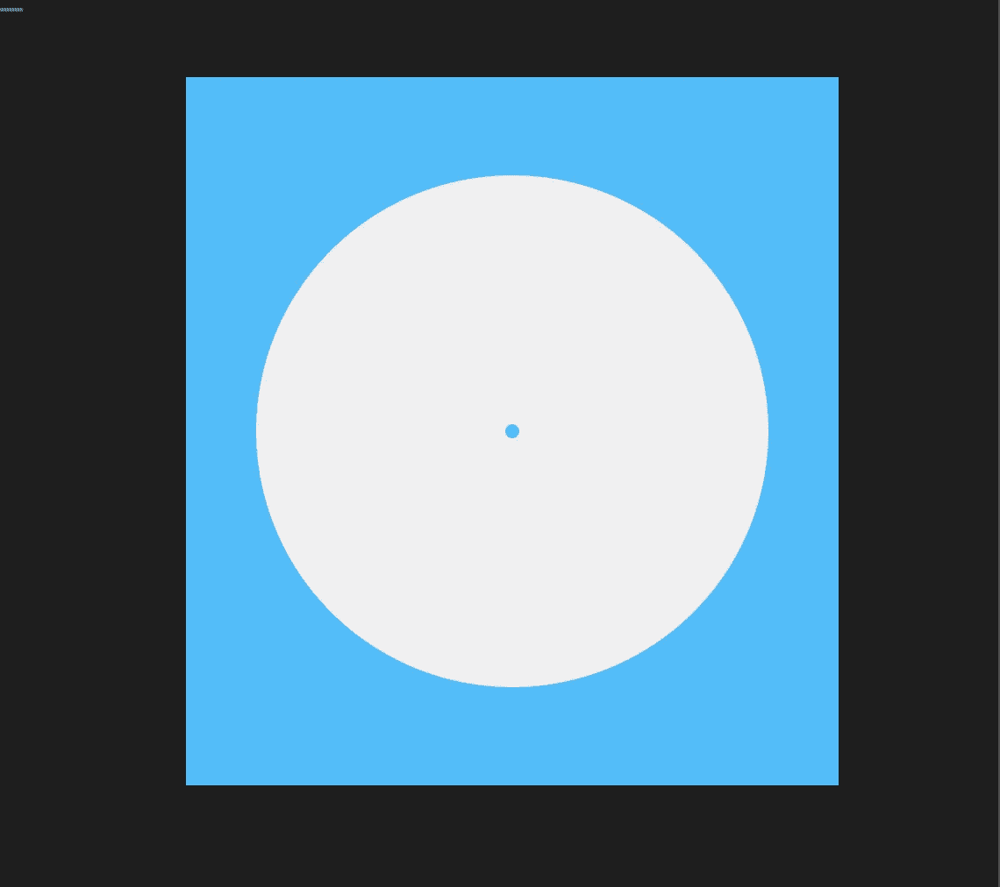
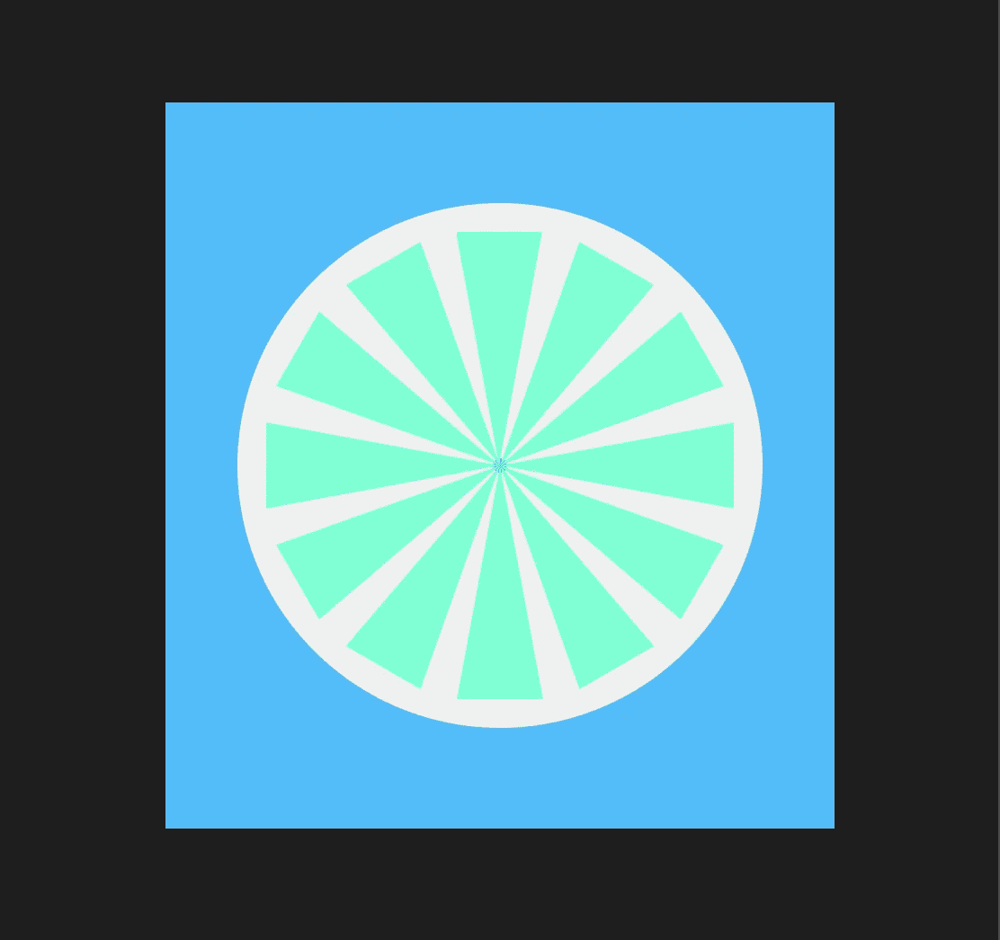
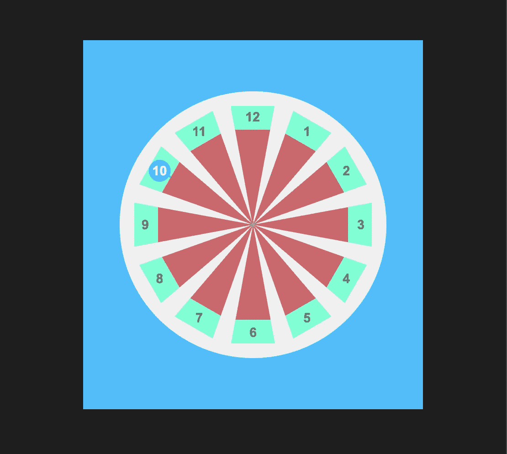
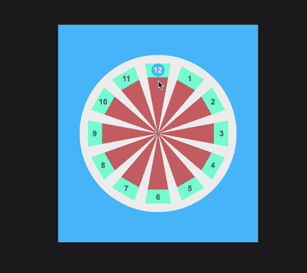
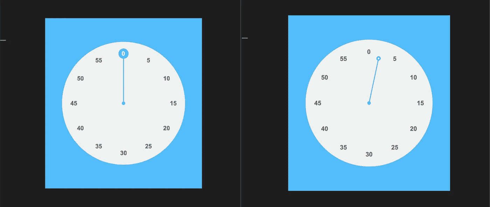
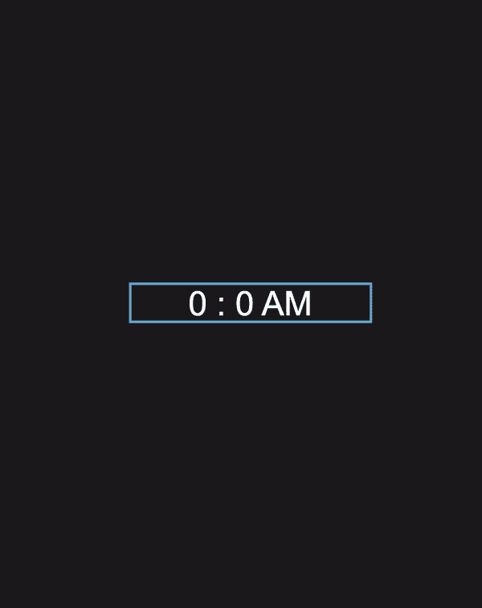

# 我如何以及为什么在 Angular 中从头开始创建 Android 风格的时间选择器

> 原文：<https://levelup.gitconnected.com/how-and-why-i-created-android-style-time-picker-from-scratch-in-angular-d747cb5bdf36>

# 简介和动机

这篇文章主要是一步一步的指导你从零开始构建一个角度风格的时间选择器。但是我想谈谈为什么我们需要重新发明轮子。简单的答案是边做边学。这一切都始于我脑海中的一个问题“如何像时钟一样在一个圆内定位元素”。令我惊讶的是，我们有 [**shape-outside**](https://css-tricks.com/almanac/properties/s/shape-outside/) 属性，它将内容包装在一个圆的外面，但没有什么东西可以在里面包装内容。就像蝴蝶效应一样，事情最终让我有了时间选择的要求，我决定自己做一个。我从这种方式中学到了很多，我想与社区分享。如果你把它当作一个挑战，自己建立一个，并在评论中贴上链接，我会很感激。事不宜迟，我们重新发明轮子吧！

# 逐渐地

我们的第一项行动是创建一个小时拨号。从高层次上看，我们将创建一个圆形 div，在其中，我们将创建 12 个大小相等的扇区，每个扇区代表一个小时，并循环排列它们。

下面是一个小的样板代码。

现在是第一部分。在圆内添加 12 个扇区，并将它们放置在一个圆内。

每个扇区都是使用**和*创建的。拨号盘*** CSS 类。在 TS 文件中，我们创建了一个名为 ***hoursWheel*** 的数组，并存储了所有的小时值。在 HTML 文件中，使用 ***ngFor*** 我们在我们的圆( ***)内创建了 12 个扇形 div。拨号盘*** )。

我们使用 CSS 变量为每个 div 分配唯一的值。—I]HTML 中的属性绑定。最后，我们通过 transform 使用 CSS 中该变量的值来旋转扇区。由于有 12 个扇区，每个扇区将获得 360/12 = 30 度的空间。要记住的一点是将变换原点从中心改为底部中心。我使用 ***剪辑路径*** 和扇区只是为了演示的目的。在最后阶段，我们将删除剪辑路径的风格，并留下他们作为透明的矩形组合成一个圆圈。

这些扇区对于检测用户选择哪个小时是有用的。例如，如果用户将鼠标悬停在特定区域内的任何地方，我们将突出显示所选择的小时。在每个扇区内，有三个部分:小时值，荧光笔，以及连接所选小时和表盘中心的线条。

创建一个名为 ***selectedHours*** 的变量，它将存储所选择的小时值。我暂时将该值设为 10。在 HTML 中，我们为每个扇区添加了 ***扇区线*** 、 ***扇区值*** 、 ***扇区选择器*** divs。 ***扇区线*** 和 ***扇区值*** 的活动样式只有在该扇区的索引等于 ***选择的小时*** 变量时才会显示。在 ***sector-val*** 类中，我们通过应用变换来旋转 div。这是必要的，因为由于 ***dial-sector*** 是 ***sector-val*** 的父级，我们旋转了父级，里面的内容也会旋转，因此文本值也会旋转。我现在给*到 ***扇区选择器*** 。接下来，我们将添加鼠标事件处理程序来突出显示用户选择。*

# *让我们开始行动吧*

*要选择一个值，用户必须**点击鼠标左键**，然后当**用户在刻度盘**内时，如果他们**悬停在特定的扇区**内，我们将高亮显示该扇区。一旦用户**释放鼠标键**，我们将锁定选择。*

*有一个选择值的机制。下面是用户动作到鼠标事件的简单映射。*

*点击鼠标左键:***【mousedown()***
在表盘内:***mouseenter()***
悬停在某个扇区内: *mouseover()*
释放鼠标键: ***mouseup()****

*因此，要选择一个值，用户必须**点击鼠标**，**进入刻度盘**，**悬停在所需值上，**和**释放鼠标**。*

**

*我在 Wheel 内部创建了两个新变量*:当我们进入刻度盘时，我们将它设置为 true，当我们离开刻度盘时，我们将它设置为 false。 ***wheelClicked*** :我们在点击鼠标的时候设置为 true，如果松开鼠标则设置为 false。**

**当鼠标在转盘内时， ***mouseEnter*** 方法将被调用，并将 ***insideWheel*** 值设置为 ***true*** ，单击时， ***mouseDown*** 方法将被调用，并将被单击的***wheel***设置为 ***true*** 。如果我们松开这个键， ***mouseUp*** 将被调用，而 ***wheelClicked*** 将被设置为 ***false*** 。如果我们走到拨号盘外， ***mouseExit*** 将被调用，并将 ***insideWheel*** 设置为 ***false*** 。当我们悬停在任何扇区上时，将调用 ***mouseOver*** 方法，我们将传递我们要更改的变量的名称(“selectedHour”)和要更改的值(“I”)。传递变量名是有原因的。我们还将创建一个分钟表盘。在那里，我们将发送设置分钟的变量。所以我们可以在那里重用这个方法。 ***mouseOver*** 方法将使用我们发送的索引设置 ***selectedHour*** 变量，前提是 ***insideWheel*** 和 ***wheelClicked*** 为真，这意味着鼠标被按下并且指针在刻度盘内部。否则，该值不会改变。还有***selectByClick***()方法。如果用户单击一个小时数来设置值，而不是单击鼠标、悬停并在特定位置释放，则使用此方法来设置值。**

**当我们点击并悬停时，该动作被认为是默认选中的。当我们选择一个值时，浏览器将启动选择并选择文本。为了防止这种情况，我们在 HTML 中为 ***mousedown*** 事件返回 false 以防止默认行为。**

**我们完成了时间选择器的制作。缺少的部分是创建另一个分钟选择拨号，主要是重复上述步骤，并添加一个过渡到打开时间选择器点击图标或按钮或其他东西，并在选择小时，打开分钟拨号选择分钟。**

# ****不再等待分钟****

**我不会深究会议记录部分。我将粘贴代码，并给出一些概述和总结。**

****

**我添加了 ***minutesWheel*** 数组来存储要显示的值，并添加了 ***selectedMinute*** 变量来存储所选分钟的值。这些变化主要出现在 HTML 文件中。与有 12 个扇区的小时表盘相比，这里有 60 个扇区。所以我减少了每个部分的宽度，只显示了 5 的倍数的分钟，其余的用一个小圆圈表示。之前我们讨论过 ***剪辑路径*** 最后我们会移除它，在这里。如果我们保持剪辑路径属性，选择器气泡将不会是一个圆。你们自己试试。**

# **了结未了结的事情**

**我们做了核心部分。现在是大多数人拖延的时候了。我将用尽可能少的细节来完成这一部分。**

**首先创建一个触发器来打开时间选择器。首先显示小时刻度，选择小时后，显示分钟刻度。始终在刻度盘和控件的顶部显示选定的值以选择 AM 或 PM，并在底部添加一个按钮以关闭时间选择器。**

****

**瞧啊。**

# **Farewell🥳🎉**

**我希望你会同意重新发明轮子的思想。我们做了一些了不起的事情，这才是最重要的。一路上我们学到了很多。我期待着看到人们把这作为一个挑战，做出他们的版本并与我们分享。记住总有改进的空间。**

**查看下面的参考资料，稍后见。**

**github:[https://github.com/kumararduino/mat-time-picker](https://github.com/kumararduino/mat-time-picker)**

**现场演示:[https://angular-mat-time-picker . stack blitz . io](https://angular-mat-time-picker.stackblitz.io)**

# **分级编码**

**感谢您成为我们社区的一员！[订阅我们的 YouTube 频道](https://www.youtube.com/channel/UC3v9kBR_ab4UHXXdknz8Fbg?sub_confirmation=1)或者加入 [**Skilled.dev 编码面试课程**](https://skilled.dev/) 。**

** [## 编写面试问题+获得开发工作

### 掌握编码面试的过程

技术开发](https://skilled.dev)**