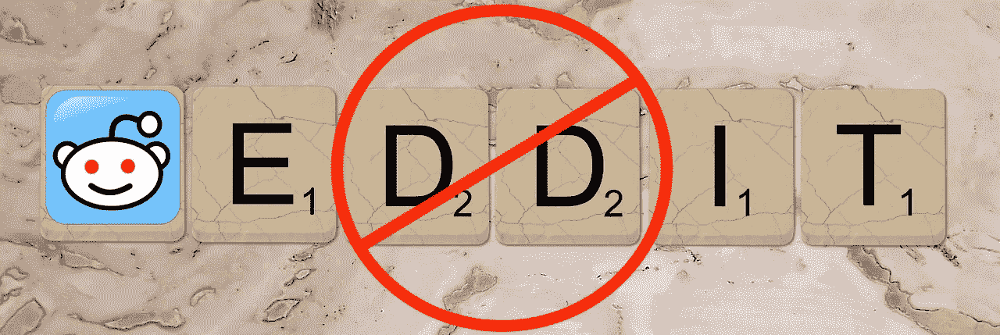
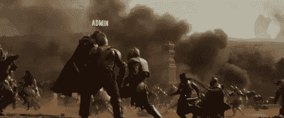
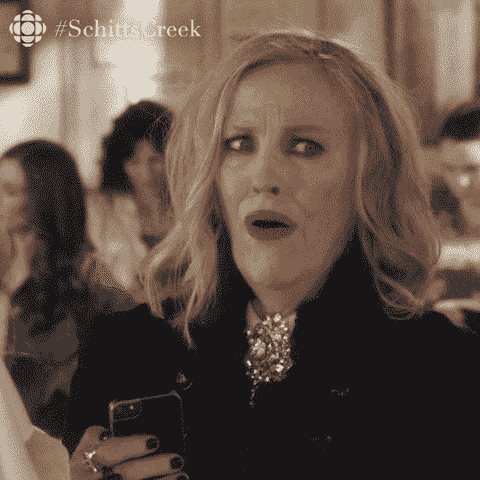
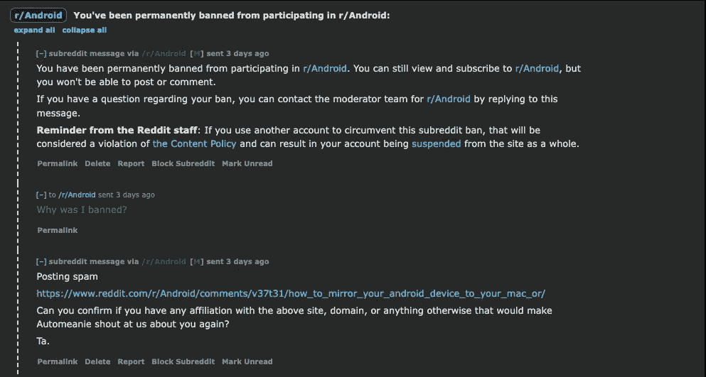
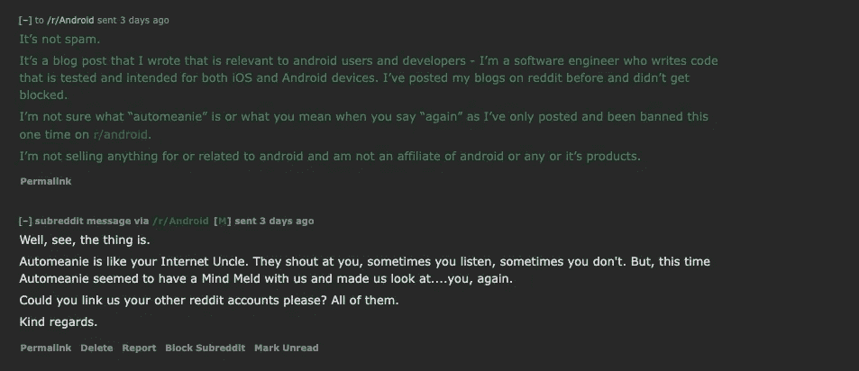
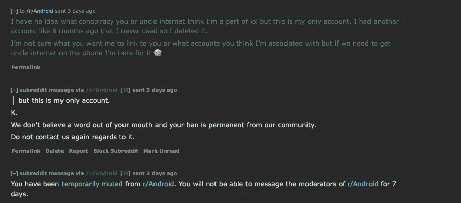
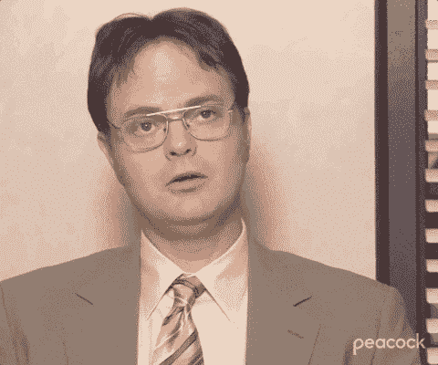
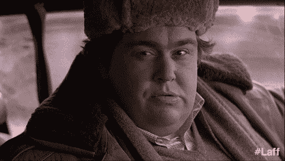

# 我是如何(为什么)在 Reddit 上被封禁的

> 原文：<https://levelup.gitconnected.com/how-and-why-i-got-banned-on-reddit-c5cd21246acf>

## 第二次有魅力吗？

图片来自 [Pixabay](https://pixabay.com/?utm_source=link-attribution&utm_medium=referral&utm_campaign=image&utm_content=1007072) 的[凯文·菲利普斯](https://pixabay.com/users/27707-27707/?utm_source=link-attribution&utm_medium=referral&utm_campaign=image&utm_content=1007072)，由我编辑。

写完博客后，我通常会在社交媒体上分享。

Instagram，Twitter，LinkedIn，Quora，当然还有 Reddit。在社交媒体上分享后，我通常会进行一定程度的互动。人们评论、喜欢等。

我最近为 [gitconnected](https://medium.com/u/7c701b439582?source=post_page-----c5cd21246acf--------------------------------) 写了一篇关于[如何通过 AirDroid 免费(无线)](/how-to-mirror-your-android-device-to-your-mac-or-pc-for-free-4aa13e578df0)将你的 Android 设备镜像到 mac 或 PC 上的博文。所以，我想分享它的一个好地方是 r/android 线程。我以前在其他线程上分享过帖子。

但这次，我被禁赛了。

我甚至从未在任何其他社交媒体平台上删除或以任何方式报道过我的内容，更不用说我被禁止了。

在 Reddit 上，我已经被 ***禁止*** 跟帖了…两次。

第一次是在我分享了一篇关于我写的[为什么科技招聘人员喜欢和你通电话](/why-software-recruiters-want-to-talk-on-the-phone-42e977d2f093)的帖子之后。我在 [r/tech](https://www.reddit.com/r/tech/) 里贴的。两个人评论道。

有人说，在你要求科技招聘人员提高薪水后，他们可能不会跟进。

另一个人认为这个帖子是“音盲”。

不是一个很好的接待，但总的来说没有什么太消极或严重的。我很乐意回应这两条评论。当我尝试回复时，我收到一条消息，说我无法发布。

奇怪？也许我的连接不好？我转到了数据。

没什么。

我又切换回 WiFi，再试了一次。

同样的错误。

在第三次尝试失败后，我注意到我收到了 r/tech 某个人的 DM，说我被永久禁止了。下面是对应关系。

绿色是我的回答。

如你所见，我听从了他们的建议，试着回复信息并联系了一个版主。我认为这是一个简单的误会，很乐意合作。

大约两个星期了，我想他们不会给我回复。

尽管他们没有提供任何理由，这很令人恼火，但这并没有让我太恼火。Reddit 的许多审核都是自动化的。

众所周知，包括 LinkedIn 在内的所有平台的自动审核并不总是公平的。我不会把它当成个人问题，我也不太依赖或接触 r/tech，所以我没有被解除禁令的压力。

***第二次*** 我却被封杀了，真是一见钟情。

写完[这篇文章](/how-to-mirror-your-android-device-to-your-mac-or-pc-for-free-4aa13e578df0)后，我想我已经在一个帖子中分享了它，可能会有一些观众对这些信息感兴趣。

像 [r/android](https://www.reddit.com/r/Android/) 这样的受众。

这一次，在我被禁止之前，没有人能够发表评论。相反，我收到了与第一次禁赛相似的信息，我想，嗯，还不如问我为什么被禁赛。最坏的情况是我被鬼上身了。

男孩，我错了。

以下是我和一位版主之间的一系列信息中的第一条。这真是……过山车。

他们声称我在发垃圾邮件。他们链接我的帖子，问我是否与它有关联，网站，域名等。是的，我会说我在某种程度上“隶属于”一个从我的账户上发布的帖子，这个帖子分享了我写的一篇博文…*。*

*它没有抄袭，没有安卓赞助，也没有任何垃圾邮件。实际上只是分享一篇我写的关于我学到的东西的博文。我在大赦国际已经做了几年了。*

*他们还问“Automeanie”是否还会对他们“大喊”什么。*

*当时，我不知道那是什么。我也不确定他们说的“再次”是什么意思，因为这是我第一次听说。他们的反应是…神秘的…至少可以这么说。*

**

*他们声称 Automeanie 是对我大喊大叫的“网络大叔”。有时候我会听。有时候我不知道。*

*嗯， *OK* ？*

*在被封杀之前我真的没有机会听。显然，网络大叔有一个*头脑融合*(有点戏剧性，但似乎符合版主的个性)，这个版主让他们看起来“…我，增益。”*

*对不起，*什么*？*

*他们认为我有其他的 Reddit 账户(虽然我没有，但实际上是允许的)。为了透明起见，我提到我曾经有另一个账户，我从来没有真正使用过(我碰巧用错误的电子邮件地址登录过一次)，所以我在 6 个月前删除了它，也许更久。*

*另一个账户没有相关的限制、禁令或报告。我把这一切都告诉了他们。除了那一个，我没有别的了。下面是最后一封信——包括我对上图的回应。*

**

*我承认我的反应不是最成熟的。我觉得整件事很好笑，还有点讽刺。我觉得如果我有礼貌的话会有什么改变吗？*

**

*事后看来，像这样的事情，礼貌通常比讽刺更适合你。我受宠若惊。尽管我做出了回应，但他们的回应更奇怪。*

*首先，他们用 k 打我。*

**

*没有人喜欢这种回应，也没有人会说出来，除非他们很受伤，很小气。*

*其次，他们说他们“不相信我说的任何一句话。”*

**戏剧性*再得五分。*

*他们告诉我，我被永久禁止，不能联系他们。总的来说，r/android 不是一个我经常访问或从中获得很多价值的线程。*

*我会活下去。*

*尽管如此，被禁止参加任何活动还是有点令人沮丧。所以这就引出了一个问题，*我是怎么被封杀的*？让我们回到 Automeanie。*

## *汽车(即 HOW)*

*Automeanie 本质上是 AutoModerator 的另一个名字，这是 Reddit 提供的一个工具，允许版主自动审核他们的线程。当线程变得相当大时，由于需要筛选的内容越来越多，个人审核会变得更加困难。*

*如果使用得当，AutoModerator 不仅可以成为版主的有效调节工具，还可以成为被调节者的教育工具。它可以鼓励用户贡献更好的内容，也不会因为轻微的过错而受到严厉的惩罚。*

*对我来说不幸的是，我是方便而不是清晰的接收者。*

> *我写了一篇关于 Automeanie 是什么以及如何使用它的更深入的文章。你可以点击查看[。](/what-is-automeanie-aka-automoderator-on-reddit-a54177f0e18e)*

*既然我们已经知道怎么做了，那就让我们最后谈谈为什么我会被禁赛吧。*

## *最后，是为什么*

*我有两个理论。*

*首先，我在标题中使用的措辞可能被**错误地**过滤为*垃圾邮件或点击诱饵*。AutoModerator 允许版主定义规则来检查帖子是否包含某些单词或短语。基于这些单词或短语，版主可以告诉 AutoModerator 如何处理它。*

*在我的[auto modator 帖子](/what-is-automeanie-aka-automoderator-on-reddit-a54177f0e18e)中，我展示了一个例子，其中一个规则发现包含“提示”和/或“技巧”的帖子，并将其删除，因为它被认为是 clickbait。类似的事情可能发生在我的帖子上，因为它包含了“免费”这个词。*

*是为了引起用户的注意吗？*

*绝对的。*

*我喜欢人们读我写的东西。提到它与文章和文章主题是免费相关的吗？*

*当然了。*

*我在帖子中使用这款应用的部分原因是因为它是免费的。有很多应用程序可以完成文章标题中描述的任务，但也需要花钱。*

*我找到一个免费的。*

*我不想让其他开发者像我一样筛选购买应用，我想节省他们的时间，向他们展示免费产品。*

*这篇文章的重点是提供信息、教学，并且*具有成本效益*。*

*尽管如此，我猜想，由于我的标题包含“免费”在所有的大写字母，一些稀疏定义的规则可能会称之为垃圾邮件或点击诱饵。更糟糕的是，我的帖子根本不是点击诱饵。*

*首先， [clickbait](https://edu.gcfglobal.org/en/thenow/what-is-clickbait/1/) 意在煽情。"点击诱饵标题通常不是呈现客观事实，而是吸引你的**情感和好奇心."**虽然我的标题包含了一个吸引人的词*，但这确实是事实*。我正在指导的产品是免费的。*

*第二，clickbait 的目的是让用户查看大量令人困惑和侵扰性的广告。广告的浏览量越多，网站的收入就越多，你访问的内容就越多。*

> *Medium 没有广告。*

*我是否希望人们看到我的作品，在 here 和其他平台上与我联系？*

*我当然知道。这就是博客的基本内容。*

*我不认为这是恶意或错误的，或者应该被视为垃圾邮件。帖子也有价值。*是教程*。*

*我确实从用户互动(鼓掌、评论等)中获得了经济利益。)，而不仅仅是点击量。生产有价值的内容被奖励有错吗？*

**

*这让我想到了我的第二个理论。*

## *我的会员链接*

*我的猜测是 AutoModerator 没有找到这个，但我认为如果以某种方式检测到它，它可能会被视为 clickbait。在每篇帖子的底部，我都有一个会员链接，以防有人想升级到中级会员帐户，这样他们就可以看到更多内容。*

*Medium 这样做是因为他们不投放广告。*

*他们的反广告模式意味着他们需要寻求一种更为审慎的收入形式——出售会员资格。当有人注册了我的会员链接，我会得到一些钱。*

*在每篇帖子(包括这篇)的底部，我都有一个包含链接的注释。我特别声明这是一个附属链接，并对使用它的人表示感谢。*

**你不一定要弄一个。**

*这是我为自己创作的内容获得少量报酬(每月约 2 美元)的一种方式。*

## *仍然未知*

*我仍然不确定为什么他们认为我有多个账户。*

*他们对此提出了重大异议，但没有提供证据来支持他们的主张。即使他们发现了一个他们认为和我相似的账号(或者多个账号)，为什么不分享给我？那些账户也被盯上了吗？*

*在 Instagram 上，有时你会收到来自一个新个人资料的好友请求，该资料使用了你认识的人(或你不认识的人)的照片，并带有一个链接，指向他们的“私人内容”之类的内容。*

*但是受到惩罚的不是原始帐户，而是垃圾邮件帐户。我在 Reddit 上有将近 2800 个 karma 这对于一个垃圾邮件账户来说并不典型。这又引出了一个问题…*

*他们为什么不告诉我或与我分享他们认为是我的账户？*

*快速讨论，我可以证明我，事实上，不是垃圾邮件，没有多个帐户。*

*但是没有。*

*他们没有负责任地使用 AutoModerator，而是决定对我进行审查，就此打住。*

*这就是生活。*

*你认为我的禁令合理吗？你被 Reddit 上的自动调节功能盯上了吗？其他网站？*

*请在评论中告诉我！*

*[***升级您的免费 Medium 会员资格***](https://matt-croak.medium.com/membership) *，就能收到各种出版物上数千名作家的无限量、无广告的故事。这是一个附属链接，你的会员资格的一部分帮助我为我创造的内容获得奖励。**

**您也可以通过电子邮件* [***订阅，每当我发布新内容时，您都会收到通知！***](https://matt-croak.medium.com/subscribe)*

# *参考*

* [## 如何免费将 Android 设备镜像到 Mac 或 PC 上！

### 借助一个快速易用的应用程序

levelup.gitconnected.com](/how-to-mirror-your-android-device-to-your-mac-or-pc-for-free-4aa13e578df0)  [## 为什么科技招聘人员喜欢打电话

### 如何避免成为另一个“这可能是一封电子邮件”的陈词滥调

levelup.gitconnected.com](/why-software-recruiters-want-to-talk-on-the-phone-42e977d2f093)  [## 研究/技术

### r/tech :/ r/tech 的目标是提供一个空间，致力于智能讨论创新和变化…

www.reddit.com](https://www.reddit.com/r/tech/)  [## 我刚刚被 LinkedIn 封禁了(第六次)

### 拥有 LinkedIn 个人资料的每个人都必须阅读的课程

medium.com](https://medium.com/swlh/i-just-got-banned-from-linkedin-for-the-6th-time-697babe24d61)  [## r/Android

### r/Android: Android 新闻、评论、技巧和关于根、教程和应用的讨论。关于…的一般性讨论

www.reddit.com](https://www.reddit.com/r/Android/)  [## Reddit 上的 Automeanie(又名 AutoModerator)是什么？

### 它是怎么让我被禁的？

levelup.gitconnected.com](/what-is-automeanie-aka-automoderator-on-reddit-a54177f0e18e)  [## 现在:什么是 Clickbait？

### en/thenow/what-is-Reddit/content/如果你在互联网上呆过一段时间，你可能已经看过一些文章和图片…

edu.gcfglobal.org](https://edu.gcfglobal.org/en/thenow/what-is-clickbait/1/)*