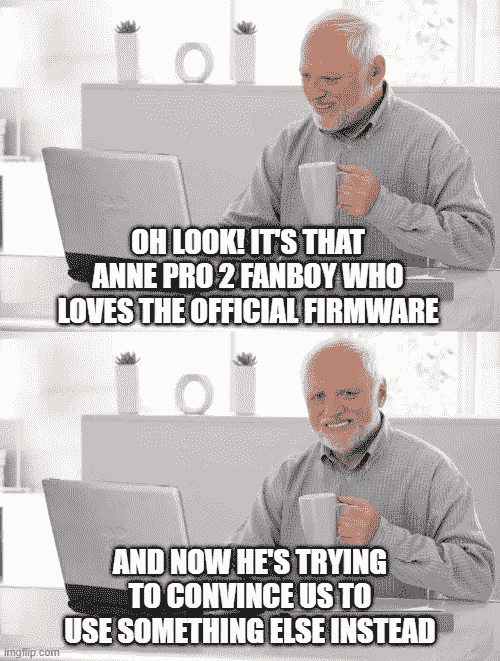
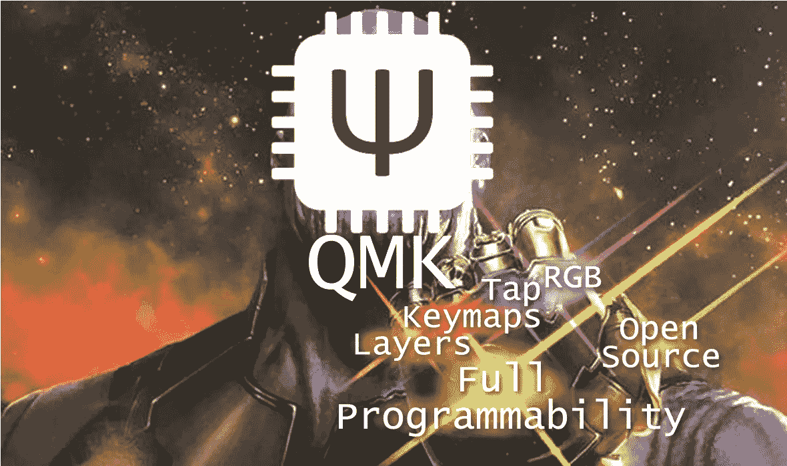
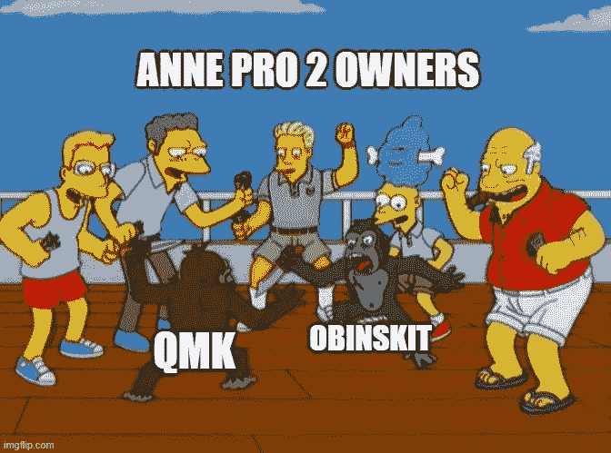
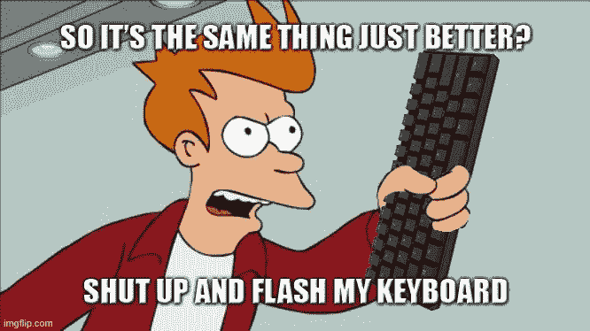

# Anne Pro 2(由 QMK 支持)如何进一步改变我的工作流程

> 原文：<https://levelup.gitconnected.com/how-anne-pro-2-powered-by-qmk-changed-my-workflow-even-further-82390b9a9422>

## 或者 QMK 开源固件如何为我的日常驱动程序释放更多的能量

一年前，我写了一篇文章，讲述了 Anne Pro 2 (AP2，从现在开始)通过允许我完全自定义所有键，使我可以轻松访问甚至难以触及的键，而不必将手从主行移开，这要归功于它的 ObinsKit 固件。这一次，我将展示 QMK 如何将所有这些提升到一个全新的水平。

这是一个很好的观点……但是再忍耐一下，一切都会变得有意义。

*免责声明:https://openannepro.github.io/没有正式支持 QMK，但是一些神奇的人超过了***设法非正式地移植了它。根据我的经验，它运行得非常好，但请记住，这是一个处于早期阶段的开源项目，由志愿者管理，没有得到 Obins (AP 2 制造商)或任何其他公司的支持。有一些粗糙的边缘，进展可能受限于贡献者的空闲时间——但是如果你有必要的技能，你总是可以自己帮助这个项目。**

*但是你们中的一些人可能想知道:QMK 到底是什么？最重要的是，我为什么要在乎？*

# *认识一下 QMK！键盘定制的圣杯！*

**

*QMK 和 Infinity 特性:图层、键映射、Tap、RGB、开源和完全可编程性。*

*好吧，这听起来可能有点言过其实(很可能是)，但关键是:QMK 是最好的机械键盘固件之一，也是我所知道的最好的。现在，如果你想知道什么是键盘固件，那就把它想象成运行在你的键盘内部的软件，而不是运行在你的键盘所连接的设备上(比如你的电脑)。*

*对于机械键盘爱好以外的人来说，这听起来可能很奇怪，因为大多数预建的键盘模型(包括一些主流的机械键盘)只允许你下载软件来管理键盘，而不是直接更新固件。但是对于定制的机械键盘和许多预建的键盘(如 AP2 本身)来说，允许你更新固件(通常使用一些软件作为 GUI)是很常见的。*

*更新固件而不是只处理软件的一个好处是，你所做的更改将在你插入或配对键盘的任何地方生效。这意味着，如果您将 CAPS LOCK 键设置为固件上的 CTRL 键，那么无论您在哪里使用它，它都将起作用，而不需要设备上的任何特殊软件。*

*有许多机械键盘的自定义固件，包括一些特定于供应商或型号的固件(如 AP2 官方固件 Obinskit)和一些开源固件，如我在这里重点介绍的 QMK 固件。QMK 代表 Quantum Mechanical Keyboard，是一个开源项目，最初从 TMK(另一个开源键盘固件项目)派生出来，并在那里进行了大量修改。该项目包括不同的产品，如 QMK 固件、QMK 配置器和 QMK 工具箱。目前(截至 2021 年 4 月)，只有 QMK 固件被移植到 AP2。这些变化还没有被合并回正式的 QMK 回购协议，所以它们暂时是在[https://github.com/OpenAnnePro/qmk_firmware](https://github.com/OpenAnnePro/qmk_firmware)回购协议上进行的。*

**

*QMK 带来了在大多数键盘固件上通常无法实现的定制水平。您可以将每个键重新映射到您喜欢的任何其他键，并使用不同的层来映射不同的功能。您还可以将同一个键映射到任何层上，以获得不同的操作，无论您只是点击它还是按住它。此外，您还可以从 QMK 控制 led(当与 Shine 一起使用时)。*

**

*嗯，官方固件有这些功能…有点。我的意思是，Obinskit 已经有可编程的键、多层和 tap 功能，但不是 QMK 的方式。AP2 本身甚至有 2 个额外的层，比大多数预建的 60%键盘都多，但 QMK 的限制是 32 层(尽管我承认我没有测试过超过 6 层)，QMK 上的 tap 功能是另一个层次。一个证明我的观点的例子是，在 QMK 上，如果你点击然后按住一个点击按钮，它会像你按住它一样不断地发送点击动作，而不是激活保持动作——这样你就可以通过点击并按住右 shift 键来保持向上箭头键。*

*然后有些事情在 AP2 的股票固件上是不可行的。要激活 AP2 上的一个层，您必须在想要激活该层时按住层键。在 QMK 上，您可以以同样的方式映射层键，但您也可以映射一个键来打开和关闭该层，这样您就不必一直按住该键，您甚至可以将层键映射为临时保持和点击切换(如果您按住它，它将仅在您释放之前处于活动状态，如果您点击它，它将处于活动状态，直到您再次点击它)。*

*如果你愿意尝试更高级的功能，你可以跳踢踏舞(基本上在同一个键上有不同的动作，无论你点击它，按住它，点击然后按住它，点击它两次，点击它两次并按住它等等)，甚至设置你的键盘来控制鼠标光标，因为你可以。但在下一节中会有更多关于每种方法的利弊的讨论。*

# *QMK vs obin skit——或者为什么你应该关心你是否有一个 Anne Pro 2*

**

*因为伟大的爱好带来伟大的战争。*

*好了，现在你知道什么是 QMK，并且已经体验了它有多棒，让我们将它与 AP2 的股票固件进行比较。*

## *赞成的意见*

***改良层系统。**使用 QMK，您可以拥有多达 32 层，每层都有自己的按键布局。此外，您可以切换层以及临时激活它们。*

***更高级的可编程性。**在 Obin 的固件上，你可以将任何动作映射到任何按键，并设置一些宏，但在 QMK 上，你可以对任何按键进行编程，做任何你想做的事情，包括与 led 互动。这就是我如何让我的层在一个层激活时显示一种纯色(每层一种颜色)，这样我就可以快速反馈我刚刚在 tap dance 上激活了哪个层。*

***开源。**对于一个开源新手来说，这可能不是什么重要的事情，但我想要的键盘功能目前还不被 Obin 的固件支持。由于是开源的，QMK 给了你自己做这件事的可能性——我已经用这种方式自己根据当前图层特性编码了 LED 颜色。现在代码已经合并到回购协议中，其他人也可以使用它，并进一步改进它。*

***更高级的 tap 功能。即使 Obin 的固件有 tap 支持，它也比不上 QMK 的实现。踢踏舞的特色是一个全新的水平。为了说明它的灵活性，我的 CAPS LOCK 目前映射到:***

*   *单击:充当 ESC 键；*
*   *按住:激活我的箭头层(HJKL 成为关键就像在 VIM)直到释放；*
*   *双击:如果有任何切换层，禁用它。如果没有，则充当两次 ESC 键；*
*   *双击并按住:激活我的数字小键盘层(现在位于我右手休息的地方)。*
*   *三次点击:打开和关闭鼠标层(因为我可以)。*
*   *按住三次:激活鼠标层，直到释放。*
*   *四键:打开和关闭数字小键盘(当我处理工作表时非常有用——我甚至将箭头键映射到 ESDF，这样我就可以在只有这一层活跃的情况下执行大多数工作表任务)。*

*我还在空格键上使用了更简单的 LT 功能，当按住它时会激活一个层，点击它会发送一个普通的空格。这样，如果我正常按下它，它就像一个空格键，但如果我按住它，我的导航键(Home、End、Page Up 和 Page Down)也在 HJKL 上。这样，我可以用左手按住 CAPS LOCK 键，双击它并按住或按住空格键，然后用右手访问箭头、数字小键盘或 home、End、Page up 和 Page down 键，而无需将它们从 Home 行移开。*

*这看起来很像我在 ObinsKit 上使用的设置，但是现在我在右手上有了一个数字小键盘(这让我的肌肉记忆很开心),通过使用空格键，我可以恢复 windows 的左键。*

**

*不过，在你决定加入 QMK 之前，你可能要考虑下面的缺点。*

## *骗局*

*仍处于早期阶段……算是吧。在许多领域，社区支持已经相当成熟，目前也相当稳定。但是仍然有一些领域如蓝牙仍然需要改进(顺便说一下，欢迎帮助)。*

***蓝牙还没有完全集成。**大多数键盘已经可以很好地与蓝牙上的 QMK 配合使用。但是有一些东西，比如媒体密钥，尽管它们在本地固件上运行良好，但还没有完全移植到 QMK 上，至少在撰写本文时是这样。一些功能，如通过蓝牙用键盘控制鼠标，目前在蓝牙上无法实现(目前 QMK 端口不覆盖蓝牙固件，因此默认情况下，它将使用其上闪存的蓝牙处理器的最新版本)。*

***拆分应用和 LED 逻辑。**AP2 的 QMK 端口具有不同的应用固件(键盘映射等由 QMK 控制)和 LED(LED 由 Shine 固件控制)。这使得一些功能，如动态效果更加复杂，因为你必须序列化两个固件之间的消息。*

***暂时没有基于 GUI 的配置。QMK 有一些 GUI 来支持键盘的配置，而不需要直接编码。但是 QMK 的 AP2 端口目前还不支持这些图形用户界面，所以您必须编写代码来定制键盘以满足您的需求。***

***整体体验不如奥比斯基“新手友好”。说实话，我认为 ObinsKit 是一个非常棒的固件，很大一部分原因是因为它对新手来说配置起来非常简单。另一方面，QMK 需要一些基本的编程技能，并且对命令行有一些基本的了解。***

# *考虑*

*QMK 是一个非常棒的项目，在 AP2 上运行它的功能版本肯定会打开许多大门。但请记住，在目前的状态下，该项目并不那么新手友好。另一方面，Obinskit 对用户友好得多，本身也非常强大。*

*我通常建议任何刚接触机械键盘、拥有 AP2 键盘的人首先尝试一下 Obinskit，这是一种更容易、更友好的方式来习惯定制键盘的想法。在你对你想要的键盘行为有了一个清晰的想法之后，也许值得一试一下 QMK，看看它是否更适合你。*

*也就是说，我再也看不到自己回到奥比斯基了。我喜欢它的 GUI，喜欢它进行更改是多么简单，但是 QMK 允许的踢踏舞功能和层数目前是我的一个必需功能——我无法想象自己使用一个不允许我作为日常司机使用导航键和右手数字小键盘的键盘。*

*总结一下:*

> *如果你有任何编码经验，并且想释放 60%键盘的全部能量，QMK 肯定值得一试。另一方面，如果你正在寻找一个易于使用和配置的漂亮键盘，Obinskit 可能是一个更好的选择。*

## *参考*

*我之前关于 AP2 的文章(QMK 之前)
[Anne Pro 2 机械键盘如何彻底改变我的工作流程|作者 Thomaz Moura | Medium](https://medium.com/@thomaz.moura/how-the-anne-pro-2-mechanical-keyboard-completely-changed-my-workflow-e795f1f62026)*

*打开 Anne Pro 页面(QMK 的 AP2 端口，页面):
[首页—打开 Anne Pro](https://openannepro.github.io/)*

*安装教程:
[如何安装—打开 Anne Pro](https://openannepro.github.io/install/)*

*qmk 端口本身的 Github 页面:
[GitHub—OpenAnnePro/QMK _ firmware:Anne Pro 2 的 QMK 端口](https://github.com/OpenAnnePro/qmk_firmware)*

*Shine 的 Github 页面(使用 QMK 控制 LED 的固件)
[GitHub—OpenAnnePro/Anne Pro 2-Shine:Open Anne Pro 2 QMK 端口的定制 LED 矩阵固件](https://github.com/OpenAnnePro/AnnePro2-Shine)*

*QMK 参考(对制作你的键映射有用):
[构建你的第一个固件(qmk.fm)](https://docs.qmk.fm/#/newbs_building_firmware)*

*我的 QMK 键图(你可以用它作为一个例子来获得你的键图的想法):
[QMK _ firmware/key map . c at keyboard-Anne pro 2 openanne pro/QMK _ firmware GitHub](https://github.com/OpenAnnePro/qmk_firmware/blob/keyboard-annepro2/keyboards/annepro2/keymaps/thomazmoura/keymap.c)*

*ObinsKit (AP2 官方固件)下载(英文版):
[ANNE Pro | Bluttooth 机械键盘 _Annepro2_Obins 官网](http://en.obins.net/obinskit)*

*Anne Pro Dev Discord channel(AP2 QMK 和其他 Anne Pro 相关事物的社区——请记住这不是官方的 Obins 频道，也不是技术援助的地方)
[https://discord.gg/W97Q8xzms2](https://discord.gg/W97Q8xzms2)*