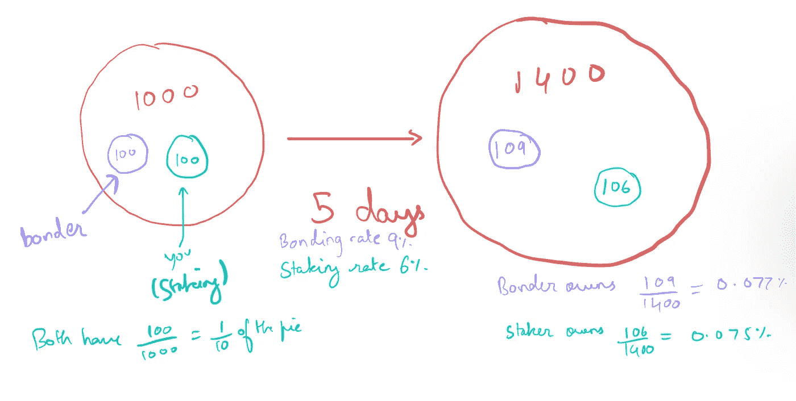
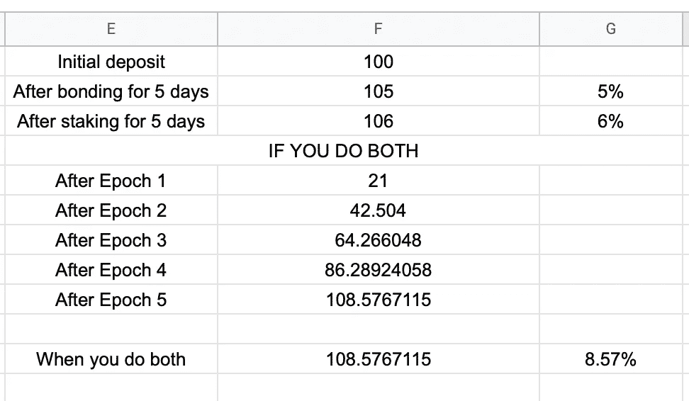

# 加密怎么可能有 100，000%的收益

> 原文：<https://levelup.gitconnected.com/how-are-100-000-gains-in-crypto-possible-c72c235c8c21>

## 什么是 DeFi 2.0

由 Canva Design 创建

是啊！只需下注加密货币，您就可以赚取超过 100，000 APY。更疯狂的是，就在几个月前，这个数字还在 20 万 APY 左右。在你认为我只是在向你乱吐疯狂的数字之前，我要向你解释这一切是如何可能的，你如何能赚取这些疯狂的利率，显然，什么会出错。

当我第一次发现这一点时，我非常怀疑，并在几周内完全忽略了这个项目。我的朋友告诉我这件事，他自己也不明白它是如何正常运作的，所以在我看来这就像一个庞氏骗局。但是奥林巴斯坚持了几个月，它的许多分支，如时间仙境，变得流行起来。所以，我想到把一些钱投入到这些项目中，然后开始了解它们。

什么是比你自己的钱更好的学习动力？

在我们继续之前，我想披露我个人使用过这些平台，但我不以任何形式隶属于它们或得到它们的赞助。这篇文章是基于我对 Olympus 的理解以及它是如何工作的，请分享你的想法，这样我可以完善我的想法。

下面是你将从这篇文章中学到的东西

*   什么是 DeFi
*   DeFi 1.0(流动性挖掘)
*   DeFi 1.0 的问题
*   输入 DeFi 2.0
*   奥林巴斯如何运作
*   APY 是一个幻象

# 什么是 DeFi

如果你没有听说过 DeFi，它代表**分散财政。**

> DeFi 试图复制和增强当前的金融体系，以及我们互动和使用资金的方式

与传统金融不同，DeFi 试图创建一个任何人都更容易接触到的平台。这种可访问性不仅包括基本的金融服务，如贷款、借款、投资等，还为任何人提供了创建自己的金融产品和解决方案的能力。

理论上，DeFi 将为任何人提供互联网连接、获得贷款、借款、投资的机会，以及创造金融产品的能力，并改善/促进现有的金融解决方案，无论他们的人口统计数据、收入或其他因素如何。

与这个定义相反，大多数 DeFi 协议由少数个人控制，实际上并不是**分散自治组织(Dao)**。然而，这些协议中的大多数都渴望在未来成为 Dao。最初，由于管理、激励和后勤方面的困难，任何组织都很难成为 Dao。在我看来，真正的 DeFi 协议应该是 DAO。

# DeFi 1.0(流动性挖掘)

一项资产最基本的功能之一是能够交易另一项资产。为了促进这种交易，我们需要一个中间人或协议来监督和执行这种交易。

在传统环境中，这是由集中交易所(CEXs)完成的，CEXs 是在一个国家注册的组织，由几个董事会成员控制，位于中央服务器上。集中交易所保持某些资产的流动性，他们希望用户能够进行交易，并向用户收取交易费。

我不会详细介绍集中交易是如何运作的，但是如果你对它感兴趣，你可以看看 Sukhad Anand 写的一篇文章

 [## 集中式加密交换实际上是如何工作的？

### 交易实际上是如何发生的？

medium.com](https://medium.com/coinmonks/how-does-a-centralised-crypto-exchange-actually-work-84a574fe0a1) 

我们再去一次去中心化的世界，好吗？

在去中心化的世界里，不存在具有流动性的中央权威。为了获得流动性，这些平台以交易费和与所提供的流动性成比例的免费代币的形式向用户提供激励。这也被称为流动性开采或耕作。流动性通常以 50/50 的比例由两个来自 ETH/USDT 的代币成对提供。接收到的令牌被称为 **LP 令牌**。

这里有一篇关于如何用 DeFi 1.0 赚钱的更详细的文章——

 [## 6 种通过加密获得被动收入的方法

### 牛市可能已经结束，但你的密码仍然可以让你赚钱

levelup.gitconnected.com](/6-ways-to-generate-passive-income-with-crypto-eb02c611e150) 

## DeFi 1.0 的问题

为了激励人们提供流动性，DeXs 引入了农业的概念，但这个概念有几个问题。

*   如果平台停止提供利润丰厚的 LP 令牌，协议可能会失去很多流动性。
*   流动性提供商经常出售 LP 代币，从而影响代币的价格，降低平台的利润。
*   资产价格的突然变动会降低平台的库存价值。
*   当用户存放一对资产时，他们暴露于两者的价格波动。因此，价格变动会导致非永久性的损失，当用户取出他们的股份时，这种损失就会被意识到。
*   智能合约漏洞会导致巨大的损失。(适用于任何 Dapp)

> 非永久性损失是流动性提供者招致的未实现损失。假设我向一个资金池提供流动性，我的股份是 1%。当我拿出我的股份，即 1%时，我将收到分成两个令牌的池的份额。现在，如果这两种代币的价格都下跌，我会蒙受损失！所以我不想在价格低的时候拿出我的股份，这是我的**非永久性损失**，因为我还没有发生它，我有这样做的选择权。

简而言之，DeFi 1.0 吸引了只想要高 APY 产量的农民，一旦 APY 不可持续，他们就会抛售代币以获取利润。因此，整个协议有时间限制，因此是不可持续的。让我们看看 DeFi 2.0 带来了什么。

# 输入 DeFi 2.0

> 需要澄清的是，在 DeFi 1.0 和 DeFi 2.0 之间没有教科书上的区别，twitter 上的人们只是开始把 Oympus DAO 和它的替代品称为 DeFi 2.0。

DeFi 2.0 引入了拥有自己流动性的**协议的概念。我们来分解一下。**

因此，在 DeFi 1.0 机制中，协议需要一种分发 LP 令牌的方法，这样它们可以在最初提供高 apy，并吸引流动性提供商，只要 apy 持续，他们就会坚持下去。在 DeFi 2.0 系统中，存在允许协议拥有其流动性的激励机制，从而不会像 DeFi 1.0 协议那样耗尽流动性。

首先，我们先来看看奥林巴斯是什么，它想要达到的目标是什么。

> 奥林巴斯是一个算法分散的协议，希望成为世界储备货币。为了实现这一目标，它创造了一种叫做欧姆的代币，从长期来看，它应该是一种由其他资产支持的稳定的浮动货币，就像货币由黄金支持一样。

它是怎么做到的？

# 奥林巴斯如何运作

让这一切成为可能的关键因素有三个——**债券**、**国库**和**赌注**。

## **财政部**

OHM 的金库里有以太坊、戴、Frax 等资产做后盾。该金库由稳定硬币和非稳定硬币资产组成，使得**金库资产的无风险价值**。当前国债市值/市值为 0.25 或 25%。欧姆的最小值是欧姆的库存/供应值。欧姆目前的奖金是 326.76 美元，每欧姆的支持是 96.02 美元，因此欧姆目前的价值是其支持价值的 3.4 倍。

但是新的欧姆是由稳定的硬币铸造和支持的，因此每欧姆的储备国债支持目前是 64.4 美元。如果欧姆的价值低于这个价格，协议将烧毁欧姆或购买更多的国库资产。因此，储备国库资产中的欧姆值将始终≥0。

## 黏结

债券本质上类似于你从美联储得到的债券。奥林巴斯以低于市场价的价格向您提供欧姆代币，即它在 dex 上出售的价格。目前，有两种债券可用- Frax 债券(5.97%)和 OHM-Frax LP (0.47%)，因此在 5 天的锁定期内，您将解锁某些 OHM 令牌，与您的头寸成比例。

*在 Time Wonderland 中，您甚至可以每 8 小时申领并下注铸造的代币，以获得可能的最高收益。*

焊接机接收的欧姆值由一个简单的等式决定。`Bond payout = mkt value of an asset or LP token / bond price`

你可以把债券价格想成协议认为欧姆值的值。使用下面的链接了解详细信息。

 [## 方程式

docs.olympusdao.finance](https://docs.olympusdao.finance/main/references/equations) 

这种结合机制作为协议的利润机制，允许它从市场上购买自己的流动性。因此，该协议通过出售这些债券和通过交易积累的交易费来赚钱。奥林巴斯道仅 LP 费一项就让[赚了 2880 万美元](https://dune.xyz/queries/239518/498941)。

但是有一个问题。欧姆供应不封顶！你会问，这意味着什么？

当你购买欧姆债券时，你以比市场价格更低的价格得到欧姆，但是锁定期是 5 天。如果欧姆的价格上升或保持不变，你没有损失，但如果它下降，你招致损失。如果你持有代币，你会再次遭受损失，因为其他参与者正在铸造新的代币。因此，要想盈利，你要么在铸造代币后马上卖掉，要么把它们押上。

## 立桩标界

在赌注中，用户下注欧姆代币，欧姆代币将这些代币从流通中移除，作为回报，平台奖励这些用户赌注奖励。Rebase 是你在一个纪元(8 小时)后获得的 sOHM 的数量，在撰写本文时，TIME 目前提供每个纪元 0.5928%的奖励，Olympus 提供 0.3771%。这意味着 5 天的回报，即 15 个时期分别约为 8.892%和 5.65%。APY 数是从这个基础回报中得出的年化回报率。

到目前为止，奥林巴斯刀的历史上，平均欧姆赌注已经超过 90%。这是因为你拥有多少欧姆代币并不重要，重要的是你拥有的市值百分比。这是因为欧姆的市值可能会随着流通供应量不断增加，但如果你不下注，你拥有的代币将保持不变。

# APY 是一个幻象

请记住，这里涉及到两个群体——债券人和股东，他们都试图尽可能多地获取奥林巴斯的市值。

假设馅饼的大小是 1000，你进入这里，和一个拥有相同数量的人拥有大约 100 个单位的馅饼。现在，为了扩大你的份额，你要么下注，要么买债券。看着疯狂的 85，000%的 APY，你决定下注，而另一个人正在粘合。

如果粘合率高于赌注，粘合者比赌注者增长更快，反之亦然。所以在这种情况下，一方会比另一方受益更多。对于 100k 的 APY，5 天的投资回报率为

`x⁷³=1000 , where x is the 5 day ROI, 73 is the number of 5-day epochs.`

粘合与铆接

这个意思是`x = 1.09925 or 9.92%`。为简单起见，我们假设 5 天的投资回报率为 6%，即 7k APY，债券收益率为 9%。显而易见，债券发行人将获得更多的增长蛋糕。这意味着这些协议包括奥林巴斯或时间仙境提供的高 APY 并不意味着太多，因为稀释。

现在你可能会说- *但是结合并不总是提供更高的 APY！通常比赌注少。*

这是真的。粘合率高于铆接的情况非常罕见，但这并不是不可能的。但是即使粘合率低一点，你也可以通过粘合赚更多的钱！这是如何-

假设 5 天的粘合率为 5%，铆接率为 6%。在每一个时期，你会得到`5/15 = 0.33%`的结合和`6/15 = 0.4%`的赌注。债券的授予期是 5 天，但你可以在每个时期要求奖励，即 8 小时，你可以把这些押回来！假设你每天都要求这些奖励并把它们押回来，如果我们计算一下，我们会得到—

当你既做粘合又做铆接时

正如你所看到的，我们得到了 8.57%的回报，这比单独的赌注和债券都要高！现在索赔和重新下注涉及到汽油费，所以如果你在奥林巴斯这么做，可能不可行，因为以太坊汽油费。但是你可以在时光仙境里这么做，赚取更多的奖励。

## 资源和参考资料

 [## 沙丘分析

### 以太坊生态系统分析。探索和分享来自以太坊主网、Matic、乐观…

沙丘. xyz](https://dune.xyz/shadow/Olympus-%28OHM%29)  [## 奥林匹克道-介质

### 在媒体上阅读来自奥林巴斯道的文字。https://www.olympusdao.finance/.每天，奥林巴斯道和成千上万的其他…

olympusdao.medium.com](https://olympusdao.medium.com/)  [## 小心希腊人的欺诈行为

### 现在，我可以以 99.98 美元购买一张三个月期的美国国债，等三个月后，我将获得 100 美元的回报

networked.substack.com](https://networked.substack.com/p/beware-of-greeks-bearing-grifts)  [## 介绍

### 编辑描述

docs.olympusdao.finance](https://docs.olympusdao.finance/main/)