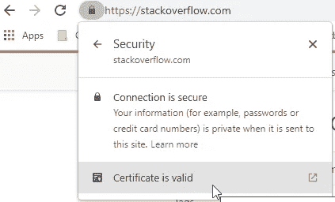
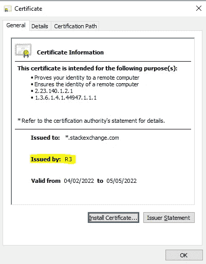
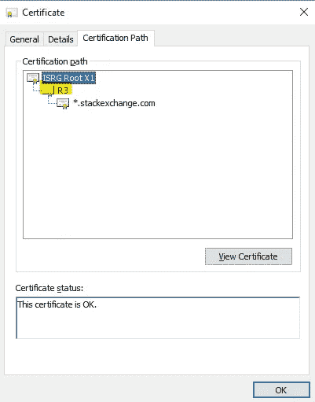
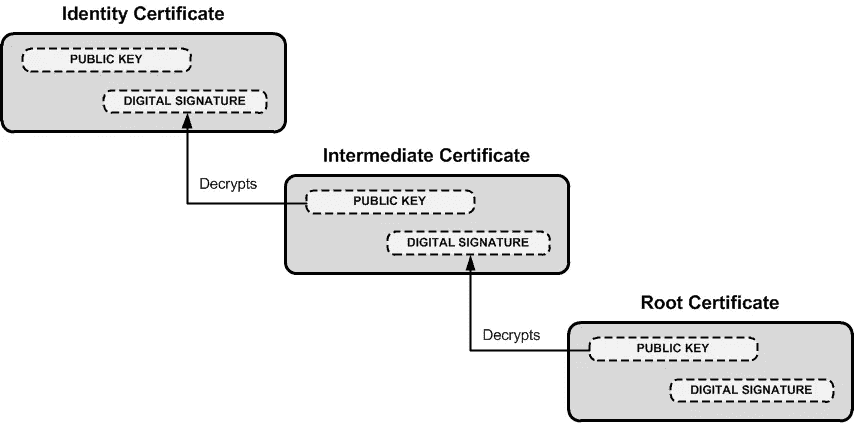
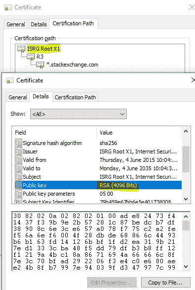
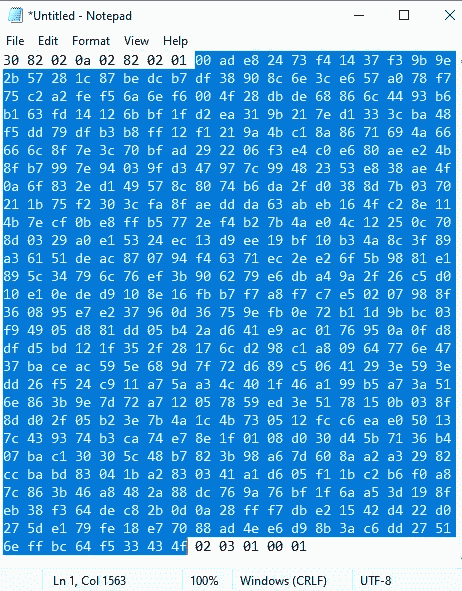

# 浏览器如何验证数字证书—第 1 部分

> 原文：<https://levelup.gitconnected.com/how-browsers-verify-digital-certificates-part-1-26ee57a6e712>

## 签名验证在底层如何工作

[内森·安德森](https://unsplash.com/@nathananderson)在 [Unsplash](https://unsplash.com/photos/L95xDkSSuWw) 上拍照

这是 2 部分系列的第 1 部分，我们将了解如何验证数字证书的签名。

在本文中，我们将看看如何从根 CA 证书中提取公钥，在[第 2 部分](https://davidklempfner.medium.com/how-browsers-verify-digital-certificates-part-2-ad46e4b5b59f)中，我们将看看如何使用它来验证 CA 签署的证书中的签名。

你应该已经了解了[非对称加密](https://cheapsslsecurity.com/blog/what-is-asymmetric-encryption-understand-with-simple-examples/)以及 [TLS](https://www.cloudflare.com/en-au/learning/ssl/what-happens-in-a-tls-handshake/) 和数字[证书](https://www.docusign.com.au/how-it-works/electronic-signature/digital-signature/digital-signature-faq)如何工作的基本概念。

# 认证途径

这是 StackOverflow 的数字证书。

您可以通过点击浏览器中[https://stackoverflow.com](https://stackoverflow.com)前的挂锁找到证书，然后点击“证书有效”。

您可以看到它是由 R3 颁发的，这意味着名为 R3 的实体已经签署了该证书。

如果你点击[认证路径](https://stackoverflow.com/questions/26659333/why-does-a-certificate-authority-ca-issue-certificates-from-an-intermediate-au)，你会看到一连串的证书:

顶层证书是根 CA(证书颁发机构)证书，是隐式受信任的。根 ca 随 Windows 或您的浏览器一起安装。

来自这个根 CA 证书的公钥用于验证列表中的下一个证书，即中间 CA，它来自一家名为 [R3 让我们加密](https://letsencrypt.org/certificates/)的公司。

这个由 R3 颁发的证书包含一个公钥，用于验证 stack overflow(* . stack exchange . com)使用的实际证书的签名。

如何验证签名。摘自[StackOverflow.com](https://security.stackexchange.com/questions/56389/ssl-certificate-framework-101-how-does-the-browser-actually-verify-the-validity)

# 签名验证过程

让我们来看看浏览器如何验证*.stackexchange.com 证书的签名。

## 步骤 1:解密签名

使用根 CA 的公钥解密证书链中下一个证书的签名(R3)(签名只是带填充的证书的加密散列)。

## 步骤 2:比较哈希值

将 R3 证书的哈希(带填充)与步骤 1 中的未加密签名进行比较。

## 步骤 3:在认证链上继续这个过程

如果值匹配，使用 R3 的公钥再次执行步骤 1 和 2，解密*.stackexchange.com 证书中的签名，并比较哈希。

在下一节中，我们将看看如何从根 CA 证书中提取公钥。

## 根 CA 证书

让我们检查根 CA 证书中的公钥。双击 ISRG 根 X1 查看详细信息。

在下面的截图中，你可以看到它使用的是 [RSA](https://www.practicalnetworking.net/series/cryptography/rsa-example/) ，公钥长度为 4096 位。

如果您将这些十六进制值复制到记事本中，您将看到有 1052 个单独的字符。

“详细信息”选项卡中的公钥值。突出显示的字节构成了模数。

由于每个字符代表 4 位，即半个字节，所以这里有 1052/2 = 526 个字节(526 * 8 = 4208 位)。

但是细节说 4096 位(512 字节)用于公钥，这意味着有 112 个额外的位(14 字节)。

## 额外的 14 个字节

下面根据 [ASN.1 编码](https://letsencrypt.org/docs/a-warm-welcome-to-asn1-and-der/)描述字节的含义。

**字节 1: 0x30**

这意味着接下来的字节构成了一个序列。

**字节 2: 0x82**

这是二进制的 10000010。因为 MSB 为 1，这意味着最低有效半字节代表长度的长度。

由于最低有效半字节是 2，这意味着接下来的两个字节代表剩余字节数的长度/计数。

**字节 3 至 4: 0x020a**

这是长度，等于 522。这意味着在第 4 个字节`0x0a`之后还有 522 个字节。

**字节 5: 0x02**

这是一个表示整数的标签。所以这个标签引用的值应该被解释为一个整数。

**字节 6: 0x82**

就像第二个字节一样，这个字节意味着接下来的两个字节代表长度。

**字节 7 至 8: 0x0201**

这等于 513，意味着接下来的 513 个字节构成了模数。

513 字节* 8 位= 4104 位。这比第一个屏幕截图中指定的 4096 大 1 个字节(8 位)。

**为什么模数多了一个字节？**

模数的第一个字节是`0x00`。这很重要，因为模数是用 [2 的补码](https://medium.com/gitconnected/what-is-the-2s-complement-d185800bcdab)来表示的。

因为第 10 个字节是 MSB 等于 1 的`0xad`(二进制为 10101101)，所以在此之前必须有一个字节设置为`0x00`，否则该数字将被解释为负数，但事实并非如此。

**字节 9 到 521:在截图中高亮显示**

这是**模数**，它等于这个巨大的十进制数:

`709477870415445373015359016562426660610553770685944520893298396600226760899977879191004898543350831842119174188613678136510262472550532722234131754439181090009824131001234702144200501816519311599904090606194984753842587622398776018408050245574116028550608708896478977104703101364577377554823893350339376892984086676842821506637376561471221178677513035811884589888230947855482554780924844280661412982827405878164907670403886160896655313460186264922042760067692235383478494519985672059698752915965998412445946254227413232257276525240006651483130792248112417425846451951438781260632137645358927568158361961710185115502577127010922344394993078948994750404287047493247048147066090211292167313905862438457453781042040498702821432013765502024105065778257759178356925494156447570322373310256999609083201778278588599854706241788119448943034477370959349516873162063461521707809689839710972753590949570167489887658749686740890549110678989462474318310617765270337415238713770800711236563610171101328052424145478220993016515262478543813796899677215192789612682845145008993144513547444131126029557147570005369943143213525671105288817016183804256755470528641042403865830064493168693765438364296560479053823886598989258655438933191724193029337334607`

**字节 522: 0x02**

这是一个表示整数的标签。所以这个标签引用的值应该被解释为一个整数。

**字节 523: 0x03**

这是二进制的 00000011，其 MSB 设置为 0。这意味着这只是长度，而不是长度的长度。所以指数的长度是 3 个字节。

**字节 524 至 526: 0x010001**

这代表 65537，它是**的指数**。

## 公钥

我们现在有了公钥(模数和指数)，这是我们验证证书链中下一个证书(R3 证书)的签名所需的一切，我们将在[第 2 部分](https://davidklempfner.medium.com/how-browsers-verify-digital-certificates-part-2-ad46e4b5b59f)中进行验证。