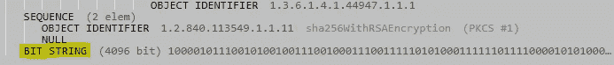

# 浏览器如何验证数字证书—第 2 部分

> 原文：<https://levelup.gitconnected.com/how-browsers-verify-digital-certificates-part-2-ad46e4b5b59f>

## 签名验证在底层如何工作


照片由[加勒特·帕克](https://unsplash.com/@garrettpsystems)在 [Unsplash](https://unsplash.com/photos/DlkF4-dbCOU) 上拍摄

这是“浏览器如何验证数字证书”系列的最后一篇文章。

如果您还没有，请在继续之前阅读[第 1 部分](https://davidklempfner.medium.com/how-browsers-verify-digital-certificates-part-1-26ee57a6e712)。

在本文中，我们将:

1.  从 R3 证书中提取“待签名”(tbs)证书。
2.  从 R3 证书中提取签名。
3.  使用。NET 5.0 来使用我们在第 1 部分中找到的公钥解密签名。
4.  验证解密的签名是否与 tbs 证书匹配。

# 在本地保存证书

在我们在[第 1 部分](https://davidklempfner.medium.com/how-browsers-verify-digital-certificates-part-1-26ee57a6e712)中看到的 ISRG 根 X1 证书的证书路径选项卡中，双击 R3 证书。

将此证书作为 DER 编码的二进制 X.509(.cer)文件:


# 在十六进制编辑器中查看字节

根据 [RFC5280](https://www.rfc-editor.org/rfc/rfc5280#section-4.1) ，证书的结构如下:

```
Certificate  ::=  SEQUENCE  {
        tbsCertificate       TBSCertificate,
        signatureAlgorithm   AlgorithmIdentifier,
        signatureValue       BIT STRING  }
```

我们需要提取出`tbsCertificate`和`signatureValue`。

为了查看证书中哪一个字节对应于三个部分中的哪一个，您需要复制证书的字节(您可以使用 [HxD](https://mh-nexus.de/en/hxd/) 查看字节)，并将它们粘贴到[http://lapo.it/asn1js](http://lapo.it/asn1js)中。

下面是证书在 HxD 中打开时的样子。

将这些字节复制到记事本中。


你可以通过将这些字节粘贴到[http://lapo.it/asn1js](http://lapo.it/asn1js)中来查看它们代表了什么。

如你所见，这是有等级的。第一个序列是整个证书，层次结构中的下一个序列是`tbsCertificate`。这意味着在`tbsCertificate` 下面的同一级别中的下两个项目必须是`signatureAlgorithm` ，然后是`signatureValue`。


# 提取 R3 的“待签名”证书

正如您在上面的截图中看到的，如果您将鼠标悬停在第一个子序列(`tbsCertificate`)上，您可以看到右侧突出显示的字节。使用它在记事本中查找字节，并将其复制到另一个文件中，因为您以后会需要它。

# 提取 R3 的签名

如果您滚动到底部并将鼠标悬停在 BITSTRING 上，您将会看到右侧突出显示的代表签名的字节。



它不会显示所有的字节，但你会看到开始序列，并可以用它来识别你的记事本文件中的字节。找到文件的开头，将所有字节复制到文件的末尾，然后粘贴到另一个记事本文件中，以备后用。

您需要移除`03`到`00`，即。从`85`开始复制。

这是因为前四个字节是[元数据](https://letsencrypt.org/docs/a-warm-welcome-to-asn1-and-der/):

`03`表示它是一个位串，`82`表示接下来的两个字节代表长度。`0201`是长度，`00`只是用来让签名成为 [+ve 号](https://medium.com/gitconnected/what-is-the-2s-complement-d185800bcdab)。


签名从字节 0x85 开始。

# 解密 R3 的签名

要解密 R3 的签名，我们需要使用 RSA 使用的算法。我不会在这里讨论数学，但是如果你感兴趣的话，这很容易理解。

要执行验证，我们需要将以下几组字节复制到. NET 5.0 控制台应用程序中:

1.  来自 ISRG 根 X1 的模数(来自[第 1 部分](https://davidklempfner.medium.com/how-browsers-verify-digital-certificates-part-1-26ee57a6e712)中的根 CA 证书)。
2.  来自 ISRG 根 X1 的指数(来自[第一部分](https://davidklempfner.medium.com/how-browsers-verify-digital-certificates-part-1-26ee57a6e712)中的根 CA 证书)。
3.  TbsCertificate(来自之前提取的 R3 证书)。
4.  签名字节(来自之前提取的 R3 证书)。

# 控制台应用程序

现在你有了你需要的字节(模数，指数，证书，签名)，你可以把它们作为十六进制字符串复制到这里。NET 5 控制台应用程序。确保您删除了字节之间的任何空格。

你需要安装一个名为 [BouncyCastle](https://www.bouncycastle.org/csharp/index.html) 的 NuGet 包。

大部分代码是不言自明的，但是您会注意到有一行代码从解密的签名中删除了“sha256Identifier”。

这些字节[代表](https://www.rfc-editor.org/rfc/rfc3447#page-43)sha 256 算法。

你可以在这里阅读更多关于对象标识符如何编码的信息[。](https://docs.microsoft.com/en-us/windows/win32/seccertenroll/about-object-identifier)

如果您运行上面的控制台应用程序，它应该会打印出`true`,表明签名已经过验证。

# 常见问题

如果一个证书的签名可以用 CA 的公钥成功解密，这难道还不足以证明 CA 签署了那个证书吗？

这足以证明签名确实是由 CA 创建的，但是不足以证明签名属于那个特定的证书。这就是为什么必须将证书的哈希与解密的签名进行比较。

否则，任何人都可以创建一个恶意证书，并添加他们想要的任何签名。

***为什么用的是证书的 hash 而不是证书本身？***

使用 RSA，被加密的值不能大于模数。使用散列是因为它接受任意大量的数据，并将其转换成大小不变的东西。即使您可以解密大于模数的数据，解密小于模数的数据仍然是有意义的。

# 摘要

在本系列中，我们讨论了如何从数字证书中提取所有必要的信息，以便验证签名。

证书验证不仅仅是验证签名。你可以在谷歌上阅读更多关于证书验证的内容。

没有显示的是验证的最后一步，使用 R3 验证 StackOverflow 的证书。这一点没有讨论，因为它与这里已经展示的过程完全相同。

如果你有兴趣了解更多关于 C#中的 BouncyCastle，看看`VerifyData()`、`GetPublicKey()`、`GetSignature()`和`GetTbsCertificate()`。这些方法使得获取所需信息变得非常容易，并且极大地简化了验证过程。

我希望你喜欢这篇文章，如果你有任何问题，请留下评论。