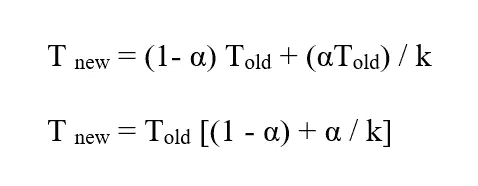
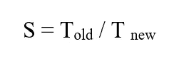
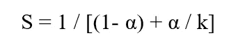
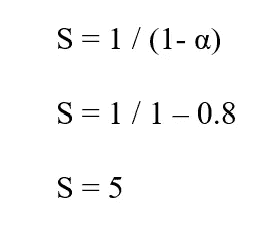

# 如何让电脑更有效率

> 原文：<https://levelup.gitconnected.com/how-can-we-really-improve-a-system-da6187dc0e67>

为了不断寻求改进，我们需要系统:

*   做更多的工作
*   更快地工作

## 但是我们能带来多大的改善呢？

计算领域的早期先驱吉恩·阿姆达尔 提出了一个想法，即通过提高系统的一部分性能来限制系统整体性能的提高。

由[卡尔·海尔达尔](https://unsplash.com/@carlheyerdahl?utm_source=medium&utm_medium=referral)在 [Unsplash](https://unsplash.com?utm_source=medium&utm_medium=referral) 上拍摄

## 这个想法

考虑一个执行一个功能需要时间 T(old)的系统。

假设系统中有一个 X 部件。

它需要总工作时间的一部分(α)。

假设我们将这部分的性能提高了 k 倍。

根据 ***阿姆达尔定律*** ，改进的持续时间(T new)可以计算为:

*阿姆达尔定律计算*

因此，加速系数可以计算如下:

由*阿姆达尔定律(1)* 计算的加速系数

由*阿姆达尔定律(2)* 计算的加速系数

伊恩·杜利在 [Unsplash](https://unsplash.com?utm_source=medium&utm_medium=referral) 拍摄的照片

# 这意义有多大？

假设我们改进了系统的一部分，以在接近零的时间内完成它的任务。

这类似于说 k = **∞。**

如果这部分构成整个系统的 80%(α= 80%或 0.8)，那么整个系统的加速系数将为 5。

当α = 0.8 且 k = **∞** 时的加速因子

这意味着整体系统性能仍然只能提高 5 倍。

尼古拉斯·托马斯在 [Unsplash](https://unsplash.com?utm_source=medium&utm_medium=referral) 上的照片

## 结论

只有通过显著优化系统的大部分，才能提高整体性能。

## 有点跑题

这不仅适用于计算机，也适用于大公司和机构。

这适用于你的工作场所和你将要从事的下一个项目。

如果你想变得更有效率、更快乐，这也适用于你的生活。

林赛·亨伍德在 [Unsplash](https://unsplash.com?utm_source=medium&utm_medium=referral) 上的照片

***感谢阅读本文:)希望对你有帮助！***

请鼓掌支持我在 Medium 上的工作，并跟随我。

# 分级编码

感谢您成为我们社区的一员！更多内容见[升级编码出版物](https://levelup.gitconnected.com/)。
跟随:[推特](https://twitter.com/gitconnected)，[领英](https://www.linkedin.com/company/gitconnected)，[通迅](https://newsletter.levelup.dev/)
升一级就是变身科技招聘👉 [**加入我们的人才集体**](https://jobs.levelup.dev/talent/welcome?referral=true)