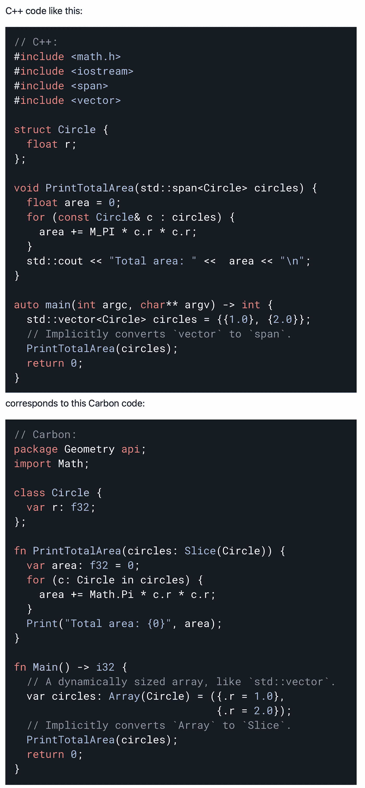

# 谷歌的新语言 Carbon 如何能比 C++表现得更好

> 原文：<https://levelup.gitconnected.com/how-carbon-googles-new-language-can-perform-better-than-c-1e77963bceaf>

我提出了 C++的两个关注点，Carbon 可以操作这两个点以获得早期成功

来自 Unsplash 的 Tim Gouw

我在职业生涯的早期就开始了软件工程之旅，这条路几乎与我现在做的事情完全无关。C++是你开始为之做准备的地方，正如我和许多人一样，无论是你在大学之前如何进入学术界，还是为了参加几次面试而进行的在线学习。我在之前的工作中已经了解了 Java，并希望避开这一领域，我不想使用 Objective-C 进行开发，因为竞争非常激烈，很难被击败。

为了理解 Carbon，它的潜力、优点、缺点，以及未来几年将会被写出来和被打乱的所有东西，**我建议对 Ruby 的意图有一个高层次的认识(在 C++的环境中)。**

由来自 Unsplash 的[弗洛里安·施梅兹](https://unsplash.com/@floschmaezz)

Ruby 本应在我们经历的所有 C++挑战的交叉点上取得重大进步。也就是说，它的垃圾收集机制将释放不使用的内存，C++社区将不再需要求助于一些商业解决方案。对于 C++社区来说，现在已经不太需要为这个挑战而设计的用于对象管理的 *unique_ptr* 智能指针了。

并且 Ruby 以一种重塑的方式处理变量声明。或者说 Ruby 是如何支持多重继承的。

即使有了 Python，对其光明未来的渴望也会被说成是它的终点是取代像 C++这样的语言。对于 Python，最大的争议是基于它的简单性和速度。

如果 Carbon 要管理生命周期的编程元素，它必须能够通过低级编程实现经验结果。

来自 Unsplash 的维多利亚博物馆

Python 不适合低级编程。Ruby 也不是。不管所有的评论，即使是今天关于 Python 和 Ruby(以及现在的 Carbon)，我认为可访问性和可用性归结为在低水平上可实现的东西，不管实验将显示 Carbon 有多快或多简单。

尽管这些语言简单、优雅、快速，但软件工程在其最分解的功能上实现了一个主要目标:**直接与操作系统或硬件交互。**多年来，我发现自己迫切需要跨越性能优化用例来解决问题，或者使用 C++直接控制硬件的特性。我会执行高阶的内存映射过程，以设计虚拟表示物理内存地址的克隆(由于当时在访问管理控制方面的许多挑战和不完整的安全框架——我们谈论的是许多、许多年前)。

低级编程*需要*来实现跨多个不同平台的编译，因为操作系统不驻留在单个实体中。如果你包括程序员为显式用例构建的操作系统，我会说今天有成千上万的操作系统。显而易见的我们都知道。为了让碳穿过终点线，它归结为在操作系统底层设计中挑选用例，并揭示它如何优化这些任务(用一个明显的 C++比较器)。

由来自 Unsplash 的[约书亚·戈尔德](https://unsplash.com/@joshgmit)

**硬件是为软件打造的。软件支持硬件解决方案。如果 Carbon 要取得成功，它必须在许多不同的平台上实现编译能力。要做到这一点，它必须是可移植的，易于导入、迁移和集成，就像跨第三方集成一样(3P 集成)。金钱可以买到的性能最佳的高度优化的硬件可能会因为未优化的软件而停滞不前。你们都经历过台式机/笔记本电脑的挑战。我认为这更像是一个软件问题，而不是硬件问题。低级编程的成功将展示碳的可能性艺术。**

第二个更直接，我打赌 99%的 C++社区会支持我:我们需要直接访问内存地址，让程序员对程序如何运行有更多的控制。分支预测和缓存利用是两个方面，在这两个方面稍加调整就可以对优化的 Carbon 编码产生重大影响。

来自 Unsplash 的 Braden Collum

读到这里的 C++人可能会说，现在用 C++编写程序是可能的，甚至不需要显式释放任何内存，比如使用智能指针或其他 RAII(资源获取即初始化)技术。这不是让垃圾收集成为稻草人的争论。无论智能指向路径在程序上和外科手术上多么有效，您在硬件上用来进行编译的线程仍然会在速度和整体性能上受到影响。

垃圾收集很快就会成为一个转移注意力的话题。端到端的自动垃圾收集会带来很大的性能开销，这在 C++中是不可取的。使用手动内存管理，程序员不仅可以在释放内存时获得更多的控制，而且主要是如何实现(我前面已经解释过)软件性能的优化。有些类型的对象无论如何都很难自动收集，即使是在自带垃圾收集过程的 C#实例中，不管 Carbon 在这个问题范围内实现得有多好。

C++的语法并不混乱，我也不觉得使用起来很麻烦。我看到了一些温和的主题和围绕着 Carbon 将如何简化代码可读性的主题的共同点。以下面的 C++代码为例，它的碳当量代码如下:

GitHub 上的碳[1]

我发现 Python 在这方面实现了许多其他语言的跨越，几乎让人认为代码可读性现在是必须的。我在 Carbon 上看到了一些简单的语法，很明显 Google 在刻意思考简单性。

## **离别的思念**

在考虑 Carbon 可能取代低级编程的 C++的背景下，我讨论了垃圾收集管理和内存管理过程如何成为急需的早期成功的两个领域。跳到 GitHub 空间，探索更多关于碳的知识。

如果您有任何编辑/修改建议或关于进一步扩展此主题的建议，请考虑与我分享您的想法。

# **另外，请考虑订阅我的每周简讯:**

 [## 周日报告#1

### 设计思维与 AI 的共生关系设计思维能向 AI 揭示什么，AI 又能如何拥抱…

pventures.substack.com](https://pventures.substack.com/) 

参考:

1.  碳语言。(未注明)。*GitHub—Carbon-lang/Carbon-lang:Carbon Language 的主要知识库:文档、设计、实现和相关工具。(注:碳语是实验性的；*参见自述。GitHub。于 2022 年 7 月 24 日从[https://github.com/carbon-language/carbon-lang](https://github.com/carbon-language/carbon-lang)检索