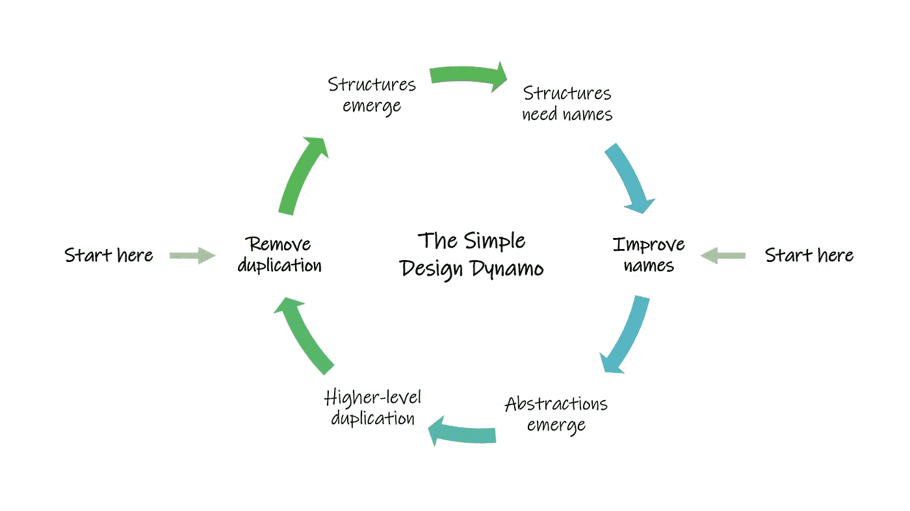
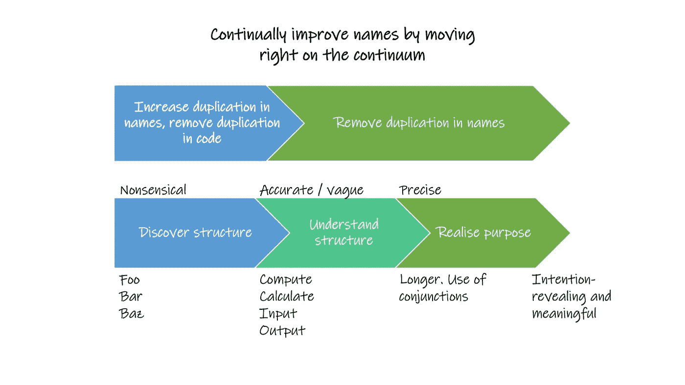

# 选择更好的名字如何改善你的代码

> 原文：<https://levelup.gitconnected.com/how-choosing-better-names-can-improve-your-code-31a0050c6c93>

## 为什么正确的命名是编写结构良好的程序的内在要求

照片由[扬西·敏](https://unsplash.com/@yancymin?utm_source=medium&utm_medium=referral)在 [Unsplash](https://unsplash.com?utm_source=medium&utm_medium=referral) 上拍摄

众所周知，命名是编程的一个重要部分，这一点很少有争议。我们给变量和常量、函数和方法、类和文件、包和模块命名，这样的例子不胜枚举…

我们被教导名字需要描述性的，简洁的，足够公平的。但是我们有时没有被教导——因此并不总是意识到——命名在迭代改进代码的可读性以及它的结构和设计的过程中是多么重要。

> 计算机科学只有两个硬东西:缓存失效和事物命名。
> 
> **—菲尔·卡尔顿**

对于一个初学编程的人来说，这句名言可能看起来异想天开或不太可能，他们可能会带着一些怀疑态度对待它。在现实中，尽管这显然意味着要持保留态度，但它非常接近事实。

照片由[卢卡·布拉沃](https://unsplash.com/@lucabravo?utm_source=medium&utm_medium=referral)在 [Unsplash](https://unsplash.com?utm_source=medium&utm_medium=referral) 上拍摄

# 你需要先把基本的东西弄好

在你打好基础之前，深入研究是没有多大意义的。要以良好的风格编写代码，您必须遵守语言的相关命名约定，并遵循一些通用的良好实践。在高层次上，这使得你的代码对其他程序员来说是熟悉的和可读的(包括你未来的自己！).

## 一些示例约定

*   Java:类名是大写，方法和变量是小写，常量是大写，包是小写，等等。
*   Python:大多数名字都是小写的，如果包含多个单词，用下划线分隔，例如 *new_order* 。

## 良好做法

*   一般来说，不要让你的名字太长而难以使用*(例如 customerCartCheckoutTotal)。*
*   也不要短到完全无法描述。
*   在你的上下文中找到一个有意义的平衡点*(例如总计)*。
*   例如，把一个函数的名字想象成一个用户无需阅读函数体就可以阅读并理解该函数做什么的东西。

请确保您熟悉这些约定和实践，作为改进您的名称的基础，但是名称改进有更深的层次，它与开发您的 with 程序结构和提高其质量密切相关。

在 [Unsplash](https://unsplash.com?utm_source=medium&utm_medium=referral) 上由 [Austin Distel](https://unsplash.com/@austindistel?utm_source=medium&utm_medium=referral) 拍摄的照片

# 名字如何影响你的程序

软件工程和开发的一个关键焦点是编写可维护的程序，这是有充分理由的。很可能其他人，甚至是你未来的自己，将不得不使用你的代码。因此，用一种经得起未来考验的方式来写它是很重要的。

两种方法是通过**消除重复**和**选择合理的抽象**。

这些直接来自于肯特·贝克在 20 世纪 90 年代提出的简单设计的四个要素。他断言一个简单的设计:

1.  通过测试。
2.  尽量减少重复。
3.  最大化清晰度。
4.  有更少的元素。

*你可能以前遇到过这些原则——或者在某个阶段会遇到——但是在遵循这些原则的过程中，命名是如何发挥如此巨大的作用的呢？*

## 消除重复

试着遵循*一次编写规则，*该规则规定每个独立的决定应该只被合并到你的代码中一次。这样，如果某项功能必须进行修改，您只需要在一个地方进行修改，而不是在许多地方(您可能会错过这些地方，从而导致错误)。

这里有一个非常简单的例子来说明命名是如何驱动这个过程的。假设我们有一个类，它包含了一个根据楼层数对建筑进行分类的方法:

现在假设我们对建筑高度的定义已经改变。我们需要改变所有 if 语句中的文字。

好吧，但是如果我们在其他地方有另一个函数也存在这些文字呢？现在我们也需要在那里改变它们。

通过像这样重构我们的程序，可以很容易地避免这个潜在的问题:

现在我们只需要改变一次常量的值，并且我们确信程序的其余部分将按预期工作。此外，我们程序的结构变得更加清晰，我们的 if 语句也更有意义。

## 抽象

抽象超越了结构。当你选择抽象时，你定义了用户如何看待你的程序。代码中的名称集合应该为讨论代码创建一个词汇表。

以下列程序计算银行帐户的税后余额为例:

这个节目有点乱。这个函数的名字并不是一个准确的描述，因为它不仅仅返回税后余额，它还计算余额和税后余额。我们可以将其重构为:

这要干净得多。不是一个函数做多件事，而是三个函数各做一件事。此外，您可以通过查看其名称来判断每个函数的作用。希望你能在这里看到，命名如何塑造了我们的抽象选择，并深刻地改进了结构。

## 潜得更深

上述规则 1 和规则 2 的顺序自其最初构想以来一直是争论不休的话题。然而，最近有人提出，这两者在某种程度上是可以互换的，并且构成了迭代周期的一部分——其中命名扮演了一个关键的角色。

J . B . rains Berger 在 2013 年的一篇博客文章中清楚地讨论了这是如何发生的:

J.B. Rainsberger，jbains 2013 年

他指出，当你从代码中去除重复时，结构就出现了。新的结构需要新的名称，这些名称需要改进。因此，程序中的职责被重新分配。

我们应该努力在代码中实现高内聚，而内聚性只会随着名字的改进而改进。此外，随着责任的重新分配，我们实现了抽象！

但是在这个抽象层次上，我们注意到新的、更大的模式，以及更高层次上的更多重复。我们消除了这种重复，新的结构出现了，这些结构需要名字，所以我们改进了这些名字，抽象层次又一次提高了…

由[布雷特·乔丹](https://unsplash.com/@brett_jordan?utm_source=medium&utm_medium=referral)在 [Unsplash](https://unsplash.com?utm_source=medium&utm_medium=referral) 上拍摄的照片

# 如何改进你的名字

一个常见的误解是，名字是你必须第一次就弄对的东西。这是千真万确的，因为从上面可以看出，命名是一个迭代过程的一部分。

**在另一篇 2019 年的文章(也在下面)中，Rainsberger 提出了一个改进名称的模型:**

J.B. Rainsberger，jbains 2019

*   他勾勒出一个连续体，最左边是无意义的占位符名称(像经典的 *foo* 和 *bar* )。这些是你在设计原型和充实一些初步想法时可能用到的。
*   一旦你的程序成形了，你发现了结构，你就把它们改成功能性更强，但仍然模糊的名字——从而在连续体上向右移动。
*   这些名称有助于您理解结构，在这一点上，您可以通过书写更精确的名称(往往更长)来进一步沿着连续体移动。他称之为名称上的重复增加，而代码上的重复减少。
*   现在，当你阐明你的代码的目的时，你去除了名字中的重复，到达了连续体的最右边，名字是有意义的和揭示意图的。

礼来朗姆酒在 [Unsplash](https://unsplash.com?utm_source=medium&utm_medium=referral) 上拍摄的照片

# 结论

直到最近，在阅读 Perdita Stevens 的*如何写好程序*时，我才意识到名字实际上可以驱动开发。

我认为这是一个非常有趣的想法，作为程序员，我们需要更加了解这个想法，这样我们才能有意识地努力写出更好的程序。在变量、函数、类和包级别反复不断地改进我们的名字是发现和改进我们代码的结构和抽象的重要部分，这是一个非常强大的工具。

感谢阅读。我希望你觉得这篇文章有趣。如果你喜欢它或有任何问题/评论，我很乐意你留下回应和参与！

[**订阅**](https://medium.com/subscribe/@adenhaus) 📚为了不错过我的一篇新文章，如果你还不是中等会员，请加入**🚀去读我所有的，还有成千上万的其他故事！**

## **参考资料和进一步阅读**

*   **Java 命名惯例[*https://www.javatpoint.com/java-naming-conventions*](https://www.javatpoint.com/java-naming-conventions)**
*   **Python 命名约定[*https://visual git . readthe docs . io/en/latest/pages/naming _ conventi on . html*](https://visualgit.readthedocs.io/en/latest/pages/naming_convention.html)**
*   **如何写出好的程序，Perdita Stevens[*https://www . Amazon . com/How-Write-Good-Programs-Students/DP/1108789870*](https://www.amazon.com/How-Write-Good-Programs-Students/dp/1108789870)**
*   **J.b . rains Berger on improving names[*https://blog . thecodwishperer . com/permalink/a-model-for-improving-names*](https://blog.thecodewhisperer.com/permalink/a-model-for-improving-names)**
*   **J.B. Rainsberger 谈“简单设计发电机”[*https://blog . thecodwishperer . com/permalink/put-an-age-old-battle-to-rest*](https://blog.thecodewhisperer.com/permalink/putting-an-age-old-battle-to-rest)**