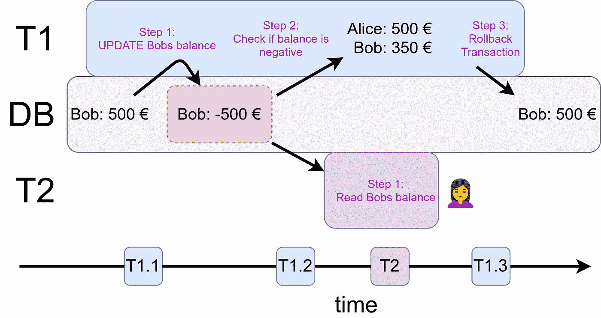
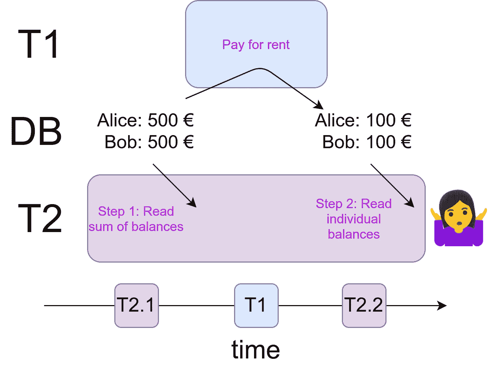
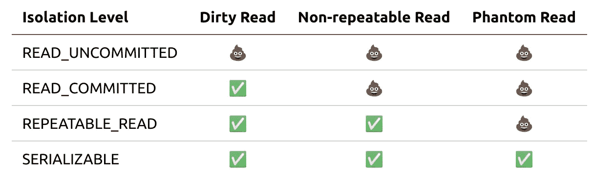

# 并发性如何破坏你的软件

> 原文：<https://levelup.gitconnected.com/how-concurrency-can-break-your-software-f777b97d3286>

## 与不充分的事务隔离相关的竞争条件


韦斯·希克斯在 [Unsplash](https://unsplash.com?utm_source=medium&utm_medium=referral) 上的照片

在过去的 30 年里，我们看到了硬件方面的显著进步。[摩尔](https://en.wikipedia.org/wiki/Moore%27s_law)观察到，密集集成电路(IC)中的晶体管数量大约每两年翻一番，CPU 时钟频率从 1970 年的 740 kHz 增加到 2021 年的 4.9 GHz，随着时间的推移，CPU 可以执行的指令类型变得更加复杂。但是增加时钟频率和增加更复杂的指令是有限制的。CPU 制造商没有这样做，而是增加了并发执行更多东西的可能性。这带来了它自己的一系列问题。

对我来说，最有趣的是在 web 服务的环境中。最突出的是，它与中央数据库交互，并与事务隔离相关。在本文中，您将了解最著名的缺少隔离的问题是什么，以及哪些事务隔离级别可以解决这些问题。开始吧！

# 基础知识📚

数据库在 ***事务*** 中组织多个操作。您可以将数据库想象成一系列事务。如果事务是数据库的一部分，我们说它是*提交的*。如果交易失败，则执行 ***回滚*** 。交易被撤销。

我们希望事务是 ***原子的***——要么事务完全是数据库的一部分，要么根本不是。不应有部分提交的事务。

我们还希望 ***事务隔离*** —事务的并发执行不会导致与串行执行不同的结果。事务是一个接一个执行还是并行执行并不重要。

我们将在本文中研究的问题被称为*读取现象*，它们发生在隔离特性被破坏时。更强的隔离是有代价的。权衡是速度和保证某些问题不会发生。这些保证被称为事务隔离级别。控制问题也被称为**并发控制**。有**乐观**和**悲观**并发控制。乐观并发控制使用**快照**和验证，悲观并发控制使用**锁**。之所以称之为乐观，是因为它首先允许发生变化，并在必要时回滚。它假设事情会好起来，而锁则假设事情会出错。取决于什么事情发生得更频繁，乐观或悲观更便宜。

# 自己动手！🔨

如果要执行以下语句，需要运行 PostgreSQL:

```
$ sudo su - postgres
$ psql
# CREATE TABLE balances (id varchar PRIMARY KEY, balance int);
CREATE TABLE# INSERT INTO balances (id, balance) VALUES ('Alice', 500), ('Bob', 500);
INSERT 0 2# SELECT * FROM balances;id   | balance
-------+---------
Alice |     500
Bob   |     500
```

# 脏读:读取未提交的数据

> 当事务 T2 看到未提交的事务 T1 时，这被称为脏读。

想象一下这个场景:爱丽丝和鲍勃在谈恋爱。艾丽丝擅长记账并记录财务状况，而鲍勃有时在财务上并不那么负责。在这种情况下，他想花 600 €买一把玄幻剑。幸运的是，如果余额低于 0 €，他们的银行会拒绝交易。但是爱丽丝在中间检查了鲍勃的账户。

所以我们有两个交易:

*   T1:鲍勃试图支付幻想剑，失败了，并得到回滚。
*   T2:艾丽斯查看了账户。

为了对另一家银行执行交易，Alice 和 Bob 的银行运行以下`transfer_out`函数:

两人的账户上最初都有 500 欧元。

```
-- T1: Bob tries to get that fantasy sword
BEGIN TRANSACTION
    # Step 1: Pay for the sword
    UPDATE balances SET balance = balance - 1000 WHERE id = 'Bob'; # Step 2: Check if the balance got negative
    SELECT balance FROM balances WHERE id = 'Bob';
END TRANSACTION-- T2: Bob's interaction with the bank
BEGIN TRANSACTION
    # Step 1: Reduce the balance of Bobs account by 150 EUR
    UPDATE balances SET balance = balance - 150 WHERE id = 'Bob'

    # Step 2: Increase the balance of Alice account by 150 EUR
    UPDATE balances SET balance = balance + 150 WHERE id = 'Alice'
END TRANSACTION
```

因为我们有两个事务，所以这两个步骤同时发生。这意味着可能是 T1 首先完全执行，然后是 T2，但也可能是它们交错执行。例如:
t1 . step 1➔T2 . step 1➔t1 . step 2➔T2 . step 2



Alice 读取到数据库的不一致状态，因为事务 T1 尚未完成。这让她得出了错误的结论，认为鲍勃欠了债，可能会导致高利率。马丁·托马斯创造形象

如你所见，这是有问题的。爱丽丝现在可能认为他们的钱比实际的少。

使用 **READ_COMMITTED** 事务隔离级别来防止脏读。由于在很多情况下读取未提交的数据是有问题的，PostgreSQL 甚至不允许这样做:

> SQL 标准定义了一个额外的级别，READ UNCOMMITTED。在 PostgreSQL 中，未提交读被视为已提交读([来源](https://www.postgresql.org/docs/9.3/sql-set-transaction.html))

# 不可重复读取🤷‍♀️

> 当同一行在一个事务中被读取两次，但由于事务外部的更改而不包含相同的信息时，这是一种不可重复的读取(也称为读取偏差)。

安娜喜欢记录他们的财务状况。其中一部分是得到他们余额的总和以及个人余额。然而，这次她倒霉了。在他们都支付 400€租金之前，她读了余额的总数。之后，她会读取个人余额。



爱丽丝读了他们支付 400€租金之前的余额总和以及之后的个人余额。现在她很困惑，因为她不知道发生了不可重复的读取。图片由马丁·托马斯提供。

要亲自查看，您需要终端会话打开到您的 PostgreSQL 服务器:

如您所见，左边的事务 2 看到了不一致的状态:一方面，余额的总和是 1000。另一方面，个人余额的总和只有 200。

使用 **REPEATABLE_READ** 事务隔离级别来防止不可重复的读取:

# 幻像读取👻

> 如果同一个查询在一个事务中执行了两次，但行集不同，则会发生幻像读取。消失的行是幻影。

根据 ANSI SQL-92 标准，可序列化隔离级别可防止幻像读取。但是，PostgreSQL 中可重复读取事务隔离级别的实现也防止了幻像读取。

查理是这里的幽灵👻

# 丢失更新

> 当一个更新因为被第二个事务的另一个更新覆盖而丢失时，它被称为丢失的更新。

举个例子，下面的情况。左侧和右侧是两个不同的事务:

如果您处于 REPEATABLE_READ 序列化级别，第二次更新(第 11 行)将触发一个异常:

> 错误:由于并发更新，无法序列化访问

# Postgres 如何实现事务隔离级别？

Postgres 对所有事务隔离级别使用快照隔离([来源](https://www.postgresql.org/docs/14/transaction-iso.html)):

*   READ_COMMITTED 看到事务中当前语句的**开始时的快照**
*   REPEATABLE_READ 看到事务中第一个非事务控制语句**开始时的快照。**
*   SERIALIZABLE 类似于 REPEATABLE_READ，但是它还监视可能使一组并发的可序列化事务的执行行为与这些事务的所有可能的串行(一次一个)执行行为不一致的条件

Postgres 使用多版本并发控制(MVCC)的一种变体，称为可序列化快照隔离。核心思想是每次更新都不会覆盖数据，而是用事务 ID 将数据添加到 DB 中。当执行 SELECT 时，可能会选择多个版本，这允许一个事务具有一致的快照。可序列化隔离级别的实现是复杂的。

# 其他异常情况

如果这对你来说还不够，我推荐阅读贝伦森、伯恩斯坦、格雷、梅尔顿、奥尼尔和奥尼尔的《T2 对 ANSI SQL 隔离级别的评论》。他们深入细节并指出其他异常之处。例如，所有隔离级别(甚至 READ_UNCOMMITTED)都会阻止**脏写**。它不同于**写偏斜**。在 Postgres 的可序列化隔离级别中，写偏斜是被阻止的。

# 摘要

下面概述了哪些事务隔离级别可以防止哪些读取现象:



READ _ UNCIMMITTED 事务隔离级别允许所有三种读取现象发生，而 SERIALIZABLE 隔离级别则阻止所有这些现象发生。图片由马丁·托马斯提供。

这些隔离级别是在 SQL 标准中定义的。然而，各种数据库可能会提供更强的保证。例如，READ_UNCOMMITTED 事务隔离级别等于 Postgres 中的 READ_COMMITTED 隔离级别。此外，REPEATABLE_READ 隔离级别已经防止了 Postgres 中的幻像读取。

# 参考

为了写这篇文章，我读了很多书。最有价值的资源是:

*   [Vlad Mihalcea](https://vladmihalcea.com/):[YouTube 上 Devoxx 的事务和并发控制模式](https://www.youtube.com/watch?v=onYjxRcToto)，2017。
*   [PostgreSQL 的内部机制](https://www.interdb.jp/pg/pgsql05.html)
*   [Uwe rhm](https://www.sydney.edu.au/engineering/about/our-people/academic-staff/uwe-roehm.html):[交易系统](https://db.in.tum.de/teaching/ws1314/transactions/pdf/SnapshotIsolation.pdf?lang=de)in 2267，2014。
*   PostgreSQL 文档:[事务隔离](https://www.postgresql.org/docs/14/transaction-iso.html)
*   Berenson，Bernstein，Gray，Melton，O'Neil，O'Neil: [对 ANSI SQL 隔离级别的批判](https://www.microsoft.com/en-us/research/wp-content/uploads/2016/02/tr-95-51.pdf)，2016。——阿德里安·科尔耶为《T2》写了一篇精彩的文章。