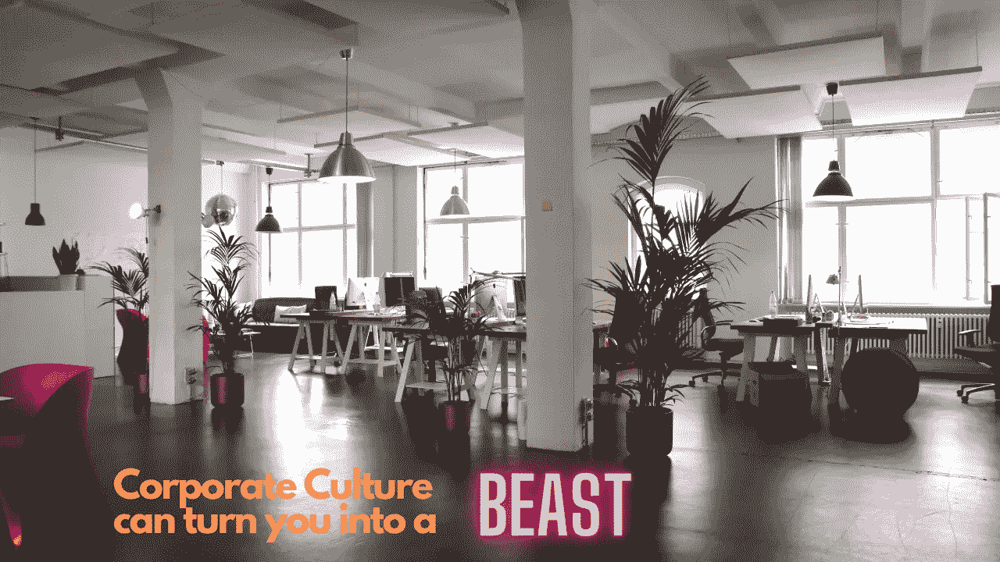
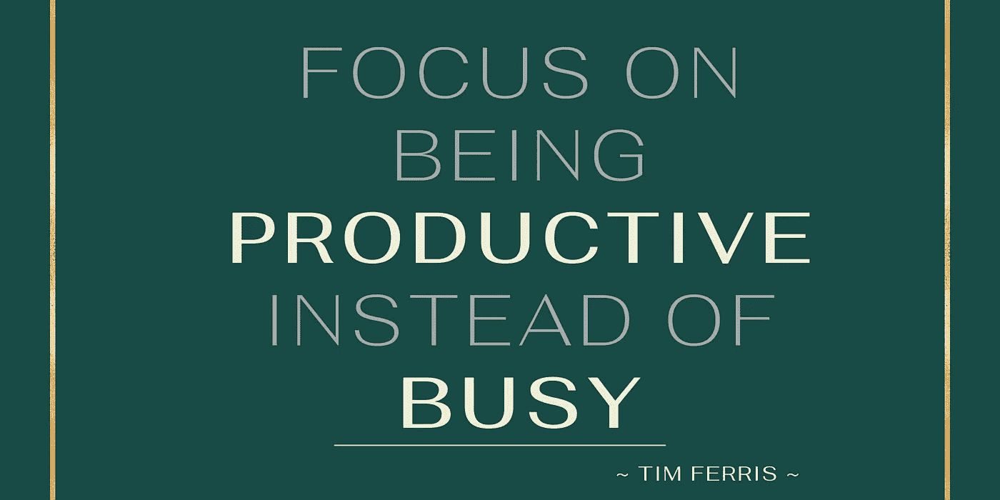
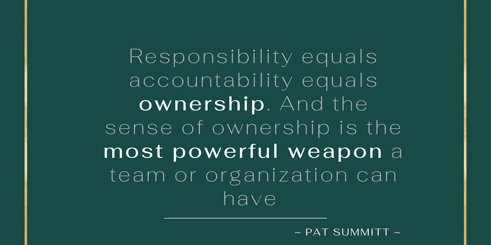
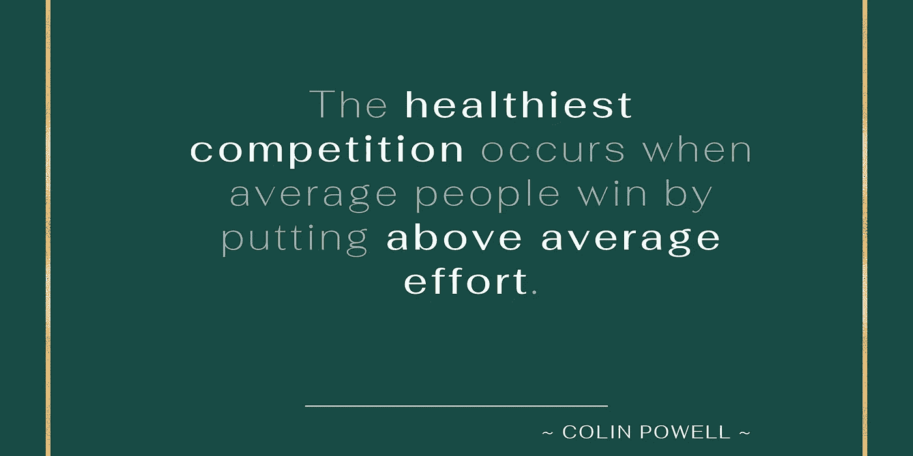
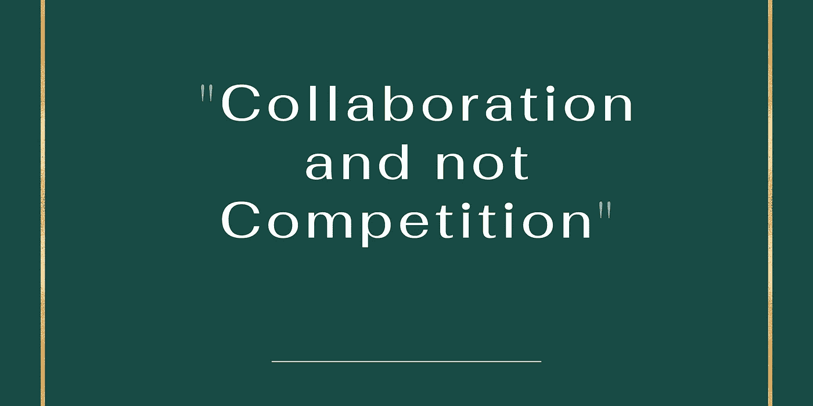
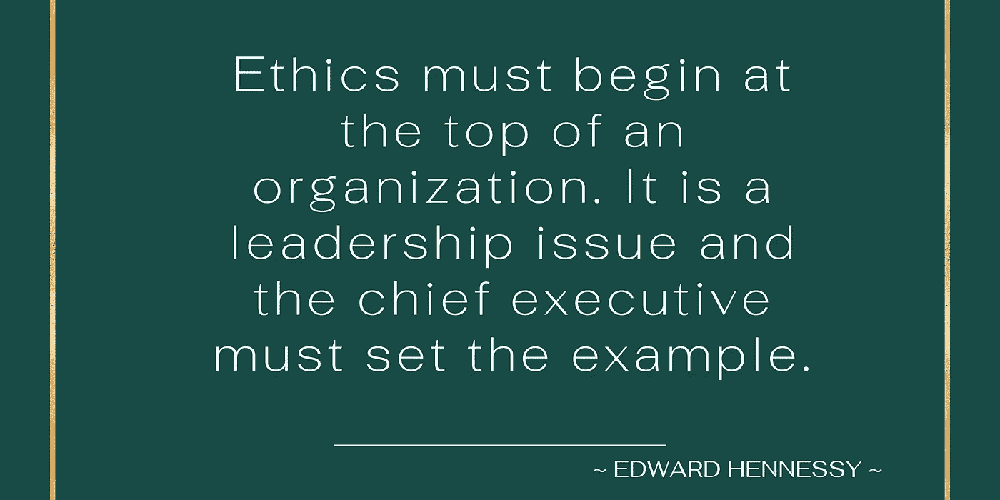
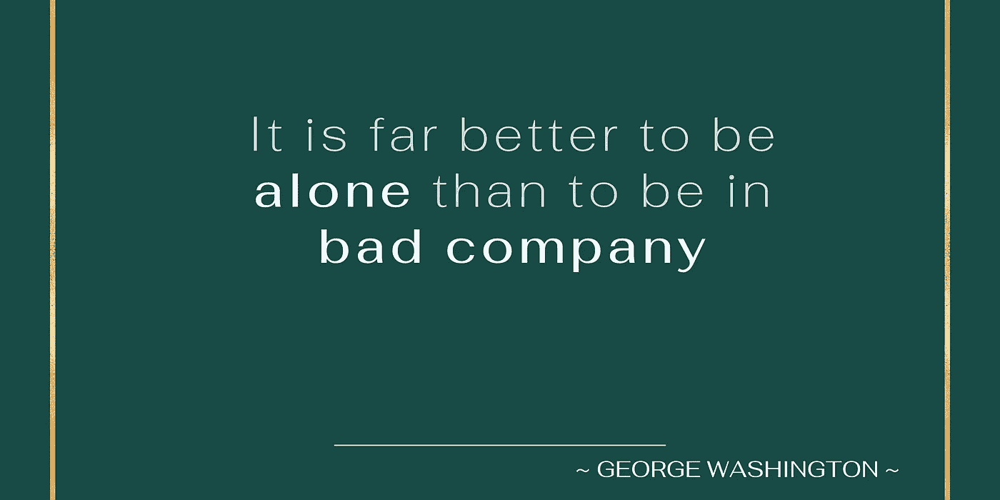
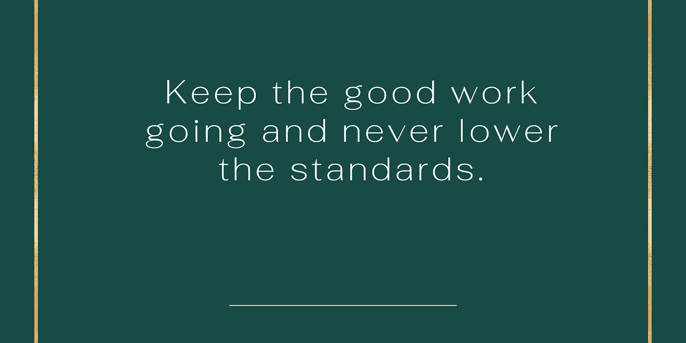

# 企业文化如何慢慢把你变成一头野兽

> 原文：<https://levelup.gitconnected.com/how-corporate-culture-can-slowly-turn-you-into-a-beast-77ac6c918ddf>

## 以及如何保护自己。

我的职业生涯始于一家大型公司。适应他们现有的流程并不容易。

正如所有事情一样，企业文化也有好的方面和坏的方面。积极的一面是，你慢慢理解了你一开始讨厌的过程，以及它是如何帮助你实现工作目标的。最糟糕的是，你看到你的同事，善良的人被体制变成了自私和邪恶的人。

企业制度有很多方式可以暴露人们肮脏的一面。以下是其中的几个

# 忙碌与高效

这是你随着时间发展的一个特点。一直“忙”是没有借口的。你可能看起来或感觉很忙，但实际上没有完成多少。你想办法让别人也相信你。

富有成效意味着你完成了高质量的工作，这有助于你更接近目标或完成重要任务。

不必要的忙碌意味着你试图处理太多的任务，而其中大部分都不是重要的。这也意味着不给你自己和你爱的人太多的自由时间，因为你正忙于不重要的事情。

## 避免的方法

《纽约时报》3 本畅销书《每周 4 小时工作》、《4 小时身材》和《4 小时厨师》的作者蒂姆·费里斯建议你用以下策略少工作多做事:

*   80-20 法则:你从 20%的任务中获得 80%的结果。使用此规则来确定导致更多输出的任务，并在这些任务上花费更多时间。
*   在上午 11 点前完成最重要的任务。
*   用软件来自动化任何可以自动化的东西。

# 缺乏所有权和信任

大公司中存在信任赤字。当你越往下走，情况越糟，有时会导致微观管理。最终，从事某项任务或项目的人会失去主人翁感。这导致了延迟并影响了可交付成果的质量。

你可能是不被信任的人，或者你是不信任别人的人，因此对你的下属进行微观管理。

## 避免的方法

每个人都被要求做一些不愉快的，不有趣的任务。人们需要来自高层的信任和保证来有效地履行他们的职责。责任是关于授权，鼓励你的下属完成他们的任务。没有人喜欢被问责。

鼓励你自己和你的团队承担责任，做出改变，并对你和你的团队正在完成的任务产生一种主人翁感。

# 团队中的比较——破坏团队

大多数经理倾向于比较团队成员。这是非常自然的人类行为。这造成了偏袒，并在团队内部产生了问题。

这并没有创造一个健康的竞争，事实上，它把团队分裂成了多个团队。

破碎的团队没有生产力。每个团队成员都只是想在经理眼中表现良好，而忽略了工作质量。

## 避免的方法

> 记住你雇佣某人是因为他/她的长处，而不是弱点。

作为一个团队的管理者，你需要了解你的团队成员擅长什么，并在此基础上给他们工作。作为个人贡献者，尽可能以最好的方式做好自己的工作。

# 相对绩效分析和评估

我知道一家大公司，我的朋友以前在那里工作。他们过去常常分析团队中个人之间的表现。每年他们都会解雇排名倒数 5%的员工。

这刺激了团队中不健康的竞争，每个人都是靠自己。个人贡献者不会向他人寻求帮助，并且总是很紧张。基本上，合作是一种冒险。

当人们看到他们的朋友受到伤害时，他们倾向于寻找其他选择。

## 避免的方法

把你的关注点从“竞争”转移到“协作”上。是的，改变整个组织的文化并不容易，但要努力改变你自己和你的团队。协作是带领你的团队走向成功的关键。

# 道德至上

> "如果高层的道德观念很差，这种行为就会在整个组织中被复制下来. "—罗伯特·诺伊斯

如果道德在高层受到损害，中层管理人员和低层管理人员也会受到同样的影响。慢慢地，整个组织都以同样的方式行动。迟早，不知道系统也会腐蚀你。

## 避免的方法

在一个大组织中，改变高层的道德规范是不可能的。但在你自己的层面上，你应该尽一切努力保持你的道德规范。

保持正直和职业道德的完整，所以如果这意味着更加努力地工作。一个值得尊敬的角色是你最好的赌注。

# 坏的腐蚀好的

> “坏朋友会腐蚀好品质”——雅典的梅南德

以上的说法对于任何领域的任何一家不好的公司都是成立的。就像假教不会导致知识一样，公司层面的烂公司一定会把你腐蚀掉。因此，我们必须谨慎对待我们的合作伙伴

## 避免的方法

让自己免受坏公司影响的唯一方法就是避免它。不要沉迷于工作场所发生的各种流言蜚语。在你不知情的情况下，这些谈话会慢慢地腐蚀你的灵魂。

# 对糟糕工作的认可

> “不去面对糟糕的执行力和行为，就是认可它。不加强良好的执行力和行为就是消灭它。”— Dic 朱红色

在我的职业生涯中，我在大型组织和初创公司中都见过这种情况。在软件开发中，你会遇到这样的场景，你会经常遇到写垃圾代码的人，他们会花很多时间来修复错误。管理层认为他们比那些写好代码的人工作更努力，因此需要解决的错误更少。

我记得在一次年度回顾会议上，有人给我举了一个写 sh*tty 代码的人的例子，并要求我像他一样工作。

## 避免的方法

千万不要让这种对糟糕执行和行为的认可影响到你。你应该继续提高工作水平。

反对这种行为，执行力比你想象的更重要。这就像瘟疫一样蔓延开来，慢慢影响到很多人。

# 包扎

嗯，企业文化会在很多方面影响你的个性，让你暴露出不好的一面。我已经列出了迫使我在不到 6 个月的时间里离开大公司的情景。

*   **忙碌 vs 高效**:不要忙。专注于利用你的时间完成最重要的任务。
*   **缺乏所有权和信任**:试着获得你工作的所有权。
*   **团队中的比较——打破团队**:你需要了解你的团队成员擅长什么，并在此基础上给他们工作。
*   **相对绩效分析和评估**:建立健康的协作文化。
*   **高层道德**:无论高层如何，都要保持正直和职业道德。
*   **坏人腐蚀好人**:远离坏人。
*   **为糟糕的工作背书**:让好的工作继续下去。谴责不好的执行或行为。

不管有什么缺点，只要你明智地利用，企业部门可能是一个学习和发展的好地方。