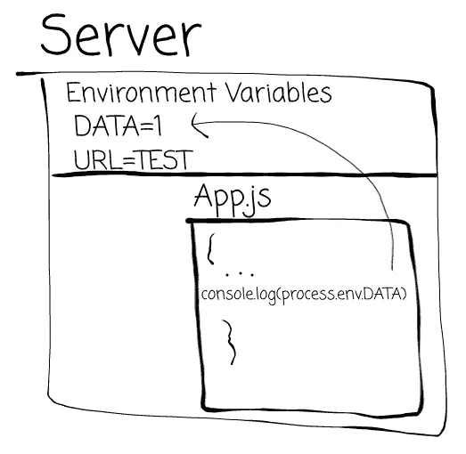
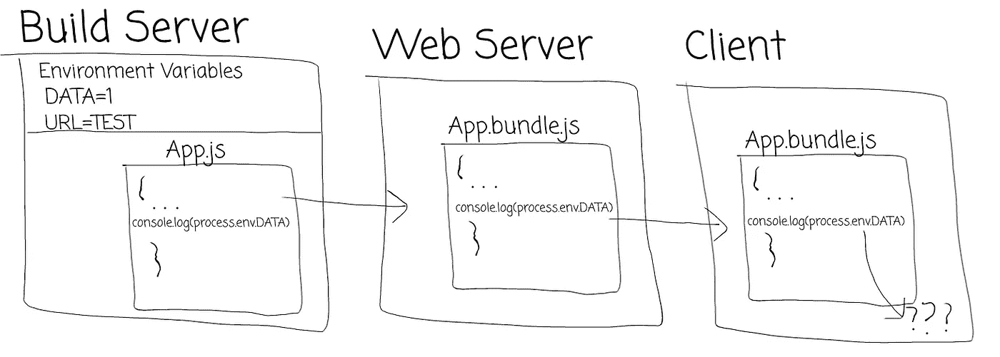
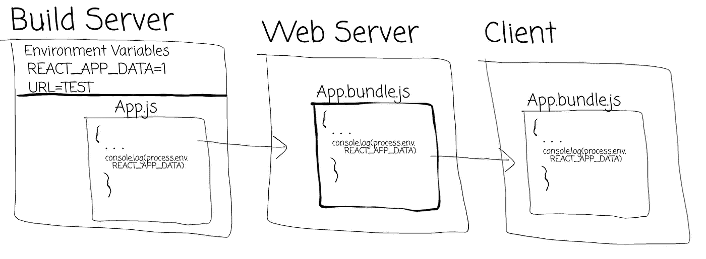
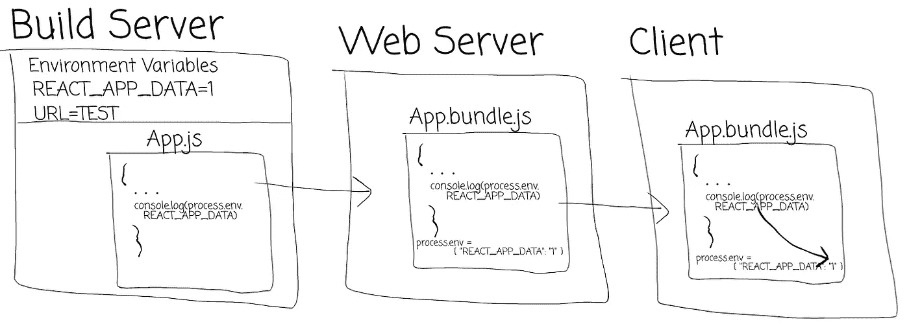

# create-react-app 如何伪造环境变量

> 原文：<https://levelup.gitconnected.com/how-create-react-app-fakes-environment-variables-a08a9cb6e581>

在没有 create-react-app 的情况下编写 React 应用程序时，我被如何在 web 应用程序中使用环境变量所困扰，并且在我的构建过程中遇到了无数问题，之后我决定研究 create-react-app 的构建脚本是如何工作的以及它的所有魔力。

您可能很熟悉在服务器端代码中使用环境变量来根据运行环境提供不同的值。当开始开发 web 应用程序时，采用这种方法并开始将其放入您的 web 应用程序中并不罕见。

# 问题是

简而言之，一个服务器可以有一组唯一的键和值。运行开发代码的服务器和运行生产代码的服务器可以拥有不同值的相同密钥，这意味着在不同服务器上运行的相同代码可以使用不同的值。

例如，node.js 应用程序允许我们使用`process.env`对象访问服务器环境。

不幸的是，这种基于环境变量的通用方法并不能很好地转化为静态 web 应用程序，即使是那些从流行的框架如 React 或 Angular 创建的应用程序。如果我们想在 React 应用程序中使用相同的方法来使用环境变量，会发生什么？

对于这个例子，我们使用 CI 服务器来捆绑我们的应用程序。让我们看看如何构建、部署使用相同 NodeJS 语法的 web 应用程序并将其提供给客户端。

虽然静态 web 应用程序构建在具有所需环境变量的服务器上，但是当我们将应用程序提供给浏览器时，对这些变量的引用就丢失了。

# 解决方案

但这是怎么回事呢？create-react-app 文档本身说你可以这样使用环境变量([https://Facebook . github . io/create-react-app/docs/adding-custom-environment-variables](https://facebook.github.io/create-react-app/docs/adding-custom-environment-variables))。

进一步阅读文档，您会发现环境变量只有在前缀为`REACT_APP`时才有效。让我们对我们的假装演示进行更改:

突然，我们的控制台注销“1”。

create-react-app 的构建脚本是否神奇地将 NodeJS `process`对象添加到了我们的 web 应用中？我们是否在窥视服务器的环境变量？神奇的`REACT_APP`前缀是如何让一切运转的？

幸运的是，`react-scripts`包是开源的，所以我们可以窥视其中的魔力。这样做，烟雾和镜像就清楚了，我们可以看到执行了什么样的技巧来让我们表现得好像我们可以访问构建服务器的环境变量。

以下脚本包含在 create-react-app 的 Webpack 配置([https://github . com/Facebook/create-react-app/tree/master/packages/react-scripts/config](https://github.com/facebook/create-react-app/tree/master/packages/react-scripts/config))的一部分中

这到底是怎么回事？回想一下**这段代码将在构建服务器**上运行，我们的`process.env`对象将在此时被填充。这段代码将遍历每个环境变量，**过滤掉所有不以**T1 开头的变量。然后导出该对象。我们可以在稍后 create-react-app 设置其 webpack 配置时看到它的使用:

Webpack `DefinePlugin`被传递了这个对象，它包含了我们过滤后的环境变量列表。这个插件到底是做什么的？

> `DefinePlugin`允许你创建可以在编译时配置的全局常量。—[https://webpack.js.org/plugins/define-plugin/](https://webpack.js.org/plugins/define-plugin/)

因此，create-react-app 正在为浏览器创建一个名为`process.env`的新的全局常量，并将其值设置为从构建服务器获取的过滤后的环境变量的值。

谜团解开了。

# TL；速度三角形定位法(dead reckoning)

当运行构建脚本时，create-react-app 检索环境变量对象，过滤掉任何没有前缀`REACT_APP`的键，并将它们传递给 Webpack `DefinePlugin`，Webpack 将该对象设置在位于`process.env`的全局常量上。

# 附录—本地环境变量

上面的内容是在构建服务器的伪装下编写的。我们希望能够在我们的本地开发机器上设置环境变量，这样`process.env.REACT_APP_DATA`就不会因为没有设置任何东西而无法定义。

幸运的是，create-react-app 自带`dotenv`。这个包将寻找一个名为`.env`的文件，并将它读入环境变量对象。在项目根中创建一个名为`.env`的文件，我们可以用我们的`REACT_APP_DATA`填充它:

当我们在本地构建我们的应用程序时，上面定义的过程将会运行，包括在这个文件中设置的任何变量。

 [## 学习 React -最佳 React 教程(2019) | gitconnected

### 排名前 49 的 React 教程-免费学习 React。课程由开发人员提交并投票，使您能够…

gitconnected.com](https://gitconnected.com/learn/react)