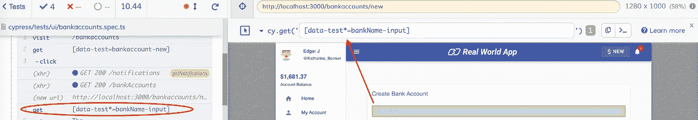

# Cypress 如何帮助非技术团队成员自动化测试

> 原文：<https://levelup.gitconnected.com/how-cypress-can-help-non-technical-team-members-automate-tests-b067fcb9a407>

## **关键用户和业务分析师也可以在 Cypress 中进行自动化测试，只需一点点帮助**


由[安德斯·吉尔登](https://unsplash.com/@andersjilden?utm_source=unsplash&utm_medium=referral&utm_content=creditCopyText)在 [Unsplash](https://unsplash.com/s/photos/bridge?utm_source=unsplash&utm_medium=referral&utm_content=creditCopyText) 上拍摄

一些最有价值的测试案例来自业务分析师和关键用户。他们确切地知道需求是什么，并且他们能够识别潜在的瓶颈。从业务角度来看，这些业务代表最擅长评估新特性。

但是最大的挑战是他们没有技术背景。他们的测试是功能验收测试，他们将为每个版本手工执行这些测试。但是当敏捷工作时，在 sprint 中测试所有东西是不可能的。当然，解决方案是测试自动化。

这就是为什么对我来说，我工作中最重要的一部分就是让这些业务代表参与进来。我通过确保每个人都做他或她最擅长的事情来做到这一点。我确保他们专注于创建可靠的测试用例，而我专注于技术挑战。通过这样做，我可以创建一个稳定且易于使用的测试环境。即使你完全没有技术背景。

# 与应用程序交互

当我刚开始从事测试自动化时，我大部分时间都在使用 CSS 选择器和 XPath。要理解这一点，您必须对 web 元素和域对象模型(DOM)有一个基本的了解。此外，您必须知道如何在 DevTools 中验证路径，以及如何将它集成到您的测试中。每个浏览器对待 XPath 的方式都不一样，所以也是如此。

在 Cypress，我们可以跳过整个过程，通过遵循 it 的[最佳实践](https://docs.cypress.io/guides/references/best-practices.html)来节省大量时间:

> 1.不要把基于 CSS 属性的元素作为目标，比如:id，class，tag
> 
> 2.不要将可能改变其文本内容的元素作为目标
> 
> 3.添加 data-*属性，以便更容易定位元素

我喜欢使用 data-cy 属性，因为它们是唯一的测试 id。这意味着页面上的每个元素都可以以一种标准化的方式直接调用。数据属性必须添加到页面元素中，因此需要在前端进行投资。如果您熟悉 Vue、Angular 或 React 等框架，您可以自己添加它们，如下所示:

```
<input type="text" name="client-id" onChange={this.handleChange} *data-cy*="inputClientID"/>
```

添加它们需要更多的努力，但是它给了你一个很大的优势。您的测试更加健壮，需要的维护更少。这意味着你将节省大量的时间！当然，这意味着修复脆弱测试的时间更少。您可以将这些时间投入到创建新的测试用例和优化中。

大多数前端开发人员不介意添加测试属性，但是他们不想在生产环境中拥有它们。有些人甚至认为这是“污染代码”。您总是可以创建一个 helper 函数来从代码中剥离 id。然后，如果代码被部署到生产环境中，id 将不会出现。

# 自定义命令，让你的队友生活更轻松

如果有了 id，就可以在 commands.js 文件中创建定制命令。这将使您的非技术团队成员更容易编写测试脚本。同样，以标准化的方式。

因此，与其为每个步骤编写代码:

```
*cy*.get(`[data-cy=${value}]`);
```

你的队友可以使用以下命令:

```
cy.dataCy(‘value’);
```

我曾经参与过将 [Jest](https://jestjs.io/) 用于单元测试和集成测试的项目。Jest 也支持测试 id，但是属性有可能有不同的名字，比如 **data-testid** 。如果是这种情况，我建议使用相同的命名约定。

现在有了 IDs，您的业务分析师和关键用户就不需要学习复杂的 XPath 了。他们只需要学会如何找到身份证。

# 在柏树游乐场找身份证



这张截图是我拍的。

柏树游乐场是找身份证的好地方。为此，你需要使用电子浏览器。在浏览器中，你必须激活顶部菜单中的操场选项，然后你可以简单地点击一个元素，它的 ID 就会出现。操场根据以下特定顺序的属性选择元素:

1.  数据中心，
2.  数据测试，
3.  数据测试 id，
4.  id，
5.  类，
6.  标签，
7.  属性，
8.  第 n 胎。

这是一个非常简单快捷的方法来获取所有的测试材料。如果您知道如何使用它，并且理解 Cypress 语法，那么您可以从头开始创建测试。而且没有任何开发技能。所以你现在需要做的就是训练你的测试人员。

# 培训非技术团队成员

当你控制了环境，你就可以开始训练你的关键用户使用 Cypress。我总是向他们展示基础知识，如何创建动态测试用例，以及如何验证结果。我教他们如何使用测试 id，以及如何使用定制命令。我向他们展示了如何确定测试用例的范围，从而使测试最稳定。

# 成功之路

根据我的经验，这是一个非常成功的方法。通过创建一个友好的测试环境，并通过适当的培训，您的同事将学会如何使用 Cypress fast。开发人员和测试人员将更紧密地合作，这将导致错误的预防，而不是检测错误。此外，当他们可以在演示中展示他们的第一次测试时，他们会感到自豪。

现在您将拥有自己的 Cypress 大使，并且您可以开始构建一个成熟的测试自动化组织。