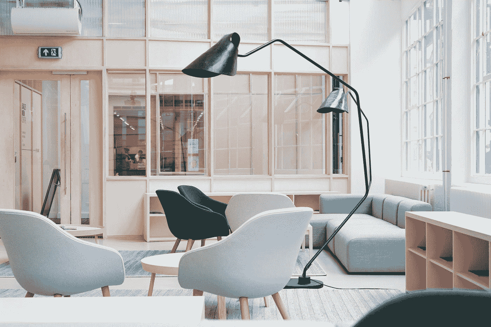

# 开发人员如何在嘈杂的开放式办公室工作？

> 原文：<https://levelup.gitconnected.com/how-developers-work-in-a-noisy-open-office-83c5e3b4f68d>

在 [Unsplash](https://unsplash.com?utm_source=medium&utm_medium=referral) 上由 [Toa Heftiba](https://unsplash.com/@heftiba?utm_source=medium&utm_medium=referral) 拍摄的照片

许多人在开放式办公室工作。它们很吵，可能会分散在那里工作的许多人的注意力。

在这篇文章中，我们将会看到一些方法来解决在嘈杂的办公室里工作的问题，并找到宁静。

# **听东西**

播放一些东西来掩盖噪音是对付嘈杂的办公室的一种方法。只需带上一些耳机，然后开始播放一些音乐、播客或有声读物，这样我们就可以掩盖噪音。

这是听音乐的好时机，也是听长篇播客和有声读物的好时机。由于工作时间很长，这是一个很好的机会去听长的播客和有声读物来学习一些东西。

# 降噪耳机

降噪耳机很棒。它们有助于消除我们不想听到的任何噪音，让我们能够专注于工作。

如果有必要的话，我们只需要问一个或者带一个到办公室。

# 耳塞

我们可以把耳塞放在耳朵里，这样我们可以掩盖噪音。那我们就不会再有噪音穿过我们的耳朵。

# 沉思

冥想是舒缓的，让我们远离所有的噪音，找到平静、安宁和安宁。

此外，它让我们专注于自己，而不是外界发生的干扰。

# **传达我们的需求**

我们也可以礼貌地告诉人们安静下来，这样我们都可以工作。大多数人可能会听。

然而，大多数人不喜欢对抗，所以这可能不是每个人的选择。

但最终，噪音可能会如此难以忍受，以至于我们宁愿进行对抗，也不愿忍受噪音，这样我们才能完成一些事情。

大多数人只是不知道他们很吵，所以我们应该告诉他们安静下来。

# **深呼吸，走开**

还有，我们可以深呼吸，然后走开一会儿。它让我们的头脑更清晰，我们可以远离噪音。

然后我们可以希望每个人都谈完了，我们回到一个安静的房间。

# 设置障碍

我们还可以设置障碍，让它更像一个小隔间。这样，我们可以消除人们说话时的噪音，同时也有一些隐私，这样人们就不会窥探我们在做什么。

# 去一个安静的房间

办公室里应该有一些安静的地方。我们可以走到那里，然后在那里工作。

由 [Austin Distel](https://unsplash.com/@austindistel?utm_source=medium&utm_medium=referral) 在 [Unsplash](https://unsplash.com?utm_source=medium&utm_medium=referral) 上拍摄的照片

# **在家工作**

在家工作可能是我们安静的最佳选择，因为我们可以控制自己的环境，所以我们可以做任何我们想做的事情。

如果我们真的需要赶上，那么我们可以在家工作。

如果没有在家工作的政策，我们可以试着问问是否有一天我们可以在家工作。如果我们想要更多的社交或者面对面的合作，我们仍然可以去办公室。

# 结论

对付在嘈杂的办公室工作有很多方法。

我们可以带降噪耳机。此外，我们可以用音乐或一些有声音频如播客和有声读物来掩盖噪音。

此外，我们可以在家工作或步行到一个安静的地方。如果噪音持续存在，我们也可以要求人们安静下来。

最后，我们也应该通过冥想和用耳塞塞住耳朵来寻找平静。