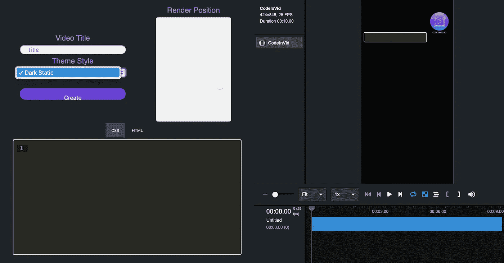
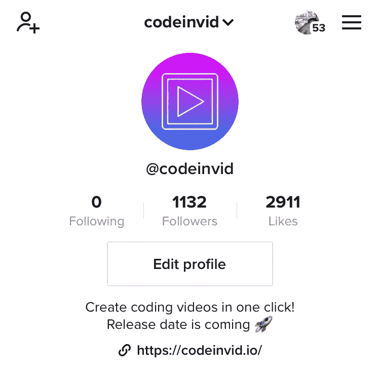
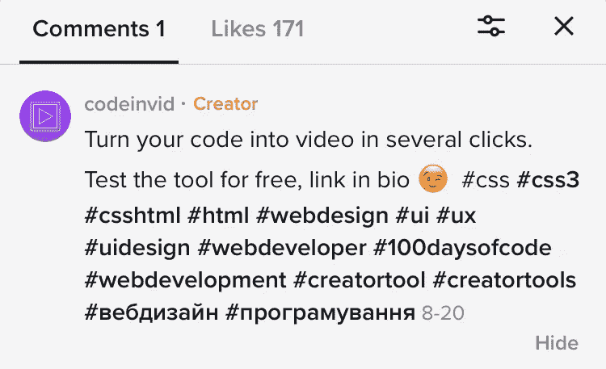
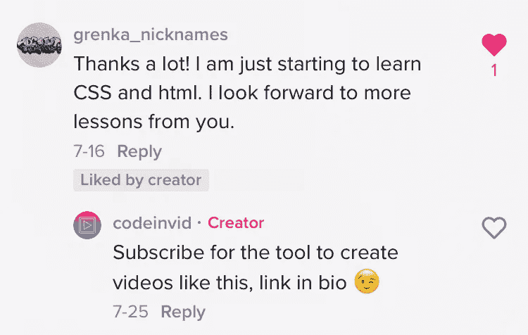
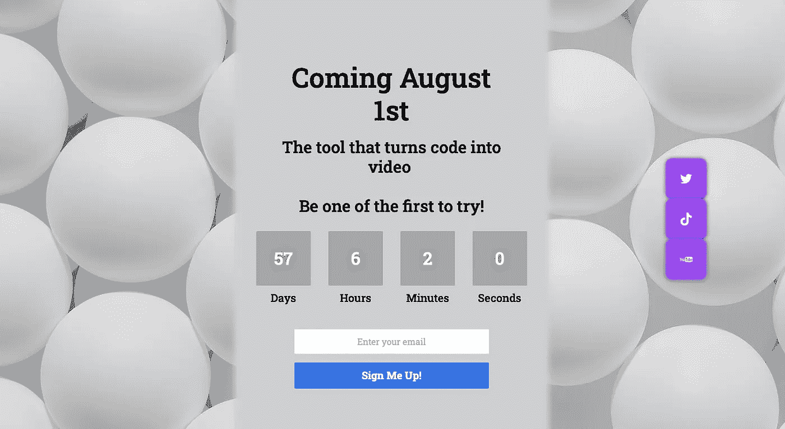

# 我如何在抖音上开展促销活动，并为我的服务获得了 117 个预订阅用户

> 原文：<https://levelup.gitconnected.com/how-did-i-run-a-promo-campaign-on-tiktok-and-get-117-pre-subscribers-for-my-service-ad4fbb3d02f9>

几个月前，我想到了一个主意。我知道开发人员只在 GitHub 或 Bitbucket 上以文本形式分享他们的代码。但现在是视频格式的时代。我开始开发一款工具，只需点击几下，就能把你的代码转换成视频。你不需要任何视频编辑方面的技能来创建这样的教程，因为这个工具代替你做所有的事情。

顺便说一下，我已经建立了 MVP，该工具可用于 HTML 和 CSS，你现在可以尝试一下。为了改进它，并从测试版制作钻石，我需要用户采访的人。因此，如果你是前端开发人员或 UX 设计师，[让我们赶上一个 30 分钟的电话](https://calendly.com/iyurchenko/30min?month=2022-09)

在做技术部分的时候，我明白我需要预订阅用户，没有宣传就不可能得到他们。至于我的潜在客户是想成为社交媒体明星的开发者和设计师，[我从抖音](https://www.tiktok.com/@codeinvid?_t=8VanOSHeYdy&_r=1)开始。

抖音正迅速成为最受欢迎的社交媒体平台之一。**2022 年的 Q1，抖音月活跃用户超过 10 亿。那可是很多潜在客户啊！那么，我怎样才能联系到他们呢？**

****这里是我在抖音成功营销的 5 个技巧:****

1.  **选择你的目标任何促销活动的第一步都是设定你的目标。你想通过你的活动达到什么目的？您是否希望提高品牌知名度？给你的网站带来流量？提升销量？对我来说，就是——告诉人们这个工具，并在发布前获得尽可能多的预订阅者。**
2.  ****确保您的个人资料完整**在您开始创建内容之前，请确保您的个人资料完整。这意味着填写你的简历，选择一张个人资料图片，并添加到你的网站或登陆页面的链接(只有在 1000 名追随者之后才有可能，顺便说一下，这是一个很好的动机)。你必须让潜在客户尽可能容易地找到你并更多地了解你的产品或服务。**

****

**3.使用标签标签是在抖音接触你的观众的一个很好的方式。当你使用相关的标签时，你的视频将会被搜索那个特定主题的人发现。就我而言，我准备了一个标签列表，比如#100daysofcode 或# developerstools，并在我发布的所有视频中使用它们**

****

**4.创作引人入胜的视频众所周知，抖音是一个视频之都。因此，要想在这个平台上取得成功，你需要制作吸引人们注意力的视频。它们应该是有益的或者有趣的。尝试跟随潮流，使用流行音乐/声音。它变化很快，所以你需要跟随潮流**

****

**5.评论你所在领域的影响者。我研究了关于前端开发主题的博客，并利用一切可能通过评论视频来接触他们的追随者。但要巧妙，不要看起来像是大量评论或垃圾邮件。我的评论和视频的内容 1000%相关。**

**这 5 条建议帮助我在抖音上获得了 1000 名关注者，并获得了 117 名 codeinvid.io 的预订阅者。**

****

**您可以通过对该工具提供反馈来帮助我将预订阅者转变为真正的客户。试试吧，给我写封短信或者[安排一次用户访问](https://calendly.com/iyurchenko/30min?month=2022-09) [，](https://calendly.com/iyurchenko/30min?month=2022-09,)只需要 30 分钟的时间和+100 到 karma:)**