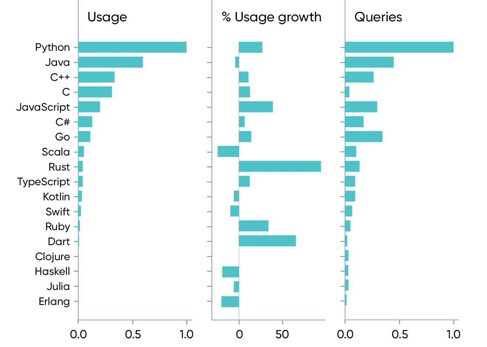
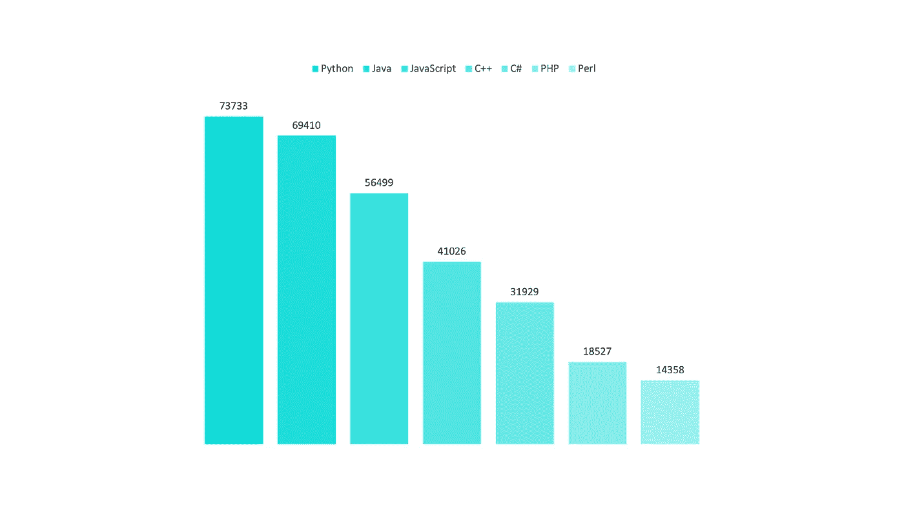
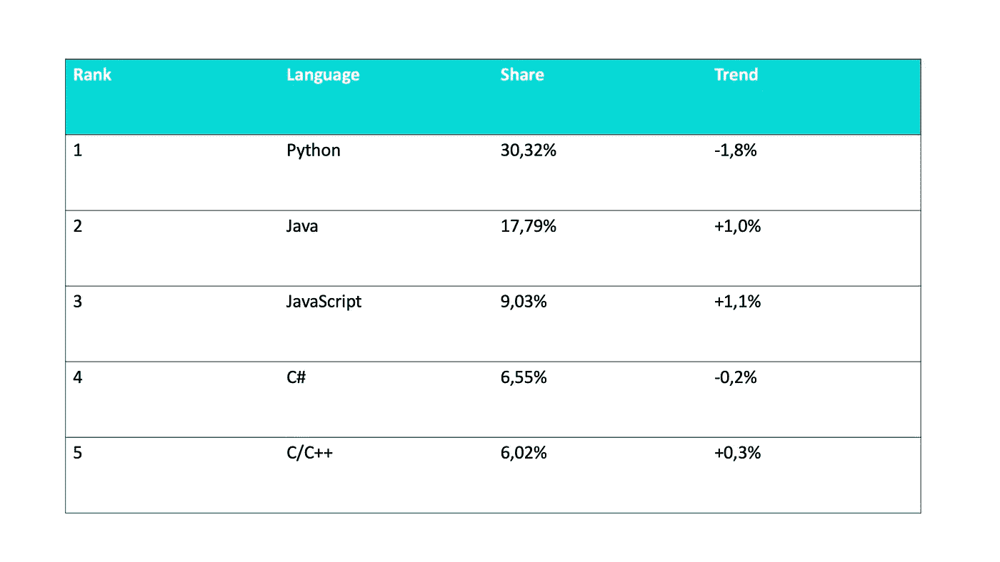
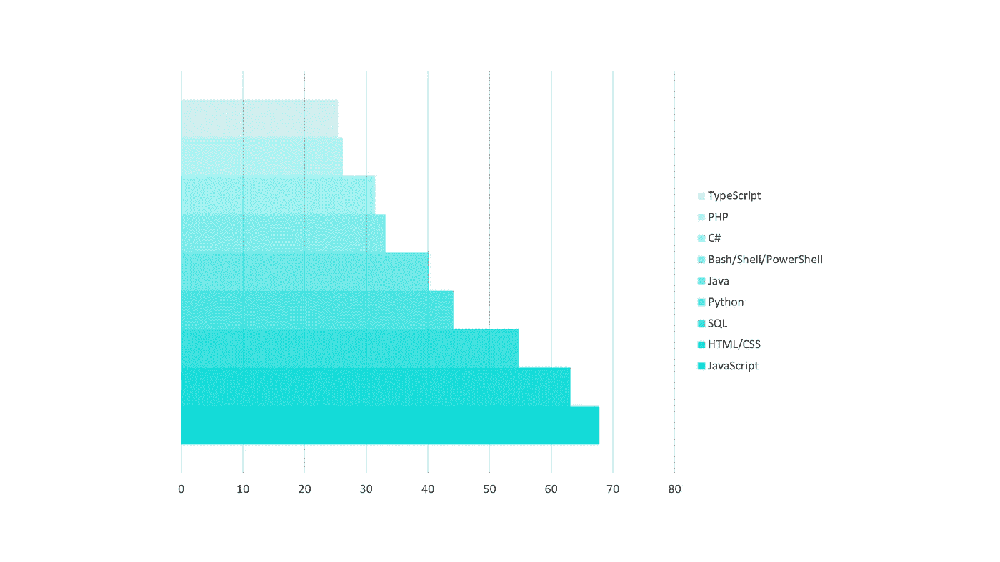
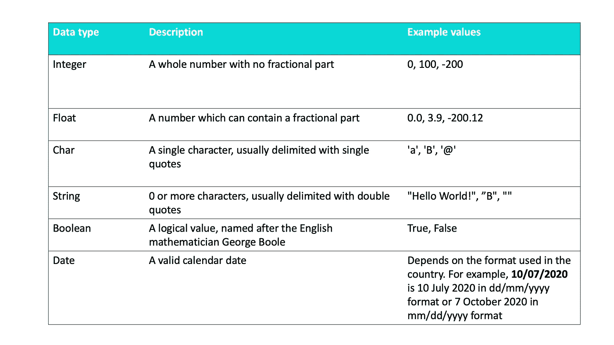
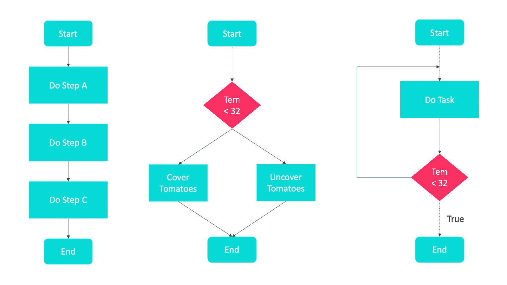

# 不同的编程语言如何做同样的事情

> 原文：<https://levelup.gitconnected.com/how-different-programming-languages-do-the-same-things-d75db9f28bf9>

## 思维程序员

## 几种流行编程语言的比较


在 [Unsplash](https://unsplash.com?utm_source=medium&utm_medium=referral) 上 [NeONBRAND](https://unsplash.com/@neonbrand?utm_source=medium&utm_medium=referral) 拍摄的照片

实际上，五种流行的编程语言是 C#、JavaScript、Java、Python 和 PHP。今天我对它们进行了比较，以找出不同的编程语言是如何做同样的事情的。

# **人气**

```
Java and Python appear to be the most popular language choices
```

## 要学习的编程语言

根据 O'Reilly 的报告“编程、Ops、AI 和云在 2021 年的发展方向”，在所有语言中，Python 是最受人们欢迎的语言，去年的兴趣比前一年上升了 27%。



[2021 年编程、运营、人工智能和云计算的发展方向](https://www.oreilly.com/radar/where-programming-ops-ai-and-the-cloud-are-headed-in-2021/)

## **全球发布的职位数量**

统计数据显示，与 Python 相关的工作正在蓬勃发展。这并不奇怪，因为它已经受到科学界的热烈欢迎。



Indeed.com 上发布的全球招聘信息

## 多久在谷歌上搜索一次语言教程？

PYPL 编程语言流行指数是通过分析语言教程在谷歌上被搜索的频率而创建的。Python 是最流行的语言。



多久在谷歌上搜索一次语言教程？

**社区**

根据 2020⁴. stack overflow 进行的一项调查，以下是最受欢迎语言的排名



最流行的语言

JavaScript 已经连续第八年保持其最常用编程语言的地位。

# 数据类型

数据类型是数据值和对这些值的一组预定义操作的集合。大多数语言都定义了数据类型，如下所示。



编程语言中的数据类型

## 整数

这是最常见的数字数据类型，用于存储不带小数部分的数字。

*   不同的长度:带符号的 char、short、int、long、long long ( *分别使用至少 1、2、2、4 和 8 个字节*)。
*   可能有符号或无符号(*典型实现:二进制补码)*
*   任意精度:典型的脚本语言和性能损失。

## 浮点

它也是一种数字数据类型，用于存储可能包含小数部分的数字。

*   模拟实数
*   单精度(浮点/实数)或双精度(双精度)
*   标准 IEEE 754
*   不能精确表达所有的实数

## 茶

它用于存储单个字母、数字、标点符号、符号或空格。

*   存储单个字符
*   表示的大小取决于使用的编码( *ASCII，现代语言:Unicode，UTF-xx* )(可能因不同字符而异，例如 UTF-8)
*   有时在语言中会缺失(Python 中的*:长度为 1 的字符串*)
*   甚至可以像数字类型(C)一样处理

## 线

它是一个字符序列，也是存储文本最常用的数据类型。

*   静态长度:Python，Java (String)，C#
*   有限的动态长度:C(长度的上限)
*   动态长度:JavaScript，Perl，标准 C++库

## 布尔代数学体系的

它代表值`true` 和`false` *。*

*   C89 中缺少，可以使用任意数字类型(零/非零)
*   通常使用一个以上的位来实现

# 输入和输出

一般来说，所有的编程语言都需要既接受来自`stdin`的输入又向`stdout`发送消息的方法。

## 输出

*   C#

```
Console.Write("Hello world!");
```

*   Java 语言(一种计算机语言，尤用于创建网站)

```
System.out.println("Hello world!");
```

*   Python 3.x

```
print("Hello world!", file = sys.stdout)
```

*   Java Script 语言

## 投入

*   C# 8.0

```
string testString;
testString = Console.ReadLine();
Console.WriteLine("You entered '{0}'", testString);
```

*   Java 语言(一种计算机语言，尤用于创建网站)

```
Scanner scanner = new Scanner(System.in);
String testString = scanner.next();
scanner.close();
System.out.println("You entered " + testString);
```

*   Python 3.x

```
testString = input("You entered ")
print(testString)
```

# 经营者

大多数语言利用特殊符号对数据进行算术、逻辑运算或关系运算。

## 算术

计算机程序广泛用于数学计算。

例如，`+, -, *, /`。

## 逻辑学的

逻辑运算符在任何编程语言中都非常重要，它们帮助我们根据特定条件做出决策。

**布尔** `**AND**` **运算**

称为逻辑与运算符。如果两个操作数都不为零，则条件为真。

**布尔** `**OR**` **运算**

称为逻辑或运算符。如果两个操作数中的任何一个非零，则条件为真。

**布尔** `**NOT**` **运算**

称为逻辑非运算符。用于反转其操作数的逻辑状态。如果条件为真，则逻辑 NOT 运算符将为假。

## 有关系的

关系运算符是一种编程语言构造或运算符，用于测试或定义两个实体之间的某种关系。

*   数字相等(例如，5 = 5)
*   不等式(例如，4 ≥ 3)

# **构造**

程序是计算机执行的一组指令。它是由结构组成的。所有程序只有如下 3 个构造结构。



3 种构造结构

## 顺序

一组线性语句，按严格的顺序一个接一个地执行，没有重复，没有遗漏。

```
var a = 1; 
var b = 2; 
var c = 3; 
a = b; 
c = a; 
```

## 选择

选择语句提供了选项之间的选择，如指令执行的可用路由选项中的选项。

比如`if…else`。

```
var a = 1; 
var b = 2; if (a < b) {
    var text = “I know a < b, it’s a bit obvious”;  
}document.getElementById(“demo”).innerHTML =text;
```

## 重复

重复结构导致一组一个或多个程序语句被重复调用，直到满足某个结束条件。

比如`for loop`、`while loop`、**、**、`do…while`。

```
var a = 0; 
var b = 10; 
result = “a < b”; 
text = “ “; while(a < b) { 
    text += result + “<br>”; 
    a++; 
}document.getElementById(“demo”).innerHTML = text;
```

# 结论

我们可以发现不同的编程语言做同样的事情，所以我们可以用不同的方式实现一个解决方案。

很简单，对吧？

# 参考

[1][https://www . oreilly . com/radar/where-programming-ops-ai-and-the-cloud-are-head-in-2021/](https://www.oreilly.com/radar/where-programming-ops-ai-and-the-cloud-are-headed-in-2021/)

[https://indeed.com/](https://vn.indeed.com/?r=us)

[http://pypl.github.io/PYPL.html](http://pypl.github.io/PYPL.html)

[4][https://insights . stack overflow . com/survey/2020 #最受欢迎的技术](https://insights.stackoverflow.com/survey/2020#most-popular-technologies)