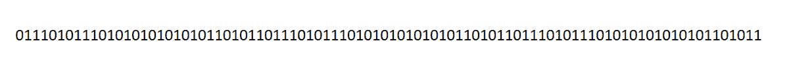
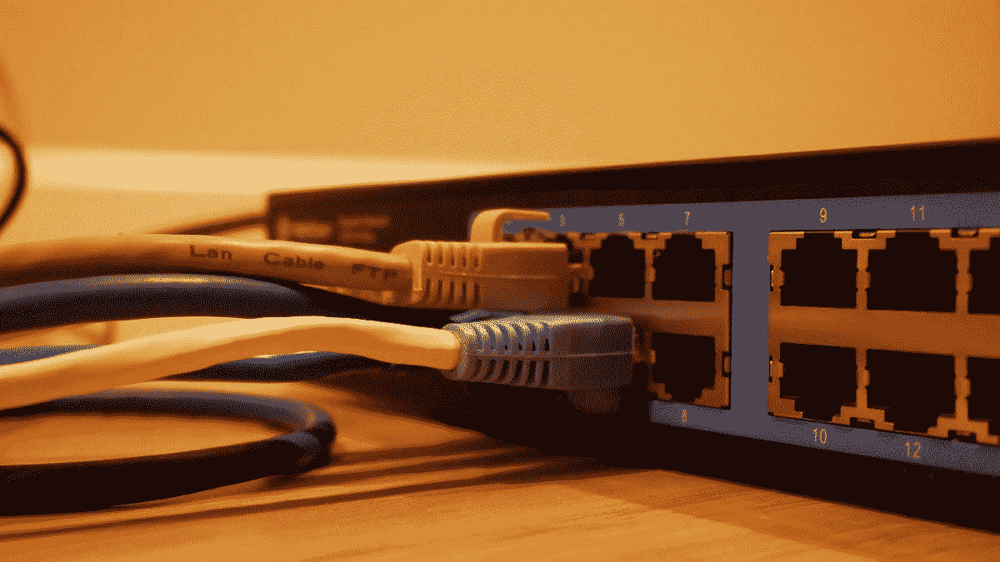
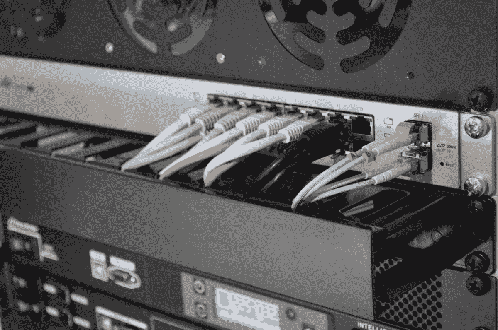
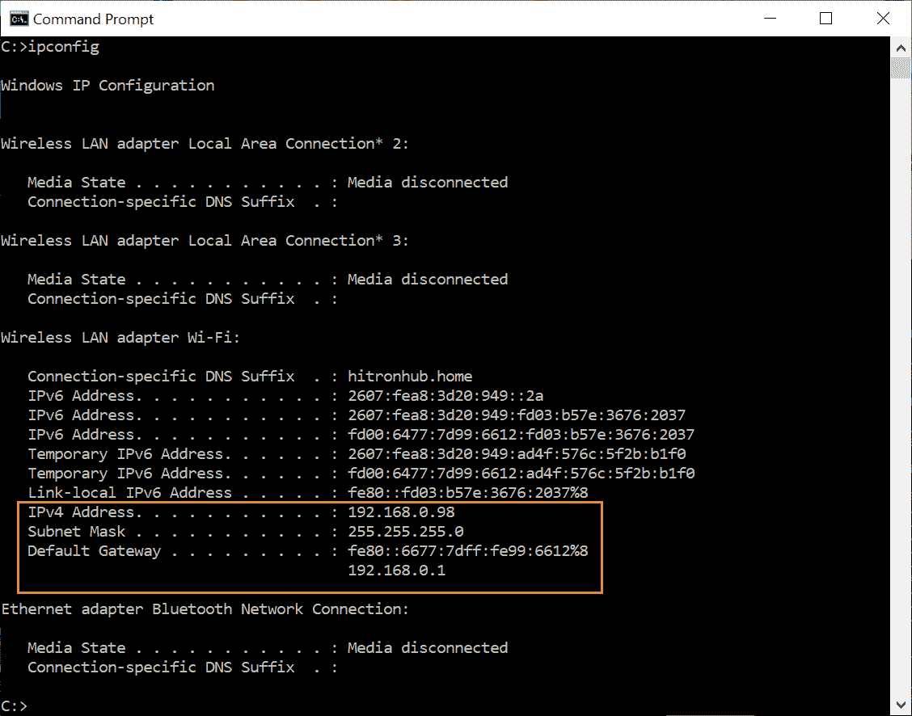
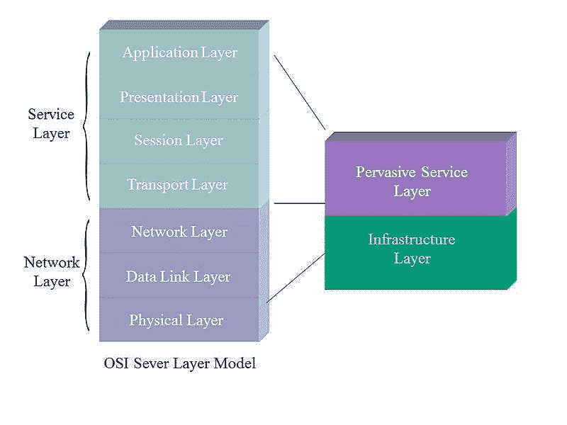
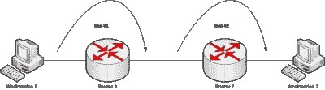
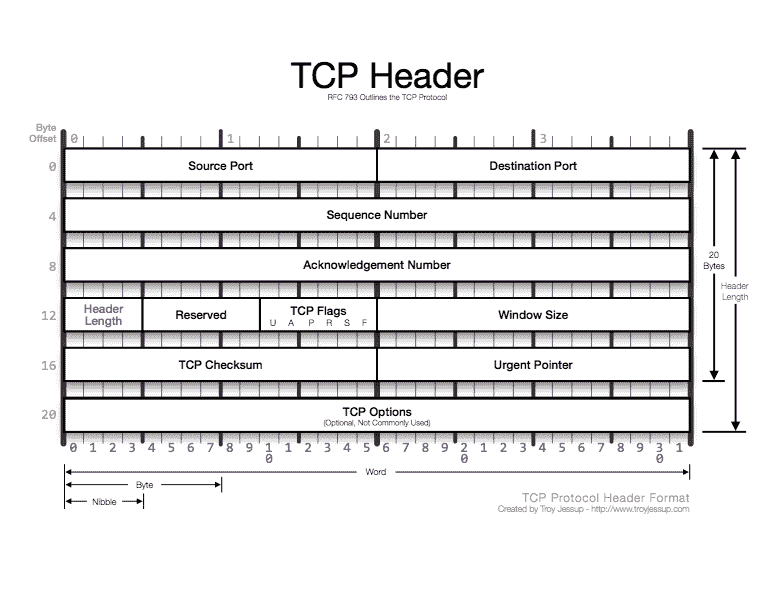
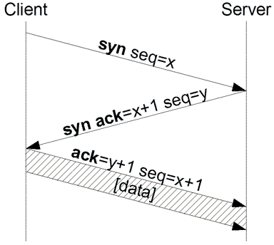

# 计算机是如何相互通信的？

> 原文：<https://levelup.gitconnected.com/how-do-computers-communicate-with-each-other-50636acbeb4c>

从某种程度上考虑人类交流。人类使用**语言**相互交流。这种交流可以创建一个**网络**，人们在这里**连接**。创建一个网络意味着有一个共同的媒介将我们所有人联系在一起。它可以是一个想法，类似的爱好或工作，但对于计算机来说，链接可以只是一根电缆。

**简介**

计算机交流类似于人类交流。事实上，计算机科学的许多方面与人类行为相似。如果你对这台机器如何相互通信以及数据如何在网络上流动感到好奇，那么这篇文章绝对适合你。如果计算机对你的思维来说是一个迷人的主题，那么让我们说计算机交流在某种程度上可以让你兴奋。

在我们深入研究计算机通信之前，我想简要介绍一下这篇文章的结构。第一段提供了关于计算机系统的一般信息。接下来，我们将重点介绍更多的技术术语和详细术语，如计算机网络和网络协议。

*   关于计算机的一般信息
*   计算机如何理解程序
*   什么是计算机网络
*   计算机如何通过网络进行通信
*   什么是 OSI 模型
*   网络上的数据流

## 让我们从基础开始

从最基本的开始。什么是电脑？我们为什么需要电脑？电脑可以互相交流吗？怎么会？

他们当然可以。首先，计算机是人类为了提高生活质量而创造的机器。计算机是一种能够处理和计算算术和逻辑运算的机器。被创造用来比人类更快地计算这些操作，所以它是一个核心的计算设备。

> 硬件和软件的组合被称为计算机系统。

计算机系统使用硬件与软件协作来处理多个程序。**程序**是执行特定任务的一组指令。

第一个计算机程序是由大约 200 年前出生的数学家阿达·洛芙莱斯发明的。1843 年，她开发了与分析引擎相关的算法。她成为著名的数学家，还因为她对计算机科学和计算机未来及其性能的洞察力。

从[计算机历史](https://www.computerhistory.org/timeline/computers/)中检查此时间线

 [## 计算机|计算机历史时间表|计算机历史博物馆

### 阿塔纳索夫-贝里计算机(ABC)在 1939 年成功演示了一个概念验证原型后完成…

www.computerhistory.org](https://www.computerhistory.org/timeline/computers/) 

## 但是他们如何理解这些程序呢？

计算机只能理解二进制形式 0 和 1。前面提到的程序都是程序员用编程语言写的。

从高级编程语言到低级编程语言，**编译器**将任何编程语言转换成汇编(最接近机器)语言，以便理解和处理程序的操作。

计算机处理 0 和 1 的序列！

## 计算机通过自己的网络进行通信

我们每天都在使用互联网。这实际上意味着我们都连接在同一个网络中。互联网是一个全球性的网络，它连接了世界上所有的用户，他们可以在任何时候从不同的地方相互交流，因为他们属于同一个网络。

网络是一组互连。它也可以是一组较小的网络。计算机网络使用两台或多台通过网络介质相互连接的计算机。

同一网络中的用户可以使用相同的硬件(打印机)或软件(相同的程序)传输不同类型的数据，如文本、视频、语音等。硬件用于相互链接，例如有线电缆、光纤或无线连接。

照片由[乔纳森](https://unsplash.com/@isodme?utm_source=medium&utm_medium=referral)在 [Unsplash](https://unsplash.com?utm_source=medium&utm_medium=referral) 上拍摄

网络分为两种不同的类型。这些类型是**局域网**和**广域网**。主要区别在于网络内连接的**范围**。

首先让我们简单解释一下什么是本地网络。

从它的名字你可以理解，LAN(局域网)可以连接更小范围的计算机，因为它是基于本地的。

你可以认为本地网络侧重于连接有共同点的人，例如学校课堂上让学生或员工交流的计算机或公司的计算机。局域网可以是仅由他们访问和使用的安全网络。所以现在局域网已经授权用户使用他们的 IP 地址，这将在下面解释。

下面还解释了网络如何识别发送者和接收者。

现在我们来解释一下广域网。随着用户数量的增长，广域网可以用来创建比局域网更大的网络。

接下来是广域网，它连接更大地理区域的网络。假设公司已经将他们的办事处扩展到不同的国家或城市，并且仍然希望相互交流。WAN 用于在长距离区域之间或连接到更大网络的不同网络之间传输数据。

由于用户数量和复杂性，广域网的速度可能比局域网慢，但这取决于其设置。

是的，广域网用来连接局域网。互联网是一种广域网，对吗？

## 网络如何识别哪台计算机是接收方？

现在我们已经创建了一个局域网。属于同一个网络的所有计算机，我们可以用一根叫做**以太网**的公共电缆将它们连接起来。当计算机 A(实际上有一个用户)想向计算机 B 发送信息时，信息在电缆中传输，进入网络中的每一台计算机，因为它们共享相同的介质。

但是网络如何知道消息的接收者呢？

信息有一个最终目的地，一个等待阅读信息的接收者，他可能也想交换信息。为了让路由器解决这个问题**每台电脑都有一个唯一的 MAC 地址**。此地址确保计算机的物理地址是唯一的。

每台独立的计算机都有一个由他们的 **ISP** 给定的专用地址。**IP(互联网协议)**地址对于连接到网络的每台计算机都是唯一的，并且当然会定义它们，以便计算机可以被识别。用句点分隔的 IP 地址是四个 8 位数字，如 192.168.1.8，每一组都是从 0 到 255 的范围。

互联网协议有助于在同一网络中发送数据。数据通过网络数据包发送。每台计算机都有一个静态 IP 和一个公共 IP。

您的计算机有一个专用的私有 IP。ISP(互联网服务提供商)会为您的设备分配一个地址。这个 IP 存储在路由器中。路由器有一个路由表，收集所有连接到该网络的私有 IP 地址(手机、笔记本电脑等)。在你连接的每个网络中，网络的 ISP 会给你分配一个不同的 IP 地址，例如，如果你连接到一个像 Starbucks 这样的公共网络，IP 地址就会改变，并且由 Starbucks 合作的提供商提供。

路由器帮助设备使用不同的 IP(公共 IP)连接到全球网络(互联网)。公共 IP 由 ISP 从分配每个网络地址的路由池中设置。公共地址可以是动态的，也可以是静态的，但现在我们不会拘泥于此。

我只是想让你明白，你的**计算机**连接到一个**网络**，网络可以从它的 **IP 地址**识别它。在网络中，您的计算机可以与通过以太网或交换机连接到同一网络的其他计算机进行通信。

**以太网**电缆是网络中每台计算机的公共媒介。交换机可以用来分割有线网络。多条电缆连接到负责数据传输的交换机。因此，如果计算机 A 要向计算机 B 发送数据，交换机不会将信号发送到所有相连的计算机。**交换机**保存 MAC 地址，只在需要的地方转发消息。交换机帮助网络**避免冲突**。

托马斯·詹森在 [Unsplash](https://unsplash.com?utm_source=medium&utm_medium=referral) 上拍摄的照片

这是电脑相互交流的地方。

*   号外:怎么才能看到自己的 IP？

windows:打开 Windows 终端(cmd)- Windows 键+ R 并键入 ipconfig 或 ipconfig /all

Linux: Ctrl-Alt-T 并键入 ifconfig

## 开放系统互连模型

计算机通信使用**协议**，协议建立**一套规则**以保证通信成功且无错误。协议体系结构可以让数据在使用硬件和软件的一组特定操作内从一台计算机传输到另一台计算机。

每一个过程，比如沟通，都是由一个模型定义的。在这种情况下，我们的模型是 **OSI(开放系统互连)模型**。这个模型有七层。例如，为了理解它的用途，该模型使公司更容易测试他们的产品软件在哪一层崩溃，以及为什么它有问题，因为他们的产品或数据必须在不同层之间传递。

这是一次不同层面之间的旅行。每一层都使用不同的协议。每个协议可以使用不同的硬件或软件。每一层都与前一层无关，即如果它显示错误，那么问题只存在于特定层，因为每一层都有不同的任务要完成。

OSI 模型的七层:

从底部移动到顶部

## 数据如何从一层移动到另一层

为了理解基础知识，我们将介绍从一层到另一层的数据传输的要点，而不涉及技术细节。

假设以太网是介质，数据以信号的形式通过它传输。数据通信完全是关于从一跳到另一跳直到最终目的地的数据包传输。这被称为跳网络。

跳跃网络

数据从包含电缆的物理层(物理传输介质)开始它们的旅程。数据是一种信号。那些信号**在第一层被解释为 0 和 1** 的形式。是时候转移到称为数据链路层的第二层了。它负责将消息组织成不同的块，并找到数据将遵循的网络路径。收集属于同一网络的节点的 Mac 地址，并确定帧从一跳到另一跳必须遵循的路径(**跳网络**)。

接下来，我们继续讨论基于 IP 协议的网络层(第 2 层)。这一层从端到端主机、发送方和最终目的地接收方收集 IP 地址。然后，传输层(第 3 层)依赖于 IP 协议，并创建一个包含 MAC 和之前找到的 IP 的数据包报头。下面我们进一步解释一下。

## 传输层和 TCP/IP 协议

**传输层**是 OSI 模型的第四层。传输层处理数据量、速率和目的地。这一层也必须根据协议工作。

这一层使用 **TCP(传输控制协议)。**这种被称为 TCP/IP 协议的协议依赖于来自网络层(第 3 层)的 IP 协议。

第四层确保数据无误，并按顺序交付，不会丢失或重复。**提供可靠性**，它负责在下一层建立会话之前完全控制数据传输。传输层也负责数据包的分段。

将大量数据分解成数据包，这一操作确保了**数据完整性**。主要的 TCP 操作是数据包分段、消息确认、流量控制和会话多路复用。

如前所述，节点的路径、MAC 之间的跳数和 IP 地址从前面的层是已知的。TCP now **在每个数据包的**报头**中添加信息**，该信息包括源端口和目的端口、序列号、确认号和校验和字段。

TCP 报头的结构如下所示:

ACK 号包含接收器等待序列中下一个数据包的值。这样，TCP 提供了**可靠性**。对于每个失败并包含错误的数据，TCP 提供重新传输，并继续发送无错误的数据包。

为了交换信息，必须在节点之间建立连接。TCP 面向连接，提供**双向通信**。TCP 连接是在三次握手中建立的。就像**客户端和服务器之间的文字握手，以了解对方**并交换数据包。

**客户端和服务器之间的 TCP 三次握手**

为了继续下一层，我们将简要介绍它们是如何工作的。

现在我们转移到会话层(第 5 层)。它负责打开、维护和终止节点之间的通信会话。还提供认证机制，以验证用户(即密码验证)。

现在数据在表示层上移动。数据的压缩和加密/解密是它的主要功能。也称为语法层，因为它处理下一(应用)层需要的语法(即 ASCII 翻译)。

很明显，应用层支持应用程序对吗？支持 SSL、FTP 和 SSH，这将在另一篇文章中详细介绍。请注意，这一层支持**服务**，如邮件和文件传输，以及与**应用**的交互。

最后，我们到达了最后一层，应用层(第 7 层)。

我们的最后一步。

应用层是 OSI 模型的最高层次。这一层最接近最终用户，支持客户机-服务器协议，如 HTTP，这是最流行的协议之一。也支持域名系统，文件传输协议，HTTPS，SMTP 等。允许**获取资源**如网站的页面(HTML，图像，样式表)。它是一个抽象层。提供**可用性**并允许用户与软件应用程序交互。文件和电子邮件传输、域名服务、远程服务器登录是最后一层的功能。

**结论**

这篇文章涵盖了计算机通信的基础知识。现在，您知道了数据如何以可读的形式通过不同的层和协议从电缆作为信号传输到另一台计算机。每次你点击发送按钮，数据(信号)就变成 01010101，根据 OSI 模型在不同的层之间传输。现在你也知道每一层的功能了！很酷，对吧？

关于计算机通信有成千上万的细节，但在这篇文章中，我只想分享一些基础知识。

我们探索了表面，所以你现在可能有问题。为了进一步阅读，我推荐一本容易阅读的有趣的书

拖延是一个！

*   数据与计算机通信(威廉·斯塔林斯 1985)

感谢您阅读本文！！

🌐**在** [**Twitter**](https://twitter.com/StelHunter) **和** [**Github**](https://github.com/StelKinigou) 上找我