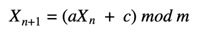
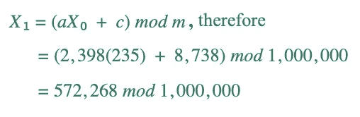
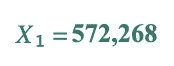
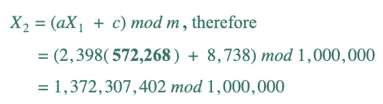
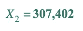
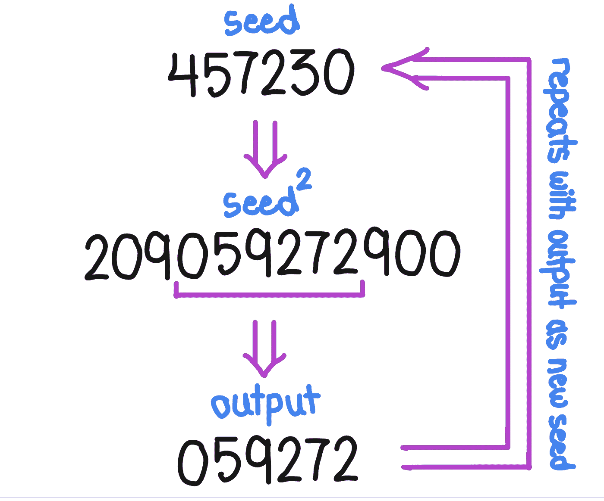
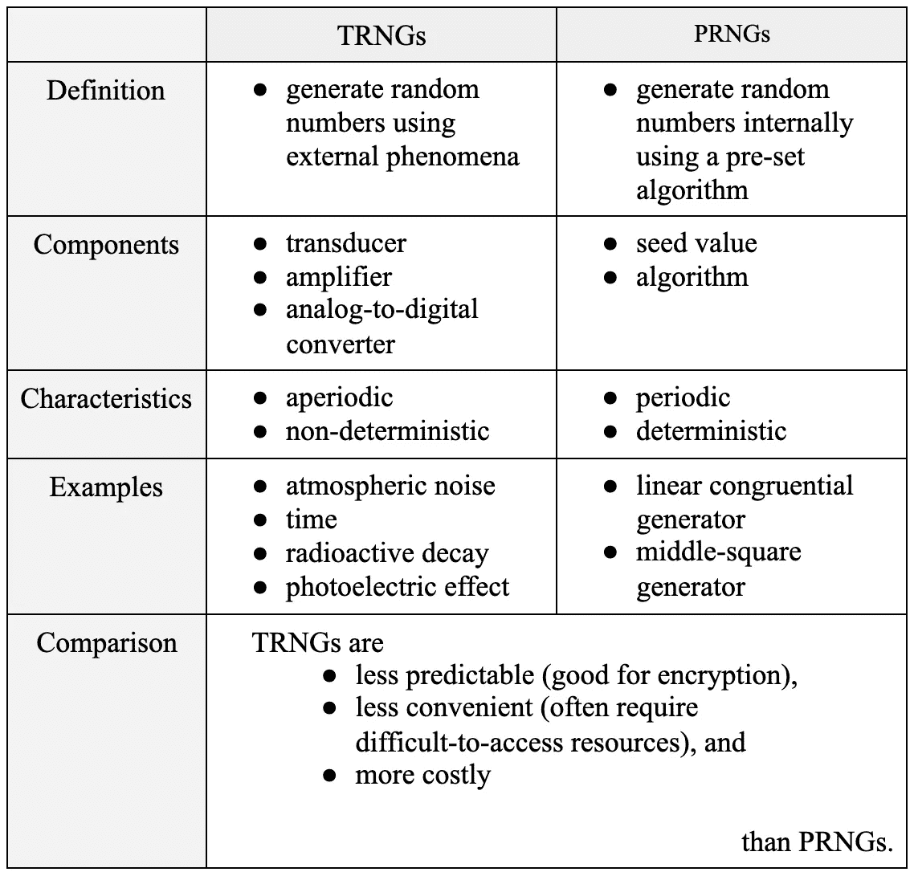

# 计算机如何产生随机数

> 原文：<https://levelup.gitconnected.com/how-do-computers-generate-random-numbers-a72be65877f6>

信不信由你，遵循规则的机器实际上是相当自发的。


图片由 [Pixabay](https://pixabay.com/photos/games-dice-of-cube-statistics-4725932/) 上的 [JACLOU-DL](https://pixabay.com/users/jaclou-dl-5602247/) 拍摄

## 索引

*   [真随机数发生器(附例子)](#5e79)
*   [伪随机数发生器(附示例)](#e15c)
*   [比较两者:trng vs prng](#fc8f)
*   [汇总表](#71d9)

我想我们都遇到过这样的群体情况:有一项可怕的任务必须完成，但没有人愿意去做。无论是坏消息还是项目结束后的清理工作，总有人要为团队做点什么。

那你怎么解决呢？你不能让某人随便选一个号码，因为他们总是可以改变他们的号码来刁难他们最不喜欢的成员。你能做的就是[让电脑帮你做](https://www.google.com/search?q=flip+a+coin&oq=flip+a+coin&aqs=chrome.0.69i59j0l4j69i60l3.1511j0j7&sourceid=chrome&ie=UTF-8)。但是产生的数字真的是随机的吗？**计算机，一台被定义为遵守指令和公式的机器，是如何产生随机结果的？**

在我们开始之前，有一点很重要，那就是随机生成比解决群体纠纷更有用。随机性是赌博、视频游戏、统计抽样以及最著名的密码学的前沿。如果它们不是不可预测的，我们的设备将缺乏基本的安全功能，更容易受到网络攻击。

计算机产生随机数的方法主要有两种:**真随机数发生器(trng)**和**伪随机数发生器(prng)**。前者使用计算机之外的一些现象来生成数字，而后者依靠预设的算法来模拟随机性。

如果这还没有任何意义，不要担心**——接下来还有更多。**

# ****真随机数发生器(trng)****

****

**[核随机数发生器](https://hackaday.io/project/4628-nuclear-random-number-generator)由 [M.daSilva](https://hackaday.io/mano)**

**真正的随机数发生器(也称为硬件随机数发生器)通过**收集熵**来产生数字，这意味着它们从不可预测的环境条件中收集信息。**

**为了将一些物理现象转换成数字，TRNG 必须有几个硬件组件:**

*   ****传感器:**将被测现象转换成电信号**
*   ****一个放大器:**这增加了信号中随机变化的幅度，因此它们可以被设备识别**
*   ****模数转换器:**将信号转换成数字**

**TRNG 源的一些例子包括大气噪声、时间和放射性衰变。**

## **大气噪声**

**这利用了大气中发生的 RNG 过程。最常见的是，它能捕捉到闪电产生的静电，这种现象在 second⁴.大约发生 40 次这种方法就像它们一样不可预测。**

> **[众所周知，Random.org](https://www.random.org/)使用大气噪音为各种不同的场景生成随机结果。强烈推荐去看看！**

## **时间**

**一些 TRNGs 将使用您按键或单击鼠标的精确纳秒来生成一个随机数。例如:如果你想生成一个介于 1 和 10 之间的整数值，你在下午 4:50:52.287503482 点整按下回车键(是的，我刚刚敲了键盘)，那么计算机可能会取最后一个数字，并使用“2”作为输出。**

## ****放射性衰变****

**当原子核不稳定时，没有办法预测它何时衰变。这使得它成为产生真随机数的理想的熵源。**

> **如果你有兴趣了解更多关于放射性衰变和 RNG 的知识，你可能想看看 FormiLab 的热门话题。**

# ****伪随机数发生器****

****

**图片来自 [Pixabay](https://www.pexels.com/photo/code-coding-computer-cyberspace-270373/)**

**PRNGs 依靠算法生成看似随机的数字序列。正如前缀“pseudo”所暗示的，这个序列实际上并不是随机的，只是看起来像而已。PRNG 的两个主要组成部分是初始值或**种子、**和预设的**算法**。**

**它是这样工作的。发电机必须:**

1.  ****接收**初始值或**种子**作为输入**
2.  **通过对种子应用一系列数学变换来生成一个新数字**
3.  ****使用**获得的值作为下一次迭代的种子**
4.  ****重复**过程，直到达到所需长度**

**PRNGs 是**确定性**和**周期性**。它们是确定性的，因为一旦定义了算法和种子，就没有什么可以改变输出的数字。序列中的每个连续数字都与前面的数字相关；这就是所谓的递归关系。PRNGs 是周期性的，这意味着它们在一定次数的迭代后会重复自身。一个好的 PRNG 算法应该有很长的周期。**

**让我们来看一些例子:线性同余发生器**和中间平方发生器**。**

> **注意:PRNGs 还有无数其他类型和变体，其中一些听起来很酷，比如 [Philox](https://numpy.org/doc/stable/reference/random/bit_generators/philox.html) 和 [Mersenne Twister](https://www.sciencedirect.com/topics/computer-science/mersenne-twister) 。**

## ****线性同余发生器****

**线性同余发生器(LCG) 于 1958 年首次亮相，是至今最流行的 algorithms⁵.之一**

**它遵循以下格式的递归关系:**

****

**在哪里**

*   **X₀是**种子**或**起始值(0 ≤ X₀ < m)****
*   **a 为**乘数(0 ≤ a < m)** ，**
*   **c 为**增量(0 ≤ c < m)** ，且**
*   **m 是**模数(m > 0)****

**让我们使用上面概述的过程来尝试一个例子。设 X₀ = 235，a = 2,398，c = 8,738，m = 100 万。**

**步骤 1:接收一个初始值或种子作为输入。**

**太好了！我们已经做到了: **X₀ = 235。****

****第二步:通过对种子应用一系列数学变换来生成一个新数字。****

**使用 a、c 和 m 的值，我们可以完成计算:**

****

*   **100 万适合 572268**乘以**0，剩下**572268**的余数。**

****

****第三步:使用获得的值作为下一次迭代的种子。****

**我们的 X₁是 572，268，所以要得到我们的 X₂，我们只需再次使用我们的公式:**

****

*   **1，000，000 适合 1，372，307，402 **的 1372 倍，**剩下剩余的 **307，402** 。**

****

**第四步:重复这个过程，直到达到想要的长度。**

**通过重复步骤 1 到 3，我们发现这个序列的前 10 个数字是 572268、307402、158734、652870 和 590998。看起来很随意，不是吗？**

**如果您不喜欢手动进行所有这些计算，我创建了一个方法，它返回由线性同余算法生成的一系列值。下面是用 Java 语言呈现的:**

```
public static String generateRandomNumbers(int length, long x0, long a, long c, long m)
 {
  StringBuilder sb = new StringBuilder();

  long x[] = new long [length];
  x[0] = x0;

**// applies a series of mathematical operations to a term (x[i]) in order to find the next term in the sequence (x[i+1]); this repeats until the desired length is achieved** for(int i = 0; i< length-1; i++)
  {
   x[i+1] = (long) ((a*x[i] + c) % m);
   sb.append(x[i+1]+" ");
  }

  String results = sb.toString();

  return results;
 }
```

## **中间平方生成器**

****

**中间平方方法是乔恩·冯·诺依曼在 1949 年发明的，其工作原理是用**对种子值**求平方，**提取其中的中间数字**作为下一个种子。⁶**

> **注意:这种方法被认为是不太实用的算法之一，因为它的周期较短。大量的种子值很快会导致零或其他数字的重复。**

****要让这个方法生效，需要满足几个条件:****

*   ****平方种子的位数必须至少是种子的两倍。**如果不是这种情况，则添加前导零进行补偿。**

***例如，如果我们的种子是 20，那么种子就是 400。400 有 3 位数，20 有 2 位数。由于 3 < 2*10，我们加一个前导零使平方值为 0400，我们的输出是 40。***

*   ****种子必须有偶数位数。**这是因为对奇数求平方并不保证会有中间数字要提取。**

***如果我们的种子是 617，那么种子就是 380689。这里，种子中的位数是种子位数的 2 倍，因此满足该条件。然而，没有 3 个中间数字是有效的。这可以通过在种子中添加前导零来纠正:0617→00****3806****89→3806。***

**同样，我们可以创建一个 Java 程序，它将一个种子作为输入，并生成一个数字序列。**

**首先，我们必须创建一个方法来获取种子，对其求平方，然后提取中间的数字:**

```
**// String x = seed // int digitsX = number of digits in the seed**public static String getMiddleDigits(String x, int digitsX)
 {
  String leadingZeros="";

**// adds leading zeros** for(int k = 0; k < x.length(); k++)
  {
  if(x.charAt(k)!='0') {
   break;
  } else {
   leadingZeros+="00";
  }
  }**// squares the seed, converts it to a string array, and obtains the number of digits
**  
  String squared = leadingZeros + String.valueOf((long) Math.pow(Integer.parseInt(x), 2));
  String[] stringSquared = squared.split("");
  int digitsSquared = stringSquared.length;

  **// finds the digit in the squared seed where the next term will start** int start = (int) (digitsSquared - digitsX) / 2;
  String [] newTerm = new String [digitsX];StringBuilder sb = new StringBuilder();

**// creates the new term by adding digits from the middle of the squared seed to an array** for(int j = 0; j < digitsX; j++)
  {
   newTerm[j] = stringSquared[start+j];
   sb.append(newTerm[j]);
  } String middleDigits = sb.toString();

  return middleDigits;
 }
```

**然后，我们让它重复这个过程来生成序列中的前 200 个数字:**

```
public static String generateRandomNumbers(String x0)
 {
  String x[] = new String [200];
  x[0] = x0;**// finds the number of digits in the seed
** 
  int digitsX = (x[0]).split("").length;

  StringBuilder sb = new StringBuilder();

**// applies the getMiddleDigits method to create a sequence of seemingly random numbers** for(int i=0; i<199; i++)
  {
   x[i + 1] = getMiddleDigits(x[i], digitsX);
   sb.append(x[i + 1] + " ");
  }

  String results = sb.toString();

  return results;
 }
```

**现在你知道了！中间平方生成器。**

# **TRNGs 和 PRNGs 哪个生成器更好？**

**要看什么叫“更好”。**

**如果我们谈论的是便利性，PRNG 拿走了蛋糕。因为它们依赖于外部条件，所以大多数 TRNGs 需要昂贵的仪器和资源，并且必须持续监测其损害。说说高维护。**

**谈到网络安全，TRNG 是你的赢家。对于序列真随机数，除了它们来自同一个熵源之外，后续值之间没有关系。通过这种方式，TRNGs 几乎不可能预测，因此对网络攻击的防御要安全得多。PRNGs 是确定性的；因为序列中的每个数字都依赖于前面的数字，所以它们更容易被解密。**

**伪随机数也是周期性的；他们最终会重复自己。这在某些情况下可能会有问题，但实际上，在周期足够长的情况下，通常很容易找到输入组合。**

# **一览表**

****

# **参考**

**[1] C. Hoffman，[计算机如何产生随机数。](http://www.howtogeek.com/183051/htg-explains-how-computers-generate-random-numbers/.) (2019)，极客入门**

**[2] M. Haahr，[真随机数服务。](http://www.random.org/randomness/.) (1998)，随机。（同 organic）有机**

**[3] A. Arobelidze，[随机数生成器:计算机如何生成随机数？](http://www.freecodecamp.org/news/random-number-generator/.) (2020 年)，FreeCodeCamp.org**

**[4] P .林奇，[从大气中随机抽取的数字。](https://www.irishtimes.com/news/science/random-numbers-plucked-from-the-atmosphere-1.3714968) (2018)，《爱尔兰时报》**

**[5] V .拉文德兰，[线性同余生成器](http://theurbanengine.com/blog//linear-congruential-generator) (2019)，唯帅·拉文德兰博客**

**[6] S. Pigeon，[中平方方法(生成随机序列八)](http://hbfs.wordpress.com/2017/11/21/the-middle-square-method-generating-random-sequences-viii/) (2017)，更难，更好，更快，更强**