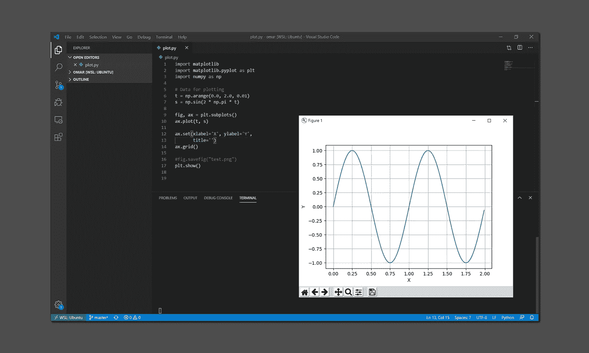

# 我该如何开始学习 AI？

> 原文：<https://levelup.gitconnected.com/how-do-i-start-learning-ai-8986043eedee>

## 完全初学者的路线图，从环境设置到推荐的学习资源

[亚历山大·奈特](https://unsplash.com/@agkdesign?utm_source=medium&utm_medium=referral)在 [Unsplash](https://unsplash.com?utm_source=medium&utm_medium=referral) 上拍照

人工智能是当今软件工程界最热门的话题之一。不管你在这个行业已经呆了多长时间，或者实际上如果你是从一个完全不同的领域开始编程，人工智能和机器学习的基础不仅可以帮助你推进你的职业生涯，还可以开阔你的思维，以不同的方式解决问题，超越算法领域。

现在是投身其中的最佳时机。互联网上充满了教程、框架和实验，人们可以通过运行这些来熟悉这个学科。你不再需要阅读复杂的研究论文，并有一个坚实的数学基础来开始。只要遵循一些课程和教程，你就上路了。

这在理论上很好，但有这么多资源可供选择，一个完全的初学者很容易迷失方向，花无数个小时看这个主题，而没有真正去任何地方。这就是这篇文章的来源:今天，我们将看看一个基本的设置和一些好的资源，以便开始这个迷人的世界。

准备好了吗？我们走吧！

开始前的免责声明:我与本文中提到的任何产品/资源都没有任何关系。它们是我个人使用过的工具，对我和我指导过的工程师都很有用。

# 环境和编程语言

由[萨法尔·萨法罗夫](https://unsplash.com/@codestorm?utm_source=medium&utm_medium=referral)在 [Unsplash](https://unsplash.com?utm_source=medium&utm_medium=referral) 上拍摄的照片

有许多针对大量语言的框架可用于 AI 和 ML。我想看两个最流行的入门:Torch 和 Tensorflow。

整个行业都在使用这些框架来建立、训练和运行深度学习网络，以实现图像识别、语音合成和其他一系列现代技术。它们都是开源的，并且得到了很好的支持/资助，因为它们分别来自脸书和谷歌，并且它们在功能和表达网络模型的方式方面非常相似。

无论你选择哪一个，都很可能取决于你将要使用的学习材料。我们一会儿会谈到这些，但首先让我们简单地谈谈编程语言。

有许多不同语言的这些框架的实现，但你可能会想坚持使用 Python，因为这是人工智能开发的事实上的标准，你会在网上找到的大量例子和学习材料都是用这种语言编写的。

Python 如此受欢迎的原因可能是其语法易于学习，并且有许多用于数据操作(例如`numpy`、`panda`)和数据显示(例如`pyplot`)的库，这些库容易获得，易于通过`pip`安装，并且易于使用。

Python 是如此的简单明了，以至于只要看一看你遇到的 AI / ML 例子，你就可能学会它。然而，如果你想在一头扎进人工智能之前多熟悉一点 Python，你可以遵循像这样的免费在线教程:

Python 初学者速成班—[TraversyMedia.com](https://traversymedia.com/)

现在，你可以选择在本地运行你的深度学习环境，也可以使用基于云的解决方案。你的选择很大程度上取决于你最终想做什么。

在线环境更容易使用，但它们的可定制性较差，并且可能需要更长时间来使用您自己的数据训练网络，特别是如果您使用的是免费提供商，就像我们马上要介绍的那样。本地设置更加灵活，可以定制以充分利用您的硬件，但与任何东西一样，它需要您自己维护和更新。

# 选择在线环境

Jupyter 笔记本电脑是用于在浏览器中运行 Python 环境的主要技术。您可以将这些笔记本视为 IDE 和命令行 python 解释器的混合体。

在 Jupyter 中运行的一个简单的 Python 测试，就在浏览器中

网上有不同的托管 Jupyter 笔记本解决方案，如果你愿意，你甚至可以推出自己的解决方案，但如果你只是想尝试 Tensorflow / PyTorch，只需看看谷歌自己的 [Colab](https://colab.research.google.com/) 系统即可，该系统对任何拥有谷歌账户的人都是免费的。微软也为 Azure 笔记本电脑提供了类似的解决方案。

# 设置本地环境

Tensorflow 和 Torch 很容易通过`pip`安装在现有的 Python 环境中，而如果您喜欢使用容器，Docker 或 Kubernetes 都可以使用图像。

如果您已经在运行 Python，或者确实已经准备好了自己的容器设置，请随意跳过这一节，因为我将讲述如何从头开始设置 Python 环境。

为此，我们将使用一个*环境管理器*，它是一个包，允许您创建任意多个单独的 Python 环境，这样您就可以并排设置 py Torch(Torch 的 Python 版本)和 Tensorflow。具体来说，我们将使用 [Miniconda](https://conda.io/en/latest/miniconda.html) 。

在 Mac 和 Linux 上，安装非常简单。只需按照网站上的说明下载软件包并安装即可。

对于 Windows 10，可以在 [Windows 子系统下运行 Miniconda for Linux](https://docs.microsoft.com/en-us/windows/wsl/install-win10)(WSL)，也可以直接安装在 Windows 下。如果您习惯于在类似 Linux 的环境中编程，并且如果您打算从在线`git`资源库(如 GitHub)中检查 ML 项目，那么 WSL 路线是更可取的。**但是，你将无法在 WSL** 下使用 GPU 加速(或者至少，现在还不能)。

安装 Miniconda 后，请按照以下链接设置环境，并设置您选择的机器学习框架:

*   [用 Conda 创建一个 Python 环境](https://docs.conda.io/projects/conda/en/latest/user-guide/tasks/manage-environments.html#creating-an-environment-with-commands)
*   Pip 安装 [Tensorflow](https://www.tensorflow.org/install) 或[PyTorch](https://pytorch.org/get-started/locally/) 以及它们的先决条件(如`numpy`)

一旦你确认你的本地环境工作正常，你可能想要得到一个*理解* Python 的 IDE，如果你还没有的话。[Visual Studio Code](https://code.visualstudio.com/)(vs Code)是一个很好的选择，因为它几乎可以在任何平台上使用，而且还是免费的。

我们之前在 Jupyter 上看到的同样的例子，现在在本地运行

*奖励点:如果你在 Windows 上，并且已经在 WSL 下设置了 Python 环境，VSCode 可以连接到你的 WSL 实例，并允许你直接在 IDE 中运行* `*bash*` *终端。相当整洁！*

# 学习资源

韦斯·希克斯在 [Unsplash](https://unsplash.com?utm_source=medium&utm_medium=referral) 上的照片

正如我前面说过的，互联网充满了各种选择。我来推荐两门课，我个人上过，觉得很有用，也很清晰。

它们都是由斯坦福大学计算机科学教授吴恩达提出的，他是 Coursera 的联合创始人，也是 ML 超级巨星伊恩·古德菲勒计算机科学学士和硕士学位的导师。

第一门课程在方法上更具理论性，它涵盖了大量的数学知识，并没有真正深入任何高级主题或复杂的神经网络，但它是理解支撑更复杂系统的概念的良好基础课程:

 [## 机器学习|课程

### 机器学习是让计算机在没有明确编程的情况下行动的科学。在过去的十年里…

www.coursera.org](https://www.coursera.org/learn/machine-learning) 

第二个是更长的专业，由五门课程组成，从完全连接的深度神经网络到更高级的复杂神经网络(CNN)和递归神经网络(RNN ),为现代计算机视觉和语音识别提供动力。根据您的参与情况，这需要几个月的时间来完成，但这是值得的:

 [## deeplearning.ai 的深度学习| Coursera

### 从 deeplearning.ai 学习深度学习，如果你想打入人工智能(ai)，这个专精…

www.coursera.org](https://www.coursera.org/specializations/deep-learning) 

一旦你熟悉了基础知识，也许你可以去 [Kaggle](https://www.kaggle.com/) 参加他们的比赛，或者从他们的微课中学到更多关于 ML 和数据科学的知识。

# 数据和其他资源

卡洛斯·穆扎在 [Unsplash](https://unsplash.com?utm_source=medium&utm_medium=referral) 上的照片

一旦你掌握了基本概念，熟悉了常见的神经网络，你就可以做自己的 AI / ML 实验了。

现在，这里的共同问题是，任何人工智能实验都需要大量的数据才能取得成果，而数据可能很难获得。幸运的是，网上有一些免费的资源，你可以用来练习。

其中之一是 OpenML，正如他们的首页所说:

> 开放机器学习项目是一个包容性的运动，旨在为机器学习建立一个开放、有组织的在线生态系统。

从 OpenML 网站上，您可以下载数百个数据集，用于运行您自己的 ML 实验，以及提交您自己基于这些数据运行的特定任务。

如果你正在寻找更高级的工作，如计算机视觉、语言解释或音频识别，你可能会在谷歌的[研究资源](https://research.google/tools/)网站上找到有用的数据集。 [ImageNet](http://image-net.org/) 也是识别任务的一个很好的图像来源。

此外，使用和修改(部分再训练)预训练模型作为一种让*与 AI 玩*的方式也很有趣，而不必花费数小时训练特定的神经网络。ModelZoo 是这种模型的一个很好的仓库。

# 保持最新

[LinkedIn 销售导航员](https://unsplash.com/@linkedinsalesnavigator?utm_source=medium&utm_medium=referral)在 [Unsplash](https://unsplash.com?utm_source=medium&utm_medium=referral) 上的照片

人工智能的世界正在以极快的速度发展，所以我想我应该用一个资源列表来结束这篇文章，以帮助你跟上该领域的最新发展。

除了通常可以在 arXiv 网站上免费获得的研究论文之外，还有两个重要的博客值得关注，它们分别来自谷歌和脸书。麻省理工学院新闻也有一个相当活跃的人工智能文章策划区，当然还有 Reddit 和 [r/MachineLearning](https://www.reddit.com/r/MachineLearning/) 。

然而，跟踪人工智能中发生的一切几乎是不可能的。更好的方法是选择一个感兴趣的领域，无论是自然语言处理、计算机视觉、语音识别还是任何让你感兴趣的领域，并相应地专门化你的知识。

# 包扎

布鲁诺·伯格尔在 [Unsplash](https://unsplash.com?utm_source=medium&utm_medium=referral) 上拍摄的照片

在这样一篇短文中，很难全面介绍人工智能的广阔世界，因为该领域永远在发展，并在最不同的专业领域中分支，从疾病检测和预测到语音识别。

然而，每个人都需要从某个地方开始，这个简短的介绍，最重要的是，记录了我是如何开始的，以及我今天仍然使用的资源列表以保持更新。

我绝不是人工智能方面的专家，我也不认为自己是，但我希望我的经验对任何考虑涉足这一知识海洋的人有用，从外面看，这可能会显得令人生畏和神秘。

在你离开之前，我会给你一句话来激励你学习人工智能，作为对你坚持到最后的感谢:

> “我们的智力是我们成为人类的原因，而人工智能是这种素质的延伸。”——扬·勒昆

祝你旅途好运！